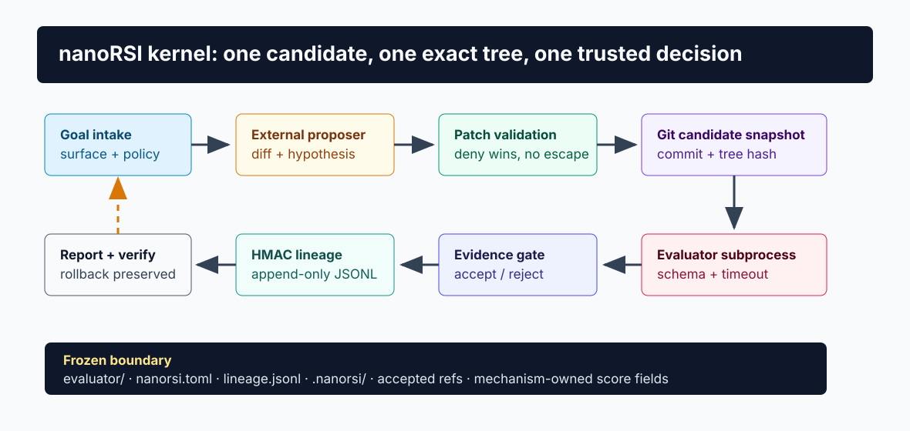
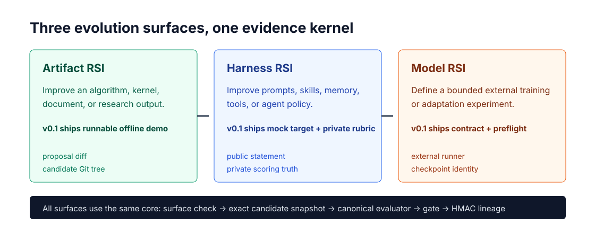

# nanoRSI

[](https://github.com/xxwtiancai/nanoRSI/actions/workflows/ci.yml)
[](https://www.python.org/)
[](pyproject.toml)
[](LICENSE)

**nanoRSI** is a nano-scale, evidence-gated experiment kernel for Recursive Self-Improvement (RSI). It creates small workspaces where an artifact, harness, or model-training recipe can be proposed, evaluated against a frozen contract, and accepted only when the evidence justifies it.

It is deliberately **not** an autonomous superintelligence runtime. nanoRSI is the smallest complete control loop: one parent, one candidate, one evaluator, one decision, and one auditable lineage.



## Why nanoRSI?

Most RSI tools either provide a large research platform or a tiny improvement loop without trustworthy evaluation. nanoRSI takes a different position:

- **Complete enough to be real**: baseline, proposal, patch validation, exact Git candidate, evaluator, gate, lineage, report, verification, and rollback boundary are all included.
- **Small enough to understand**: one experiment, one authoritative parent, one child candidate, one proposer, one evaluator, single-parent hill climbing.
- **Evidence before claims**: scores are bound to candidate, evaluator, split, and gate identities.
- **No hidden execution**: external commands run as argv subprocesses with filtered environment and timeouts.
- **Standard library only**: no runtime dependencies, no database, no service, no plugin loader.



## Install

```bash
git clone https://github.com/xxwtiancai/nanoRSI.git
cd nanoRSI
python3.11 -m venv .venv
source .venv/bin/activate
python -m pip install -e .
```

Requirements: Python 3.11 or newer and Git. Docker is not required for the bundled offline demos.

## 60-second demo

```bash
nanorsi new artifact ./artifact-demo --goal "Find the maximum value"
nanorsi baseline --workspace ./artifact-demo
nanorsi step --workspace ./artifact-demo
nanorsi report --workspace ./artifact-demo
nanorsi verify --workspace ./artifact-demo
```

The artifact template starts with an intentionally weak `best()` function. A mock proposer submits a bounded diff, the frozen evaluator checks gate and heldout cases, and the candidate is accepted only after the evaluator improves.

Example `nanorsi step` output:

```json
{
  "candidate_tree": "b15855acdad1bbc48a51c1324d432c4dadc35d61",
  "decision": "accepted",
  "generation": 1
}
```

The generated `reports/report.md` shows both generations, parent links, gate scores, heldout scores, candidate tree hashes, and the final decision.

## Commands

| Command | Purpose |
| --- | --- |
| `nanorsi new artifact PATH` | Create an offline artifact-improvement experiment |
| `nanorsi new harness PATH` | Create a prompt/policy experiment with private scoring |
| `nanorsi new model PATH` | Create an external model-training experiment contract |
| `nanorsi doctor` | Check config, Git, commands, and execution posture |
| `nanorsi baseline` | Snapshot and evaluate generation zero |
| `nanorsi step` | Propose, validate, evaluate, and gate one child |
| `nanorsi evaluate` | Evaluate a selected ref and split |
| `nanorsi report` | Write deterministic JSON and Markdown reports |
| `nanorsi verify` | Verify sequence, HMAC receipts, and accepted parent chain |
| `nanorsi recover` | Remove stale lock/worktree state after a dead process |

All commands accept `--workspace PATH`; the default is the current directory.

## RSI surfaces

| Surface | Included in v0.1 | Typical target |
| --- | --- | --- |
| Artifact | Fully runnable offline accepted/rejected cycle | algorithm, kernel, document, report |
| Harness | Offline mock target, public statement/private rubric, accepted cycle | prompt, policy, skill, memory, tool config |
| Model | External command contract, doctor, evaluator, safety fields | training recipe, dataset builder, adapter runner |

Model training is intentionally outside the core. nanoRSI renders and validates the contract; the user supplies the training command and compute environment.

## Trust boundary

The following are never valid candidate mutation targets:

```text
evaluator/
proposer/
nanorsi.toml
lineage.jsonl
.nanorsi/
reports/
accepted refs and score receipts
```

Every candidate is evaluated in a detached Git worktree. The evaluator fingerprint must match generation zero. Scores enter `lineage.jsonl` only through nanoRSI and are authenticated with a local HMAC receipt key.

### Safety expectations

- nanoRSI filters obvious credential-like environment variables from subprocesses.
- Evaluation and proposal commands use argv arrays, never shell strings.
- Commands have explicit timeouts.
- One lock prevents concurrent candidates in one experiment.
- A killed step leaves the accepted parent unchanged.
- Host execution remains the caller's responsibility; use a container or sandbox for untrusted proposers, evaluators, and target runners.

See [SECURITY.md](SECURITY.md) before connecting nanoRSI to untrusted models or external services.

## Project layout

```text
src/nanorsi/
  cli.py          command dispatch and one-step orchestration
  config.py       strict TOML validation
  surface.py      mutable-surface policy
  gitops.py       worktrees, patches, commits, and tags
  proposer.py     external proposal contract
  evaluator.py    canonical evaluator subprocess and schema
  gate.py         accepted / rejected / inconclusive decisions
  lineage.py      append-only HMAC-protected JSONL
  locking.py      one active operation per experiment
  doctor.py       local preflight diagnostics
  templates/      artifact, harness, and model starters
```

## Development

```bash
python -m unittest discover -v
python -m pip install -e .
nanorsi doctor --workspace ./artifact-demo
```

CI runs the same standard-library test suite on Python 3.11. Architecture tests enforce the nano budget: no core file over 300 lines, no function over 50 lines, total core under 2,500 lines, and no runtime third-party imports.

## Roadmap

The core v0.1 surface is intentionally fixed. Likely post-v0.1 extensions include:

- population and island search as separate examples rather than core modules;
- additional evaluator examples;
- optional container adapter;
- richer statistical comparison and repeated evaluation;
- a JSON export API for external dashboards.

These will not compromise the frozen evaluator, protected lineage, or exact candidate identity.

## Documentation

- [RSI Research Dossier & Architecture Survey](docs/research/RSI_SURVEY.md)
- [Kernel specification](docs/specification.md)
- [Project charter](docs/PROJECT_CHARTER.md)
- [Security policy](SECURITY.md)
- [Contributing guide](CONTRIBUTING.md)
- [Chinese README](README.zh-CN.md)

## License

Apache-2.0. See [LICENSE](LICENSE).
