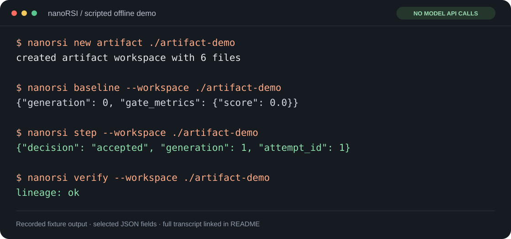

<p align="center">
  
</p>

<p align="center"><strong>Make coding agents learn from test failures.</strong><br>Evolve reusable skills. Check the improvement on unseen tasks.</p>

<p align="center">
  <a href="https://github.com/xxwtiancai/nanoRSI/actions/workflows/ci.yml"></a>
  <a href="https://www.python.org/"></a>
  <a href="pyproject.toml"></a>
  <a href="CHANGELOG.md"></a>
  <a href="LICENSE"></a>
</p>

<p align="center">
  <a href="#quick-start">Quick start</a> ·
  <a href="#how-it-works">How it works</a> ·
  <a href="#bring-your-model">Bring your model</a> ·
  <a href="#research-with-it">Research</a> ·
  <a href="README.zh-CN.md">简体中文</a>
</p>

---

You changed a skill. Did the agent actually get better?

**nanoRSI** turns that question into a small experiment. Run tasks, collect feedback, propose a skill patch, and compare the candidate with the current version. Keep the change only when it passes the gate. Then freeze your choices and test on unseen tasks.

The model weights stay fixed. The skills and harness are what you study.

| Small enough to read | Complete enough to run | Built for inspection |
| :---: | :---: | :---: |
| **<2.5k lines** of Python core | **One** parent, candidate and loop | **Every attempt** leaves evidence |
| Standard library + Git | Training → validation → final test | Patches, traces, decisions and costs |

## Why nanoRSI

- **Executable Python tasks.** Twelve repair tasks with public tests for debugging and separate private tests for behavioral grading. A configurable model bridge and three procedural skills are included.
- **A loop you can understand.** Sequential attempts, ordinary files, exact Git snapshots and a single readable [loop module](src/nanorsi/loop.py).
- **Useful comparisons.** Compare initial skills, no skills and evolved skills. Switch between a frozen and a self-use proposer harness.
- **A report you can share.** Standalone HTML and Markdown show final comparisons, search decisions, failed attempts and known/unknown costs.

The coding suite is an independently authored starter pack, not a published general-purpose benchmark. The existing 90 text-edit tasks remain protocol fixtures. Engineering tests and reference solutions establish correctness of the lab; model gains require actual model experiments.

## Quick start

Clone and install with Python 3.11+ and Git:

```bash
git clone https://github.com/xxwtiancai/nanoRSI.git
cd nanoRSI
python3.11 -m venv .venv
source .venv/bin/activate
python -m pip install -e .
```

Try the **scripted offline demo** first. It makes no model API calls:

```bash
nanorsi new artifact ./artifact-demo
nanorsi baseline --workspace ./artifact-demo
nanorsi step --workspace ./artifact-demo
nanorsi report --workspace ./artifact-demo
nanorsi verify --workspace ./artifact-demo
```

<p align="center"></p>

<sub>Terminal visualization of an actual scripted fixture run. <a href="docs/assets/readme/demo-transcript.txt">Read the transcript</a> · <a href="docs/assets/readme/demo-evidence.json">Inspect the captured output</a>. Fixture scores demonstrate protocol behavior.</sub>

## Run a coding experiment

```bash
nanorsi new coding ./coding-lab --goal "Learn reliable Python repair skills"
# Configure model and base_url in coding-lab/nanorsi.toml before baseline.
nanorsi doctor --workspace ./coding-lab
nanorsi run --workspace ./coding-lab
nanorsi freeze --workspace ./coding-lab --repeats 1
nanorsi final-test --workspace ./coding-lab
nanorsi report --workspace ./coding-lab --format html
nanorsi verify --workspace ./coding-lab
```

Open `coding-lab/reports/report.html`. Compare **initial skills**, **no skills** and **evolved skills** on the same frozen task/repeat pairs. The report preserves negative results and unknown costs.

During each task, the agent can read/edit Python files and call the fixed `test` tool for public unittest feedback. Private grading tests and reference implementations stay out of model requests. Only reusable skills evolve between attempts; the scorer, task pack and model settings stay fixed. Equivalent correct implementations pass even when their source differs from the reference.

The starter covers twelve utility repairs across parsing, collections and configuration, split into four train, four validation and four final-test tasks. The default three-attempt search can consume 40 task episodes; the one-repeat final panel adds 12. Each episode allows up to eight model calls, with proposal calls additional. Configure a local endpoint or choose a hosted budget before running.

**No model available yet?** Validate the task pack offline:

```bash
python examples/coding_tasks/prepare.py --check
```

This checks broken starters and reference solutions; it does not simulate or claim learned model improvement.

[Full coding walkthrough and task format](docs/CODING_LAB.md) · [中文指南](docs/CODING_LAB.zh-CN.md)

## How it works

<p align="center"></p>

Training feedback helps write the next patch. Validation chooses which version survives. Final-test results stay out of that selection loop.

Failed, rejected and unchanged proposals still consume the attempt budget. Every accepted version has an exact parent and candidate commit, so the experiment remains traceable.

## Bring your model

Create the skills workspace:

```bash
nanorsi new skills ./skills-lab --goal "Improve reliable file editing"
```

Edit the existing `[agent]` section in `skills-lab/nanorsi.toml` **before baseline**. Configure your model ID and compatible endpoint; the starter's model name is a placeholder. A compatible local server can run without a key. Authenticated endpoints use an explicitly configured external key file.

```toml
[agent]
model_command = ["python3", "adapters/model.py"]
model = "your-model-id"
base_url = "http://localhost:8000/v1"
max_turns = 8
skills = ["inspect", "edit", "verify"]
```

The starter defaults to five proposal attempts and a 400-episode search cap. A full five-attempt search can use 350 episodes; the default final panel adds 270. Proposal calls are separate, and hosted model calls may cost money. [Choose your budget and configure the bridge](docs/QUICKSTART.md#choose-a-budget-before-running) before running:

```bash
nanorsi doctor --workspace ./skills-lab
nanorsi run --workspace ./skills-lab
nanorsi freeze --workspace ./skills-lab --repeats 3
nanorsi final-test --workspace ./skills-lab
python examples/compare.py ./skills-lab/reports/final.json
nanorsi verify --workspace ./skills-lab
```

<details>
<summary><strong>What is inside the workspace?</strong></summary>

```text
skills-lab/
├── target/agent/
│   ├── run.py                 # Small task/propose runner
│   └── skills/
│       ├── inspect/SKILL.md
│       ├── edit/SKILL.md
│       └── verify/SKILL.md
├── proposer/propose.py        # Fixed proposal driver
├── evaluator/evaluate.py      # Fixed task grader
├── adapters/model.py          # Configurable model bridge
├── tasks/manifest.json        # Grouped train/validation/test fixtures
├── nanorsi.toml               # Experiment settings
└── reports/                   # Search evidence and final comparisons
```

Only `target/agent/skills/**` is mutable by default. The reference runner loads Markdown skills and uses list/read/write/final actions in fresh task directories. Script execution and vector retrieval are outside this starter.

[Full walkthrough](docs/QUICKSTART.md) · [All contracts and states](docs/specification.md)

</details>

## Research with it

Three questions deserve three separate comparisons:

| Question | Comparison |
| --- | --- |
| Do these skills help? | No skills vs. initial skills |
| Did evolution help on new tasks? | Initial vs. selected skills on the frozen test set |
| Does recursive reuse add anything? | Frozen proposer vs. self-use proposer, with matched settings and budgets |

`arm = "frozen"` always proposes through the initial harness. `arm = "self-use"` proposes through the latest accepted harness. Both modify the current parent. Use separate workspaces and freeze all arms before examining final results.

The comparison tool reports paired task-macro deltas, per-arm results, episode timing and cost coverage. Independent evolution runs and repeated deployments are kept distinct. A negative result is still useful evidence.

Our [evaluation research notes](docs/research/HARNESS_EVALUATION_2026-09-08.zh-CN.md) cover DGM, SICA, GEPA, ACE, Memento-Skills and recent skills benchmarks. The small, readable project philosophy draws inspiration from [nanoGPT](https://github.com/karpathy/nanoGPT) and [nanochat](https://github.com/karpathy/nanochat).

## Where to look next

| I want to… | Start here |
| --- | --- |
| Run my own experiment | [Quickstart and budgets](docs/QUICKSTART.md) |
| Read the implementation | [The loop](src/nanorsi/loop.py) · [Reference runner](src/nanorsi/templates/skills/target/agent/run.py) |
| Understand the design | [Project charter](docs/PROJECT_CHARTER.md) · [v0.2 design](docs/design/HARNESS_PLATFORM_V0_2.zh-CN.md) |
| Prepare tasks or compare runs | [Examples](examples/README.md) |
| Check changes and contribute | [Changelog](CHANGELOG.md) · [Contributing](CONTRIBUTING.md) |

**Execution boundary:** the built-in mode is trusted local execution. Worktrees and receipts provide version checks; private-label isolation for untrusted code requires an external container, VM or service. [Read the security model](SECURITY.md).

<details>
<summary><strong>Development checks and legacy templates</strong></summary>

```bash
PYTHONPATH=src python -m unittest discover -v
python -m compileall -q src examples tests
```

CI checks Python 3.11/3.12 on Linux and macOS. Architecture tests enforce a 2,500-line core ceiling, 300-line files, 50-line functions and no runtime third-party imports.

Legacy artifact/harness templates remain scripted offline demos. Model mode remains an external training contract. Legacy heldout data participates in selection; v2 experiments start in fresh workspaces with an independent final-test phase.

</details>

---

<p align="center"></p>
<p align="center"><strong>Bring a task. Run an experiment. Share what happened.</strong><br>
If this is the kind of agent research you want more of, <a href="https://github.com/xxwtiancai/nanoRSI">give nanoRSI a star</a>.<br>
<a href="https://github.com/xxwtiancai/nanoRSI/issues">Share an experiment or report a bug</a> · <a href="CONTRIBUTING.md">Contribute</a></p>

<p align="center">Apache-2.0 · <a href="LICENSE">License</a></p>
