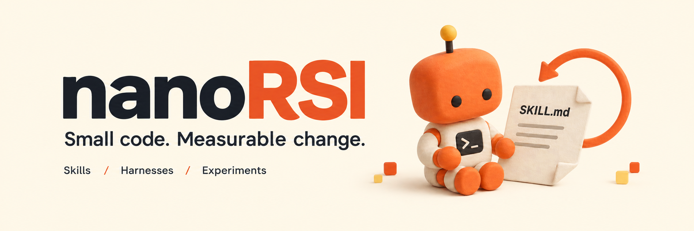
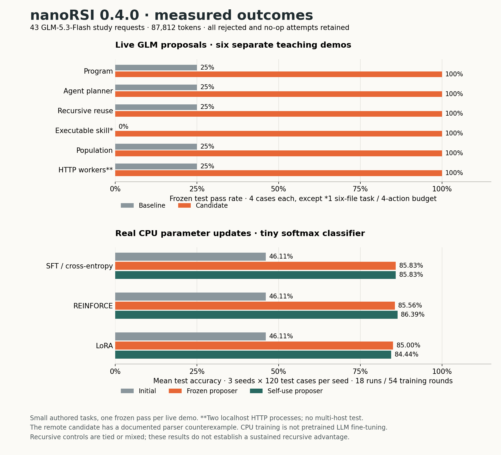
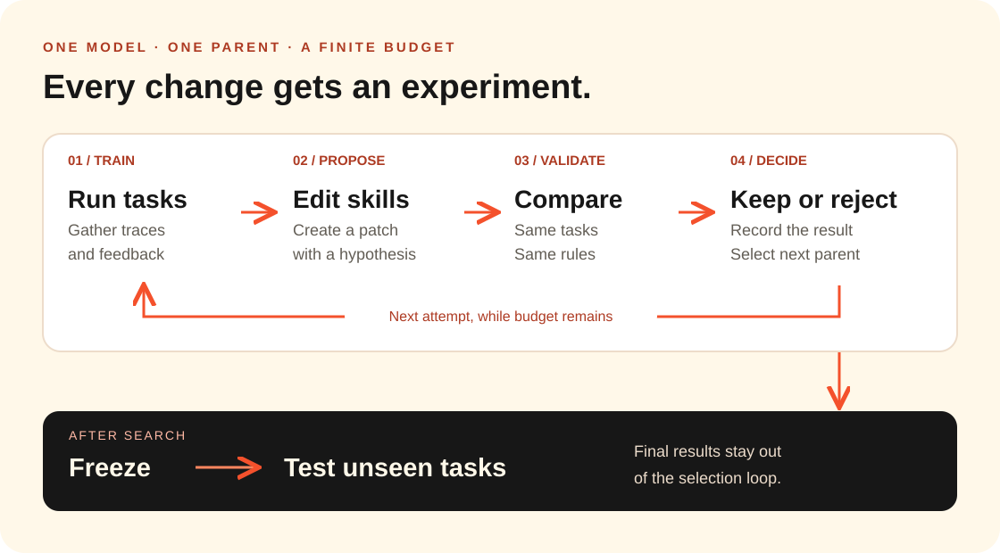

<p align="center">
  
</p>

<p align="center"><strong>Improve programs, agents and model parameters.</strong><br>Run the change. Measure it on unseen tasks.</p>

<p align="center">
  <a href="https://github.com/xxwtiancai/nanoRSI/actions/workflows/ci.yml"></a>
  <a href="https://www.python.org/"></a>
  <a href="pyproject.toml"></a>
  <a href="CHANGELOG.md"></a>
  <a href="LICENSE"></a>
</p>

<p align="center">
  <a href="#quick-start">Quick start</a> ·
  <a href="#how-it-works">How it works</a> ·
  <a href="#bring-your-model">Bring your model</a> ·
  <a href="#research-with-it">Research</a> ·
  <a href="README.zh-CN.md">简体中文</a>
</p>

---

You changed the program, the agent, or its weights. Did it actually get better?

**nanoRSI** turns that question into a small executable experiment. Run tasks, collect feedback, propose a change, and compare the candidate with its parent. In model mode, actually train and save the parameters. Keep qualifying changes, then freeze your choices and test on separate tasks.

| Small enough to read | Several things to improve | Built for inspection |
| :---: | :---: | :---: |
| **5,000-line core ceiling** | **Artifacts · harnesses · parameters** | **Every attempt** leaves evidence |
| Standard library + Git | Serial or population search | Patches, checkpoints, traces and costs |

## What can improve?

| Start with | What actually changes | Try it |
| --- | --- | --- |
| **Artifact** | An executable Python program; a live LLM proposes source improvements | `nanorsi new artifact ./program-lab` |
| **Harness** | An agent's executable workflow planner and runner | `nanorsi new harness ./agent-lab` |
| **Model** | Real numerical parameters trained with SFT, REINFORCE or LoRA on CPU | `nanorsi new model ./learner-lab` |
| **Skills / coding** | Reusable Markdown guidance and declared `run.py` skills used by an LLM agent | `nanorsi new coding ./coding-lab` |

`program`, `agent` and `learner` are aliases for artifact, harness and model. All use the same baseline → search → freeze → final-test lifecycle. Frozen/self-use proposer controls and bounded population search let you study how improvements are produced. [The multilevel guide](docs/MULTILEVEL.md) explains the actual execution, comparisons and limits · [中文](docs/MULTILEVEL.zh-CN.md).

The bundled tasks are small authored demonstrations, not broad capability benchmarks. The parameter example is a tiny classifier, not LLM fine-tuning. Executable recursive mechanisms do not by themselves prove a recursive advantage or solve general RSI.

## Quick start

Clone and install with Python 3.11+ and Git:

```bash
git clone https://github.com/xxwtiancai/nanoRSI.git
cd nanoRSI
python3.11 -m venv .venv
source .venv/bin/activate
python -m pip install -e .
```

Start with **real CPU parameter learning**. It makes no model API calls:

```bash
nanorsi new model ./learner-lab
nanorsi baseline --workspace ./learner-lab
nanorsi run --workspace ./learner-lab
nanorsi freeze --workspace ./learner-lab --repeats 1
nanorsi final-test --workspace ./learner-lab
nanorsi report --workspace ./learner-lab --format html
nanorsi verify --workspace ./learner-lab
```

Open `learner-lab/reports/report.html`. It compares the initial and selected saved checkpoints on frozen test cases; final evaluation does not retrain them. For API-driven artifact, harness or coding experiments, configure the model before baseline using the first-run path below.

**[First model run: API key → connection check → experiment → report](docs/QUICKSTART.md)** · [中文入门](docs/QUICKSTART.zh-CN.md)

## Measured live-model demos

On implementation `50556ad`, six small demos used **GLM-5.3-Flash**, seed 0 and one frozen test repeat per condition. The study made **43 API requests / 87,812 tokens** under a 59-request cap with thinking disabled; setup connection probes are excluded. Requested and returned model IDs were `glm-5.3-flash`. [Run settings and provider usage](examples/results/v0.4.0/live/summary.json).

| Demo | Initial test cases passed | Selected test cases passed | Evidence |
| --- | ---: | ---: | --- |
| Program | 1/4 | 4/4 | [Final](examples/results/v0.4.0/live/program/final.json) |
| Agent, frozen proposer | 1/4 | 4/4 | [Final](examples/results/v0.4.0/live/agent/final.json) |
| Recursive agent, self-use | 1/4 | 4/4 | [Final](examples/results/v0.4.0/live/recursive/final.json) |
| Executable skill | 0/1 | 1/1 | [Final](examples/results/v0.4.0/live/skills/final.json) |
| Local population | 1/4 | 4/4 | [Final](examples/results/v0.4.0/live/population/final.json) |
| HTTP evaluation, two localhost processes | 1/4 | 4/4 | [Final](examples/results/v0.4.0/live/remote/final.json) |

These are separate authored tasks, not one benchmark or RSI score. Recursive planning was reused in the next proposal, but **did not outperform the frozen proposer** on the final panel. The skill demo deliberately batches six files within four actions; no-skills scored 0/1. Population retained two branches and rejected a crossover with no gain. HTTP execution was tested on localhost only.

**The selected remote parser still fails on `(12.5)` despite its 4/4 final score.** [Counterexample, rejected attempts, source snapshots and evidence limits](examples/results/v0.4.0/README.md#known-counterexample).

<p align="center"></p>

## Measured recursive learning: handwritten digits

**SFT self-use reduced mean test error by 35.95% relative to frozen priorities: 10.16% → 6.51%.** That is **+3.65 percentage points of accuracy**, with a positive paired difference in all 10 training seeds. This v0.4.1 study completed **120 runs and 720 training rounds**, with matched actual budgets and every workspace frozen before testing.

Mean selected-checkpoint test accuracy on the same 364-image panel:

| Method | Frozen priorities | Self-use priorities | Uniform | Random priorities | Self-use − frozen |
| --- | ---: | ---: | ---: | ---: | ---: |
| SFT | 89.835% | 93.489% | 92.582% | 92.390% | +3.654 pp |
| REINFORCE | 19.286% | 27.473% | 36.236% | 27.005% | +8.187 pp |
| LoRA | 79.533% | 82.060% | 82.885% | 83.736% | +2.527 pp |

The primary paired percentile bootstrap intervals use Bonferroni alpha allocation across the three methods (nominal 98.333% each): **[2.198, 5.192]**, **[1.071, 13.462]** and **[0.549, 4.423] pp**, respectively. Only REINFORCE met the predeclared target of an observed mean gain ≥5 pp with a positive adjusted lower bound; SFT and LoRA did not. This does not establish that REINFORCE's true gain is ≥5 pp. REINFORCE still trailed uniform by 8.764 pp, and LoRA by 0.824 pp. SFT exceeded uniform by 0.907 pp and random priorities by 1.099 pp; these secondary comparisons have descriptive 95% intervals in the full results.

This is real CPU training of a small linear classifier on a custom **1,074/359/364 train/validation/test split** of the 1,797-image UCI/scikit-learn digits subset. Settings were chosen in validation-only pilots and locked before confirmation. It is not the official UCI benchmark, evidence of unseen-writer generalization, or LLM fine-tuning. The intervals describe training-seed variation on this one split.

<p align="center"></p>

**[All results, controls and inspectable evidence](examples/results/recursive-digits-v0.4.1/README.md)** · [Reproduce the study](examples/recursive_learning/README.md) · [中文实验指南](examples/recursive_learning/README.zh-CN.md). The optional adapter uses an existing NumPy installation and makes no API calls; the core retains zero third-party runtime dependencies.

## Historical CPU example (v0.4.0)

The verified panel ran three methods × three seeds × frozen/self-use controls: **18 runs, 54 training rounds, 20 accepted and 34 rejected candidates**. Mean test accuracy on overlapping synthetic numeric clusters was:

| Method | Initial | Selected, frozen proposer | Selected, self-use proposer |
| --- | ---: | ---: | ---: |
| SFT | 46.11% | 85.83% | 85.83% |
| REINFORCE | 46.11% | 85.56% | 86.39% |
| LoRA | 46.11% | 85.00% | 84.44% |

These are real updates to a four-feature, three-class softmax model. The nine paired self-use comparisons had one positive difference, one negative difference and seven ties: the data does not show a consistent recursive advantage. LoRA demonstrates frozen-base updates, not parameter efficiency at this tiny scale. No API calls were made; monetary cost was not measured.

Reproduce all 18 trials with `python examples/parameter_learning/run.py ./parameter-results`. [Published CPU results](examples/results/v0.4.0/parameter-learning/summary.json) · [Per-run evidence](examples/results/v0.4.0/README.md#cpu-parameter-learning) · [Methods and interpretation](docs/MULTILEVEL.md#what-the-learning-demo-actually-trains) · [All demo commands](examples/README.md).

## Run a coding experiment

**Configure API access before running.** A chat-app login or `export OPENAI_API_KEY=...` alone does not configure nanoRSI. Create an API key in your provider's console, then replace `YOUR_MODEL_ID` with an exact API model ID available to your account. This example uses the [OpenAI API-key console](https://platform.openai.com/api-keys); [other providers and local servers](docs/QUICKSTART.md#2-get-api-access-and-choose-an-endpoint) are supported through compatible chat-completions endpoints.

```bash
nanorsi new coding ./coding-lab --goal "Learn reliable Python repair skills"
nanorsi configure --workspace ./coding-lab \
  --model YOUR_MODEL_ID --base-url https://api.openai.com/v1 \
  --prompt-key --token-parameter max_completion_tokens \
  --max-steps 1 --max-episodes 40
nanorsi doctor --workspace ./coding-lab --check-model
nanorsi baseline --workspace ./coding-lab
nanorsi run --workspace ./coding-lab
nanorsi freeze --workspace ./coding-lab --repeats 1
nanorsi final-test --workspace ./coding-lab
nanorsi report --workspace ./coding-lab --format html
nanorsi verify --workspace ./coding-lab
```

`--prompt-key` reads a hidden terminal input and stores the key outside the workspace; TOML contains only its file path. Alternatively, use `--api-key-file /absolute/external/path` or `--no-api-key` for an unauthenticated local server. Plain `doctor` is offline; `--check-model` makes one bounded model request, which may incur a charge outside experiment accounting. Configure is offline and must run before the experiment journal starts.

Open `coding-lab/reports/report.html`. Compare **initial skills**, **no skills** and **selected skills** on the same frozen task/repeat pairs. During each task, the model repairs a fresh Python file and can run public tests. Across coding attempts, persistent skill files evolve, including declared executable scripts when proposed; model weights, task data and the evaluator stay fixed. Task-code repairs and skill patches are separate outputs. A rejected patch or no final gain is a valid result.

This one-attempt preset uses up to **16 search episodes + 12 final-test episodes**, with up to eight model calls per episode and one additional proposal call. Final testing is outside the search cap; episode limits are not a dollar cap. No model yet? Run `python examples/coding_tasks/prepare.py --check` to validate the authored task pack offline.

**[Complete first-run tutorial: API key → connection check → RSI loop → report](docs/QUICKSTART.md)** · [中文入门](docs/QUICKSTART.zh-CN.md) · [Task format](docs/CODING_LAB.md)

## How it works

<p align="center"></p>

Training feedback helps write the next change; model mode also runs the protected trainer before evaluation. Validation chooses which version survives. Final-test results stay out of that selection loop.

Failed, rejected and unchanged proposals still consume the attempt budget. Every accepted version has an exact parent and candidate commit, so the experiment remains traceable.

## Bring your model

The coding starter above is one complete model-backed path. Use `artifact` to improve a program or `harness` to improve its agent runner with the same configuration flow. Follow the [provider/key setup guide](docs/QUICKSTART.md#2-get-api-access-and-choose-an-endpoint) to use OpenAI, OpenRouter, DeepSeek or a local compatible server. The bundled bridge uses `/chat/completions`; native Anthropic Messages and OpenAI Responses require a custom adapter. It does not automatically read API-key environment variables or `.env` files.

For text-edit protocol research, create `nanorsi new skills ./skills-lab`, then use the same `configure` → `doctor --check-model` → `baseline` → `run` → `freeze` → `final-test` → `report` → `verify` sequence with that workspace. Its 90-task manifest is larger: five attempts can use 350 search episodes, and a three-repeat final panel adds 270. [Choose a budget before running](docs/QUICKSTART.md#choose-a-budget-before-running).

Generated model/proposer/evaluator commands use the Python interpreter that created the workspace. Preserve those commands. All settings become fixed once the experiment journal starts; to change the model or endpoint after that, create a fresh workspace.

<details>
<summary><strong>What is inside the workspace?</strong></summary>

```text
skills-lab/
├── target/agent/
│   ├── run.py                 # Small task/propose runner
│   └── skills/
│       ├── inspect/SKILL.md
│       ├── edit/SKILL.md
│       └── verify/SKILL.md
├── proposer/propose.py        # Fixed proposal driver
├── evaluator/evaluate.py      # Fixed task grader
├── adapters/model.py          # Configurable model bridge
├── tasks/manifest.json        # Grouped train/validation/test fixtures
├── nanorsi.toml               # Experiment settings
└── reports/                   # Search evidence and final comparisons
```

In skills/coding workspaces, `target/agent/skills/**` is mutable. The runner loads Markdown guidance and uses list/read/write/final actions in fresh task directories. Declared skills may include `run.py`; a bounded `skill` action invokes that exact script and records its source hash. Other starters declare their own narrow mutation surface.

[Full walkthrough](docs/QUICKSTART.md) · [All contracts and states](docs/specification.md)

</details>

## Research with it

Different questions need separate comparisons:

| Question | Comparison |
| --- | --- |
| Do these skills help? | No skills vs. initial skills |
| Did evolution help on new tasks? | Initial vs. selected program, harness, skills or checkpoint on the frozen test set |
| Does recursive reuse add anything? | Frozen proposer vs. self-use proposer, with matched settings and budgets |
| Does population search help? | Serial vs. population search on the same task with matched budgets |

`arm = "frozen"` always proposes through the initial harness. `arm = "self-use"` proposes through the latest accepted harness. Both modify the current parent. The harness planner also preprocesses training feedback during proposal generation; the learner checkpoint computes a curriculum for subsequent training. Use separate workspaces and freeze all arms before examining final results.

The skills comparison tool reports paired task-macro deltas, per-arm results, episode timing and cost coverage. Each other mode has its own frozen report; heterogeneous demos are not one RSI score. Independent evolution runs and repeated deployments are kept distinct. A negative result is still useful evidence.

Our [evaluation research notes](docs/research/HARNESS_EVALUATION_2026-09-08.zh-CN.md) cover DGM, SICA, GEPA, ACE, Memento-Skills and recent skills benchmarks. The small, readable project philosophy draws inspiration from [nanoGPT](https://github.com/karpathy/nanoGPT) and [nanochat](https://github.com/karpathy/nanochat).

## Where to look next

| I want to… | Start here |
| --- | --- |
| Run my own experiment | [Quickstart and API keys](docs/QUICKSTART.md) · [Multilevel experiments](docs/MULTILEVEL.md) |
| Read the implementation | [The loop](src/nanorsi/loop.py) · [Reference runner](src/nanorsi/templates/skills/target/agent/run.py) |
| Understand the design | [Project charter](docs/PROJECT_CHARTER.md) · [v0.2 design](docs/design/HARNESS_PLATFORM_V0_2.zh-CN.md) |
| Prepare tasks or compare runs | [Examples](examples/README.md) |
| Check changes and contribute | [Changelog](CHANGELOG.md) · [Contributing](CONTRIBUTING.md) |

**Execution boundary:** the built-in mode is trusted local execution. Optional HTTP evaluation has been demonstrated with two localhost worker processes; multi-host operation remains unverified. Worktrees and receipts provide version checks; private-label isolation for untrusted code requires an external container, VM or service. [Read the security model](SECURITY.md).

<details>
<summary><strong>Development checks and legacy templates</strong></summary>

Install the checkout in your virtual environment first so evaluator subprocesses can import nanoRSI from temporary workspaces.

```bash
python -m pip install -e .
PYTHONPATH=src python -m unittest discover -v
python -m compileall -q src examples tests
```

CI checks Python 3.11/3.12 on Linux and macOS. Architecture tests enforce a 5,000-line core ceiling, 300-line files, 50-line functions and no runtime third-party imports.

Use `artifact-fixture` or `harness-fixture` for the legacy scripted offline demos, and `model-contract` for the legacy external-training contract. Existing schema-1 workspaces still run; their heldout data participates in selection. New artifact/harness/model workspaces use schema 2 and an independent final-test phase.

</details>

---

<p align="center"></p>
<p align="center"><strong>Bring a task. Run an experiment. Share what happened.</strong><br>
If this is the kind of agent research you want more of, <a href="https://github.com/xxwtiancai/nanoRSI">give nanoRSI a star</a>.<br>
<a href="https://github.com/xxwtiancai/nanoRSI/issues">Share an experiment or report a bug</a> · <a href="CONTRIBUTING.md">Contribute</a></p>

<p align="center">Apache-2.0 · <a href="LICENSE">License</a></p>
