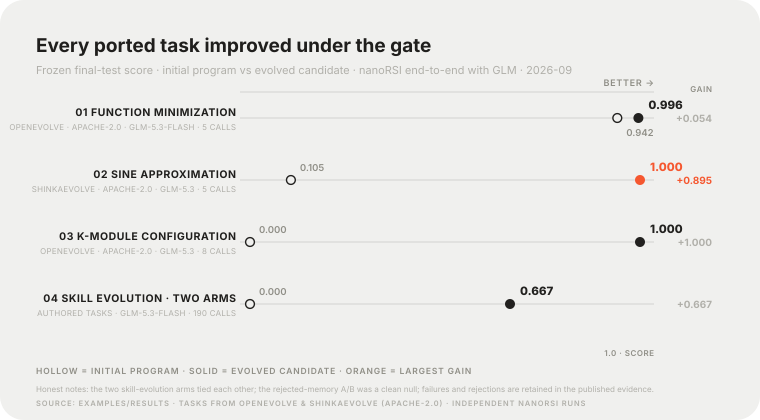

<p align="center">
  
</p>

<p align="center"><strong>一个读得懂的最小递归自改进（RSI）实验框架。</strong><br>让修改真正执行，再用未见任务衡量效果。<br>配套一部每日更新的 RSI 技术雷达。</p>

<p align="center">
  <a href="https://github.com/xxwtiancai/nanoRSI/actions/workflows/ci.yml"></a>
  <a href="https://www.python.org/"></a>
  <a href="pyproject.toml"></a>
  <a href="CHANGELOG.md"></a>
  <a href="LICENSE"></a>
</p>

<p align="center">
  <a href="#快速开始">快速开始</a> · <a href="#从上游-rsi-项目移植的真实任务">真实任务</a> · <a href="#一次改进如何发生">工作流程</a> ·
  <a href="#接入你的模型">接入模型</a> · <a href="#可以研究什么">研究方向</a> ·
  <a href="docs/research/industry-rsi/RADAR.md">每日雷达</a> ·
  <a href="docs/research/industry-rsi/README.zh-CN.md">RSI 研究地图</a> · <a href="README.md">English</a>
</p>

---

程序、Agent 或权重改了一版，真的变好了吗？

**nanoRSI** 把这个问题变成一个能执行的小实验：运行任务，收集反馈，提出修改，与当前父代比较。参数模式还会真正训练并保存模型。符合条件的改动留下，然后冻结选择，用独立任务检验效果。

| 小到可以读懂 | 多种改进对象 | 每一步可以检查 |
| :---: | :---: | :---: |
| **5,000 行内核上限** | **产物 · 执行器 · 参数** | **每次尝试**留下证据 |
| 标准库 + Git | 顺序或种群搜索 | 修改、检查点、轨迹和成本 |

## 宗旨

nanoRSI 这个名字下有两件事：

1. **一个最小、可运行的 RSI 实现。** 改进程序、Agent 执行器、可复用技能或模型参数，并在最小任务上以 frozen、uniform、random 等对照验证每次改动是否有效。框架必须始终端到端可运行，并持续对齐企业与高校当前最新的 RSI 框架做法——OpenRSI、SEAL、DGM、OpenEvolve 等高星开源项目作为参考持续跟踪，借鉴前核对许可证。
2. **一部每日更新的 RSI 技术雷达。** 每天零点自动检索全球权威来源——arXiv、企业研究主页、国内外高校实验室、会议期刊成果、高星 GitHub 项目——核验后以统一格式进入资料库，并记录在[每日雷达日志](docs/research/industry-rsi/RADAR.md)中。

[雷达发现会转化为排好序的实验方向](docs/research/industry-rsi/ADOPTION.md)，实验结果又反过来决定雷达盯什么。任何一条都不宣称通用 RSI 已解决，证据边界始终是记录的一部分。

刚接触 RSI？[RSI 的最小机制集](docs/RSI_MINIMAL.zh-CN.md)五分钟讲清概念，`python examples/smoke/run_smoke.py` 离线跑通整个循环——无需 API key。

## 可以改进什么？

| 从哪里开始 | 实际改变什么 | 命令 |
| --- | --- | --- |
| **Artifact** | 可执行 Python 程序，由真实 LLM 提出源码改进 | `nanorsi new artifact ./program-lab` |
| **Harness** | Agent 的可执行工作流规划器与执行器 | `nanorsi new harness ./agent-lab` |
| **Model** | 在 CPU 上用 SFT、REINFORCE 或 LoRA 真正更新数值参数 | `nanorsi new model ./learner-lab` |
| **Skills / coding** | LLM Agent 使用的 Markdown 指导与已声明的 `run.py` 技能 | `nanorsi new coding ./coding-lab` |

`program`、`agent`、`learner` 分别是 artifact、harness、model 的别名。它们共用 baseline → 搜索 → freeze → final-test 生命周期。Frozen/self-use 改进器对照和有界种群搜索，让“如何产生改进”也能成为实验对象。[多层级实验指南](docs/MULTILEVEL.zh-CN.md)解释实际执行、对照方式与边界 · [English](docs/MULTILEVEL.md)。

附带任务是小型自编演示，不是广泛能力基准。参数示例是小型分类器，不是 LLM 微调。递归机制可以执行，并不自动证明递归优势，更不代表通用 RSI 已解决。

## 快速开始

准备 Python 3.11+ 和 Git：

```bash
git clone https://github.com/xxwtiancai/nanoRSI.git
cd nanoRSI
python3.11 -m venv .venv
source .venv/bin/activate
python -m pip install -e .
```

先运行**真实 CPU 参数学习**，无需调用模型 API：

```bash
nanorsi new model ./learner-lab
nanorsi baseline --workspace ./learner-lab
nanorsi run --workspace ./learner-lab
nanorsi freeze --workspace ./learner-lab --repeats 1
nanorsi final-test --workspace ./learner-lab
nanorsi report --workspace ./learner-lab --format html
nanorsi verify --workspace ./learner-lab
```

打开 `learner-lab/reports/report.html`，比较初始与选中检查点在冻结测试任务上的表现；最终评估不会重新训练。Artifact、harness 或 coding 的真实模型实验，需要按下面的首次运行流程在 baseline 前配置模型。

**[首次模型实验：API key → 连接检查 → 实验 → 报告](docs/QUICKSTART.zh-CN.md)** · [English tutorial](docs/QUICKSTART.md)

## 从上游 RSI 项目移植的真实任务

nanoRSI 不只跑自编演示。以下完整评测任务移植自高星开源 RSI 项目——移植前核对许可证，初始程序在署名头下逐字保留——并在这套平台上端到端真跑：真实模型调用、真实闸门裁决、冻结最终面板：

| 移植任务 | 来源 | 模型 | 调用次数 | 初始 → 选中 | 证据 |
| --- | --- | --- | ---: | ---: | --- |
| 函数最小化 | [OpenEvolve](https://github.com/codelion/openevolve)（Apache-2.0） | GLM-5.3-Flash | 5 | 0.9418 → 0.9960 | [研究](examples/results/openevolve-fnmin/README.md) |
| 正弦逼近 | [ShinkaEvolve](https://github.com/SakanaAI/ShinkaEvolve)（Apache-2.0 · arXiv 2509.19349） | GLM-5.3 | 5 | 0.1049 → 0.999963（RMSE 4.0e-06） | [研究](examples/results/glm53-real-tasks/README.md) |
| K-module 配置 | [OpenEvolve](https://github.com/codelion/openevolve)（Apache-2.0） | GLM-5.3 | 8 | 0/4 → 4/4 个模块 | [研究](examples/results/glm53-real-tasks/README.md) |

<p align="center"></p>

每个被接受的候选都先在验证集上通过相对父代的严格改进闸门，再面对冻结的未见最终面板。失败与被拒尝试同样保留在已发布记录里：正弦任务两次修复模型产出的损坏 diff 后才得到泰勒级数候选；k-module 的赢家是第一代直生候选（种群交叉没有产生赢家）。另一项[拒绝记忆 A/B 研究](examples/results/rejected-memory-ab/README.md)如实报告了零效应结果。

这些是 nanoRSI 对上游任务的独立运行，**不是**对上游作者报告结果的复现；各研究页面列明种子、预算、审计与边界。[重新生成图表](docs/assets/readme/render-real-tasks.py) · [全部已发布研究](examples/results/)。

## 评测标准与内部研究

对外展示的实验遵循 RSI 文献的评测方案：任务与指标来自成熟的上游套件（或社区通用基准），得分一律在冻结的留出面板上报告，失败记录全部保留。新实验以常用验证集为目标——候选基准与方案说明见 [ADOPTION.md](docs/research/industry-rsi/ADOPTION.md)。

早于该标准的平台工作**不作为基准证据展示**：[v0.4.0 live 研究](examples/results/v0.4.0/README.md)（自编四例冒烟面板与已知解析器反例）、[手写数字研究](examples/results/recursive-digits-v0.4.1/README.md)（UCI 数字子集的自定义非官方划分，配匹配对照）、[技能迁移研究](examples/results/live-skills-frozen-selfuse/README.md)（自编任务；self-use 与 frozen 提案器打平）与 [v0.4.0 CPU 面板](examples/results/v0.4.0/README.md#cpu-parameter-learning)（合成簇）原样保留发布，作为平台验证与受控消融记录——为诚实而保留，不作为效果主张展示。

## 运行代码改进实验

**先配置 API 权限再运行。** 登录聊天产品或仅执行 `export OPENAI_API_KEY=...` 都不会配置 nanoRSI。请在服务商控制台创建 API key，并将 `YOUR_MODEL_ID` 替换为账号可用的准确 API 模型 ID。下面使用 [OpenAI API-key 控制台](https://platform.openai.com/api-keys)；也可通过兼容的 chat-completions 接口接入[其他服务商或本地服务器](docs/QUICKSTART.zh-CN.md#2-获取-api-权限并选择接口)。

```bash
nanorsi new coding ./coding-lab --goal "学习可靠的 Python 修复技能"
nanorsi configure --workspace ./coding-lab \
  --model YOUR_MODEL_ID --base-url https://api.openai.com/v1 \
  --prompt-key --token-parameter max_completion_tokens \
  --max-steps 1 --max-episodes 40
nanorsi doctor --workspace ./coding-lab --check-model
nanorsi baseline --workspace ./coding-lab
nanorsi run --workspace ./coding-lab
nanorsi freeze --workspace ./coding-lab --repeats 1
nanorsi final-test --workspace ./coding-lab
nanorsi report --workspace ./coding-lab --format html
nanorsi verify --workspace ./coding-lab
```

`--prompt-key` 在终端隐藏输入密钥，将它保存在工作区外，TOML 只包含文件路径。也可用 `--api-key-file /absolute/external/path`，或用 `--no-api-key` 接入无需鉴权的本地服务。普通 `doctor` 离线执行；`--check-model` 发出一次有界模型请求，可能收费且不计入实验成本记录。Configure 本身离线执行，必须在实验日志开始前完成。

打开 `coding-lab/reports/report.html`，在相同的冻结任务与重复执行配对上比较**初始技能、无技能、选中技能**。每题中模型修复一份全新的 Python 文件，并可运行公开测试。Coding 跨尝试演进的是持久技能文件，也可包含提议生成的可执行脚本；模型权重、任务数据与评测器保持固定。任务代码修复与技能补丁是不同输出。补丁被拒绝或最终没有收益，都是有效结果。

这个单次尝试配置最多使用 **16 个搜索 episode + 12 个最终测试 episode**，每题最多八次模型调用，提案另需一次。最终测试在搜索上限之外，episode 上限不是金额上限。暂时没有模型？运行 `python examples/coding_tasks/prepare.py --check` 离线验证任务包。

**[完整入门教程：API key → 连接检查 → RSI 循环 → 报告](docs/QUICKSTART.zh-CN.md)** · [English tutorial](docs/QUICKSTART.md) · [任务格式](docs/CODING_LAB.zh-CN.md)

## 一次改进如何发生

<p align="center"></p>

训练反馈用于提出下一次修改；参数模式还会在评估前运行受保护的训练器。验证集用于选择候选。最终测试在冻结之后进行，结果不会回流到接受决策。

失败、拒绝和无变化的提案也会消耗尝试预算。每个接受的版本都有明确的父代和候选 commit，方便检查整个过程。

## 接入你的模型

上面的 coding 入门包是一条完整模型实验路径；也可用 `artifact` 改进程序，或用 `harness` 改进 Agent 执行器，配置流程相同。按照[服务商与密钥配置指南](docs/QUICKSTART.zh-CN.md#2-获取-api-权限并选择接口)，可接入 OpenAI、OpenRouter、DeepSeek 或本地兼容服务器。内置桥接使用 `/chat/completions`；原生 Anthropic Messages 和 OpenAI Responses 需要自定义适配器。它不自动读取 API-key 环境变量或 `.env` 文件。

研究文本编辑协议时，执行 `nanorsi new skills ./skills-lab`，再对这个工作区执行同样的 `configure` → `doctor --check-model` → `baseline` → `run` → `freeze` → `final-test` → `report` → `verify` 流程。其 90 题清单更大：五次尝试最多使用 350 个搜索 episode，三次重复的最终面板另需 270 个。[运行前确定预算](docs/QUICKSTART.zh-CN.md#运行前确定预算)。

生成的模型、提案和评测命令使用创建工作区时的 Python 解释器，请保留这些命令。实验日志一旦开始，设置就固定；之后要修改模型或接口，需要新建工作区。

<details>
<summary><strong>工作区里有什么？</strong></summary>

```text
skills-lab/
├── target/agent/
│   ├── run.py                 # 小型 task/propose Runner
│   └── skills/
│       ├── inspect/SKILL.md
│       ├── edit/SKILL.md
│       └── verify/SKILL.md
├── proposer/propose.py        # 固定的提案驱动
├── evaluator/evaluate.py      # 固定的任务评分器
├── adapters/model.py          # 可配置模型桥接
├── tasks/manifest.json        # 分组 train/validation/test 任务
├── nanorsi.toml               # 实验配置
└── reports/                   # 搜索证据和最终对照
```

Skills/coding 工作区允许修改 `target/agent/skills/**`。执行器加载 Markdown 指导，在每题独立的临时目录中提供 list/read/write/final 操作。已声明的技能可以包含 `run.py`，由有界的 `skill` 动作调用固定脚本，并记录源码哈希。其他模板各自声明可修改范围。

[完整操作指南](docs/QUICKSTART.zh-CN.md) · [数据合同与状态](docs/specification.md)

</details>

## 可以研究什么

不同问题，分别做对照：

| 问题 | 对照方式 |
| --- | --- |
| 加载这些 skills 有用吗？ | 无 skills 与初始 skills |
| 演进对新任务有效吗？ | 冻结测试集上的初始与选定程序、执行器、技能或检查点 |
| 递归复用有额外收益吗？ | 固定改进器与 self-use 改进器，保持配置和预算一致 |
| 种群搜索有帮助吗？ | 相同任务、匹配预算下的顺序与种群搜索 |

`arm="frozen"` 始终通过初始 Harness 提出修改；`arm="self-use"` 通过最新接受的 Harness 提出修改。两种模式的修改目标都是当前父代。Harness 规划器还会在生成提案时预处理训练反馈，learner 检查点则为后续训练计算课程。不同组使用独立工作区，在查看最终测试结果前冻结所有组。

Skills 比较工具输出配对任务宏平均差值、分组结果、单次任务耗时和成本覆盖率，并区分独立进化与重复部署。其他模式各自生成冻结报告；不同任务的演示不应合并为一个 RSI 总分。负结果也值得留下。

[评估调研](docs/research/HARNESS_EVALUATION_2026-09-08.zh-CN.md) 涵盖 DGM、SICA、GEPA、ACE、Memento-Skills 和近期 skills 基准。项目的小型、可读实现风格受到 [nanoGPT](https://github.com/karpathy/nanoGPT) 与 [nanochat](https://github.com/karpathy/nanochat) 的启发。

## RSI 研究雷达（每日更新）

**[阅读每日雷达日志](docs/research/industry-rsi/RADAR.md)** · [浏览研究地图](docs/research/industry-rsi/README.zh-CN.md) · [English](docs/research/industry-rsi/README.md)

每天零点自动检索一轮：arXiv（cs.AI/cs.LG/cs.CL/cs.MA）前沿预印本；OpenAI、Google DeepMind、Anthropic、Meta、Microsoft、Salesforce、Sakana AI、阿里、字节、腾讯、DeepSeek、Frontis／清华等企业的官方成果；清华、北大、上交、浙大、中科大、港科大、MIT、Stanford、CMU、Berkeley 等国内外高校实验室；NeurIPS、ICML、ICLR、ACL、CVPR 等会议期刊；GitHub 高星 RSI 项目；权威媒体报告只作为线索，收录前必须回溯到论文原文或机构官方来源。核验后的发现以统一格式进入资料库；每天的检索范围与缺口如实记录在雷达日志中，"无合格新发现"的日子也会记录。

资料库按参数与训练数据、Agent 与代码、记忆与上下文、自动化研发分类。每条说明反馈闭环、作者报告结果、对照条件、代码／权重／数据许可和证据边界，并附纳入仓库的论文原图、官方研究图片或原文页截图，以及已核验的开源材料直链。

直接有界闭环、支撑技术与辅助研发分别标注，保留原始发布日期及负结果。这是研究资料库，不代表本地复现，也不构成 RSI 综合排行榜。建议先阅读[五分钟快速开始](docs/research/industry-rsi/QUICKSTART.zh-CN.md)、[研究全景与分类](docs/research/industry-rsi/LANDSCAPE.zh-CN.md)和[开放材料索引](docs/research/industry-rsi/OPEN_MATERIALS.zh-CN.md)，再进入具体案例。[可落地的实验方向](docs/research/industry-rsi/ADOPTION.md)将研究发现对应到具体 nanoRSI 工作。

## 接下来可以看

| 想做什么 | 入口 |
| --- | --- |
| 快速理解 RSI | [最小机制集](docs/RSI_MINIMAL.zh-CN.md) · [离线冒烟实验](examples/smoke/run_smoke.py) |
| 运行自己的实验 | [操作与 API 密钥指南](docs/QUICKSTART.zh-CN.md) · [多层级实验](docs/MULTILEVEL.zh-CN.md) |
| 看核心实现 | [实验循环](src/nanorsi/loop.py) · [参考 Runner](src/nanorsi/templates/skills/target/agent/run.py) |
| 理解设计取舍 | [项目章程](docs/PROJECT_CHARTER.md) · [v0.2 设计](docs/design/HARNESS_PLATFORM_V0_2.zh-CN.md) |
| 准备任务、比较结果 | [示例工具](examples/README.md) |
| 了解更新、参与贡献 | [变更记录](CHANGELOG.md) · [贡献说明](CONTRIBUTING.md) |

**执行边界：** 默认是可信本地运行。可选 HTTP 评估已在两个 localhost 工作进程上演示，多主机运行尚未验证。worktree 和 receipt 提供版本检查；不可信代码和真正的标签隔离需要外部容器、VM 或服务。详见 [安全模型](SECURITY.md)。

<details>
<summary><strong>开发检查与旧版模板</strong></summary>

请先在虚拟环境中安装当前仓库，使评测子进程可以在临时工作区中导入 nanoRSI。

```bash
python -m pip install -e .
PYTHONPATH=src python -m unittest discover -v
python -m compileall -q src examples tests
```

CI 在 Linux/macOS 的 Python 3.11/3.12 上检查。架构测试限制内核不超过 5,000 行，每文件 300 行、每函数 50 行，并禁止第三方运行时导入。

使用 `artifact-fixture` 或 `harness-fixture` 运行旧版脚本演示，使用 `model-contract` 查看旧版外部训练契约。已有 schema-1 工作区仍可运行，其 heldout 数据参与选择。新建 artifact/harness/model 使用 schema 2 和独立最终测试。

</details>

---

<p align="center"></p>
<p align="center"><strong>带一个任务来，跑一次实验，分享结果。</strong><br>
如果你也想看到更多这类 Agent 研究，欢迎给 <a href="https://github.com/xxwtiancai/nanoRSI">nanoRSI 点个 Star</a>。<br>
<a href="https://github.com/xxwtiancai/nanoRSI/issues">分享实验或报告问题</a> · <a href="CONTRIBUTING.md">参与贡献</a></p>

<p align="center">Apache-2.0 · <a href="LICENSE">许可证</a></p>
