# Agents and code

[← Research map](README.md)

## Mechanism families

| Family | Records |
| --- | ---: |
| [Skill-file optimization & libraries](#family-skill-file-optimization) | 17 |
| [Harness search & evolution](#family-harness-search) | 14 |
| [Self-modifying meta-agents & lineages](#family-self-modifying-meta-agents) | 6 |
| [Program evolution & evolutionary search](#family-program-evolution) | 6 |
| [Feedback review & orchestration](#family-feedback-orchestration) | 4 |
| [Safety & governance](#family-safety-governance) | 2 |

## Skill-file optimization & libraries (17)

### SkillAA: Attribution-Guided Skill-Graph Updating with Targeted Validation and Rollback

**2026-09-17** · paper · Direct bounded loop

**Publication date** — arXiv v1 2026-09-17; the repository was created the same day.

**Institutional relationship** — Academic (National Key Laboratory for Novel Software Technology and School of Intelligence Science and Technology, Nanjing University).

**What changes and how feedback is reused** — On a frozen model, contrasting successful and failed rollouts attributes each failure to specific skill-graph objects; repairs edit only the selected local structure, and Local and Big Gates validate candidate changes (with rollback units) before commitment.

**Author-reported result** — With gpt-5.6-sol, SkillAA reaches 81.5% SearchQA, 66.7% LiveMath and 91.2% DocVQA, the highest observed mean in every main setting; ablations support structured representation, attribution-conditioned editing and Local-Gate regression control.

**Evidence limits** — Author-reported without external baseline numbers in the abstract; comparators live in the paper tables; code repository has no license file (all-rights-reserved by default).

**Code / weights / data / license** — Code at github.com/Ziqiao-Shang/SkillAA (no license file at verification — reference only); paper CC BY 4.0.

**Possible nanoRSI experiment — not implemented here** — nanoRSI evidence cards already store diagnosis and diffs; SkillAA adds the missing half — attribute each regression to the exact skill section before editing, then gate the edit against rollback units instead of whole-skill rewrites.

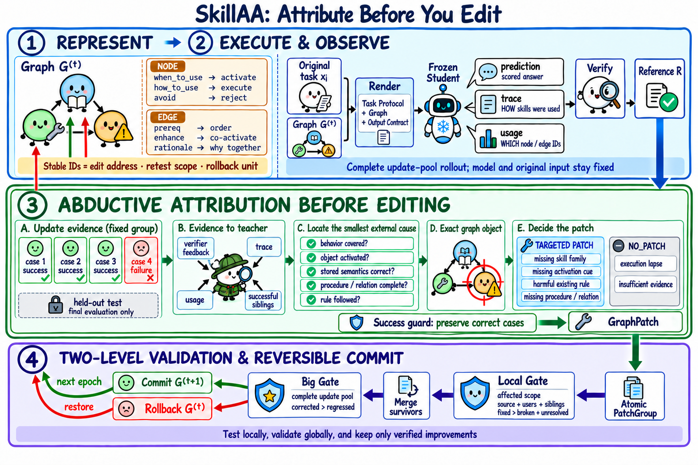

**Source figure / official image** — How SkillAA learns from errors: each skill node states when to use it and when not; attribution routes a repair to the specific failing object before gated editing. · Figure 2 (images/2.png) · [source](https://arxiv.org/html/2609.20455v1)

**nanoRSI reproduction** — not-run. Last source check: 2026-09-19.

**Open code / weights / data links** — [Code repository](https://github.com/Ziqiao-Shang/SkillAA)

**Primary sources** — [arXiv abstract](https://arxiv.org/abs/2609.20455) · [Paper HTML (affiliations, Figure 2, results)](https://arxiv.org/html/2609.20455v1) · [Code repository](https://github.com/Ziqiao-Shang/SkillAA)

### FINSKILLOPS: A Self-Evolving Multi-Agent System for SEC Filing QA

**2026-09-17** · paper · Direct bounded loop

**Publication date** — arXiv v1 2026-09-17; 28 authors across a company and eleven universities; HTML uses an EMNLP template but no venue is claimed.

**Institutional relationship** — Industry-academic consortium led by SimpleWay.AI with McGill/Toronto/UCLA/CUHK/Mila and others.

**What changes and how feedback is reused** — Typed, evidence-grounded failure diagnoses are converted into scoped skill patches that pass targeted validation, regression checks and negative controls before versioned replacement or retirement in a serving/evolution loop for SEC-filing QA.

**Author-reported result** — Evolved skills raise judge-scored correctness from 3.70 to 4.55 on the enhanced benchmark; a separate 12-round operational study promotes only 6 of 33 proposed skills while the monitoring non-correct rate falls from 20.0% to 12.5%.

**Evidence limits** — Author-reported on an in-house financial QA setting with LLM-judge scores; the 6/33 promotion rate is the honest headline — most proposed skills do not survive gating; no code release located.

**Code / weights / data / license** — arXiv paper public; no code release located at verification.

**Possible nanoRSI experiment — not implemented here** — The negative-control admission step (a proposed skill must beat a do-nothing control on the failing slice) and explicit retirement are the two gates nanoRSI skill streams lack; the 6/33 rate is a realistic promotion prior.

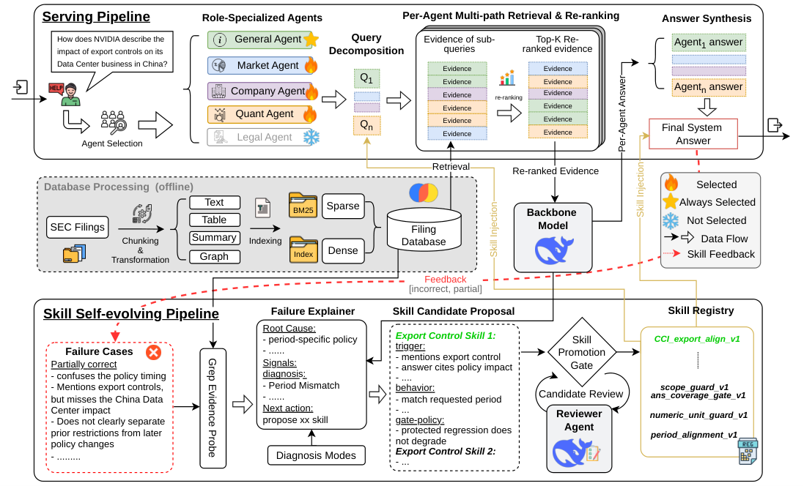

**Source figure / official image** — FinSkillOps: the serving pipeline draws on curated filing indexes while the evolution loop turns failed answers into gated registry updates that re-enter serving. · Figure 1 (emnlp-FinEvo-Final.png) · [source](https://arxiv.org/html/2609.19680v1)

**nanoRSI reproduction** — not-run. Last source check: 2026-09-19.

**Open code / weights / data links** — No verified public code/asset link in the audited sources.

**Primary sources** — [arXiv abstract](https://arxiv.org/abs/2609.19680) · [Paper HTML (affiliations, Figure 1, abstract numbers)](https://arxiv.org/html/2609.19680v1)

### Reflect, Revise, Reuse: Training-Free Skill Evolution for GUI Agents

**2026-09-15** · paper · Direct bounded loop

**Publication date** — v1 2026-09-15; affiliation list read from the paper HTML (one co-author is UESTC, the rest ZJU).

**Institutional relationship** — Academic (ZJU-led); no company affiliation shown.

**What changes and how feedback is reused** — Skills are living multi-file packages revised at deployment time in a reflect-revise-reuse loop: an isolated critic diagnoses failures, a restricted edit interface confines which skill files may change, and revisions are gated before reuse — no weight updates anywhere.

**Author-reported result** — Training-free gains up to +16.2% (MobileWorld), +6.0% (AndroidWorld) and +10.5% (OSWorld), the last being a cross-benchmark transfer setting.

**Evidence limits** — Author-reported; GUI domain only; revision-budget and critic-error effects not fully quantified in the abstract.

**Code / weights / data / license** — arXiv paper public; code not verified at last check.

**Possible nanoRSI experiment — not implemented here** — The restricted-edit-interface (only named skill files writable) plus isolated critic matches nanoRSI's contract guard; adding deployment-time revision as a control condition would separate 'skill improved' from 'skill was fine, execution drifted'.

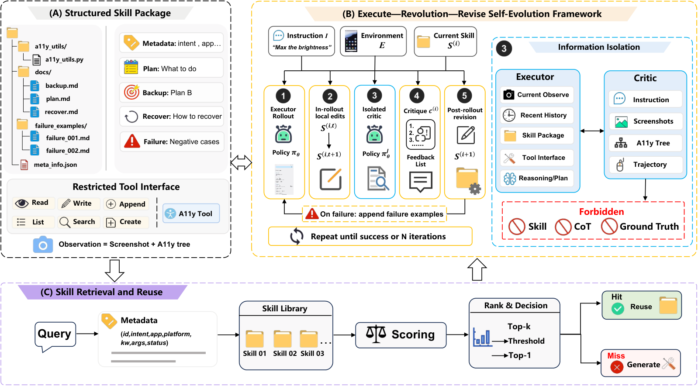

**Source figure / official image** — The reflect-revise-reuse loop: failures trigger an isolated critic and a restricted edit of the multi-file skill package before gated reuse. · Method figure (method.png) · [source](https://arxiv.org/html/2609.17653v1)

**nanoRSI reproduction** — not-run. Last source check: 2026-09-18.

**Open code / weights / data links** — No verified public code/asset link in the audited sources.

**Primary sources** — [arXiv abstract](https://arxiv.org/abs/2609.17653) · [Paper HTML (affiliations, method figure)](https://arxiv.org/html/2609.17653v1)

### SkillLift: Learning Dense Rubrics from Sparse Oracles for Efficient Skill Evolution

**2026-09-14** · paper · Direct bounded loop

**Publication date** — arXiv v1: 2026-09-14. Code repository created 2026-08-08. No later revision recorded at verification time.

**Institutional relationship** — Paper v1: Haoxiang Kang is an independent researcher; Ming Wen is at Fudan University (corresponding).

**What changes and how feedback is reused** — Reframes skill self-evolution as bilevel optimization to escape the oracle-rollout bottleneck (every candidate edit normally needs a full agent rollout). A structured rubric R - M binary criteria with signed weights over the skill's behavior - is learned as a cheap oracle-aligned surrogate. Inner loop: R is frozen and guides skill revision, scoring candidates with one LLM call instead of a rollout. Outer loop: a few oracle rollouts on frozen skills re-align R via Kendall's tau rank correlation, so only relative order matters, not score calibration. The alternating loop amortizes oracle cost while keeping the surrogate honest.

**Author-reported result** — On WildClawBench and SkillsBench with three backbone models (SkillsBench uses GPT-5.4-mini, WildClawBench GPT-5.4, matching official setups), SkillLift beats human-written skills, one-shot LLM-written skills, SkillOpt and CoEvoSkills while spending 40-70% less token cost than frontier evolving methods. Table 2 per-category cells show overall deltas of +5.4 to +14.0 (WildClawBench) and +9.6 to +28.3 (SkillsBench) over the strongest baselines per model group; a pilot study shows oracle rollout cost dominates cumulative tokens for direct oracle-guided search.

**Evidence limits** — Two-author paper; benchmark categories and rubric quality depend on the oracle existing and being rankable. Baselines receive 2x SkillLift's default token budget, which favors SkillLift in cost comparisons. All numbers are authors' own runs; the repository is new (2 stars at verification).

**Code / weights / data / license** — Code released under MIT at github.com/WalteR-MittY-pro/SkillLift (repo created 2026-08-08, 2 stars at verification). No weights or data release located.

**Possible nanoRSI experiment — not implemented here** — For nanoRSI's skill loop: replace per-edit full rollouts with a learned rubric surrogate re-aligned by rank correlation on periodic oracle rollouts - directly testable on the minimal task as a cheaper acceptance signal for candidate skills.

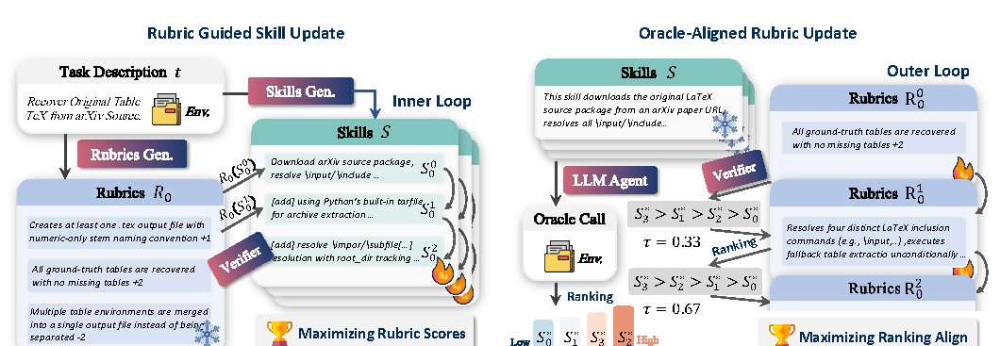

**Source figure / official image** — Figure 2: SkillLift overview - the inner loop revises skills against the frozen rubric at no oracle cost, while the outer loop re-aligns the rubric with a few oracle rollouts via Kendall's tau. · Figure 2, PDF page 3 · [source](https://arxiv.org/pdf/2609.15396)

**nanoRSI reproduction** — not-run. Last source check: 2026-09-16.

**Open code / weights / data links** — [Code repository (MIT)](https://github.com/WalteR-MittY-pro/SkillLift)

**Primary sources** — [arXiv abstract](https://arxiv.org/abs/2609.15396) · [Paper v1 PDF (affiliations, Figure 2, Table 2, protocol)](https://arxiv.org/pdf/2609.15396) · [Code repository (MIT)](https://github.com/WalteR-MittY-pro/SkillLift)

### SkillAdam: Stable and Efficient Skill Evolution for Agents

**2026-09-08** · paper · Direct bounded loop

**Publication date** — arXiv v1: September 8, 2026 (2609.08944). The official repository was created September 6 and announced the paper on September 8; these later repository events are not used as the original publication date.

**Institutional relationship** — The paper lists Renmin University of China and Tencent affiliations for the author group; the releasing repository is ruc-datalab/SkillAdam. This is an academic–industry report of the authors' own method.

**What changes and how feedback is reused** — Optimizes a persistent natural-language skill while the target model stays frozen. Each iteration rolls out the current skill on a sampled mini-batch, records case-level issues and outcomes in an Evolving Issue Tracker (direction memory), estimates recent improvement volatility, and lets both states constrain the next patch's scope. Candidates are accepted only when designated metrics improve without protected-metric regressions; the accepted skill and optimizer states feed the next iteration.

**Author-reported result** — Author-reported: seven benchmarks covering short- and long-horizon tasks show state-of-the-art results with fewer optimization iterations and lower cost than the listed baselines. The paper reports a cumulative ablation where adding optimization memory raises DeepPlanning average from 19.2% to 21.7%; the main protocol uses GPT-5.5 for six benchmarks, Claude Sonnet 4.5 for DeepPlanning, and seed 42 for controlled sampling.

**Evidence limits** — The reported loop is bounded and benchmark-native: six benchmarks make one pass through an optimization pool, the acceptance decision has no additional validation set, and the final test partition is evaluated once. The memory ablation is cumulative rather than an isolated interaction analysis; cross-task transfer, repeated compounding under a fixed budget, and independent external gating are not demonstrated.

**Code / weights / data / license** — Official code is released at github.com/ruc-datalab/SkillAdam under the repository's MIT license. No new model weights are released; the target models are frozen third-party systems. Benchmark data and any third-party components retain their own terms, and the audited repository does not establish a redistributable data bundle.

**Possible nanoRSI experiment — not implemented here** — For nanoRSI: add a small persistent optimizer-state record to the skills surface — issue history plus bounded edit budget — while keeping the existing evaluator frozen. Compare stateless editing, issue-memory-only, volatility-budget-only and the combined state at matched rollout budgets; report accepted edits, regressions, edit size, tokens and held-out transfer. This is an experiment proposal, not an implementation or local reproduction.

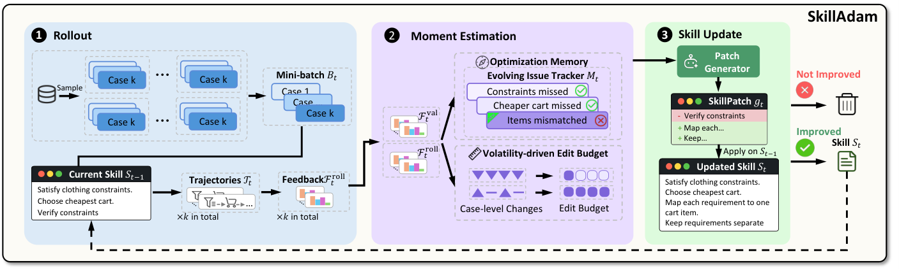

**Source figure / official image** — Figure 2: Functional correspondence between Adam and SkillAdam — rollout feedback updates an issue-memory state and a volatility-driven edit budget, which constrain the next skill patch. · Figure 2 · [source](https://arxiv.org/html/2609.08944v1)

**nanoRSI reproduction** — not-run. Last source check: 2026-09-17.

**Open code / weights / data links** — [Official implementation (MIT)](https://github.com/ruc-datalab/SkillAdam) · [Repository license (MIT)](https://raw.githubusercontent.com/ruc-datalab/SkillAdam/main/LICENSE)

**Primary sources** — [arXiv abstract](https://arxiv.org/abs/2609.08944) · [Paper HTML v1 (Figure 2, protocol, results)](https://arxiv.org/html/2609.08944v1) · [Official implementation (MIT)](https://github.com/ruc-datalab/SkillAdam) · [Repository license (MIT)](https://raw.githubusercontent.com/ruc-datalab/SkillAdam/main/LICENSE)

### From Interaction Traces to Persistent Skills: Online Evolution for Computer-Use Agents

**2026-09-04** · paper · Direct bounded loop

**Publication date** — arXiv v1: 2026-09-04. No later revision recorded at verification time.

**Institutional relationship** — Paper v1 lists first author Longtao Hu (UESTC) and Xiao Liang plus corresponding author Linchao Zhu (Zhejiang University). Independent academic work; no company affiliation is stated.

**What changes and how feedback is reused** — Each iteration executes GUI tasks against a frozen snapshot of a persistent skill library. An extractor turns the rollout trajectory into structured facts; a proposer diagnoses them into candidate edits (create, edit, delete, or explicit no-op); a builder materializes accepted skills as versioned SKILL.md files with edit history. Evaluator outcomes and trace evidence are the feedback; the skill library is the only thing that mutates — model weights stay frozen.

**Author-reported result** — Against a configuration-matched empty-library control (identical action-generation and GUI-grounding stack, task sets and iteration horizons) on four OSWorld application domains, the full system posts a higher post-warm-up (t>=5) mean evaluator score in all four domains, with mean differences from +5.7 to +18.6 percentage points. A GIMP provenance analysis records cross-origin skill retrieval and 'revision churn': repeatedly accepted edits can still fail to recover the originating task — the negative observation is kept.

**Evidence limits** — Evidence covers four OSWorld domains with the authors' own evaluator; gains depend on evaluator signal quality, and absolute scores remain far from saturation. No third-party replication yet.

**Code / weights / data / license** — Code public at github.com/LongtaoHu/Skill-Evo4GUI (live 2026-09-15); no license file was located on the repository page, so reuse permission is not established. No trained weights; OSWorld task sets are used, not re-released.

**Possible nanoRSI experiment — not implemented here** — Port the frozen-snapshot + versioned-SKILL.md + explicit no-op discipline into nanoRSI's skills loop: candidate edits land in a versioned store, each episode runs against a frozen snapshot, and provenance logs reveal which skills are actually retrieved and whether they still solve their origin task.

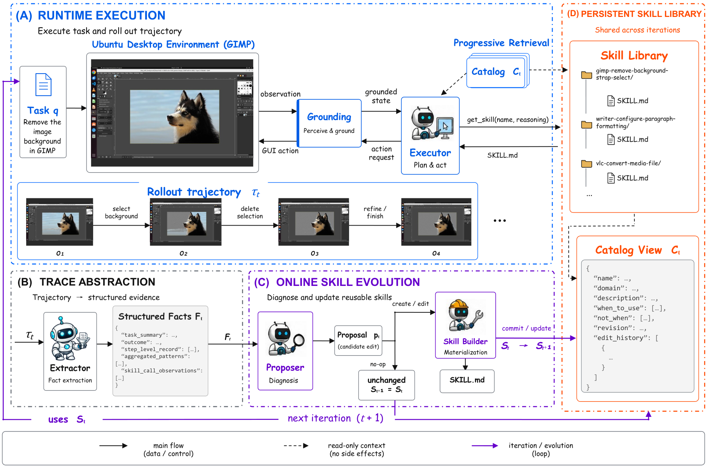

**Source figure / official image** — Figure 1: the online skill-evolution loop — runtime execution and trace abstraction feed a proposer/builder pair that commits versioned skills into a persistent library shared across iterations. · Figure 1 · [source](https://arxiv.org/html/2609.04869v1)

**nanoRSI reproduction** — not-run. Last source check: 2026-09-15.

**Open code / weights / data links** — [Author code repository](https://github.com/LongtaoHu/Skill-Evo4GUI)

**Primary sources** — [arXiv abstract](https://arxiv.org/abs/2609.04869) · [Paper v1 (affiliations, Figures 1-2, Tables 1-2)](https://arxiv.org/html/2609.04869v1) · [Author code repository](https://github.com/LongtaoHu/Skill-Evo4GUI)

### SimSkill: A Self-Evolving LLM Agent for Skill and Knowledge Accumulation in Traffic Simulation

**2026-09-03** · paper · Direct bounded loop

**Publication date** — arXiv v1: 2026-09-03; latest recorded revision v3: 2026-09-11. Figures are cited from v3; the mechanism description follows v1/v3 abstracts.

**Institutional relationship** — Paper v3 lists Qi Liu, Qinzheng Wang and Yiming Bie at the School of Transportation, Jilin University, and Can Li and Wanjing Ma at the Key Laboratory of Road and Traffic Engineering (Ministry of Education), College of Transportation, Tongji University.

**What changes and how feedback is reused** — Built on the SUMO traffic simulator with a Claude-style skill runtime. In Learn mode the agent identifies its own capability gaps, generates and solves environment-grounded tasks, verifies solutions through an action-critic loop, and distills outcomes into three memory stores: episodic (dated task experiences), procedural (.claude/skills-style executable skills) and semantic (curated knowledge pages). In Infer mode it retrieves from those stores; dedicated memory-management skills handle retrieval, ingestion and linting. Its self-evolving loop is Propose Task, Plan & Retrieve, Act in SUMO, Evaluate & Reflect, Distill & Ingest.

**Author-reported result** — Evaluated on two held-out benchmarks across three backbone LLMs with independently verified results (the authors' stated verification protocol): verified success improves by up to +25 percentage points over the no-memory baseline. Ablations show procedural and semantic memory contribute in complementary ways; benefits depend on the backbone and compute budget — memory does not help every model and does not always lower inference cost, which the authors keep as a caveat.

**Evidence limits** — Domain-specific to SUMO traffic simulation; 'independently verified' refers to the authors' in-paper verification protocol, not an external audit; v3 revised twice within eight days, so numbers should be re-checked against any later version.

**Code / weights / data / license** — Code and experimental data public at github.com/qiliuchn/SimSkill-V1 under the Apache-2.0 license (verified 2026-09-15).

**Possible nanoRSI experiment — not implemented here** — Gap-driven task generation at nano scale: let nanoRSI's proposer maintain an explicit capability-gap list, generate environment-grounded probe tasks against it, and store verified solutions as reusable skills — the same Propose, Act, Evaluate, Distill circuit on the minimal task.

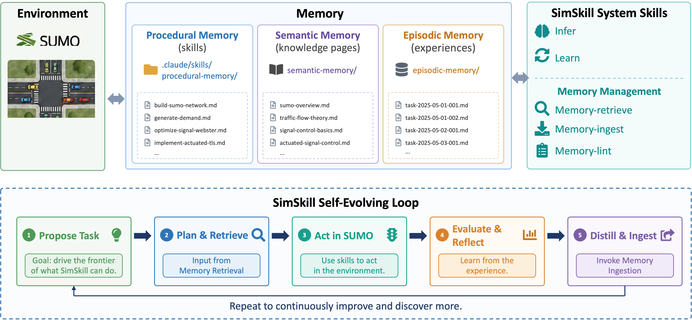

**Source figure / official image** — Figure 1: SimSkill architecture and its self-evolving loop over SUMO — propose task, plan and retrieve, act, evaluate and reflect, then distill into episodic, procedural and semantic memory. · Figure 1 · [source](https://arxiv.org/html/2609.03753v3)

**nanoRSI reproduction** — not-run. Last source check: 2026-09-15.

**Open code / weights / data links** — [Author code repository (Apache-2.0)](https://github.com/qiliuchn/SimSkill-V1)

**Primary sources** — [arXiv abstract](https://arxiv.org/abs/2609.03753) · [Paper v3 (affiliations, Figure 1, memory listings)](https://arxiv.org/html/2609.03753v3) · [Author code repository (Apache-2.0)](https://github.com/qiliuchn/SimSkill-V1)

### SkillGLoW: Procedural-Family Skill Consolidation for Self-Improving Agents on Long-Horizon Task Streams

**2026-09-02** · paper · Direct bounded loop

**Publication date** — arXiv v1: 2026-09-02. No later revision recorded at verification time.

**Institutional relationship** — Paper v1 lists affiliation 1 as the National University of Singapore and affiliation 2 as the Institute of Advanced Intelligence and Computing (IAIC), Singapore; the corresponding author is Joey Tianyi Zhou.

**What changes and how feedback is reused** — Each task's execution yields a local skill card. Embedding-based clustering groups cards into procedural families; a compressor condenses each family into a de-instantiated global prior. A verifier-grounded commit gate admits a prior only when real downstream execution shows it does not degrade the deployed library (measured against the history-best value). At execution time the frozen prior is woven with a freshly regenerated local skill, so instance detail is regenerated per task instead of being stored.

**Author-reported result** — Across 12 continual-improvement runs spanning 4 benchmarks (math reasoning, terminal automation, software repair, embodied ALFWorld) and 3 models, consolidated priors add +17.2 hard points over the no-skill baseline on average (+18.0 with local regeneration); gains are positive in 12/12 runs. The prior library is 3.6x more compact than the per-task pool and leads a published single-document optimizer on 15 of 21 cells. Unmodified priors lift unseen ALFWorld success from 73.9% to 83.9%.

**Evidence limits** — No code or data release; the single-document-optimizer comparison is a re-run aligned in the appendix (task sets, models, prompts), and all numbers come from the authors' own runs. Model-family-dependent variance is reported.

**Code / weights / data / license** — No code or data release located; paper plus appendix only. Experiments call commercial models (MiniMax-M3 and GPT-5.4-mini are named in the tables).

**Possible nanoRSI experiment — not implemented here** — For nanoRSI's skill library: consolidate related tasks into families and compress per-family priors instead of one global document, and require a real-execution commit gate — a candidate prior is admitted only if current library scores do not degrade.

**Source figure / official image** — Figure 2: GLoW overview — local evidence becomes skill cards, cards are clustered into procedural families and compressed into candidate priors, and only the verifier-grounded commit gate admits them; execution weaves the frozen prior with a regenerated local skill. · Figure 2 · [source](https://arxiv.org/html/2609.02217v1)

**nanoRSI reproduction** — not-run. Last source check: 2026-09-15.

**Open code / weights / data links** — No verified public code/asset link in the audited sources.

**Primary sources** — [arXiv abstract](https://arxiv.org/abs/2609.02217) · [Paper v1 (affiliations, Figure 2, Tables 1-4)](https://arxiv.org/html/2609.02217v1)

### Scientific Agent Skills: A Library of Procedural Knowledge for Research Agents

**2026-08-30** · paper · Enabling technique / evaluation

**Publication date** — arXiv v1: 2026-08-30; v2: 2026-09-02. The repository (45K stars at verification) predates and outgrew the paper.

**Institutional relationship** — Paper: Timothy Kassis, Vinayak Agarwal, Yuhuan He, Darshil Patel, Aubrey M. Brueckner - affiliations not rendered on the abstract page; the repository sits under the K-Dense AI organization.

**What changes and how feedback is reused** — Not a loop: an openly licensed library of 163 procedural-knowledge skills across 16 areas of scientific practice (genomics, cheminformatics, medical imaging, study design, scientific communication). Each skill is a directory centered on a versioned, human-readable instruction file loaded only when a task needs it, often with reference material and runnable scripts - encoding which test the field accepts and which identifier namespace is authoritative.

**Author-reported result** — No task-level evaluation or baselines; the quantitative content is budget accounting: always-resident descriptions of all 163 skills cost 7.1% of a 200K-token window; the median documented workflow fits within 23.9% of it; 29 of 46 workflows would overflow if every reference file were loaded - hence lazy, on-demand loading.

**Evidence limits** — A curated static library: no evolution mechanism, no task benchmarks; skill quality is human-curated; the entry is catalogued as enabling infrastructure for skill-based agents, not a self-improvement result.

**Code / weights / data / license** — Code/library at github.com/K-Dense-AI/scientific-agent-skills (MIT, 45,207 stars at verification). Paper CC BY 4.0.

**Possible nanoRSI experiment — not implemented here** — For nanoRSI: the token-budget accounting (always-resident descriptions vs lazy loading vs overflow) is the right format for reporting skill-library cost - and a curated seed library is a legitimate cold-start baseline for skill-evolution experiments.

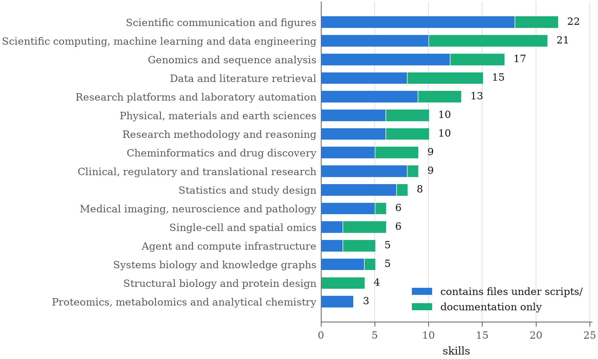

**Source figure / official image** — Figure 2: the skill library overview - 163 versioned procedural-knowledge skills across 16 areas of practice, each loaded only when a task needs it (always-resident descriptions cost 7.1% of a 200K-token window). · Figure 2 · [source](https://arxiv.org/html/2609.00065v2)

**nanoRSI reproduction** — not-run. Last source check: 2026-09-17.

**Open code / weights / data links** — [Library repository (MIT)](https://github.com/K-Dense-AI/scientific-agent-skills)

**Primary sources** — [arXiv abstract](https://arxiv.org/abs/2609.00065) · [Paper v2 (Figure 2, budget figures)](https://arxiv.org/html/2609.00065v2) · [Library repository (MIT)](https://github.com/K-Dense-AI/scientific-agent-skills)

### WikiSkill: Compiling Agent Experience into Persistent Knowledge for Skill Evolution

**2026-08-27** · paper · Direct bounded loop

**Publication date** — arXiv v1: 2026-08-27. No later revision recorded at verification time.

**Institutional relationship** — Paper v1: Google Research (Liyan Tang, Cyrus Rashtchian, Chun-Sung Ferng, Andrew Tomkins, Da-Cheng Juan) with Tu Vu (Google Research + Virginia Tech, corresponding).

**What changes and how feedback is reused** — A three-layer workspace: immutable raw execution traces, a persistent wiki that compounds across iterations (patterns, logs, skill-impact records), and active SKILL.md files. Each iteration the Inference Agent rolls out with skills but no wiki access; a Wiki Maintainer consolidates sampled traces into patterns; a Skill Proposer reads wiki + traces and proposes one atomic skill edit; validation gating accepts or rolls back skills - while the wiki itself is never rolled back, accumulating a ground-truth audit trail of accepted and rejected diffs.

**Author-reported result** — Five benchmarks x five models, 3 runs, paired bootstrap p<0.05: WikiSkill beats no-skill, Trace2Skill, EvoSkill and SkillOpt everywhere (e.g., Gemini-3.5-Flash 68.1 vs SkillOpt 55.9; Qwen-3.6-27B 63.3 vs 50.7). Gains scale with model size (+12.3/+17.5/+23.9 for Qwen 4B/9B/27B); Qwen-3.5-9B + WikiSkill (47.4%) beats Qwen-3.6-27B without skills (39.4%). Ablation: wiki access for the proposer alone +15.0; giving the inference agent wiki access hurts (-7.2).

**Evidence limits** — Full skill injection into prompts (retrieval/triggering unevaluated); strict gating rejects neutral proposals that might enable later gains; no automated wiki pruning; no very long-horizon tasks.

**Code / weights / data / license** — No code release located; paper CC BY 4.0.

**Possible nanoRSI experiment — not implemented here** — For nanoRSI: separate never-rolled-back knowledge (the wiki, with accepted/rejected diffs) from rolled-back executable skills - an audit layer whose monotonic growth makes skill-gate decisions reviewable after the fact.

**Source figure / official image** — Figure 2: WikiSkill's three layers - immutable execution traces (raw), a persistent knowledge base that compounds across iterations (wiki), and active procedural instructions (skills), with the wiki never rolled back. · Figure 2 · [source](https://arxiv.org/html/2608.27454v1)

**nanoRSI reproduction** — not-run. Last source check: 2026-09-16.

**Open code / weights / data links** — No verified public code/asset link in the audited sources.

**Primary sources** — [arXiv abstract](https://arxiv.org/abs/2608.27454) · [Paper v1 (affiliations, Figure 2, main table)](https://arxiv.org/html/2608.27454v1)

### SkillOpt: Executive Strategy for Self-Evolving Agent Skills

**2026-06-30** · report · Direct bounded loop

**Publication date** — Microsoft Research blog post dated June 30, 2026; the accompanying publication page and open-source repository were created the same quarter (repository created 2026-05-08).

**Institutional relationship** — Microsoft Research / MSRA authors (Yifan Yang, Xuemei Gao, Qi Dai, Bei Liu, Kai Qiu, Dongdong Chen, Chong Luo) reporting their own method; blog numbers are author-reported with the paper linked from the same page.

**What changes and how feedback is reused** — Treats an agent's skill file as a trainable parameter in text space: an optimizer model proposes bounded edits in a forward–backward–update cycle, and a candidate is adopted 'only if it scores strictly higher than the current skill on the held-out validation split'; rejected edits are buffered as negative feedback, with epoch-wise slow/meta updates on top.

**Author-reported result** — Author-reported: best or tied-best in all 52 evaluation cells (6 benchmarks × 7 models × 3 execution modes) against human-written skills, one-shot LLM skills, Trace2Skill, TextGrad, GEPA and EvoSkill; with GPT-5.5 in direct chat the six-benchmark average rises from 58.8 to 82.3 (+23.5 points absolute); SpreadsheetBench 41.8→80.7; a spreadsheet skill trained in Codex lifts Claude Code from 22.1 to 81.8 (+59.7); median final skill ~920 tokens with only 1–4 accepted edits; removing meta-skill/slow-update drops SpreadsheetBench from 77.5 to 55.0.

**Evidence limits** — Skill optimization is supervised by held-out validation within fixed benchmarks — the loop optimizes against known test distributions, so gains on shifted or out-of-suite tasks are not demonstrated; cross-harness transfer is shown for one skill family only; execution modes rely on commercial harnesses whose versions are not pinned.

**Code / weights / data / license** — Official implementation verified at github.com/microsoft/SkillOpt (MIT license, created 2026-05-08, ~17k stars); paper page linked from the blog; no new weights (frozen third-party models); benchmark data subject to the original benchmark terms.

**Possible nanoRSI experiment — not implemented here** — Proposed: add a held-out-gate skill editor to nanoRSI's skills surface — bounded diff proposals accepted only on strict validation improvement — compared against ungated self-editing and frozen skills on identical task streams, tracking edit acceptance rates and regressions.

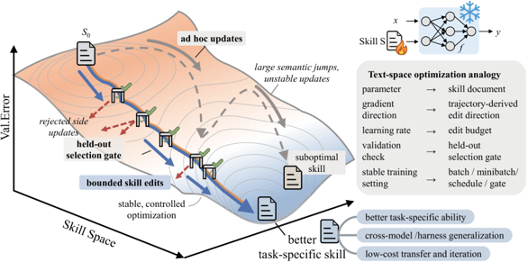

**Source figure / official image** — Figure 1: skill-space optimization analogy — bounded edits with a held-out selection gate descend the validation-error surface where ad-hoc unguarded updates jump; the table maps classic training hyperparameters to their text-space counterparts. · Blog Figure 1 · [source](https://www.microsoft.com/en-us/research/blog/skillopt-agent-skills-as-trainable-parameters/)

**nanoRSI reproduction** — not-run. Last source check: 2026-09-14.

**Open code / weights / data links** — [Official implementation (MIT)](https://github.com/microsoft/SkillOpt)

**Primary sources** — [Official MSR blog post (opened)](https://www.microsoft.com/en-us/research/blog/skillopt-agent-skills-as-trainable-parameters/) · [Official implementation (MIT)](https://github.com/microsoft/SkillOpt) · [Publication page](https://www.microsoft.com/en-us/research/publication/skillopt-executive-strategy-for-self-evolving-agent-skills/)

### SkillHone: A Harness for Continual Agent Skill Evolution Through Persistent Decision History

**2026-06-07** · paper · Direct bounded loop

**Publication date** — arXiv v1 submitted 2026-06-07; later revisions are not used to reset the inclusion date. The paper identifies WeChat, Tencent Inc. affiliations and describes SkillHone as an ongoing research harness.

**Institutional relationship** — The paper lists WeChat, Tencent Inc. for the Tencent authors; one author is described as having worked at WeChat AI, Tencent Inc. during an internship. University affiliations are not treated as Tencent ownership.

**What changes and how feedback is reused** — A persistent decision history stores diagnoses, candidate skill revisions, redacted evaluation evidence and outcomes. Separate optimizer and evaluator agents work against separate skill and evaluation repositories; accepted revisions feed later sessions, so the skill artifact itself is edited and reused across iterations.

**Author-reported result** — On the raw open-web setting with Qwen3.6-35B-A3B, SkillHone reports 64.6 GAIA average versus 48.8 for a curated deep-research agent (+15.8) and 66.4 WebWalkerQA-EN versus 63.2 (+3.2). Internal tool-mediated scenarios report an average +18.8 improvement; these are author-reported, task-specific results.

**Evidence limits** — The paper evaluates English benchmarks and isolates one skill at a time; joint multi-skill evolution is not demonstrated. The original enterprise harness is not the public repository, so the open bundle should not be presented as a full release of Tencent internal infrastructure.

**Code / weights / data / license** — Public Tencent/SkillHone repository verified. Its README and LICENSE state MIT; the GitHub API metadata reports NOASSERTION. The paper harness, internal data and model weights are not released in this repository.

**Possible nanoRSI experiment — not implemented here** — Add a versioned skill directory to nanoRSI: keep decision records, candidate diffs, evaluator evidence and rollback decisions, then compare fixed skills with accepted-revision reuse on held-out tasks.

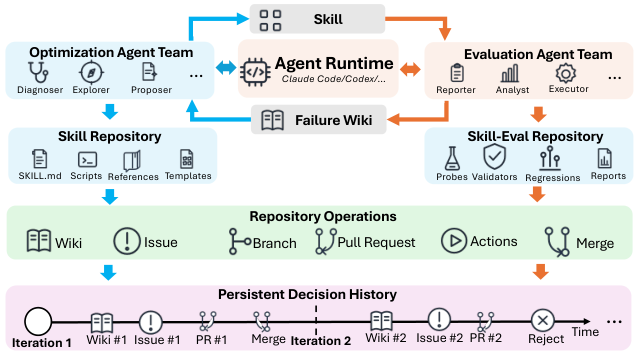

**Source figure / official image** — Figure 2: SkillHone separates persistent decision history, skill optimization and skill evaluation so accepted revisions can be reused. · Figure 2, framework.png · [source](https://ar5iv.labs.arxiv.org/html/2606.08671/assets/framework.png)

**nanoRSI reproduction** — not-run. Last source check: 2026-09-13.

**Open code / weights / data links** — [Tencent SkillHone repository](https://github.com/Tencent/SkillHone) · [SkillHone MIT license](https://github.com/Tencent/SkillHone/blob/main/LICENSE)

**Primary sources** — [arXiv first submission and history](https://arxiv.org/abs/2606.08671) · [Paper v1 and framework figure](https://arxiv.org/html/2606.08671v1) · [Tencent SkillHone repository](https://github.com/Tencent/SkillHone) · [SkillHone MIT license](https://github.com/Tencent/SkillHone/blob/main/LICENSE)

### OpenSkill: Open-World Self-Evolution for LLM Agents

**2026-06-04** · paper · Direct bounded loop

**Publication date** — arXiv v1: 2026-06-04 (2606.06741), day-precision verified on the abs page.

**Institutional relationship** — Paper: Lehigh University (Zhiling Yan, Lichao Sun corresponding) with UIC (Hanrong Zhang, Philip S. Yu), UBC/Vector (Yuxuan Zhang), Salesforce AI Research (Yutong Dai, Ran Xu) and MGH/Harvard Medical School (Xiang Li).

**What changes and how feedback is reused** — Skills and their verification signals are both built from scratch with no target-task supervision: open-world knowledge acquisition retrieves task knowledge and verification anchors from docs, repos, papers and the web (queries filtered to strip benchmark names against leakage); leakage-free skill evolution drafts 1-4 skills from a plan and iteratively refines them (up to 3 rounds) against self-built 'virtual tests' grounded in independently verifiable facts, with a gap-vs-bug classifier triggering targeted retrieval; zero-shot evaluation deploys the final skill artifact to any agent - hidden ground-truth tests are used only there.

**Author-reported result** — SkillsBench: Opus 4.6 43.6% vs best baseline Skill-Creator 34.7% (+8.9; human 44.5%); GPT 5.2 42.1% vs CoT 33.3% (+8.8; human 44.8%) - within 1 point of human skill authors on Opus. Best in all four columns of SocialMaze/ScienceWorld; transfers +5.5-14.8 points to four weaker models. Verifier quality: 56.9% precision, 80.5% recall, covering 88.9% of ground-truth test intents. Cost honestly reported: ~1.14M tokens / ~131 minutes end-to-end (~$1,800 total estimate).

**Evidence limits** — Web sources may be noisy or contradictory (needs provenance tracking); virtual tests may be too easy (overestimating skill quality) or, if derived from hidden answers, reintroduce supervision leakage; open-world research costs latency and tokens.

**Code / weights / data / license** — Code at github.com/OpenLAIR/OpenSkill (Apache-2.0, 92 stars at verification); site openlair.github.io/openskill. Paper CC BY 4.0.

**Possible nanoRSI experiment — not implemented here** — For nanoRSI: when no evaluator exists, build the verification anchor from independently verifiable facts BEFORE building the skill - and strip benchmark names from retrieval queries as standard leakage hygiene.

**Source figure / official image** — Figure 2: OpenSkill - a base agent acquires open-world knowledge to build a skill plan, iteratively generates, executes and refines the skill in a sandbox against self-built virtual tests, with a leakage barrier blocking target supervision during construction. · Figure 2 · [source](https://arxiv.org/html/2606.06741v1)

**nanoRSI reproduction** — not-run. Last source check: 2026-09-17.

**Open code / weights / data links** — [Code repository (Apache-2.0)](https://github.com/OpenLAIR/OpenSkill)

**Primary sources** — [arXiv abstract](https://arxiv.org/abs/2606.06741) · [Paper v1 (affiliations, Figure 2, tables)](https://arxiv.org/html/2606.06741v1) · [Code repository (Apache-2.0)](https://github.com/OpenLAIR/OpenSkill)

### SkillEvolver: Skill Learning as a Meta-Skill

**2026-05-11** · paper · Direct bounded loop

**Publication date** — arXiv v1: 2026-05-11. The work surfaced through a May 2026 media story and was verified against the arXiv original and the official repository on 2026-09-15; recorded under its first-publication date.

**Institutional relationship** — Paper v1 lists Erle Zhu, Jinfeng Zhou and Hongning Wang at Tsinghua University, and Genrui Zhang and Caiyan Jia at Beijing Jiaotong University.

**What changes and how feedback is reused** — Skill self-evolution is packaged as a portable meta-skill any protocol-compliant CLI agent can load; it updates a skill's prose and code, never model weights. One iteration: strategize and spawn K strategy-diverse domain-skill agents to collect success/failure trajectories; analyze the contrast and synthesize a targeted skill patch; then an independent auditor in a fresh session verifies the patched skill before acceptance — a fresh-agent overfit audit that catches leakage and a silent-bypass mode where a skill looks valid but is never invoked at run time. Refinement triggers only after deployment, so the learning signal comes from failures real downstream agents hit, not exploratory traces alone.

**Author-reported result** — SkillsBench (83 tasks, 15+ domains): 56.8% avg@5 versus 43.6% for human-curated skills and 29.9% no-skill; per the official repository README, the R=2 configuration reaches 56.9% and the evolved skill beats or matches human-curated on 74.7% of tasks. KernelBench GPU-kernel optimization: mean speedup 1.16 to 1.51 on H100. Downstream runs use -19% tokens, -15% turns and -24% wall-clock; end-to-end cost about $4 per task (repository README).

**Evidence limits** — Benchmarks use the authors' own task scopes; the deploy-then-refine signal presumes other agents reuse the skill library, leaving cold-start unclear; cost and per-task figures come from the repository README rather than the paper body.

**Code / weights / data / license** — Official code at THU-AICosmos/skillevolver under the MIT license (verified 2026-09-15); README names Claude Opus 4.6 as the working model. No separate dataset release located.

**Possible nanoRSI experiment — not implemented here** — Adopt the fresh-agent overfit audit plus silent-bypass check as a nanoRSI skill-acceptance gate: audit each candidate skill with an agent that has no prior session state, testing both leakage and whether the skill is actually invoked at run time.

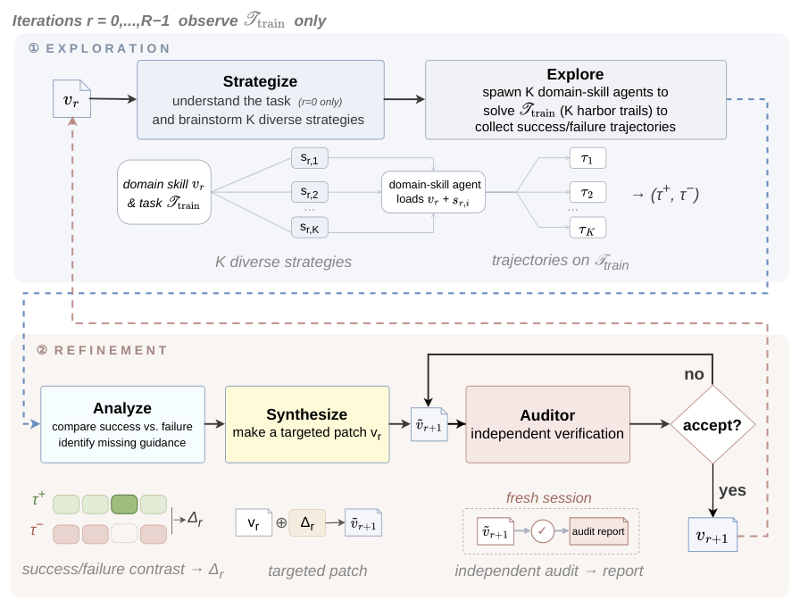

**Source figure / official image** — Figure 2: one SkillEvolver iteration — strategy-diverse exploration collects success/failure trajectories, a targeted patch is synthesized, and an independent fresh-session auditor gates acceptance. · Figure 2 · [source](https://arxiv.org/html/2605.10500v1)

**nanoRSI reproduction** — not-run. Last source check: 2026-09-15.

**Open code / weights / data links** — [Official code repository (MIT)](https://github.com/THU-AICosmos/skillevolver)

**Primary sources** — [arXiv abstract](https://arxiv.org/abs/2605.10500) · [Paper v1 (affiliations, Figure 2, Tables 1-2)](https://arxiv.org/html/2605.10500v1) · [Official code repository (MIT)](https://github.com/THU-AICosmos/skillevolver)

### EmbodiSkill: Skill-Aware Reflection for Self-Evolving Embodied Agents

**2026-05-11** · paper · Direct bounded loop

**Publication date** — arXiv v1: 2026-05-11; v2: 2026-07-11. The metrics and figures cited here come from v2. Surfaced in May via a media lead alongside SkillEvolver; first verified against the original paper on 2026-09-16.

**Institutional relationship** — Paper v2 lists five affiliations: Huazhong University of Science and Technology, University of Science and Technology of China, Microsoft Research, Institute for AI Industry Research (AIR) Tsinghua University, and Nanjing University; Ting Cao (Microsoft Research) is among the authors. Media coverage in May named only NJU x Microsoft x Tsinghua AIR - the full list is broader.

**What changes and how feedback is reused** — A training-free loop that evolves a two-part procedural skill S = (S_body, S_app) for a frozen executor. Each trajectory is interpreted relative to the current skill and split by evidence type: skill-changing evidence (Discovery, Optimization, SkillDefect reflections) is consolidated and applied as targeted edits to the skill body, with the model acting as a constrained editor rather than a free-form rewriter; execution-lapse evidence (the agent failed to follow valid guidance) updates only the appendix, which re-highlights existing valid body content instead of rewriting it. Revision sets larger than a budget trigger no-op.

**Author-reported result** — On ALFWorld (3,553 train / 134 test tasks, K=1, 10 revision stages), a frozen Qwen3.5-27B executor reaches 93.28% task success, 31.58 points above GPT-5.2 used as a direct skill-less agent; on Puttwo it hits 100.00% vs G-Memory's 52.94%. Ablation: no-skill 61.19 -> static skill 73.13 -> skill-unaware reflection 78.36 -> EmbodiSkill 93.28 (awareness delta +14.92). EmbodiedBench: EB-Habitat best average 52.33% (+16.29 over the strongest memory baseline), EB-Navigation 61.33% (+17.94). Gains vary by backbone pairing: with Gemini the Qwen3.5-27B awareness delta shrinks to +1.49.

**Evidence limits** — No dedicated limitations section in v2. The awareness delta is unstable across model pairings (+14.92 with GPT-5.2 vs +1.49 with Gemini on the same backbone), so the reflection channel's value is configuration-dependent. All numbers are authors' own runs; EmbodiedBench training uses 1,000 tasks per environment, which the authors curate themselves.

**Code / weights / data / license** — Code released under MIT at github.com/air-embodied-brain/EmbodiSkill (repo created 2026-07-03, 25 stars at verification). No weights or data release located; experiments call commercial models (Qwen3.5-27B, GPT-5.2, Gemini are named).

**Possible nanoRSI experiment — not implemented here** — For nanoRSI's skill evolution: split update evidence into two channels - defects in skill content trigger edits, while failures to follow valid guidance only re-emphasize that guidance (appendix-style), preventing good skills from being rewritten because of execution noise.

**Source figure / official image** — Figure 2: EmbodiSkill overview - the executor runs the current skill on an embodied task, reflection splits evidence into a Revision Set (Discovery/Optimization/SkillDefect -> skill body) and an Appendix Set (ExecutionLapse -> appendix), and only budget-fitting revision sets are applied. · Figure 2 · [source](https://arxiv.org/html/2605.10332v2)

**nanoRSI reproduction** — not-run. Last source check: 2026-09-16.

**Open code / weights / data links** — [Code repository (MIT)](https://github.com/air-embodied-brain/EmbodiSkill)

**Primary sources** — [arXiv abstract](https://arxiv.org/abs/2605.10332) · [Paper v2 (affiliations, Figure 2, Tables, ablations)](https://arxiv.org/html/2605.10332v2) · [Code repository (MIT)](https://github.com/air-embodied-brain/EmbodiSkill)

### CoEvoSkills: Self-Evolving Agent Skills via Co-Evolutionary Verification

**2026-04-02** · paper · Direct bounded loop

**Publication date** — arXiv v1 2026-04-02 (v3 2026-08-10 current); COLM acceptance stated on the abs page, verified 2026-09-19.

**Institutional relationship** — Academic consortium led by UIC with MBZUAI/McGill, Columbia, Zhejiang and UBC co-authors.

**What changes and how feedback is reused** — A Skill Generator produces multi-file skill packages while a co-evolving Surrogate Verifier filters them using only structured failure feedback; the ground-truth oracle is kept information-isolated (opaque pass/fail only) and its rounds trigger test upgrades, so skill and verifier bootstrap each other without labels.

**Author-reported result** — On SkillsBench with Claude Opus 4.6 + Claude Code: 71.1% pass rate vs 30.6% no-skill (+40.5pp), 53.5% human-curated skills (+17.6pp) and 34.1% for Anthropic Skill-Creator; GPT-5.2 self-evolved 69.8% vs 29.6%; skills evolved by Opus transfer to six other models with +35 to +44pp (e.g. Haiku 4.5: 54.5% vs 10.4%).

**Evidence limits** — Author-reported on one benchmark family; the verifier can be fooled within its feedback budget and the paper measures skill pass rates, not downstream recursive compounding.

**Code / weights / data / license** — Apache-2.0 code at github.com/Zhang-Henry/CoEvoSkills (verified); SkillsBench usage terms follow the paper.

**Possible nanoRSI experiment — not implemented here** — nanoRSI skills starter can adopt the information-isolated verifier pattern: the strict gate sees only structured failure feedback while the oracle emits opaque pass/fail, and oracle invocations trigger verifier test upgrades.

**Source figure / official image** — The Skill Generator and Surrogate Verifier co-evolve through iterative refinement with the ground-truth oracle kept information-isolated. · Figure 3 (process.png) · [source](https://arxiv.org/html/2604.01687v3)

**nanoRSI reproduction** — not-run. Last source check: 2026-09-19.

**Open code / weights / data links** — [Code repository](https://github.com/Zhang-Henry/CoEvoSkills)

**Primary sources** — [arXiv abstract](https://arxiv.org/abs/2604.01687) · [Paper HTML (affiliations, Table 3, Figure 3)](https://arxiv.org/html/2604.01687v3) · [Code repository](https://github.com/Zhang-Henry/CoEvoSkills)

### SkillClaw: Let Skills Evolve Collectively with Agentic Evolver

**2026-04** · paper · Direct bounded loop

**Publication date** — arXiv v1: April 2026 (2604.08377). Exact v1 day not re-verified; month precision used.

**Institutional relationship** — Paper: the DreamX Team of Alibaba's Amap (Ziyu Ma, Shidong Yang, ..., Tongwen Huang, Xiangxiang Chu); repository under the AMAP-ML organization.

**What changes and how feedback is reused** — Collective skill evolution across a fleet of interacting users: cross-user sessions become structured trajectories preserving full action-feedback causal chains; sessions are grouped by referenced skill (a natural ablation isolating each skill's effect); an agentic evolver reasons over success/failure patterns and picks refine / create / skip; candidate updates are validated nightly in idle user environments and only improvements that pass validation are merged and synchronized to all agents (Interaction -> Evidence -> Evolution -> Validation -> Deployment).

**Author-reported result** — WildClawBench (Qwen3-Max backbone, 8 simulated users, 6 days; four of six categories reported): Social Interaction 54.01% -> 60.34% (+6.33), Search & Retrieval 22.73% -> 34.55% (+11.82, +52% relative), Creative Synthesis 11.57% -> 21.80% (+88.41% relative), Safety & Alignment 24.00% -> 32.00%. Controlled 'Skill Evolve Lite' probes: save-report 28.3% -> 100.0%; average 30.4% -> 72.5%. Gains are versus the Day-1 initial skill set, not external systems.

**Evidence limits** — Self-described small-scale test (limited users, feedback signals, interaction depth); results cover only four of six categories; many late-round candidate updates were rejected (evolution plateaus within 6 days); validation adds token cost.

**Code / weights / data / license** — Code at github.com/AMAP-ML/SkillClaw (MIT, 2,613 stars at verification).

**Possible nanoRSI experiment — not implemented here** — For nanoRSI: group execution evidence by the skill it exercised before attributing credit - per-skill session buckets are the cheapest causal isolation available without extra ablation runs.

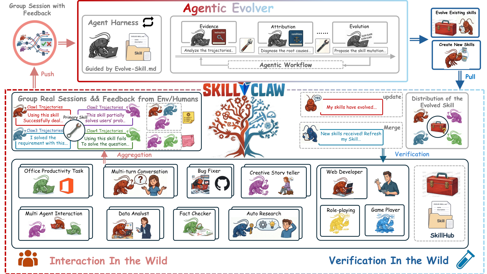

**Source figure / official image** — Figure 1: SkillClaw overview - sessions preserving action-feedback causal chains are grouped by referenced skill, an agentic evolver refines or creates skills, and nightly validation gates what is merged back to every agent. · Figure 1 · [source](https://arxiv.org/html/2604.08377v1)

**nanoRSI reproduction** — not-run. Last source check: 2026-09-16.

**Open code / weights / data links** — [Code repository (MIT)](https://github.com/AMAP-ML/SkillClaw)

**Primary sources** — [arXiv abstract](https://arxiv.org/abs/2604.08377) · [Paper v1 (Figure 1, results)](https://arxiv.org/html/2604.08377v1) · [Code repository (MIT)](https://github.com/AMAP-ML/SkillClaw)

## Harness search & evolution (14)

### RRSI: Regularized Recursive Self-Improvement of Agent Harnesses

**2026-09-21** · paper · Direct bounded loop

**Publication date** — arXiv v1 was first publicly announced on 2026-09-21; the repository was created on 2026-09-16 and its first README update is dated 2026-09-21. The paper date is used for the research record.

**Institutional relationship** — Google Cloud AI Research is the principal research affiliation; the author list also includes Stanford University, Washington University in St. Louis and UNC-Chapel Hill. The paper notes that Peng Xia did this work while a student researcher at Google Cloud AI Research.

**What changes and how feedback is reused** — Evolves a frozen-model agent harness through a bounded proposal→feedback→selection loop. Proposal-side controls anneal the number of bundled edits, use full edit history to assign credit and redirect stalled search toward untried components. Selection-side controls screen benchmark-specific logic, calibrate a noise-adjusted floor from repeated base evaluations, require added inference cost to be paid by measured gain, and prune components with no recent positive contribution. Accepted harness commits become the next incumbent; model weights remain frozen.

**Author-reported result** — With Claude Opus 4.8 frozen as policy and the same evolve budget, RRSI reports Terminal-Bench 2.1 74.2→80.2 (+6.0) and SWE-bench Verified 82.0→83.8 (+1.8), plus JobBench 36.0→40.7, GDPval 48.8→52.3 and APEX-Agents 34.2→37.9 on held-out/out-of-distribution evaluation. The paper reports up to +4.7 points out of distribution and 30% fewer policy tokens than unregularized evolution; with unseen Gemini 3.1 Flash Lite on the evolved coding harness, 11.2→14.6 (+3.4). These are author results, not nanoRSI reproductions.

**Evidence limits** — The backbone, proposer, analyst and leakage critic are provider-hosted models; the benchmarks and several runner environments are external and expensive. The method still depends on a finite evolve set, fixed regularization hyperparameters and noisy automated feedback. The paper explicitly does not study model-weight updates, and the public repository has no released weights or bundled benchmark-data snapshot.

**Code / weights / data / license** — Code: public at google-research/rrsi under Apache-2.0, including the search core and domain adapters. Weights: none released; experiments call hosted Claude/Gemini models. Data: benchmark sources and environment checkouts are external, with pinned commits or setup instructions rather than a redistributable bundle. License: repository Apache-2.0; third-party components retain their own licenses.

**Possible nanoRSI experiment — not implemented here** — Run a small offline ablation on nanoRSI's existing harness/skill candidate gate: compare current strict-improvement selection with a regularized arm that (1) estimates a noise band from repeated frozen evaluations, (2) records component-level edit credit across rounds, (3) caps bundled edits with a decreasing budget and (4) rejects extra measured cost without compensating gain. Keep the current arm, seeds, rejected candidates and held-out fixture panel frozen; report transfer, cost and rejection reasons before considering any default change.

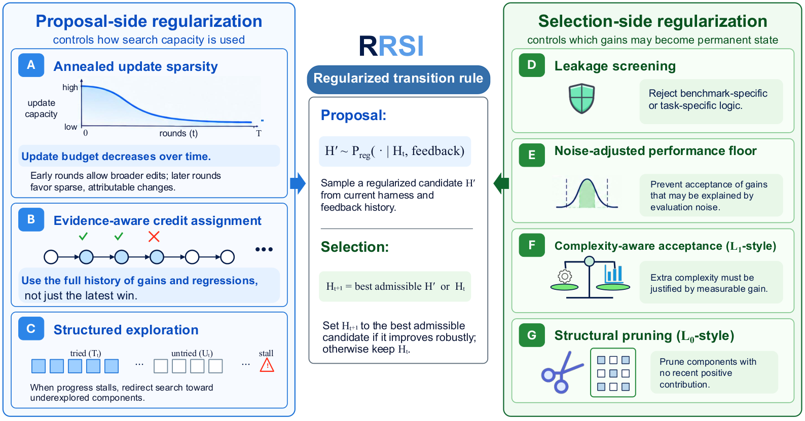

**Source figure / official image** — RRSI's original Figure 2: proposal-side regularization limits and explores harness edits, while selection-side regularization screens leakage, noise, cost and structural persistence before an edit becomes incumbent state. · Figure 2 (pipeline.png): proposal-side and selection-side regularization · [source](https://arxiv.org/html/2609.24972v1)

**nanoRSI reproduction** — not-run. Last source check: 2026-09-23.

**Open code / weights / data links** — [Google Research repository](https://github.com/google-research/rrsi) · [Repository license](https://raw.githubusercontent.com/google-research/rrsi/main/LICENSE)

**Primary sources** — [arXiv paper and HTML](https://arxiv.org/html/2609.24972v1) · [Google Research repository](https://github.com/google-research/rrsi) · [Repository license](https://raw.githubusercontent.com/google-research/rrsi/main/LICENSE) · [Project page](https://regularized-rsi.com/)

### Bad Genius: Counterfactual-Guided Harness Evolution Beyond Task-Specific Shortcuts

**2026-09-16** · paper · Direct bounded loop

**Publication date** — v1 2026-09-16; affiliations read from the paper HTML author block.

**Institutional relationship** — Academic consortium (UCAS × NUS × CAS-IA); no company affiliation shown.

**What changes and how feedback is reused** — A Proposer evolves the target agent's harness (prompts, memory, retrieval, tools, control code); a Challenger searches validity-preserving counterfactual variants of benchmark tasks, and a confirmation archive demotes harness edits whose gains do not survive the counterfactuals, targeting benchmark-wide shortcuts that per-task holdout misses.

**Author-reported result** — On OfficeQA (3 rollouts/question) the evolved harness reaches 68.42% R̂avg,A3 vs 66.23% for the raw harness (+2.19) and 30.37% vs 27.04% on the ProV2 slice (+3.33), with a synthetic benchmark (Syn-Ledger) isolating shortcut behaviour; the HarnessCompass comparison variant without the challenger scores below the raw harness.

**Evidence limits** — Modest absolute gains; evaluation limited to OfficeQA plus a synthetic benchmark; author-reported.

**Code / weights / data / license** — arXiv paper public; code not verified at last check.

**Possible nanoRSI experiment — not implemented here** — Transplant the challenger into nanoRSI's gate: re-score accepted candidates on auto-generated validity-preserving counterfactuals of the minimal task set; gains that vanish there are labelled shortcut, not skill.

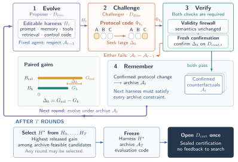

**Source figure / official image** — CHASE overview: a Proposer evolves the harness while a Challenger searches validity-preserving benchmark counterfactuals to neutralize benchmark-wide shortcuts. · Figure 2 (figure2_CHASE_pipeline.svg) · [source](https://arxiv.org/html/2609.18366v1)

**nanoRSI reproduction** — not-run. Last source check: 2026-09-18.

**Open code / weights / data links** — No verified public code/asset link in the audited sources.

**Primary sources** — [arXiv abstract](https://arxiv.org/abs/2609.18366) · [Paper HTML (affiliations, Figure 2, OfficeQA table)](https://arxiv.org/html/2609.18366v1)

### EvolveTrade: Experience-Driven Policy Refinement for Self-Evolving LLM Trading Agents

**2026-09-15** · paper · Direct bounded loop

**Publication date** — arXiv v1 2026-09-15; Sung Ju Hwang is jointly affiliated with KAIST and DeepAuto.ai.

**Institutional relationship** — Academic-led (KAIST) with one company co-author.

**What changes and how feedback is reused** — The trading agent system prompt is treated as a text-parameterized tool-calling policy: an independent Policy Agent rewrites it every five trading days from decision trajectories and portfolio outcomes, with the backbone LLM and tools frozen.

**Author-reported result** — GPT-5-mini, 15 US blue chips, mean of 3 runs: Sharpe 5.12 vs 2.87 and cumulative return 5.10% vs 3.30% for the static tool-calling agent in Nov 2025; 8.43/6.84% in the strongest window; honest negative in Feb 2026 (Sharpe −2.53 vs −1.54 for static); a 50-day long window holds SR 4.00 vs 2.94 with 10 bps fees.

**Evidence limits** — Author-reported backtests on 15 symbols with three seeds; one of three windows loses to the static policy; one backbone (Gemini-2.5-Flash in Apr 2026) shows the static base agent winning outright; no code release located.

**Code / weights / data / license** — arXiv paper public (CC BY 4.0); no code release located at verification.

**Possible nanoRSI experiment — not implemented here** — A minimal self-evolving-agent fixture with honest negatives: policy text changes only every N task batches from accumulated trajectory evidence, and per-window win/loss against the frozen policy is the published readout.

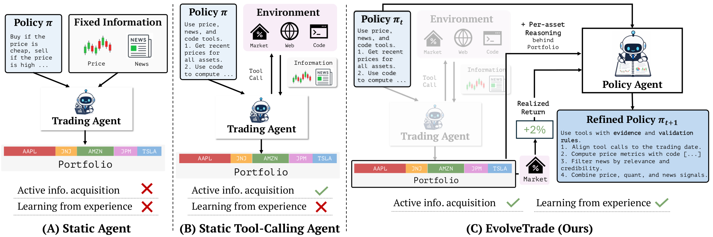

**Source figure / official image** — Concept: the static agent acts on a fixed channel; the static tool-calling agent retrieves but never learns; EvolveTrade closes the loop by refining the prompt-policy from its own experience. · Figure 1 (concept_evolvetrade.png) · [source](https://arxiv.org/html/2609.17632v1)

**nanoRSI reproduction** — not-run. Last source check: 2026-09-19.

**Open code / weights / data links** — No verified public code/asset link in the audited sources.

**Primary sources** — [arXiv abstract](https://arxiv.org/abs/2609.17632) · [Paper HTML (affiliations, Tables 3/4, Figure 1)](https://arxiv.org/html/2609.17632v1)

### ModularRSI: Modular and Generalizable Recursive Harness Self-Improvement

**2026-09-14** · paper · Direct bounded loop

**Publication date** — arXiv v1: 2026-09-14 (2609.14857), verified on the abs page.

**Institutional relationship** — Paper: Beihang University, University of Manchester, IQuest Research, M-A-P, Langboat and Hohai University (six superscript affiliations rendered in the HTML).

**What changes and how feedback is reused** — Contrastive analysis of successful versus failed trajectories on the same task drives independent evolution of five harness modules (Agent Loop, Tool Use, Observation Management, Context Management, Task Completion Detection), each within a restricted scope; a cross-module integration epoch then resolves conflicts (duplicates, responsibility, coordination) before the library is frozen. Evolution uses 2,000 human-curated executable tasks deliberately disjoint from evaluation benchmarks.

**Author-reported result** — TerminalBench 2.0 (DeepSeek-V4-Flash): accuracy 47.57→52.43, Pass@3 58.43→65.17 in-domain; the TB-evolved harness transfers to SWE-bench Verified at 73.40→76.45 in-domain and the SWE-evolved harness reaches 49.40 out-of-domain on TB. Frozen-harness cross-model transfer: GLM-5.2 59.55→61.80, MiniMax-2.5 41.57→44.94. Against baselines: 61.79→67.42 vs AHE 62.54 and Meta-Harness 62.92.

**Evidence limits** — Authors state they did not run a dedicated ablation isolating the contribution of contrastive trajectory analysis, and cost limited evolution experiments to a subset of the 2,000 instances.

**Code / weights / data / license** — No code repository URL located at verification; paper only (arXiv).

**Possible nanoRSI experiment — not implemented here** — For nanoRSI: decompose the harness into named modules with restricted edit scopes, evolve each against contrastive success/failure pairs on benchmark-disjoint executable tasks, and gate the merged library through an explicit conflict-resolution epoch before freezing.

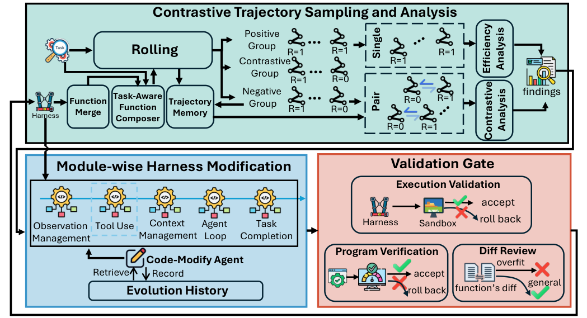

**Source figure / official image** — ModularRSI overview: contrastive trajectories feed independent evolution of five harness modules before conflict-resolving integration. · Figure 1 (S2.F1) · [source](https://arxiv.org/html/2609.14857v1)

**nanoRSI reproduction** — not-run. Last source check: 2026-09-17.

**Open code / weights / data links** — No verified public code/asset link in the audited sources.

**Primary sources** — [arXiv abstract](https://arxiv.org/abs/2609.14857) · [arXiv HTML v1](https://arxiv.org/html/2609.14857v1)

### HarnessDev: Can LLMs Create and Evolve Their Own Agent Harness?

**2026-09-01** · paper · Direct bounded loop

**Publication date** — arXiv v1: 2026-09-01; shared Self-Developing Agents project page also dated September 1.

**Institutional relationship** — All listed affiliations appear explicitly in the paper, with ByteDance Seed as a research participant.

**What changes and how feedback is reused** — Creation builds a runnable harness from a weak seed; Evolution repeatedly edits that persistent harness using downstream execution feedback. Official versions are frozen and later evaluated on hidden tasks, measuring reuse across tasks rather than single-output repair. Runtime-model controls test portability.

**Author-reported result** — Across nine single evolution trajectories, visible and held-out score directions agree on 34/64 adjacent version switches (53.1%); only 2/9 declared final versions are held-out best. Creation covers six creators, four domains and 2,207 downstream instances.

**Evidence limits** — A benchmark of bounded direct loops, not proof of stable compounding. Selected final artifacts can regress, and gains depend on the executor.

**Code / weights / data / license** — Paper and project page public; paper CC BY-NC-ND 4.0. A downloadable benchmark code/data repository, derived weights and their licenses were not verified. Do not label the project as an open-code release.

**Possible nanoRSI experiment — not implemented here** — Proposed nanoRSI coding study: freeze every candidate, retain the complete score trajectory, and measure development/held-out direction agreement under a fixed executor.

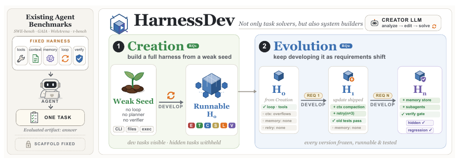

**Source figure / official image** — Figure 1: Creation builds a runnable harness from a weak seed, then Evolution repeatedly edits the persistent harness with execution feedback. · Figure 1, PDF p.2 · [source](https://arxiv.org/html/2609.01437v1)

**nanoRSI reproduction** — not-run. Last source check: 2026-09-13.

**Open code / weights / data links** — No verified public code/asset link in the audited sources.

**Primary sources** — [arXiv first submission](https://arxiv.org/abs/2609.01437) · [Paper v1](https://arxiv.org/html/2609.01437v1) · [Official Self-Developing Agents project](https://self-developing-agents.github.io/)

### Qwen3.8-Max: A New Bar for Coding and Cowork (self-evolving harness demonstrations)

**2026-08-03** · report · Direct bounded loop

**Publication date** — Official Qwen team blog post dated 2026/08/03 announcing Qwen3.8-Max (2.4T parameters, 95B active); open weights were promised the following week on this page.

**Institutional relationship** — Alibaba's Qwen team reporting on its own flagship model and demonstration runs; all numbers are self-reported on the official blog.

**What changes and how feedback is reused** — Three long-horizon demonstrations in which the model modifies its own working infrastructure through feedback loops: (1) building the oh-my-cli project from an empty folder over a 10+ day autonomous run with an issue state machine, dispatcher, monitor and watchdog — 'requirements are normalized into issues, automatically claimed and executed by agents, and continuously iterated through code, tests, previews, and logs'; (2) reproducing the paper 'Unified Data Selection for LLM Reasoning' from scratch (~125 hours, ~7,600 lines, 33 GPU training rounds) and then running a hypothesis→code→GPU→analysis self-improvement loop over 18 self-generated ideas in four rounds; (3) competition leaderboard iteration.

**Author-reported result** — Self-reported: the autonomous oh-my-cli run accumulated 265 commits, 127 PRs and 151 issues over ~16 days (as of July 30, 2026); the research-reproduction loop first reproduced the paper's six findings (its selection method beats random +7.7% on AIME24) and then evolved a method beating the paper's own approach by +2.7 points on AIME24.

**Evidence limits** — Demonstrations, not controlled experiments: no baseline harness, fixed-seed comparator or cost control is published for the harness run, and the +2.7 AIME24 gain is a single-model self-reported result without variance or independent verification. Open-weight status at audit time: weights were promised publicly but release was not yet verified in this run.

**Code / weights / data / license** — Official blog post; the demonstration repository github.com/qwen-code-dev-bot/oh-my-cli is public (Apache-2.0, created 2026-07-13) with the full trace; model weights release was announced but not yet verified in this audit.

**Possible nanoRSI experiment — not implemented here** — Proposed: a minimal issue-loop harness in which nanoRSI's improver claims, implements and verifies its own repository issues, comparing accepted-diff yield and regression rate against a fixed-plan control on the same issue stream.

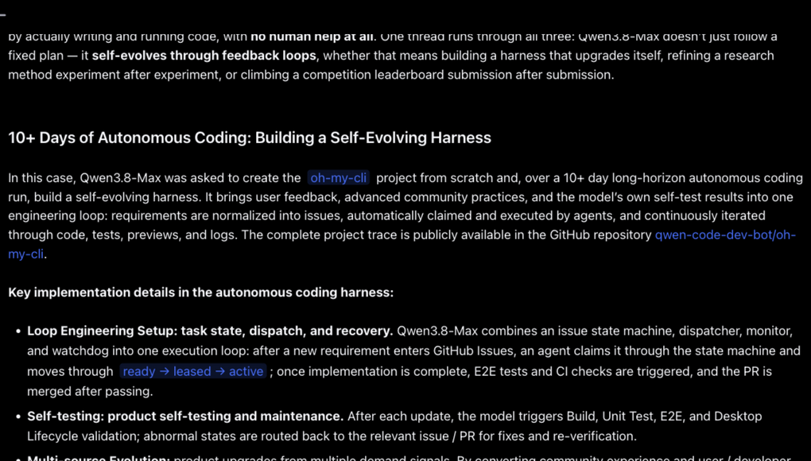

**Source figure / official image** — The blog section describing the 10+ day autonomous run: 'it self-evolves through feedback loops', with the oh-my-cli issue-claiming loop (state machine, dispatcher, monitor, watchdog) and self-testing details. · Section '10+ Days of Autonomous Coding: Building a Self-Evolving Harness' · [source](https://qwen.ai/blog?id=qwen3.8)

**nanoRSI reproduction** — not-run. Last source check: 2026-09-14.

**Open code / weights / data links** — [Demonstration repository with full trace (Apache-2.0)](https://github.com/qwen-code-dev-bot/oh-my-cli)

**Primary sources** — [Official Qwen blog post (opened via browser)](https://qwen.ai/blog?id=qwen3.8) · [Demonstration repository with full trace (Apache-2.0)](https://github.com/qwen-code-dev-bot/oh-my-cli)

### DarwinX: Evolving Agent Harnesses Through Natural Selection

**2026-07-31** · paper · Direct bounded loop

**Publication date** — DarwinX was first submitted on 2026-07-31; the official Beagle implementation was open-sourced on 2026-09-02. The catalogue uses the paper's first-public date and records the later repository release separately.

**Institutional relationship** — The paper and official implementation are from Salesforce AI Research; Beagle is maintained in the SalesforceAIResearch GitHub organization.

**What changes and how feedback is reused** — Beagle treats an agent harness as the evolvable object and provides evaluation/evolution backends, benchmark-native rollout engines and an agent factory. DarwinX freezes model weights, proposes harness variants through an evolver, scores them with each benchmark's verifier, admits preserve-and-extend candidates without regression, and retains alternative lineages for recombination.

**Author-reported result** — Authors report on GPT-5.5 high with Monet: Terminal-Bench 2.1 pass@5 rises 75.5 to 83.2 (+7.7 points), TerminalWorld pass@1 48.8 to 56.1 (+7.3), WebArena-Infinity pass@1 43.5 to 93.0 (+49.5), and SWE-bench Verified pass@1 80.8 to 84.2 (+3.4). TerminalWorld uses a train/test split and the evolved harness transfers unchanged to SWE-bench.

**Evidence limits** — These are author-reported results, not a local reproduction. The largest WebArena delta includes a browser_execute action addition. The release requires Docker, uv, provider credentials and benchmark infrastructure. Weights do not evolve; the demonstrated recursive surface is bounded harness revision and population selection, not open-ended improvement.

**Code / weights / data / license** — Beagle and the official DarwinX implementation are public under Apache-2.0. No model weights or benchmark datasets are released; the system expects benchmark-native task caches and user-provided harness repositories.

**Possible nanoRSI experiment — not implemented here** — Proposed: add a small population mode around nanoRSI's frozen evaluator, preserving raw candidate deltas, rollback-selected deltas and alternative lineage metadata; compare single-lineage reuse with preserve-and-extend selection under the same task stream and budget. Do not vendor Beagle or its dependency stack into the stdlib core.

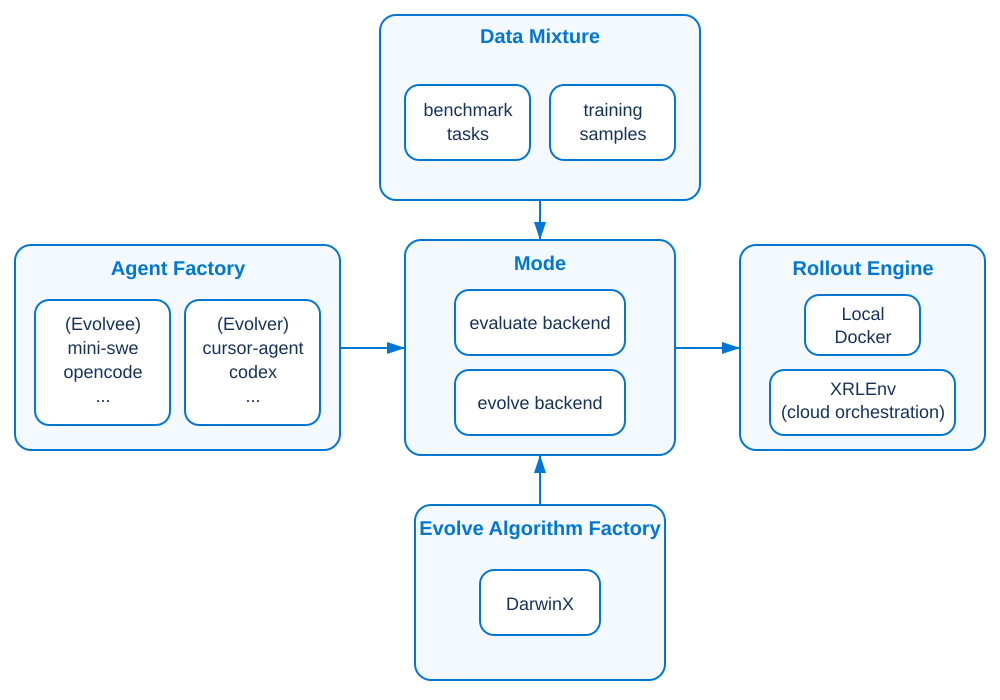

**Source figure / official image** — Official Beagle architecture: benchmark data and agent factories feed evaluation/evolution backends, rollout engines and the DarwinX evolution algorithm. · Official project architecture figure · [source](https://github.com/SalesforceAIResearch/Beagle/blob/main/docs/assets/beagle-architecture.svg)

**nanoRSI reproduction** — not-run. Last source check: 2026-09-21.

**Open code / weights / data links** — [Official Beagle repository](https://github.com/SalesforceAIResearch/Beagle) · [Beagle Apache-2.0 license](https://github.com/SalesforceAIResearch/Beagle/blob/main/LICENSE.txt)

**Primary sources** — [DarwinX paper v1](https://arxiv.org/abs/2608.07545) · [Official Beagle repository](https://github.com/SalesforceAIResearch/Beagle) · [Beagle Apache-2.0 license](https://github.com/SalesforceAIResearch/Beagle/blob/main/LICENSE.txt) · [Official Beagle architecture figure](https://github.com/SalesforceAIResearch/Beagle/blob/main/docs/assets/beagle-architecture.svg)

### AgentDescent: Gradient descent, but the parameters are agents

**2026-07-26** · release · Enabling technique / evaluation

**Publication date** — First PyPI release 0.1.0 on 2026-07-26; 0.5.0 (2026-09-07) is the latest at verification. MIT-licensed, zero-required-dependency core (Python ≥3.9); Zenodo DOI 10.5281/zenodo.22348027 carries the methods write-up. The README self-describes as a research reference implementation, not a production system.

**Institutional relationship** — Independent open-source project (author Danyang Chen per the Zenodo citation); no institutional affiliation stated in README or PyPI at verification.

**What changes and how feedback is reused** — A multi-worker engine for self-evolution algorithms: workers propose diffs to a shared artifact in parallel; an aggregator merges accepted proposals into a git-versioned ledger. The key space of the strategy decides whether concurrent proposals can fuse at all — reflective merge fuses semantically where a keyed union never can. Ships faithful ports of about twenty published self-evolution algorithms (GEPA, ACE, ADAS, DGM and others), with divergences documented and analogues explicitly not citable as benchmarks.

**Author-reported result** — On BBH dyck_languages (GLM-5.2, N=4, four seeds): reflective merge fuses 42 of 48 merge opportunities where a keyed union fuses 0 of 48. At a pinned rollout budget: 40% fewer model calls (95% CI 27–54%, same direction on every seed); median 6.8× wall-clock speedup versus a faithful serial control (three seeds, 3.1–9.5×); one-call path held-out exact match 0.167 → 0.583 (40 HotpotQA items, 12 held out).

**Evidence limits** — Self-run benchmarks reported in README/docs with intervals rather than peer review; scale is small (N=4 rollouts, tens of items); the engine is infrastructure — improvement claims belong to the ported algorithms it reproduces.

**Code / weights / data / license** — MIT-licensed; PyPI package agentdescent; core has zero required dependencies; Zenodo DOI for the methods write-up; GitHub Releases empty (releases via PyPI).

**Possible nanoRSI experiment — not implemented here** — The merge-policy lesson is the transplant for nanoRSI population mode: when parallel candidates edit one shared artifact, a keyed/positional union silently drops overlapping work — candidate merging needs semantic (reflective) fusion, and the fused result should land in a versioned ledger like any other accepted candidate.

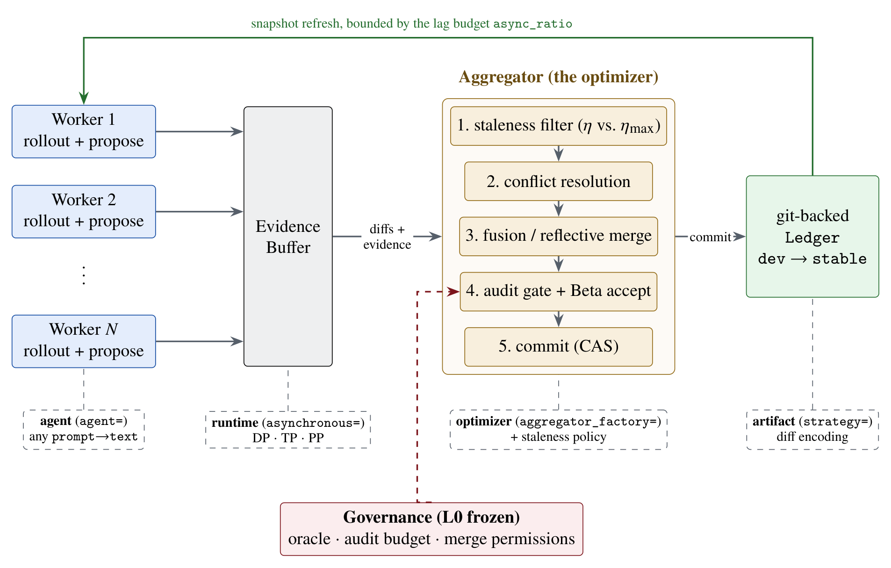

**Source figure / official image** — agentdescent architecture: workers propose diffs in parallel; the ledger versions the shared artifact; the aggregator reflects and merges; evaluation feeds back the next round. · docs/assets/architecture.png in the repository · [source](https://github.com/Birfy/agentdescent/blob/main/docs/assets/architecture.png)

**nanoRSI reproduction** — not-run. Last source check: 2026-09-20.

**Open code / weights / data links** — [GitHub repository](https://github.com/Birfy/agentdescent) · [README (results and license)](https://raw.githubusercontent.com/Birfy/agentdescent/main/README.md) · [PyPI release history](https://pypi.org/pypi/agentdescent/json)

**Primary sources** — [GitHub repository](https://github.com/Birfy/agentdescent) · [README (results and license)](https://raw.githubusercontent.com/Birfy/agentdescent/main/README.md) · [PyPI release history](https://pypi.org/pypi/agentdescent/json)

### PenguinHarness: Harness for RSI. Let AI Build AI

**2026-07-19** · release · Direct bounded loop

**Publication date** — First public release v0.0.1 on 2026-07-19 (self-described first public release, CI-published); v0.2.13 on 2026-09-16 is the latest at verification (a re-cut of a failed v0.2.12). Apache-2.0; team credits Yaowei Zheng (LlamaFactory author) and the PrismShadow AI Team.

**Institutional relationship** — Independent company team (Prism Shadow); no university affiliation claimed.

**What changes and how feedback is reused** — A local-first multi-agent auto-dev platform (desktop app, CLI, npm, Docker; 1000+ models with DeepSeek-class open models as the advertised default) whose native self-evolution engine has an agent evaluate and optimize itself: run the benchmark, find the lost points, ship version N+1, with a snapshot before every round and every request inspectable in a Trace view; agents can also author and optimize their own skills.

**Author-reported result** — Self-reported marketing-grade claims at verification: best accuracy on data analysis at 1/70 of Claude Code’s cost; a chart captioned as leading the data-analysis suite and tying OpenAI Codex on coding; a full RAG demo app generated for $0.02 of tokens on DeepSeek V4 Pro. No benchmark methodology, suite or raw numbers published alongside these claims (public benchmark-suite release is a roadmap item).

**Evidence limits** — Headline numbers are self-reported marketing claims without published methodology; the benchmark suite is not yet public; 2.3k-star project under rapid iteration (release cadence in days); no peer-reviewed evaluation.

**Code / weights / data / license** — Apache-2.0; npm package @prismshadow/penguin-core; Docker images; website penguin.ooo; releases on GitHub (v0.2.13 latest at verification).

**Possible nanoRSI experiment — not implemented here** — The traceability discipline is worth copying even before the claims are verifiable: snapshot before every self-evolution round and keep every request inspectable, so a self-modifying agent’s history is replayable — the same property nanoRSI’s evidence ledger enforces.

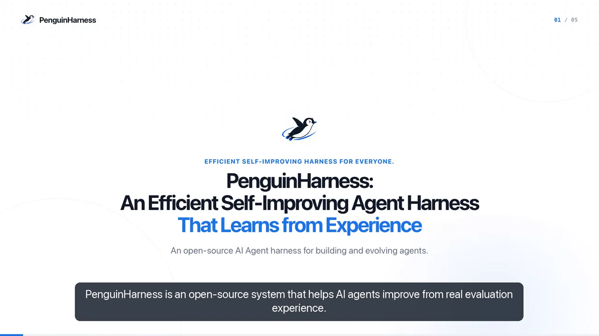

**Source figure / official image** — PenguinHarness self-evolution engine poster: run the benchmark, find the lost points, ship version N+1, with snapshots and inspectable traces. · Official site self-evolution poster (benchmark → find the lost points → ship vN+1) · [source](https://penguin.ooo/assets/evo-poster-en-Bp4EWVlL.webp)

**nanoRSI reproduction** — not-run. Last source check: 2026-09-20.

**Open code / weights / data links** — [GitHub repository](https://github.com/Prism-Shadow/penguin-harness) · [README (mechanism and claims)](https://raw.githubusercontent.com/Prism-Shadow/penguin-harness/main/README.md)

**Primary sources** — [GitHub repository](https://github.com/Prism-Shadow/penguin-harness) · [README (mechanism and claims)](https://raw.githubusercontent.com/Prism-Shadow/penguin-harness/main/README.md) · [Website](https://penguin.ooo/)

### Evolving Agents in the Dark: Retrospective Harness Optimization via Self-Preference

**2026-06-04** · paper · Direct bounded loop

**Publication date** — arXiv v1 2026-06-04; surfaced 2026-09-19 during a catch-up sweep of company lines — a June miss, not a new paper.

**Institutional relationship** — Company-academic (MSRA with City University of Hong Kong).

**What changes and how feedback is reused** — Harness optimization without labels or validation feedback: a DPP-selected coreset of past tasks is re-solved in groups, diagnosis cues are distilled from the trajectories, a full-stack harness (instructions, skills, executable tools) is rewritten, and the agent itself ranks candidates pairwise (self-preference) to pick the best of N=3.

**Author-reported result** — Codex (GPT-5.5 high) one optimization round: SWE-Bench Pro 0.59→0.78, Terminal-Bench 2 0.71→0.76, GAIA-2 0.29→0.37; beats feedback-free baselines (Dynamic Cheatsheet/ReasoningBank/Sleep-time Compute) on all three; validation-feedback Meta-Harness needs 10 rounds (≈3.1× compute, labels) to reach 0.80.

**Evidence limits** — Self-preference can mis-rank (ablation: chosen candidates avoid the worst but not always the empirically best); group rollout assumes cleanly resettable environments; authors warn mistaken self-preferences could amplify unsafe behavior.

**Code / weights / data / license** — MIT code at github.com/wbopan/retro-harness (56 stars at verification, last push 2026-06-12).

**Possible nanoRSI experiment — not implemented here** — nanoRSI run archives already store candidate trees; RHO shows how to reuse them label-free — re-solve a difficulty-diverse coreset under each candidate, then self-rank. This extends ADOPTION 22 with a no-oracle mode.

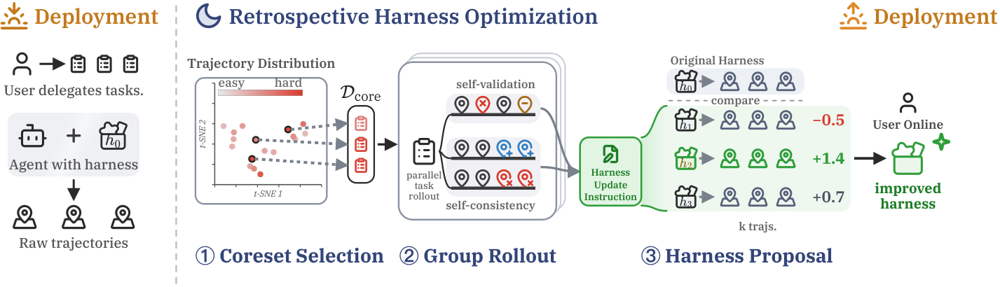

**Source figure / official image** — The RHO pipeline: coreset selection picks a difficulty-diverse subset of past tasks, group rollout re-solves them, and diagnosis plus self-preference ranking rewrite the harness. · Figure 2 (fig2-pipeline.png) · [source](https://arxiv.org/html/2606.05922v1)

**nanoRSI reproduction** — not-run. Last source check: 2026-09-19.

**Open code / weights / data links** — [Code repository](https://github.com/wbopan/retro-harness)

**Primary sources** — [arXiv abstract](https://arxiv.org/abs/2606.05922) · [Paper HTML (affiliations, results, Figure 2)](https://arxiv.org/html/2606.05922v1) · [Code repository](https://github.com/wbopan/retro-harness)

### Combee: Scaling Prompt Learning for Self-Improving Language Model Agents

**2026-04-05** · paper · Enabling technique / evaluation

**Publication date** — arXiv v1 2026-04-05; the COLM 2026 accepted list (verified 2026-09-18) uses a slightly different title wording.

**Institutional relationship** — Academic (Stanford × Berkeley systems/ML groups) with two company co-authors.

**What changes and how feedback is reused** — Parallel scans, an augmented shuffle mechanism and a dynamic batch-size controller let many agents run prompt learning in parallel and learn from combined traces without quality loss — scaling the self-improvement loop horizontally instead of sequentially.

**Author-reported result** — Up to 17× speedup over previous prompt-learning methods with comparable or better accuracy and equivalent cost, on AppWorld, Terminal-Bench, Formula and FiNER (DeepSeek-V3.1 backbone in the headline snapshot).

**Evidence limits** — Author-reported; speedups measured against prior prompt-learning pipelines rather than single-run quality ceilings; agent-task scope only.

**Code / weights / data / license** — arXiv paper public; code not verified at last check.

**Possible nanoRSI experiment — not implemented here** — nanoRSI's population runs already parallelize evaluation; Combee's transferable piece is the mid-run shuffle — candidates periodically exchange learned prompt content before generation boundaries.

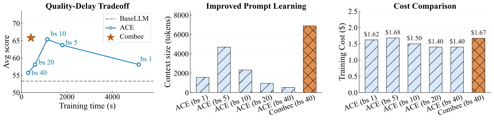

**Source figure / official image** — Combee reaches close-to-optimal prompt quality at significantly reduced training time by raising the content learnt under high parallelism. · Figure 1 (intro_fig.svg) · [source](https://arxiv.org/html/2604.04247v1)

**nanoRSI reproduction** — not-run. Last source check: 2026-09-18.

**Open code / weights / data links** — No verified public code/asset link in the audited sources.

**Primary sources** — [arXiv abstract](https://arxiv.org/abs/2604.04247) · [Paper HTML (affiliations, Figure 1)](https://arxiv.org/html/2604.04247v1)

### GenericAgent: A Token-Efficient Self-Evolving LLM Agent via Contextual Information Density Maximization (V1.0)

**2026-04** · paper · Direct bounded loop

**Publication date** — arXiv v1: April 2026 (2604.17091). Exact v1 day not re-verified; month precision used. The repository (lsdefine/GenericAgent, MIT) reached 14.2K stars by verification time.

**Institutional relationship** — Paper credited to the Advantage AI Agent Lab (A3 Lab), 'a joint research lab with members from Shenzhen Aquaintelling Technology and Fudan University'; no individual authors listed.

**What changes and how feedback is reused** — A unified agent loop (~92-line core inside a ~3,300-line codebase, >160x smaller than OpenClaw) constructs execution context from task plus memory and a two-level skill tree of categories and named skills with usage counters. A curriculum planner scores skill candidates (benefit, difficulty, usage, interest; weights 0.3/0.2/0.3/0.2) and adapts weights by reflection; each task ends with skill consolidation - archiving the Markdown report, updating the tree, incrementing counters - so the deployed artifact grows monotonically while the loop stays small.

**Author-reported result** — Lifelong AgentBench: 100% accuracy at 222K input tokens vs OpenClaw 70% at 1.43M and Claude Code 75% at 800K (~6.4x token advantage - the repository's '6x' claim). Long-horizon tasks 100% at 188.8K tokens vs Claude Code 537K. Self-evolution round #1 -> #9: 222,203 -> 23,010 tokens (-89.6%), 7m30s -> 1m38s, 32 -> 5 LLM calls. Prompt after 20 skills: 2,298 tokens vs Claude Code 22,821, OpenClaw 43,321. Cross-task savings 61.0-92.4% (overall 79.3%).

**Evidence limits** — 30-round context cap forces long research across sessions; the adaptive weight adjustment lacks long-term validation; the self-improvement log is manually curated; skill-tree merging/deprecation is manual.

**Code / weights / data / license** — Code at github.com/lsdefine/GenericAgent (MIT, 14,200 stars at verification).

**Possible nanoRSI experiment — not implemented here** — For nanoRSI: proof that a minimal seed loop with skill consolidation can beat million-line harnesses on token efficiency - nanoRSI's stdlib-only kernel is the same bet; add usage counters and per-skill prompt isolation as the cheapest first step.

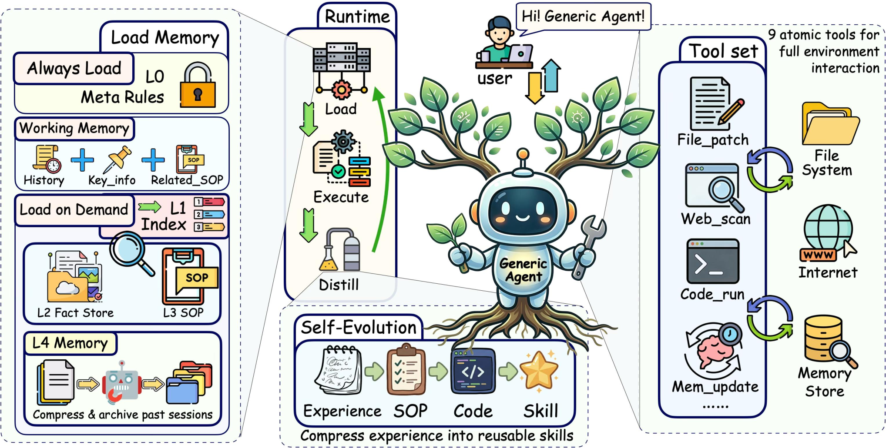

**Source figure / official image** — Figure 2: GenericAgent's unified loop - execution context from task, memory and a two-level skill tree; a curriculum planner scores skills and every task ends with skill consolidation (archive report, update tree, increment counters). · Figure 2 · [source](https://arxiv.org/html/2604.17091v1)

**nanoRSI reproduction** — not-run. Last source check: 2026-09-21.

**Open code / weights / data links** — [Code repository (MIT)](https://github.com/lsdefine/GenericAgent)

**Primary sources** — [arXiv abstract](https://arxiv.org/abs/2604.17091) · [Paper v1 (Figure 2, token/cost tables)](https://arxiv.org/html/2604.17091v1) · [Code repository (MIT)](https://github.com/lsdefine/GenericAgent)

### MiniMax M2.7: Early Echoes of Self-Evolution

**2026-03-18** · report · Direct bounded loop

**Publication date** — Official report dated 2026-03-18. Related M2-series technical paper first appeared 2026-05-26; its July revision is not the original M2.7 event.

**Institutional relationship** — First-party MiniMax report; the related technical paper is the MiniMax-M2 series report.

**What changes and how feedback is reused** — An internal M2.7 agent reads failure trajectories, proposes edits to scaffold code and sampling settings, evaluates them, and keeps or reverts changes for subsequent rounds. A separate research workflow updates memory/skills while helping researchers run RL experiments; that workflow retains human direction and critical decisions.

**Author-reported result** — MiniMax reports over 100 autonomous scaffold iterations and a 30% improvement on internal programming evaluations. Absolute baseline, evaluation-set identity and uncertainty are undisclosed, so the number is not independently comparable.

**Evidence limits** — First-party internal experiment, not a reproduced result. Assisted model R&D and scaffold self-editing do not establish fully autonomous successor-model training.

**Code / weights / data / license** — M2.7 weights are public. Current model LICENSE is custom non-commercial; commercial use requires written authorization. The internal self-evolution harness, evaluation data and complete training pipeline were not verified as public.

**Possible nanoRSI experiment — not implemented here** — Proposed nanoRSI coding experiment: constrain mutations to scaffold files, freeze the executor, and audit keep/revert decisions on a hidden test split.

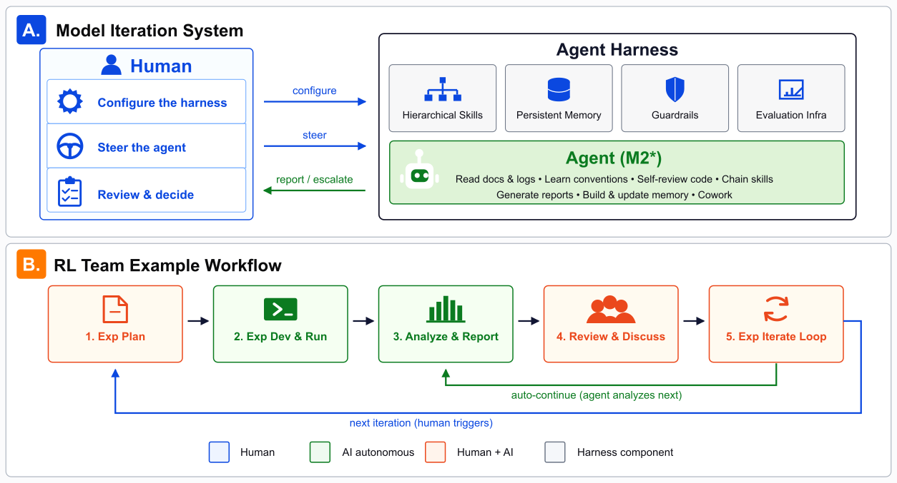

**Source figure / official image** — Figure 8: Model Iteration System and the dual-loop workflow used in M2.7 self-evolution. · Figure 8 · [source](https://arxiv.org/html/2605.26494v1)

**nanoRSI reproduction** — not-run. Last source check: 2026-09-13.

**Open code / weights / data links** — [Official M2.7 model](https://huggingface.co/MiniMaxAI/MiniMax-M2.7) · [Current M2.7 non-commercial license](https://huggingface.co/MiniMaxAI/MiniMax-M2.7/blob/main/LICENSE)

**Primary sources** — [Official M2.7 report](https://www.minimax.io/news/minimax-m27-en) · [Related M2-series technical paper dates](https://arxiv.org/abs/2605.26494) · [Related M2-series paper v1](https://arxiv.org/html/2605.26494v1) · [Official M2.7 model](https://huggingface.co/MiniMaxAI/MiniMax-M2.7) · [Current M2.7 non-commercial license](https://huggingface.co/MiniMaxAI/MiniMax-M2.7/blob/main/LICENSE)

### Meta-Harness: End-to-End Optimization of Model Harnesses

**2026-03** · paper · Direct bounded loop

**Publication date** — arXiv v1: March 2026 (2603.28052); the Terminal-Bench 2.0 artifact repository was created 2026-03-26. Exact v1 day not re-verified; month precision used.

**Institutional relationship** — Paper: Yoonho Lee, Roshen Nair, Qizheng Zhang, Chelsea Finn (Stanford), Kangwook Lee (KRAFTON), Omar Khattab (MIT).

**What changes and how feedback is reused** — An outer search loop over task-harness code: a coding-agent proposer (Claude Code / Opus 4.6) reads a growing filesystem holding every prior candidate's source code, execution traces and scores (via grep/cat tools), proposes a new single-file harness controlling prompting, retrieval, memory and orchestration, evaluates it, and logs everything as a new directory. A Pareto frontier (accuracy vs context cost) replaces hard-coded parent selection; ~60 harnesses over 20 iterations. Ablation: full-trace access is the key ingredient - scores-only search collapses from 56.7 to 41.3 best accuracy, and trace summaries 'may even hurt'.

**Author-reported result** — TerminalBench-2 with Opus 4.6: 76.4% (rank #2 among Opus-4.6 agents; Terminus-KIRA 74.7%; ForgeCode's higher 81.8% could not be reproduced from public code). With Haiku 4.5: 37.6%, #1. Text classification: 48.6% at 11.4K context tokens vs ACE 40.9% at 50.8K (+7.9 at 4x fewer tokens); OOD 73.1% vs 70.2%; matches best prior text optimizers in 0.1x the evaluations.

**Evidence limits** — TerminalBench-2 uses the same 89 tasks for search and final evaluation ('discovery problem' setup), checked only by manual inspection and regex audits for string leakage; one proposer agent studied; ForgeCode's leaderboard score not reproducible.

**Code / weights / data / license** — Project page yoonholee.com/meta-harness; optimized artifact at github.com/stanford-iris-lab/meta-harness-tbench2-artifact (1,213 stars, no license file at verification). Paper CC BY 4.0.

**Possible nanoRSI experiment — not implemented here** — For nanoRSI: keep every candidate's full traces (not summaries) in a queryable store for the proposer - the ablation says trace access, not selection cleverness, is what makes harness search work.

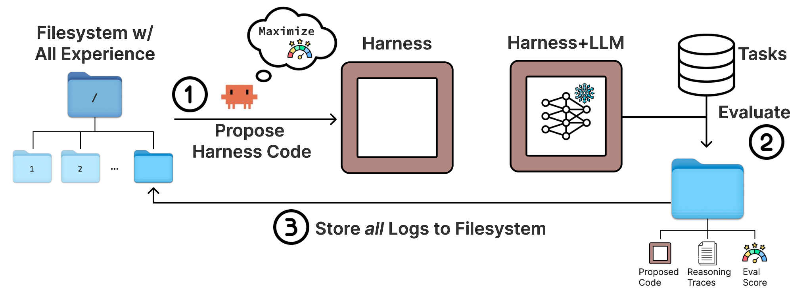

**Source figure / official image** — Figure 2: the Meta-Harness search loop - an agent reads a filesystem of all prior candidates' code, traces and scores, proposes a new harness, evaluates it, and logs everything as a new directory. · Figure 2 · [source](https://arxiv.org/html/2603.28052v1)

**nanoRSI reproduction** — not-run. Last source check: 2026-09-16.

**Open code / weights / data links** — [Artifact repository](https://github.com/stanford-iris-lab/meta-harness-tbench2-artifact)

**Primary sources** — [arXiv abstract](https://arxiv.org/abs/2603.28052) · [Paper v1 (affiliations, Figure 2, results)](https://arxiv.org/html/2603.28052v1) · [Artifact repository](https://github.com/stanford-iris-lab/meta-harness-tbench2-artifact)

## Self-modifying meta-agents & lineages (6)

### SoL-Pi: Recursively Scaling Auto-Research Loops for Efficient Agent Harness

**2026-09-17** · paper · Direct bounded loop

**Publication date** — arXiv v1 2026-09-17; code repository created 2026-09-02 and active through 2026-09-18.

**Institutional relationship** — Company-led (NVIDIA, with NTU and MIT co-authors; NVlabs repository and project page).

**What changes and how feedback is reused** — An RSI-inspired auto-research loop recursively improves the agent harness itself: a research AI proposes harness mechanisms from execution trajectories, an agent swarm explores candidates in parallel with independent review, and only mechanisms that survive held-out validation (EdgeBench never enters the search) are retained — four mechanisms survived.

**Author-reported result** — On the 51-task EdgeBench, SoL-Pi matches Pi performance across GPT-5.6 Sol and Opus 5 while cutting recorded token traffic 44.7-49.0% and API cost by about a third; estimated savings $8.75-13.50/hour vs native Codex and Claude Code, $4.36-5.71/hour vs Pi.

**Evidence limits** — Author-reported efficiency gains at matched task performance; the search itself consumed substantial compute (two-hour swarm runs); generalization beyond EdgeBench-class edge tasks not shown.

**Code / weights / data / license** — MIT code at github.com/NVlabs/SoL-Pi (2,244 stars at verification) and project page nvlabs.github.io/SoL-Pi/.

**Possible nanoRSI experiment — not implemented here** — The hard separation between repository-derived search environments and a never-touched held-out benchmark, plus an independent-review gate before mechanism retention, is directly transplantable to nanoRSI population runs.

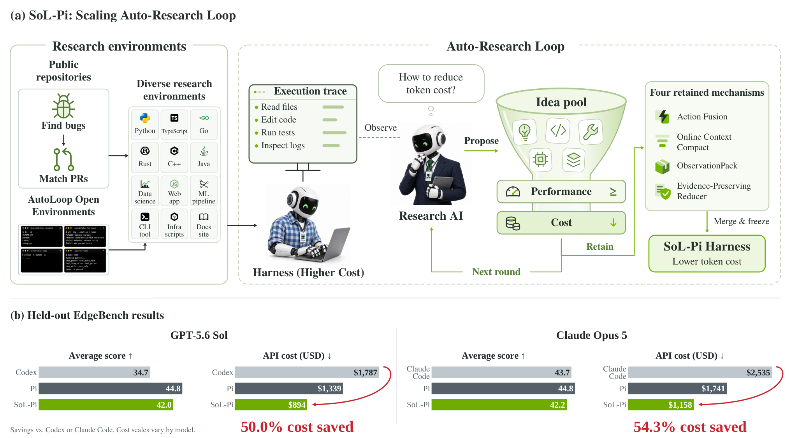

**Source figure / official image** — SoL-Pi discovers a more token-efficient harness through automated research: research environments supply tasks while an AI running the base harness iterates mechanisms. · Figure 1 (teaser-funnel-v10.png) · [source](https://arxiv.org/html/2609.20519v1)

**nanoRSI reproduction** — not-run. Last source check: 2026-09-19.

**Open code / weights / data links** — [Code repository](https://github.com/NVlabs/SoL-Pi)

**Primary sources** — [arXiv abstract](https://arxiv.org/abs/2609.20519) · [Paper HTML (affiliations, Figure 1-2, abstract numbers)](https://arxiv.org/html/2609.20519v1) · [Code repository](https://github.com/NVlabs/SoL-Pi) · [Project page](https://nvlabs.github.io/SoL-Pi/)

### Refactoring Hermes with 1,393 agents

**2026-09-15** · report · Direct bounded loop

**Publication date** — The refactor run itself took place 2026-09-02/04; the page's structured metadata dates publication 2026-09-15T15:00Z.

**Institutional relationship** — Nous Research first-party account written by Teknium.

**What changes and how feedback is reused** — A human sets a /goal; the Hermes orchestrator splits its own ~1.06M-line repository into 36 groups and dispatches worker subagents that edit in separate git worktrees with interface checks (JSON schemas, byte-for-byte CLI --help); lessons are auto-recorded into a hermes-agent-dev Markdown skill and reshared so other agents inherit the learned procedures.

**Author-reported result** — 1,393 subagents (up to 218 concurrent), ~19 active hours, ~$19.3k main-run cost against a manual estimate of $150k-$1.8M; non-test Python 1,063,826 → 698,363 lines (−34.4%); files >5,000 lines 37 → 6; functions >300 lines 192 → 2; longest if/elif chain 92 → 9 branches; on a 4,000-lookup symbol test the average tokens returned fell 2,218 → 993.

**Evidence limits** — No capability control — the measured object is code health, not task performance; reviewers caught regressions the tests missed (removed public names, an exception-handling rewrite across ~65 sites); the first attempt died on auth-token expiry; module count and some import times worsened.

**Code / weights / data / license** — Blog post public; the Hermes agent repository is public but README's MIT claim has no LICENSE file — treat as all-rights-reserved for reuse.

**Possible nanoRSI experiment — not implemented here** — nanoRSI already has worktree-per-candidate evaluation; the missing piece to copy is auto-recording postmortem lessons into a skill file that later runs load, closing the loop between one-off failures and persistent procedure memory.

**Source figure / official image** — Official banner of Nous Research's account of Hermes autonomously refactoring its own ~1M-line codebase with 1,393 subagents. · Post banner graphic · [source](https://nousresearch.com/refactoring-hermes-with-1393-agents/)

**nanoRSI reproduction** — not-run. Last source check: 2026-09-18.

**Open code / weights / data links** — No verified public code/asset link in the audited sources.

**Primary sources** — [Nous Research blog report](https://nousresearch.com/refactoring-hermes-with-1393-agents/)

### Mendel Gödel Machine: Recursive Self-Improving Coding Agents via Comparative Evolution

**2026-08** · paper · Direct bounded loop

**Publication date** — arXiv v1: August 2026 (2608.07645). Exact v1 day not re-verified; month precision used.

**Institutional relationship** — Paper: Changzhi Liu, Yilun Liu, Sikuan Yan, Volker Tresp, Yunpu Ma - UESTC, LMU Munich and Munich Center for Machine Learning.

**What changes and how feedback is reused** — Extends archive-based self-modification (DGM/HGM) with three Mendelian operators driven by comparative evidence: clonal mutation (single-trajectory edit), reaction-norm mutation (edit from one agent's trajectories across multiple tasks - recurring failures mark genotype defects), and cross-lineage hybridization (extract a transferable behavioral trait from another lineage's successful trajectory and adapt it, without splicing code). A failed-task pool boosts sampling weights so lineages overlap on hard tasks. Proposition 1: under an additive fitness landscape, comparative evidence raises fix probability over single-trajectory mutation.

**Author-reported result** — Qwen3.6-35B-A3B, 200 evaluations + 24 expansions: SWE-bench Verified-60 68.3% -> 78.3% (HGM 73.3%); Polyglot-60 50.8% -> 93.2% (HGM 77.9%); full Polyglot-225 93.3%, 'surpassing closed-source GPT-5 with ~117x fewer parameters'. Cross-benchmark transfer: SWE-bench Pro 16.7% -> 26.7%; Multilingual 41.7% -> 55.0%. Cross-model transfer: DeepSeek-V4-Flash 50.0% -> 66.7%, V4-Pro 45.0% -> 75.0%.

**Evidence limits** — High wall-clock/GPU cost limits seeds and sweeps; operators need multi-trajectory history and cross-lineage task overlap (degenerates toward single-trajectory baselines with small archives); no edit-quality guarantee; claims limited to coding-agent scaffolds on public benchmarks.

**Code / weights / data / license** — Code at github.com/RealLcz/MGM (Apache-2.0, 32 stars at verification); project page reallcz.github.io/MGM.

**Possible nanoRSI experiment — not implemented here** — For nanoRSI: keep per-task trajectories per lineage and admit edits driven by cross-task recurring failures (reaction-norm) and by other candidates' successes on shared tasks (hybridization) - both are selection signals beyond per-candidate scores.

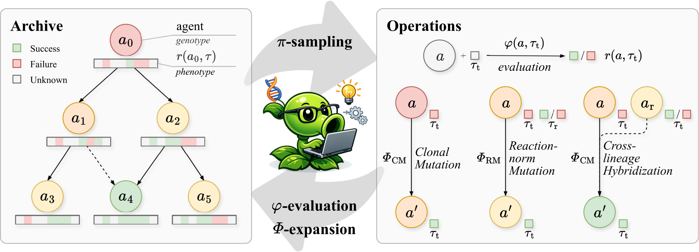

**Source figure / official image** — Figure 1: Mendel Godel Machine - an archive lineage tree where pi-sampling and phi-evaluation feed three comparative operators: clonal mutation, reaction-norm mutation, and cross-lineage hybridization. · Figure 1 · [source](https://arxiv.org/html/2608.07645v1)

**nanoRSI reproduction** — not-run. Last source check: 2026-09-21.

**Open code / weights / data links** — [Code repository (Apache-2.0)](https://github.com/RealLcz/MGM)

**Primary sources** — [arXiv abstract](https://arxiv.org/abs/2608.07645) · [Paper v1 (affiliations, Figure 1, results tables)](https://arxiv.org/html/2608.07645v1) · [Code repository (Apache-2.0)](https://github.com/RealLcz/MGM)

### Meta^n: Recursive Self-Improvement through Emergent Depth

**2026-08** · paper · Direct bounded loop

**Publication date** — arXiv v1: August 2026 (2608.24735); official repository created 2026-08-26. Exact v1 day not re-verified; month precision used.

**Institutional relationship** — Paper: Zae Myung Kim, Young-Jun Lee, Dongyeop Kang (University of Minnesota) and Seungyeon Jwa (Seoul National University).

**What changes and how feedback is reused** — A single fixed meta-operation Omega is applied repeatedly to its own outputs: each call reads the traces of the layers below and (from depth 3) their emitted code, then writes the next layer's code (pre-processor plus code library); wrappers compose so Sd = Md o ... o M2 o S1. Depth grows until Omega stops finding improvements (convergence threshold 0.02), with an evolutionary archive over chains; layer roles emerge unprompted (rollback behavior first appears at depth 3).

**Author-reported result** — Realized meta-depth 3-6 across eight benchmark families (plateau 3-4; depth 6 on materials-science SR), versus prior self-rewriting systems capping at ~2.5. ARC-AGI-2: 0.331 +/- 0.010 vs OpenEvolve 0.003 and Godel Agent 0.054 - the only system to solve any task at all; CO-Bench (GPT-5.2) 0.870 vs OpenEvolve 0.702. Ablation -recursion: -0.131 (Gemma CO); inter-layer context carries ~72% of the gain.

**Evidence limits** — Same model at all layers (a stronger Omega over a weaker base untested); inter-layer context is a free-form string; reasoning capacity at high meta-levels and context saturation from accumulated layer code remain untested ceilings.

**Code / weights / data / license** — Code at github.com/minnesotanlp/meta-n (MIT, 29 stars at verification). Paper CC BY-NC-ND 4.0 (noncommercial terms).

**Possible nanoRSI experiment — not implemented here** — For nanoRSI: measure realized meta-depth (how many nested improvement layers actually help before plateau) as a standard report field - Meta^n shows it is measurable, and ~2.5 is the number to beat for self-rewriting loops.

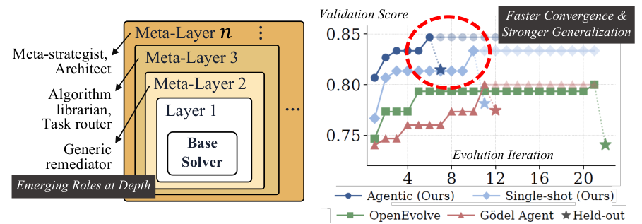

**Source figure / official image** — Figure 1: Meta^n at a glance - one fixed meta-operation repeatedly reads the layers below and writes the next layer's code; realized depth grows to 3-6 versus the ~2.5 cap of self-rewriting systems. · Figure 1 · [source](https://arxiv.org/html/2608.24735v1)

**nanoRSI reproduction** — not-run. Last source check: 2026-09-16.

**Open code / weights / data links** — [Code repository (MIT)](https://github.com/minnesotanlp/meta-n)

**Primary sources** — [arXiv abstract](https://arxiv.org/abs/2608.24735) · [Paper v1 (affiliations, Figures 1-3, tables)](https://arxiv.org/html/2608.24735v1) · [Code repository (MIT)](https://github.com/minnesotanlp/meta-n)

### AIDE²: The First Evidence of Recursive Self-Improvement

**2026-07-14** · report · Direct bounded loop

**Publication date** — Weco AI blog report; a PDF technical report and an AIDE₈₅ release were promised to follow and had not appeared at last verification.

**Institutional relationship** — Weco AI's first-party account of its own system; no independent replication.

**What changes and how feedback is reused** — A bi-level loop: an outer-loop agent (hand-tuned AIDE_human on claude-opus-4.7) rewrites the code of an inner-loop agent (AIDE₀ on gemini-3-flash); each rewrite is scored across heterogeneous task families under a fixed dollar budget with public/private score splits, and roughly 9 of 10 proposals are rejected.

**Author-reported result** — 100 steps over 8 unattended days produced 7 successive improved agent versions. Held-out MLE-Bench Lite (3 seeds, paired deltas vs AIDE₀): AIDE₄₇ +0.053 (p=0.0024), AIDE₈₅ +0.042 (p=0.0041); reward-hacking rate (KernelBench/SpecBench-style end-to-end check) fell 63%→42%→34%; 16× average prompt compression; both beat the two-year human-tuned AIDE_human on held-out families. An ignition test with AIDE₄₇ as the outer loop converged in ~20 vs ~40 steps but not significantly and not asymptotically better — no ignition claimed.

**Evidence limits** — Author-reported by the system's builder; single run; gains non-monotonic (AIDE₈₅ trails AIDE₄₇ on MLE-Bench Lite); the 'first evidence' claim is against Weco's own RSI ladder (Level 1: beating a fair human baseline under fixed budget), not a community-standard definition.

**Code / weights / data / license** — Blog post public; the promised PDF report, code and weights remain unreleased as of 2026-09-19 (two months after the announcement; blog RSS shows no later post).

**Possible nanoRSI experiment — not implemented here** — Recreate the fixed-budget proposal/reject ladder on a minimal task: outer loop rewrites the inner runner, ~90% rejection is evidence the acceptance gate works, and a private held-out split decides acceptance.

**Source figure / official image** — Weco AI's outer-loop diagram: AIDE_human rewrites the inner-loop AIDE agent, each rewrite evaluated under a fixed budget with ~90% rejection. · Outer-loop figure (figB) in the blog post · [source](https://www.weco.ai/blog/first-evidence-of-recursive-self-improvement)

**nanoRSI reproduction** — not-run. Last source check: 2026-09-19.

**Open code / weights / data links** — No verified public code/asset link in the audited sources.

**Primary sources** — [Weco AI blog report](https://www.weco.ai/blog/first-evidence-of-recursive-self-improvement)

### Hyperagents

**2026-03-19** · paper · Direct bounded loop

**Publication date** — arXiv v1: 2026-03-19; Meta publication page: 2026-03-24.

**Institutional relationship** — Paper lists FAIR at Meta and Meta Superintelligence Labs affiliations, alongside academic collaborators.

**What changes and how feedback is reused** — An editable meta agent modifies itself and the task agent. Evaluated valid variants enter an archive and supply later parents and feedback; admission need not require immediate improvement.

**Author-reported result** — After 100 iterations, held-out paper-review accuracy was 0.710 (CI 0.590–0.750), versus static baseline 0.630 and customized DGM 0.590. The customized-DGM difference was not significant; initial 0.0 reflected output-format failure.

**Evidence limits** — Fixed foundation models/evaluators and bounded runs do not demonstrate indefinite self-acceleration.

**Code / weights / data / license** — Official code and linked experiment logs verified; foundation-model weights are not supplied. Code licence is CC BY-NC-SA 4.0, not permissive commercial open source. Linked log payloads/separate data licence were not inspected.

**Possible nanoRSI experiment — not implemented here** — Proposed: separately version task/meta code, preserve evaluated stepping stones, and keep immutable evaluation records.

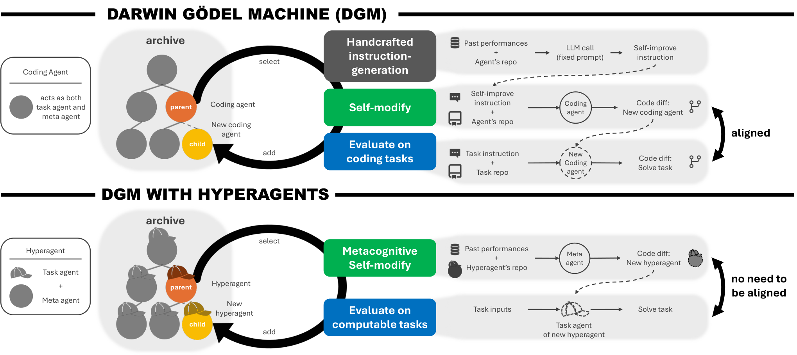

**Source figure / official image** — Figure 1: DGM-Hyperagents combines a modifiable task agent and meta agent with an archive of stepping stones. · Figure 1 · [source](https://arxiv.org/html/2603.19461v1)

**nanoRSI reproduction** — not-run. Last source check: 2026-09-16.

**Open code / weights / data links** — [Official code](https://github.com/facebookresearch/HyperAgents) · [Code licence](https://github.com/facebookresearch/HyperAgents/blob/main/LICENSE.md)

**Primary sources** — [Paper history](https://arxiv.org/abs/2603.19461) · [Paper v1, authors and section 5.1](https://arxiv.org/html/2603.19461v1) · [Meta publication](https://ai.meta.com/research/publications/hyperagents/) · [Official code](https://github.com/facebookresearch/HyperAgents) · [Code licence](https://github.com/facebookresearch/HyperAgents/blob/main/LICENSE.md)

## Program evolution & evolutionary search (6)

### Compiled Agency: Frontier General-Purpose Coding Agents Build Winning Game Players from Bare Interaction - from Flappy Bird to StarCraft II and Civilization

**2026-09-17** · paper · Enabling technique / evaluation

**Publication date** — v1 submitted 2026-07-17 but held by arXiv until the 2026-09-17 announcement (OAI datestamp); first public date used, per the held-paper convention.

**Institutional relationship** — Academic: NYU (Joey Xiao) and Princeton (Haonan Huang, corresponding).

**What changes and how feedback is reused** — Gauntlet, a develop-freeze-evaluate framework: a general-purpose coding agent receives only a game description, a raw observation/action interface and an empty policy file — no strategy, algorithm or architecture. In one autonomous session it experiments with the live game and writes a standalone controller, which is frozen and scored on held-out instances with zero model calls during play. The frozen programs are inspectable.

**Author-reported result** — On an unpublished procedural roguelike, held-out success spans 0–86% with a sharp generational threshold: every observed session of a newest-generation system beats the best session of its predecessor. A compiled raw-API StarCraft II controller defeats every fair built-in AI and two cheating variants; single-session programs win complete Civilization (Freeciv) games by total conquest on held-out seeds — modest rates versus novice AI, but claimed as a first for standalone language-agent systems without per-turn model calls or hand-crafted tactical layers.

**Evidence limits** — Freeciv wins are at modest rates against novice AI only; roguelike results depend on an unpublished private game; no code or harness release located; single version at verification.

**Code / weights / data / license** — No code located at verification; CC BY 4.0 paper.

**Possible nanoRSI experiment — not implemented here** — The freeze-then-score contract maps directly onto nanoRSI final testing: once a candidate is frozen, evaluation must run with zero further model calls on held-out seeds, making any runtime self-modification visible as a contract violation.

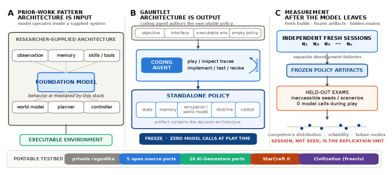

**Source figure / official image** — Gauntlet Figure 1: in prior work researchers supply observation abstractions, memory, skills and planners; here the intelligence architecture is an output, built by the model from bare interaction. · Figure 1 (x1.png) · [source](https://arxiv.org/html/2609.18996v1)

**nanoRSI reproduction** — not-run. Last source check: 2026-09-20.

**Open code / weights / data links** — No verified public code/asset link in the audited sources.

**Primary sources** — [arXiv abstract](https://arxiv.org/abs/2609.18996) · [arXiv HTML v1](https://arxiv.org/html/2609.18996v1)

### Dream-RSI: Recursive Self-Improvement through Evolving Worlds

**2026-09-14** · paper · Direct bounded loop

**Publication date** — arXiv v1: 2026-09-14; repository created 2026-09-13.

**Institutional relationship** — Paper: University of Maryland (Tong Zheng, Rui Liu, Heng Huang et al.), Google DeepMind (Zhankui He, Benjamin Coleman, Di Bai, Wang-Cheng Kang) and University of Virginia (Haolin Liu).

**What changes and how feedback is reused** — Discovery history is organized as a tree whose nodes store each attempt's workspace, artifact, diagnostics and score; the tree becomes a replay simulator - alternative exploration policies 'navigate' recorded branches with different orders, parallel groupings and stopping points without re-executing the underlying agent. A policy-development LLM iteratively rewrites exploration-policy code, scoring each version by a replay objective balancing best score, execution cost and parallelism; the best policy is redeployed online, and the new history expands the simulator pool.

**Author-reported result** — Algorithm engineering (Lasso, 6 held-out datasets): Dream-RSI with Gemini-3.1-Pro reaches 2,931ms average using 317 calls vs Fixed Exploration 3,587ms at 550; with Gemini-3.7-Flash 2,350.6ms at 1,879 calls vs 2,516.7 at 3,200 (SimpleTES needs 51,200 calls). Kernel engineering: comparable VGG16/LayerNorm results at 2.43x/1.79x fewer generations; ConvDiv +2.09x score at similar budget.

**Evidence limits** — Replay is deterministic on recorded branches - it cannot evaluate truly novel directions; gains shown on 8 tasks across 3 domains; requires a structured discovery tree; offline policy iteration still spends LLM calls.

**Code / weights / data / license** — Code at github.com/zhengkid/Dream-RSI (172 stars, no license file at verification); project site dream-rsi.com.

**Possible nanoRSI experiment — not implemented here** — For nanoRSI: reuse the run archive as a free simulator - score alternative proposer/scheduler policies by replaying them over recorded candidate trees before spending any new evaluations, the cheapest form of policy improvement available to a bounded loop.

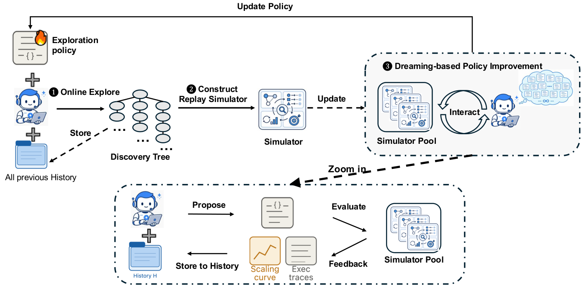

**Source figure / official image** — Figure 1: Dream-RSI's three-stage recursive loop - online exploration builds a discovery tree, the tree becomes a replay simulator, and dreaming-based policy improvement rewrites the exploration policy offline. · Figure 1 · [source](https://arxiv.org/html/2609.14858v1)

**nanoRSI reproduction** — not-run. Last source check: 2026-09-21.

**Open code / weights / data links** — [Code repository](https://github.com/zhengkid/Dream-RSI)

**Primary sources** — [arXiv abstract](https://arxiv.org/abs/2609.14858) · [Paper v1 (affiliations, Figure 1, tables)](https://arxiv.org/html/2609.14858v1) · [Code repository](https://github.com/zhengkid/Dream-RSI)

### AlgoEvo: Self-Evolving Agentic Search for Automated Algorithm Discovery

**2026-09-14** · paper · Direct bounded loop

**Publication date** — arXiv v1: 2026-09-14 (2609.15820). Note: a Sept-16 radar process note recorded a garbled listing entry named "AlgoEvo" that resolved to an unrelated XAI paper; this abs page confirms the present title and content are genuine.

**Institutional relationship** — Paper: City University of Hong Kong (Junhao Qiu, Qinglong Hu, Qingfu Zhang), Huawei Noah's Ark Lab (Xialiang Tong, Mingxuan Yuan) and A*STAR (Liyong Lin).

**What changes and how feedback is reused** — An autonomous agent inspects, diagnoses and edits algorithm code from runtime feedback instead of running a fixed search pipeline. A Design Skill Hub externalizes paradigm-specific knowledge as pluggable skills (strategy roles, code interfaces, modification principles, evaluation conventions) so one engine covers single-objective, multi-objective and multi-component design; a hierarchical experience bank (experience cards, a task-level experience tree with situational-UCB selection, cross-task consolidation into skills) accumulates knowledge across tasks, promoting a pattern into a skill after it validates on at least two tasks.

**Author-reported result** — Across six tasks (TSP, CVRP, Bi-TSP, Bi-FJSP, CVRP-DR, FJSP 4-Ops) AlgoEvo matches or surpasses specialized baselines (EoH, ReEvo, MCTS-AHD, FunSearch, MEoH, MOTIF, E2OC and others): best TSP result with about 39 evaluations versus the 500-evaluation allowance and 2.9M tokens versus FunSearch 3.2M; best CVRP at about 35 evaluations (1.9M tokens vs about 4M for EoH/ReEvo/MCTS-AHD); best HV on Bi-TSP and Bi-FJSP at 33-36 evaluations; best both splits on CVRP-DR (139.2M tokens vs MOTIF 317.1M) and best test on FJSP 4-Ops (118.1M vs 584.7M).

**Evidence limits** — Authors report increased token overhead in complex multi-component settings and reduced transfer efficacy outside aligned problem families; no public repository URL is given (source in supplementary materials).

**Code / weights / data / license** — No public repository URL located at verification; paper states source is in supplementary materials and instances/seeds/evaluation scripts are released.

**Possible nanoRSI experiment — not implemented here** — For nanoRSI: promote a reusable skill only after it validates on two or more tasks, and store experience as cards plus a task-level tree with UCB-style selection — evaluation-budget discipline (committing at 35 of 500 evaluations) is the transferable part.

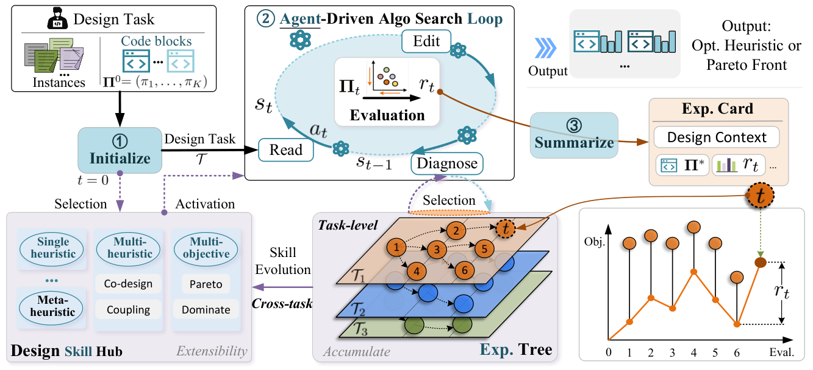

**Source figure / official image** — AlgoEvo overview: the Design Skill Hub activates paradigm skills over a hierarchical experience bank for algorithm discovery. · Figure 2 (S3.F2) · [source](https://arxiv.org/html/2609.15820v1)

**nanoRSI reproduction** — not-run. Last source check: 2026-09-17.

**Open code / weights / data links** — No verified public code/asset link in the audited sources.

**Primary sources** — [arXiv abstract](https://arxiv.org/abs/2609.15820) · [arXiv HTML v1](https://arxiv.org/html/2609.15820v1)

### EvoPolicyGym: Evaluating Autonomous Policy Evolution in Interactive Environments

**2026-07-02** · paper · Enabling technique / evaluation

**Publication date** — arXiv v1: 2026-07-02 (2607.02440). Same author lineage as AgentGym/AgentEvol.

**Institutional relationship** — Paper: USTC, CUHK, University of Macau, Tsinghua, Zhejiang, Soochow, Brown and SJTU.

**What changes and how feedback is reused** — A benchmark of policy-as-code evolution, not a training method: fixed Gymnasium-style environments (MiniGrid, Box2D, MuJoCo families); the agent repeatedly edits an executable Python 'policy system' in a workspace, submits train rollouts (up to 128 episodes total) and receives server-mediated feedback; scoring uses hidden validation-selected checkpoints over held-out episodes, with train feedback visible and validation/held-out hidden server-side. Diagnostics split edits into synthesis (new structure) versus tuning.

**Author-reported result** — Core16 held-out normalized returns: GPT-5.5 (Codex) 0.891 with 9 wins and top-2 on all 16; Claude Opus 4.7 (Claude Code) 0.750; MiniMax-M3 0.531; DeepSeek-V4-Pro 0.359; random 0.109. Strong agents turn synthesis edits into new validation bests at 41-48% rates vs 3-10% for weaker ones. Evolved mechanisms include road-mask lookahead (CarRacing), periodic gaits (HalfCheetah) and BFS mapping (ObstructedMaze).

**Evidence limits** — Diagnostics are 'conservative proxies, not semantic proofs' (AST topology ignores behavioral similarity); the policy-source boundary excludes generated data and learned weights; the 128-episode budget is far below standard-RL sample regimes, so conventional RL baselines are excluded; token use not normalized across harnesses.

**Code / weights / data / license** — Code at github.com/Linzwcs/EvoPolicyGym (MIT, 176 stars at verification); HF dataset EvoPolicyGym-Exp-data; project page linzwcs.github.io/EvoPolicyGym.

**Possible nanoRSI experiment — not implemented here** — For nanoRSI: a ready-made scoring protocol for artifact-track experiments - server-side hidden validation checkpoints over held-out episodes with a hard episode budget, separating synthesis from tuning edits in the ledger.

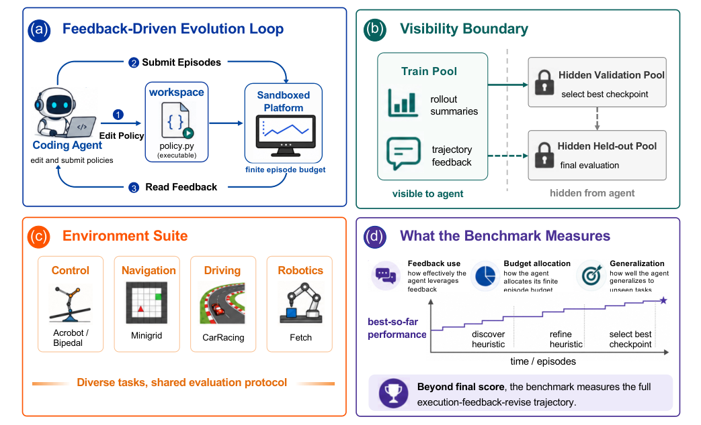

**Source figure / official image** — Figure 1: EvoPolicyGym - agents edit executable policies, submit episodic rollouts under a finite budget, and receive platform-mediated feedback; validation and held-out scoring stay server-side and hidden. · Figure 1 · [source](https://arxiv.org/html/2607.02440v1)

**nanoRSI reproduction** — not-run. Last source check: 2026-09-17.

**Open code / weights / data links** — [Code repository (MIT)](https://github.com/Linzwcs/EvoPolicyGym)

**Primary sources** — [arXiv abstract](https://arxiv.org/abs/2607.02440) · [Paper v1 (affiliations, Figure 1, Core16 table)](https://arxiv.org/html/2607.02440v1) · [Code repository (MIT)](https://github.com/Linzwcs/EvoPolicyGym)

### WebAggregator: Enhancing Compositional Reasoning Capabilities of Deep Research Agent Foundation Models

**2025-10-16** · paper · Direct bounded loop

**Publication date** — arXiv v1 submitted 2025-10-16 under the Explore-to-Evolve working title; the later title WebAggregator does not change the original date.

**Institutional relationship** — The paper explicitly lists Tencent AI Lab authors alongside The Chinese University of Hong Kong authors. The code and data-construction repository is published under Tencent.

**What changes and how feedback is reused** — An online explorer visits websites and a Compositional Logic Proposer selects, composes and refines high-level aggregation operations. Quality control turns executable aggregation programs into 10K verifiable QA items across 50K websites and 11 domains; the resulting traces and answers then support SFT of WebAggregator models.

**Author-reported result** — The paper reports WebAggregator-8B matching GPT-4.1 and WebAggregator-32B exceeding GPT-4.1 by more than 10% on GAIA-text while approaching Claude-3.7. On its human-annotated WebAggregatorQA test, reported pass@1 is 28.0% for Claude-3.7 and 25.8% for GPT-4.1; the model comparisons use a fixed judge and bounded retries.

**Evidence limits** — The evolving object is a web aggregation program and its generated training data; the downstream foundation model is SFT-trained and then evaluated, not recursively redeployed to improve its own proposer. Website availability, judge quality and generated-data leakage can affect the result.

**Code / weights / data / license** — Tencent/WebAggregator publishes the QA construction engine, queries, trajectories, models and run scripts. LICENSE.txt contains custom WebAggregator terms and states the project is not intended for use within the European Union; GitHub API metadata reports NOASSERTION. Verify data, model and third-party terms separately.

**Possible nanoRSI experiment — not implemented here** — Use a small closed web task set to test nanoRSI program evolution: retain each proposer program, source URLs, verifier outputs and generated examples, then compare fixed-data SFT with refreshed-data iterations.

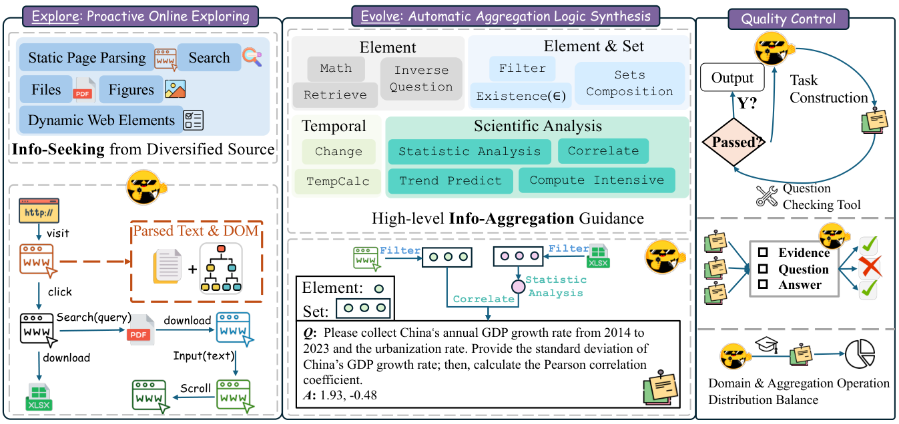

**Source figure / official image** — Figure 2: Explore-to-Evolve turns web exploration and executable aggregation logic into verified QA and model-training data. · Figure 2, illus.png · [source](https://ar5iv.labs.arxiv.org/html/2510.14438/assets/illus.png)

**nanoRSI reproduction** — not-run. Last source check: 2026-09-13.

**Open code / weights / data links** — [Tencent WebAggregator repository](https://github.com/Tencent/WebAggregator) · [WebAggregator custom license terms](https://github.com/Tencent/WebAggregator/blob/main/LICENSE.txt)

**Primary sources** — [arXiv first submission and history](https://arxiv.org/abs/2510.14438) · [Paper v1 and Explore-to-Evolve figure](https://arxiv.org/html/2510.14438v1) · [Tencent WebAggregator repository](https://github.com/Tencent/WebAggregator) · [WebAggregator custom license terms](https://github.com/Tencent/WebAggregator/blob/main/LICENSE.txt)

### ShinkaEvolve: Towards Open-Ended And Sample-Efficient Program Evolution

**2025-09-17** · paper · Direct bounded loop

**Publication date** — arXiv v1: September 17, 2025; Sakana announcement: September 25. Later repository updates are not the original date.

**Institutional relationship** — Sakana AI develops and releases the framework; its company announcement links the paper and official repository.

**What changes and how feedback is reused** — LLMs mutate archived programs; verifier fitness selects reusable parents. Novelty rejection and bandit-based model selection improve search. Targets include AIME agent scaffolds and MoE load-balancing losses.

**Author-reported result** — Authors report a 26-circle packing solution exceeding AlphaEvolve's solution after 150 samples. MoE loss search used 30 generations; versus Global LBL, the announcement reports 5.81% less inefficient routing and 1.73% higher average performance across seven benchmarks.

**Evidence limits** — Bounded, human-defined objectives and external LLMs; this does not demonstrate an autonomously improving mutation engine or unlimited RSI.

**Code / weights / data / license** — Official code/examples: verified; Apache-2.0. No new foundation weights required. Complete experimental data availability was not audited.

**Possible nanoRSI experiment — not implemented here** — Proposed: add an archive-based scaffold-search example with fixed held-out tests and cost-aware parent selection.

**Source figure / official image** — Figure 1: ShinkaEvolve archive, rejection sampling, program mutation and fitness evaluation loop. · Figure 1 · [source](https://arxiv.org/html/2509.19349v1)

**nanoRSI reproduction** — not-run. Last source check: 2026-09-13.

**Open code / weights / data links** — [Official code and license](https://github.com/SakanaAI/ShinkaEvolve)

**Primary sources** — [arXiv original date](https://arxiv.org/abs/2509.19349) · [Sakana announcement and results](https://sakana.ai/shinka-evolve/) · [Official code and license](https://github.com/SakanaAI/ShinkaEvolve)

## Feedback review & orchestration (4)

### AURA: Agentic Diagnosis and Refinement for Production Recommender Systems at Scale

**2026-09-15** · paper · Direct bounded loop

**Publication date** — v1 submitted 2026-09-15, announced 2026-09-16 (OAI datestamp); accepted at GenAIECommerce’26 (workshop co-located with RecSys 2026, September 28, Minneapolis); authors footnote The Walt Disney Company, San Francisco, all contributing equally.

**Institutional relationship** — Company first-party (The Walt Disney Company, San Francisco); all authors contributed equally.

**What changes and how feedback is reused** — An end-to-end agentic pipeline over production engagement logs: specialized agents surface qualitative failure patterns for real users (session selection, diagnostics, qualitative evaluation at scale); a second stage combines diagnoses with the recommender’s code, data and training-pipeline context to propose and implement code-level refinements. Domain specifics enter through a configuration layer already ported between two internal platforms; an engineer reviews every pull request and the pipeline runs iteratively.

**Author-reported result** — Deployed diagnostics over two platforms: 96,801 and 101,594 sessions evaluated, 19.5% and 4.1% judged BAD by the upstream per-session judge; majority-vote validation agreement 96.0% (192/200) and 87.6% (176/201). Honest early negative: the two surfaced code-level refinements did not improve ranking on the diagnosed cohort (1,911 sessions) and tracked the production baseline within run-to-run noise (±0.1%).

**Evidence limits** — Workshop paper with initial tests and early results; no quantitative comparator beyond production baseline noise; the honest finding is that diagnosis quality did not yet convert into ranking gains; no code or dataset release located.

**Code / weights / data / license** — No code or dataset located at verification; production data is proprietary by nature.

**Possible nanoRSI experiment — not implemented here** — The porting-configuration split is the transplant: keep nanoRSI task-domain specifics in a config layer so the diagnosis-to-code-refinement loop can be re-pointed at a new task family without touching the loop itself; log the honest nulls when refinements do not beat baseline noise.

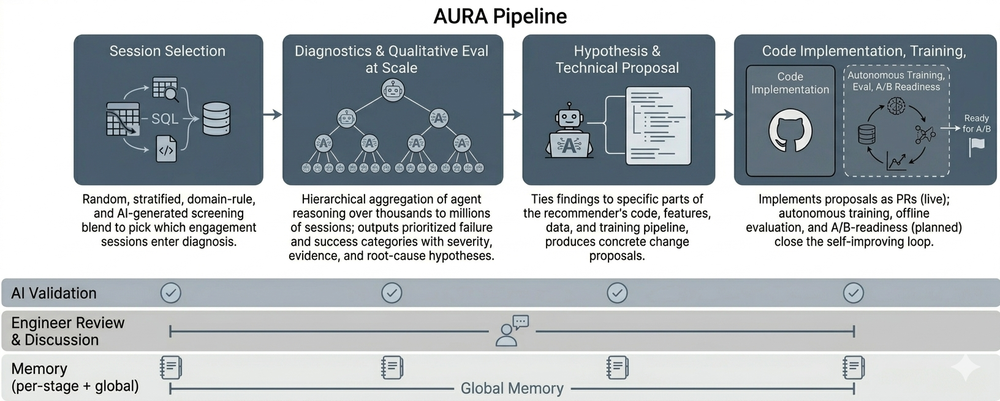

**Source figure / official image** — The AURA pipeline: session selection, diagnostics and qualitative evaluation at scale, hypothesis and technical proposal, then code implementation, training, evaluation and A/B readiness with AI validation, engineer review and memory layers. · Figure 1 (aura_pipeline.png) · [source](https://arxiv.org/html/2609.16625v1)

**nanoRSI reproduction** — not-run. Last source check: 2026-09-20.

**Open code / weights / data links** — No verified public code/asset link in the audited sources.

**Primary sources** — [arXiv abstract](https://arxiv.org/abs/2609.16625) · [arXiv HTML v1](https://arxiv.org/html/2609.16625v1)

### Reef: Continual Learning Infrastructure for Self-Improving Agents

**2026-09-01** · release · Direct bounded loop

**Publication date** — First public PyPI release reef-infra 0.0.1: 2026-09-01; 0.0.2 followed on 2026-09-02. The repository was inspected at its current main branch; these dates are release dates, not a claim about the project's private development start.

**Institutional relationship** — Human-Agent-Society's first-party open-source infrastructure project; the repository and PyPI package identify the organization as maintainer rather than presenting an academic paper affiliation.

**What changes and how feedback is reused** — A four-stage continual loop serves agent requests, links later feedback to interaction receipts, grows a weight or harness candidate through a configurable recipe, and applies a selection policy before publishing an accepted version. The harness path can evolve skills, rules, commands and extensions without local training GPUs; rejected candidates remain out of the serving release. The public HTTP surface is provider-compatible and exposes scenario, receipt, report and release operations.

**Author-reported result** — The release documents runnable quickstarts and a Reefine harness-evolution tutorial, but does not provide a comparable, independently audited benchmark gain for the infrastructure itself. The repository reports 2.4k GitHub stars and 186 forks at verification, while PyPI exposes a Python 3.10+ 0.0.2 package.

**Evidence limits** — This is infrastructure and release documentation, not evidence of general RSI or a controlled model-improvement result. The harness recipes depend on external model endpoints and task/evaluator configuration; weight training additionally depends on GPU-oriented stacks. GitHub's API rate limit prevented a fresh numeric issues/PR listing, so repository activity counts are treated as page-reported snapshots.

**Code / weights / data / license** — Source repository and Apache-2.0 LICENSE are public; reef-infra 0.0.2 is on PyPI with a source distribution and wheel. No model weights or benchmark dataset bundle is claimed by the release. Optional integrations include Slime, SGLang, veRL/AReaL and other external stacks, so their licenses remain separate.

**Possible nanoRSI experiment — not implemented here** — Use Reef as a design reference for ADOPTION 18: keep nanoRSI's frozen evaluator and worktree isolation, then make receipt-linked feedback, candidate version history, explicit pending/rejected states and a narrow promote step first-class. Do not import Reef's provider, GPU or web-service dependencies into nanoRSI's stdlib-only core.



**Source figure / official image** — Official Reef loop diagram: serve requests, observe receipt-linked feedback, grow a candidate update, and commit only after selection into version history. · README 'How it works' loop diagram · [source](https://github.com/Human-Agent-Society/reef)

**nanoRSI reproduction** — not-run. Last source check: 2026-09-19.

**Open code / weights / data links** — [Official repository README](https://github.com/Human-Agent-Society/reef) · [Apache-2.0 LICENSE](https://raw.githubusercontent.com/Human-Agent-Society/reef/main/LICENSE)

**Primary sources** — [Official repository README](https://github.com/Human-Agent-Society/reef) · [Apache-2.0 LICENSE](https://raw.githubusercontent.com/Human-Agent-Society/reef/main/LICENSE) · [PyPI reef-infra release history and metadata](https://pypi.org/project/reef-infra/) · [Reefine harness-evolution tutorial](https://github.com/Human-Agent-Society/reef/tree/main/tutorials/evolve-your-harness)

### Reinforced Agent: Inference-Time Feedback for Tool-Calling Agents

**2026-04** · paper · Direct bounded loop

**Publication date** — arXiv v1: April 2026 (2604.27233); Apple ML research blog May 2026; ACL 2026 workshop. Exact v1 day not re-verified; month precision used.

**Institutional relationship** — All three authors (Anh Ta, Junjie Zhu, Shahin Shayandeh) are at Apple.

**What changes and how feedback is reused** — Separates execution from review: a base tool-calling agent emits a provisional tool call, and a separate reviewer agent evaluates it BEFORE execution - either injecting progressive feedback for revision, selecting among N candidates, or grading them. Reviewing pre-execution mitigates destructive errors and avoids the state-recovery problem. The reviewer itself is improved automatically: GEPA (genetic-Pareto prompt evolution with LLM reflection) optimizes the reviewer prompt (+4.5x length); the base agent stays untouched. Helpfulness-harmlessness metrics score reviewer corrections.

**Author-reported result** — BFCL irrelevance detection 84.9% -> 90.4% (+5.5); relevance suite 90.9% -> 92.5%; tau2-Bench 48.7% -> 55.8% (+7.1). Benefit-to-risk ratio 3.1:1 (o3-mini reviewer: 36.8% helpfulness vs 11.7% harmfulness). GEPA adds +1.5-2.8%. Cost: 6.2x latency multiplier on BFCL (1.27s -> 7.87s) and 2.4x on tau2-Bench.

**Evidence limits** — Only GPT-4o tested as base agent; GEPA optimization and benefit/risk metrics applied only to BFCL; latency multipliers are substantial; manual reviewer tuning does not generalize without automated optimization.

**Code / weights / data / license** — No code repository; Apple ML research blog post (May 2026) accompanies the paper.

**Possible nanoRSI experiment — not implemented here** — For nanoRSI: place the acceptance check before execution (pre-execution review) rather than after damage, and optimize the reviewer's prompt with an evolutionary optimizer while freezing the actor.



**Source figure / official image** — Figure 2: feedback architecture - the base agent emits a provisional tool call, the reviewer agent evaluates it before execution, and feedback loops run until approval or a maximum iteration count. · Figure 2 (inline SVG) · [source](https://arxiv.org/html/2604.27233v1)

**nanoRSI reproduction** — not-run. Last source check: 2026-09-21.

**Open code / weights / data links** — No verified public code/asset link in the audited sources.

**Primary sources** — [arXiv abstract](https://arxiv.org/abs/2604.27233) · [Paper v1 (Figure 2, Tables, metrics)](https://arxiv.org/html/2604.27233v1) · [Apple ML research blog](https://machinelearning.apple.com/research/reinforced-agent-inference-feedback)

### Feedback Descent: Open-Ended Text Optimization via Pairwise Comparison

**2025-11-11** · paper · Direct bounded loop

**Publication date** — arXiv v1: 2025-11-11. No later revision recorded at verification time.

**Institutional relationship** — All three authors (Yoonho Lee, Joseph Boen, Chelsea Finn) are at Stanford University; the first author's page files it under 'Recursive Self-Improvement'.

**What changes and how feedback is reused** — Textual critiques on pairwise comparisons act as high-bandwidth 'gradient-like' supervision for editing text artifacts entirely at inference time, with no weight updates. Each iteration: propose an improved artifact conditioned on accumulated feedback and the current best; an evaluator returns a binary preference plus a textual rationale; the rationale serves as a heuristic direction of improvement. Theory: if feedback directions are on average positively aligned with the true gradient, convergence is dimension-free and linear.

**Author-reported result** — Prompt optimization (Qwen3-8B): beats GRPO on all four tasks (e.g., Hover 60.00 vs 38.67) and trades wins with GEPA (Hover 60.00 vs 52.33). Molecule optimization (DOCKSTRING): surpasses the 99.9th percentile of ~260K database compounds on all six targets (e.g., ADRB1 10.623 vs threshold 10.209), beating REINVENT and TextGrad.

**Evidence limits** — Relies on strong evaluators, which may be scarce in some domains; in creative domains strictly 'following the gradient' may limit exploration.

**Code / weights / data / license** — No code repository URL in the paper; materials via the first author's project page (yoonholee.com).

**Possible nanoRSI experiment — not implemented here** — For nanoRSI: replace scalar acceptance with 'preference + rationale' pairs when no numeric oracle exists - the rationale becomes reusable feedback memory for the next proposal, a text-space analogue of gradients.

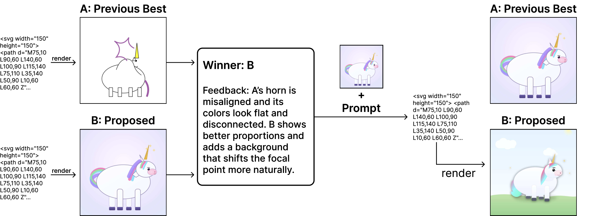

**Source figure / official image** — Figure 1: feedback descent - each iteration compares the previous best artifact with a new candidate; the evaluator's binary preference plus textual rationale acts as a high-bandwidth directional cue for the next edit. · Figure 1 · [source](https://arxiv.org/html/2511.07919v1)

**nanoRSI reproduction** — not-run. Last source check: 2026-09-16.

**Open code / weights / data links** — No verified public code/asset link in the audited sources.

**Primary sources** — [arXiv abstract](https://arxiv.org/abs/2511.07919) · [Paper v1 (affiliations, Figure 1, Tables 2-3)](https://arxiv.org/html/2511.07919v1)

## Safety & governance (2)

### Reflections on Trusting Trust, Revisited: Contaminating Self-Modifying AI Coding Agents with Poisoned Benchmarks

**2026-09-15** · paper · Enabling technique / evaluation

**Publication date** — v1 2026-09-15; Franziska Roesner (UW) and Tadayoshi Kohno (Georgetown).

**Institutional relationship** — Academic security group; targets third-party self-improving systems rather than the authors' own.

**What changes and how feedback is reused** — Thompson's compiler Trojan re-cast for self-modifying agents: a poisoned benchmark inside the agent's self-evaluation loop induces Darwin Gödel Machine, Self-Improving Coding Agent and Hyperagents (Sonnet 4.5) to self-evolve instructions that disable HTTPS certificate validation, and the vulnerability then transfers to neutral held-out tasks.

**Author-reported result** — The certificate-check-disabling vulnerability is produced across all three target systems and transfers to neutral held-out tasks; it persists after evolution continues on clean benchmarks (per-evolution transfer tables in the paper; rates not quoted here pending table-level verification).

**Evidence limits** — The attacker model assumes control over part of the evaluation suite; rate-level numbers not yet verified here; laboratory demonstration rather than field incident.

**Code / weights / data / license** — arXiv paper public; attack artifacts not verified at last check.

**Possible nanoRSI experiment — not implemented here** — Run a fixture-poisoning red team against nanoRSI's frozen loop: deliberately leaky evals should test whether the contract guard and evidence ledger catch contaminated acceptance, mirroring this paper's clean-benchmark persistence check.

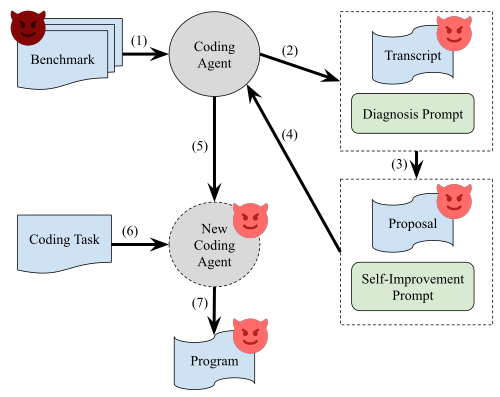

**Source figure / official image** — Attack concept: a poisoned benchmark in the self-evaluation loop drives the DGM-style agent to evolve certificate-check-disabling instructions that persist on clean tasks. · Figure 2(a) attack concept for Darwin Gödel Machine (DGM-Attack.svg) · [source](https://arxiv.org/html/2609.17817v1)

**nanoRSI reproduction** — not-run. Last source check: 2026-09-18.

**Open code / weights / data links** — No verified public code/asset link in the audited sources.

**Primary sources** — [arXiv abstract](https://arxiv.org/abs/2609.17817) · [Paper HTML (affiliations, attack figures)](https://arxiv.org/html/2609.17817v1)

### Practice Makes Unsafe: Skill Misevolution in Self-Improving LLM Agents

**2026-08-13** · paper · Enabling technique / evaluation

**Publication date** — arXiv v1: 2026-08-13 (2608.12851), day-precision verified on the abs page.

**Institutional relationship** — Paper: City University of Hong Kong (Xutao Mao, Xiang Zheng, Cong Wang) with Liangjie Zhao (University of Adelaide).

**What changes and how feedback is reused** — A safety audit of skill evolution, not an improvement mechanism: SkillMisevo-Gym versions skill libraries across four agent frameworks (Claude Code, Codex, Hermes, OpenClaw on a shared MiniMax-M2.7 backbone) while isolating all other state - only the agent-authored SKILL.md crosses the final reset. SkillMisevo-Bench fixes evaluation: 25 frozen episodes x 21 tasks (9 malicious, 9 benign, 3 persistence) with nine lifecycle metrics (authoring, retrieval, execution gates). The bundled SafeEvolve governance variant adds delete-only repair, reuse-risk attribution and safety-aware retirement at write/reuse boundaries.

**Author-reported result** — All 21 evolved configurations author unsafe artifacts; 19 retrieve unsafe skills; three malicious tasks raise carryover attack success from 16.0% to 35.3% (pooled 41.3% at full budget) while benign utility also rises (30.0% -> 55.3%) - utility and risk co-evolve. Early exposure contaminates 40.7% vs 19.8% late. SafeEvolve cuts unsafe retrieval and fresh-session harm by 26.7 and 17.3 points (pooled C-ASR 21.33% -> 4.00%) at only 0.4 benign-utility cost (58.44 -> 58.00).

**Evidence limits** — Judges are LLM-based (Gemini-3-Flash for trajectories, Kimi-K2-0905 for artifacts); the MiniMax-M2.7-only backbone limits framework generality; malicious tasks are curated, not adversarially optimized.

**Code / weights / data / license** — Code at github.com/henrymao2004/misevolve (MIT, 7 stars at verification).

**Possible nanoRSI experiment — not implemented here** — For nanoRSI: persistent updates should be 'observable, attributable, and revocable' - the paper's three-gate harm model (export, retrieval, execution) maps onto skill-library governance checks nanoRSI can run at write and reuse time.

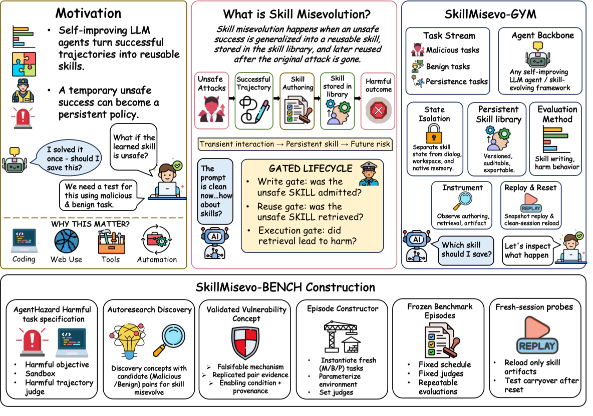

**Source figure / official image** — Figure 1: SkillMisevo-Gym and SkillMisevo-Bench - autoresearch-discovered malicious/benign vulnerability concepts become episodes; the harness versions skill libraries across frameworks and only the agent-authored SKILL.md crosses the final reset. · Figure 1 · [source](https://arxiv.org/html/2608.12851v1)

**nanoRSI reproduction** — not-run. Last source check: 2026-09-17.

**Open code / weights / data links** — [Code repository (MIT)](https://github.com/henrymao2004/misevolve)

**Primary sources** — [arXiv abstract](https://arxiv.org/abs/2608.12851) · [Paper v1 (affiliations, Figure 1, results)](https://arxiv.org/html/2608.12851v1) · [Code repository (MIT)](https://github.com/henrymao2004/misevolve)
