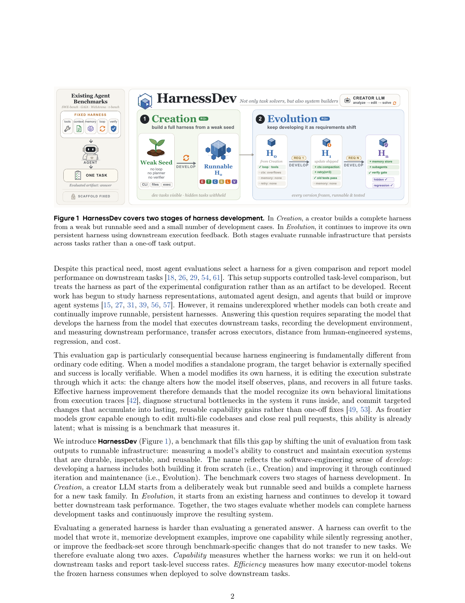

# Agent 与代码

[← 研究地图](README.zh-CN.md)

## HarnessDev: Can LLMs Create and Evolve Their Own Agent Harness?

**2026-09-01** · paper · 直接有界闭环

**日期说明** — arXiv v1：2026-09-01；共用的 Self-Developing Agents 项目页同样标为九月一日。

**机构关系** — 所列机构均由论文明列，字节跳动 Seed 为研究参与方。

**改变对象与反馈复用** — Creation 从弱种子构建可运行框架；Evolution 根据下游执行反馈反复修改持久框架。正式版本冻结后在隐藏任务上评测，衡量跨任务复用而非单份输出修补；固定运行模型的对照评估可迁移性。

**作者报告结果** — 九条单次进化轨迹中，可见分数与隐藏分数的变化方向仅在 34/64 次相邻版本切换中一致（53.1%）；仅 2/9 个声明最终版本在隐藏集上最优。Creation 覆盖六个创建模型、四个领域和 2,207 个下游实例。

**证据边界** — 这是受限直接闭环的基准研究，不证明稳定累积改进；最终选定产物可能退化，收益依赖执行模型。

**代码／权重／数据／许可** — 论文与项目页公开，论文为 CC BY-NC-ND 4.0；未核验到可下载的基准代码/数据仓库、衍生权重或对应许可，不应标为已开放代码。

**可用于 nanoRSI 的实验方向——本次未实现** — 拟议 nanoRSI coding 实验：冻结每个候选版本，保留完整评分轨迹，在固定执行模型下衡量开发集与隐藏集提升方向的一致性。

**原文图／官方图片** — 图 1：从弱种子创建可运行框架，再用执行反馈持续演化持久化框架。 · Figure 1, PDF p.2 · [source](https://arxiv.org/html/2609.01437v1)

**nanoRSI 复现状态** — not-run. 来源最近核验：2026-09-13.

**开源代码／权重／数据链接** — 核验来源中没有确认的公开代码／资产链接。

**一手来源** — [arXiv first submission](https://arxiv.org/abs/2609.01437) · [Paper v1](https://arxiv.org/html/2609.01437v1) · [Official Self-Developing Agents project](https://self-developing-agents.github.io/)

## Hyperagents

**2026-03-19** · paper · 直接有界闭环

**日期说明** — arXiv v1发布于2026-03-19；Meta论文页面日期为2026-03-24。

**机构关系** — 论文列有FAIR at Meta、Meta Superintelligence Labs及学术合作机构。

**改变对象与反馈复用** — 可编辑的元智能体修改自身及任务智能体；经评价的有效变体进入档案，作为后续父代和反馈来源，入库不要求立即提高分数。

**作者报告结果** — 100轮后，论文评审保留集准确率为0.710（置信区间0.590–0.750），静态基线为0.630、定制DGM为0.590。与定制DGM的差异不显著；初始0.0源于输出格式失败。

**证据边界** — 基础模型和评价器固定，有限轮次实验不能证明无限自我加速。

**代码／权重／数据／许可** — 已确认官方代码及实验日志链接；未提供基础模型权重。代码采用CC BY-NC-SA 4.0，不能称为允许商业使用的宽松开源。未检查日志内容及独立数据许可。

**可用于 nanoRSI 的实验方向——本次未实现** — 建议实验：分别管理任务代码和元代码版本，保留已评价的中间变体及不可变评价记录。

**原文图／官方图片** — 图 1：DGM-Hyperagents 将可修改的任务 Agent 与元 Agent 结合，并用 stepping-stone 档案持续搜索。 · Figure 1 · [source](https://arxiv.org/html/2603.19461v1)

**nanoRSI 复现状态** — not-run. 来源最近核验：2026-09-13.

**开源代码／权重／数据链接** — [Official code](https://github.com/facebookresearch/HyperAgents) · [Code licence](https://github.com/facebookresearch/HyperAgents/blob/main/LICENSE.md)

**一手来源** — [Paper history](https://arxiv.org/abs/2603.19461) · [Paper v1, authors and section 5.1](https://arxiv.org/html/2603.19461v1) · [Meta publication](https://ai.meta.com/research/publications/hyperagents/) · [Official code](https://github.com/facebookresearch/HyperAgents) · [Code licence](https://github.com/facebookresearch/HyperAgents/blob/main/LICENSE.md)

## MiniMax M2.7: Early Echoes of Self-Evolution

**2026-03-18** · report · 直接有界闭环

**日期说明** — 官方报告日期为 2026-03-18。相关 M2 系列技术论文首发于 2026-05-26，不能以七月修订日期替代 M2.7 最早事件。

**机构关系** — MiniMax 第一方报告，并有 MiniMax-M2 系列技术论文作为后续材料。

**改变对象与反馈复用** — 内部 M2.7 智能体分析失败轨迹，修改 scaffold 代码及采样配置，评测后保留或回滚，并用于下一轮。另一个研发流程更新记忆/技能、辅助研究员开展 RL 实验，但仍由人提供方向并作关键决策。

**作者报告结果** — MiniMax 报告进行了超过 100 轮自主 scaffold 迭代，内部编程评测提升 30%；未披露绝对基线、评测集身份及不确定性，因此不能独立横向比较。

**证据边界** — 这是第一方内部实验，尚非复现结果；辅助模型研发与 scaffold 自改不证明完全自主的后继模型训练。

**代码／权重／数据／许可** — M2.7 权重公开。当前模型 LICENSE 为自定义非商业许可，商业使用需书面授权；未核验到内部自进化框架、评测数据及完整训练流程公开。

**可用于 nanoRSI 的实验方向——本次未实现** — 拟议 nanoRSI coding 实验：将修改限制在 scaffold 文件，冻结执行模型，在隐藏测试集上审计保留/回滚决策。

**原文图／官方图片** — 图 8：M2.7 自进化使用的模型迭代系统与双循环流程。 · Figure 8 · [source](https://arxiv.org/html/2605.26494v1)

**nanoRSI 复现状态** — not-run. 来源最近核验：2026-09-13.

**开源代码／权重／数据链接** — [Official M2.7 model](https://huggingface.co/MiniMaxAI/MiniMax-M2.7) · [Current M2.7 non-commercial license](https://huggingface.co/MiniMaxAI/MiniMax-M2.7/blob/main/LICENSE)

**一手来源** — [Official M2.7 report](https://www.minimax.io/news/minimax-m27-en) · [Related M2-series technical paper dates](https://arxiv.org/abs/2605.26494) · [Related M2-series paper v1](https://arxiv.org/html/2605.26494v1) · [Official M2.7 model](https://huggingface.co/MiniMaxAI/MiniMax-M2.7) · [Current M2.7 non-commercial license](https://huggingface.co/MiniMaxAI/MiniMax-M2.7/blob/main/LICENSE)

## ShinkaEvolve: Towards Open-Ended And Sample-Efficient Program Evolution

**2025-09-17** · paper · 直接有界闭环

**日期说明** — arXiv 首版为 2025 年 9 月 17 日，Sakana 公告为 9 月 25 日；不以之后的仓库更新重新确定首发日期。

**机构关系** — Sakana AI 开发并发布该框架，公司公告直接链接论文及官方仓库。

**改变对象与反馈复用** — LLM 修改档案中的程序，以验证器适应度选择下一轮可复用的父代；新颖性筛选与多臂赌博机模型选择提高搜索效率。目标包括 AIME 智能体框架和 MoE 负载均衡损失。

**作者报告结果** — 作者报告以 150 个样本找到优于 AlphaEvolve 的 26 圆装填解。MoE 损失搜索使用 30 代；公告称相对 Global LBL，无效路由减少 5.81%，七个基准的平均表现提高 1.73%。

**证据边界** — 目标由人类限定，并依赖外部 LLM；并未证明变异引擎自身持续改进或无界递归自我改进。

**代码／权重／数据／许可** — 已确认官方代码与示例，许可为 Apache-2.0；不要求发布新的基础模型权重。未完整审计实验数据开放情况。

**可用于 nanoRSI 的实验方向——本次未实现** — 建议：增加基于档案的智能体框架搜索示例，固定留出测试，并在父代选择中计入成本。

**原文图／官方图片** — 图 1：ShinkaEvolve 的档案、拒绝采样、程序变异和适应度评估闭环。 · Figure 1 · [source](https://arxiv.org/html/2509.19349v1)

**nanoRSI 复现状态** — not-run. 来源最近核验：2026-09-13.

**开源代码／权重／数据链接** — [Official code and license](https://github.com/SakanaAI/ShinkaEvolve)

**一手来源** — [arXiv original date](https://arxiv.org/abs/2509.19349) · [Sakana announcement and results](https://sakana.ai/shinka-evolve/) · [Official code and license](https://github.com/SakanaAI/ShinkaEvolve)
