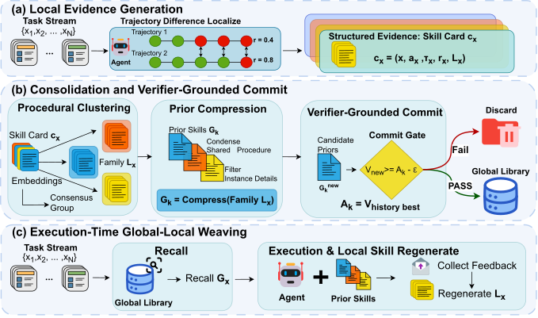
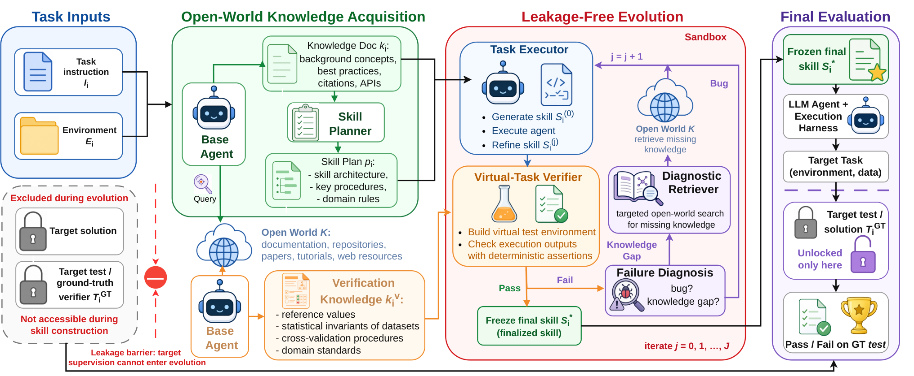
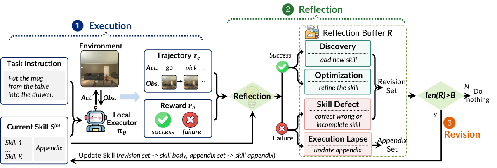

# Agent 与代码

[← 研究地图](README.zh-CN.md)

## 机制家族

| 家族 | 条目数 |
| --- | ---: |
| [技能文件优化与技能库](#family-skill-file-optimization) | 12 |
| [Harness 搜索与进化](#family-harness-search) | 6 |
| [自改写元智能体与谱系](#family-self-modifying-meta-agents) | 3 |
| [程序进化与进化搜索](#family-program-evolution) | 4 |
| [反馈审查与编排](#family-feedback-orchestration) | 2 |
| [安全与治理](#family-safety-governance) | 1 |

## 技能文件优化与技能库 (12)

### SkillLift: Learning Dense Rubrics from Sparse Oracles for Efficient Skill Evolution

**2026-09-14** · paper · 直接有界闭环

**日期说明** — arXiv v1：2026-09-14。代码仓库创建于 2026-08-08。核验时无更新版本。

**机构关系** — 论文 v1：Haoxiang Kang 为独立研究者；Ming Wen 隶属复旦大学（通讯）。

**改变对象与反馈复用** — 把技能自进化重构为双层优化，以摆脱 oracle-rollout 瓶颈（通常每个候选编辑都要跑一整次智能体 rollout）。学习一个结构化评分表 R——对技能行为的 M 条带符号权重的二元判据——作为廉价的 oracle 对齐替代器。内环：冻结 R 引导技能修订，用一次 LLM 调用而非 rollout 为候选打分。外环：在冻结技能上跑少量 oracle rollout，用 Kendall's tau 秩相关重对齐 R——只看相对次序，不校准绝对分值。交替循环在保持替代器可信的同时摊薄 oracle 成本。

**作者报告结果** — 在 WildClawBench 与 SkillsBench、三个骨干模型上（SkillsBench 用 GPT-5.4-mini、WildClawBench 用 GPT-5.4，与官方实现对齐），SkillLift 同时超过人工技能、一次性 LLM 技能、SkillOpt 与 CoEvoSkills，且 token 成本比前沿进化方法省 40-70%。表 2 分类别格显示：各组内对最强基线的总分区间为 WildClawBench +5.4~+14.0、SkillsBench +9.6~+28.3；先导实验表明直接 oracle 引导搜索的累积 token 被 oracle rollout 成本主导。

**证据边界** — 两人署名论文；基准类别与评分表质量依赖 oracle 存在且可排序。基线获得 2 倍于 SkillLift 默认预算的 token，成本对比对此有利。全部数字为作者自测；仓库很新（核验时 2 星）。

**代码／权重／数据／许可** — 代码以 MIT 发布于 github.com/WalteR-MittY-pro/SkillLift（仓库创建于 2026-08-08，核验时 2 星）。未找到权重或数据发布。

**可用于 nanoRSI 的实验方向——本次未实现** — 对 nanoRSI 技能环：用学习的评分表替代器替换逐编辑全 rollout，周期性用秩相关在 oracle rollout 上重对齐——可在最小任务上直接验证其为更便宜的技能验收信号。

**原文图／官方图片** — 图 2：SkillLift 总览——内环以冻结评分表零 oracle 成本地修订技能，外环用少量 oracle rollout 按 Kendall's tau 重对齐评分表。 · Figure 2, PDF page 3 · [source](https://arxiv.org/pdf/2609.15396)

**nanoRSI 复现状态** — not-run. 来源最近核验：2026-09-16.

**开源代码／权重／数据链接** — [Code repository (MIT)](https://github.com/WalteR-MittY-pro/SkillLift)

**一手来源** — [arXiv abstract](https://arxiv.org/abs/2609.15396) · [Paper v1 PDF (affiliations, Figure 2, Table 2, protocol)](https://arxiv.org/pdf/2609.15396) · [Code repository (MIT)](https://github.com/WalteR-MittY-pro/SkillLift)

### From Interaction Traces to Persistent Skills: Online Evolution for Computer-Use Agents

**2026-09-04** · paper · 直接有界闭环

**日期说明** — arXiv v1：2026-09-04。核验时无更新的修订版本。

**机构关系** — 论文 v1 列明第一作者 Longtao Hu（电子科技大学）与 Xiao Liang、通讯作者林超（Linchao Zhu，浙江大学）。独立学术工作，未标注企业隶属。

**改变对象与反馈复用** — 每轮迭代在持久技能库的冻结快照上执行 GUI 任务；抽取器把轨迹转为结构化事实，提案者诊断并起草候选修改（新建/编辑/删除/显式 no-op），构建者把通过的材料化为带编辑历史的版本化 SKILL.md。反馈来自评测结果与轨迹证据；唯一被修改的对象是技能库，模型权重保持冻结。

**作者报告结果** — 在与配置完全对齐的空技能库对照（同一动作生成与 GUI 定位栈、同一任务集与迭代轮数）下，系统在 OSWorld 四个应用域的预热后（t>=5）平均评测分全部更高，平均差 +5.7 至 +18.6 个百分点。GIMP 域的来源分析记录了跨任务复用与“修订抖动”：反复被接受的编辑仍可能无法恢复其来源任务——该负结果被保留。

**证据边界** — 证据限于 OSWorld 四个域和作者自建评测器；收益依赖评测信号质量，绝对分数距离饱和仍远。尚无第三方复现。

**代码／权重／数据／许可** — 代码公开于 github.com/LongtaoHu/Skill-Evo4GUI（2026-09-15 可访问）；仓库页未见许可证文件，不能假定可复用。无训练权重；使用 OSWorld 任务集但未随附发布数据。

**可用于 nanoRSI 的实验方向——本次未实现** — 把“冻结快照 + 版本化 SKILL.md + 显式 no-op”纪律移植进 nanoRSI 技能环：候选修改进入版本库，每个 episode 在冻结快照上运行，来源日志揭示哪些技能真的被检索、是否仍能解出来源任务。

**原文图／官方图片** — 图 1：在线技能进化闭环——运行时执行与轨迹抽象驱动提案/构建两端，把版本化技能提交进跨迭代共享的持久技能库。 · Figure 1 · [source](https://arxiv.org/html/2609.04869v1)

**nanoRSI 复现状态** — not-run. 来源最近核验：2026-09-15.

**开源代码／权重／数据链接** — [Author code repository](https://github.com/LongtaoHu/Skill-Evo4GUI)

**一手来源** — [arXiv abstract](https://arxiv.org/abs/2609.04869) · [Paper v1 (affiliations, Figures 1-2, Tables 1-2)](https://arxiv.org/html/2609.04869v1) · [Author code repository](https://github.com/LongtaoHu/Skill-Evo4GUI)

### SimSkill: A Self-Evolving LLM Agent for Skill and Knowledge Accumulation in Traffic Simulation

**2026-09-03** · paper · 直接有界闭环

**日期说明** — arXiv v1：2026-09-03；记录的最新修订 v3：2026-09-11。配图引自 v3，机制描述依据 v1/v3 摘要。

**机构关系** — 论文 v3 列明 Qi Liu、Qinzheng Wang、Yiming Bie 隶属吉林大学交通学院，Can Li、Wanjing Ma 隶属同济大学交通运输工程学院（道路交通工程教育部重点实验室）。

**改变对象与反馈复用** — 基于 SUMO 交通仿真与 Claude 式技能运行时。学习模式下，智能体识别自身能力缺口、自生成环境锚定任务并求解，经行动-批评环验证后，把结果蒸馏进三种记忆：情景记忆（带日期的任务经验）、程序记忆（.claude/skills 风格可执行技能）、语义记忆（策展知识页）。推理模式从记忆库检索；专门的记忆管理技能负责检索、摄取与 lint。其自进化环为：提议任务、规划检索、SUMO 执行、评估反思、蒸馏入库。

**作者报告结果** — 在两个留出基准、三个骨干 LLM 上评测，结果经作者所述的独立验证协议核验：验证成功率相对无记忆基线最多 +25 个百分点。消融显示程序记忆与语义记忆互补贡献；收益依赖骨干与算力预算——记忆并非对每个模型都有效、也不总降低推理成本，作者将其保留为警示。

**证据边界** — 限于 SUMO 交通仿真领域；“独立验证”指论文内自述的验证协议而非外部审计；v3 在八天内两次修订，若有更新版本应复读数字。

**代码／权重／数据／许可** — 代码与实验数据公开于 github.com/qiliuchn/SimSkill-V1，Apache-2.0 许可（2026-09-15 核验）。

**可用于 nanoRSI 的实验方向——本次未实现** — 缺口驱动的任务生成小型化：让 nanoRSI 提案者维护显式“能力缺口”清单，按缺口生成环境锚定的探针任务，把验证通过的解存为可复用技能——在最小任务上复刻提议、执行、评估、蒸馏回路。

**原文图／官方图片** — 图 1：SimSkill 架构及其在 SUMO 上的自进化环——提议任务、规划检索、执行、评估反思，再蒸馏进情景、程序与语义三种记忆。 · Figure 1 · [source](https://arxiv.org/html/2609.03753v3)

**nanoRSI 复现状态** — not-run. 来源最近核验：2026-09-15.

**开源代码／权重／数据链接** — [Author code repository (Apache-2.0)](https://github.com/qiliuchn/SimSkill-V1)

**一手来源** — [arXiv abstract](https://arxiv.org/abs/2609.03753) · [Paper v3 (affiliations, Figure 1, memory listings)](https://arxiv.org/html/2609.03753v3) · [Author code repository (Apache-2.0)](https://github.com/qiliuchn/SimSkill-V1)

### SkillGLoW: Procedural-Family Skill Consolidation for Self-Improving Agents on Long-Horizon Task Streams

**2026-09-02** · paper · 直接有界闭环

**日期说明** — arXiv v1：2026-09-02。核验时无更新的修订版本。

**机构关系** — 论文 v1 标注机构 1 为新加坡国立大学，机构 2 为新加坡先进智能计算研究所（IAIC）；通讯作者为 Joey Tianyi Zhou。

**改变对象与反馈复用** — 每个任务的执行产出本地技能卡；基于嵌入的聚类把卡片聚成程序性家族，压缩器把每个家族压成去实例化的全局先验。验证器锚定的提交闸门只在真实下游执行证明先验不会降低已部署技能库表现时才准入（与历史最优值比较）。执行时把冻结先验与即时再生成本地技能编织使用，实例细节按任务再生而非存储。

**作者报告结果** — 在跨 4 个基准（数学推理、终端自动化、软件修复、具身 ALFWorld）、3 个模型的 12 次持续改进运行中，整合先验相对无技能基线平均 +17.2 hard 分（本地再生后 +18.0），12/12 次运行全部为正。先验库比逐任务池紧凑 3.6 倍，并在 21 格中的 15 格领先一个已发表的单文档优化器。不加修改的先验把未见 ALFWorld 成功率从 73.9% 提到 83.9%。

**证据边界** — 未发布代码与数据；与单文档优化器的对比是附录中对齐任务集、模型与提示后的重跑，所有数字来自作者自测。作者也报告了随模型家族变化的波动。

**代码／权重／数据／许可** — 未找到代码或数据发布，仅有论文与附录。实验调用商业模型（表格中点名 MiniMax-M3 与 GPT-5.4-mini）。

**可用于 nanoRSI 的实验方向——本次未实现** — 对 nanoRSI 技能库：把相关任务聚成家族并按家族压缩先验，而非维护单一全局文档；并要求真实执行提交闸门——只有当前技能库分数不退化时才准入候选先验。

**原文图／官方图片** — 图 2：GLoW 总览——本地证据生成技能卡，聚类为程序性家族并压缩成候选先验，只有验证器锚定的提交闸门准入；执行时冻结先验与再生本地技能编织。 · Figure 2 · [source](https://arxiv.org/html/2609.02217v1)

**nanoRSI 复现状态** — not-run. 来源最近核验：2026-09-15.

**开源代码／权重／数据链接** — 核验来源中没有确认的公开代码／资产链接。

**一手来源** — [arXiv abstract](https://arxiv.org/abs/2609.02217) · [Paper v1 (affiliations, Figure 2, Tables 1-4)](https://arxiv.org/html/2609.02217v1)

### Scientific Agent Skills: A Library of Procedural Knowledge for Research Agents

**2026-08-30** · paper · 支撑技术／评测

**日期说明** — arXiv v1：2026-08-30；v2：2026-09-02。仓库（核验时 4.5 万星）早于论文且规模远超论文。

**机构关系** — 论文：Timothy Kassis、Vinayak Agarwal、Yuhuan He、Darshil Patel、Aubrey M. Brueckner——摘要页未渲染隶属；仓库在 K-Dense AI 组织下。

**改变对象与反馈复用** — 非闭环：一个开放许可的科研程序知识技能库，16 个科学实践领域（基因组、化学信息、医学影像、研究设计、科研传播）共 163 个技能。每个技能是一个目录，以版本化、人类可读的指令文件为中心、按需加载，常附参考资料与可运行脚本——编码了领域接受哪种检验、哪个标识符命名空间是权威。

**作者报告结果** — 无任务级评测与基线；量化内容是预算核算：163 个技能的常驻描述占 200K token 窗口的 7.1%；中位已文档化工作流占其 23.9%；46 个工作流中有 29 个若全量加载参考文件会溢出——故采用惰性按需加载。

**证据边界** — 人工策划的静态库：无进化机制、无任务基准；技能质量为人工保障；条目按'面向技能智能体的支撑基础设施'收录，非自改进结果。

**代码／权重／数据／许可** — 代码/库在 github.com/K-Dense-AI/scientific-agent-skills（MIT，核验时 45,207 星）。论文 CC BY 4.0。

**可用于 nanoRSI 的实验方向——本次未实现** — 对 nanoRSI：其 token 预算核算（常驻描述 vs 惰性加载 vs 溢出）是技能库成本报告的正确格式；人工策划的种子库也是技能进化实验的合法冷启动基线。

**原文图／官方图片** — 图 2：技能库总览——16 个实践领域 163 个版本化程序知识技能，按任务需要加载（常驻描述占 200K token 窗口的 7.1%）。 · Figure 2 · [source](https://arxiv.org/html/2609.00065v2)

**nanoRSI 复现状态** — not-run. 来源最近核验：2026-09-16.

**开源代码／权重／数据链接** — [Library repository (MIT)](https://github.com/K-Dense-AI/scientific-agent-skills)

**一手来源** — [arXiv abstract](https://arxiv.org/abs/2609.00065) · [Paper v2 (Figure 2, budget figures)](https://arxiv.org/html/2609.00065v2) · [Library repository (MIT)](https://github.com/K-Dense-AI/scientific-agent-skills)

### WikiSkill: Compiling Agent Experience into Persistent Knowledge for Skill Evolution

**2026-08-27** · paper · 直接有界闭环

**日期说明** — arXiv v1：2026-08-27。核验时无更新版本。

**机构关系** — 论文 v1：Google Research（Liyan Tang、Cyrus Rashtchian、Chun-Sung Ferng、Andrew Tomkins、Da-Cheng Juan）与 Tu Vu（Google Research + 弗吉尼亚理工，通讯）。

**改变对象与反馈复用** — 三层工作区：不可变的原始执行轨迹、跨迭代复利的持久 wiki（模式、日志、技能影响记录）、活跃的 SKILL.md 技能层。每轮推理智能体带技能（但不可访问 wiki）执行；wiki 维护者把采样轨迹固化为模式；技能提案者读 wiki 与轨迹，提议一次原子技能编辑；验证闸门决定接受或回滚技能——而 wiki 本身永不回滚，持续累积已接受/已拒绝 diff 的真值审计轨迹。

**作者报告结果** — 五个基准 x 五个模型、3 次运行、配对 bootstrap p<0.05：WikiSkill 全格胜过无技能、Trace2Skill、EvoSkill 与 SkillOpt（如 Gemini-3.5-Flash 68.1 对 SkillOpt 55.9；Qwen-3.6-27B 63.3 对 50.7）。增益随模型规模扩大（Qwen 4B/9B/27B +12.3/+17.5/+23.9）；Qwen-3.5-9B + WikiSkill（47.4%）胜过无技能的 Qwen-3.6-27B（39.4%）。消融：只给提案者 wiki 访问 +15.0；给推理智能体 wiki 访问反而 -7.2。

**证据边界** — 技能全量注入提示（未评估检索/触发）；严格闸门会拒绝可能支撑后续收益的中性提案；无自动 wiki 剪枝；未覆盖超长时程任务。

**代码／权重／数据／许可** — 未找到代码发布；论文 CC BY 4.0。

**可用于 nanoRSI 的实验方向——本次未实现** — 对 nanoRSI：把'永不回滚的知识'（wiki，含接受/拒绝 diff）与'可回滚的可执行技能'分层——一个单调增长的审计层，让技能闸门决策可事后复查。

**原文图／官方图片** — 图 2：WikiSkill 三层——不可变执行轨迹（raw）、跨迭代复利的持久知识库（wiki）、活跃过程指令（skills）；wiki 永不回滚。 · Figure 2 · [source](https://arxiv.org/html/2608.27454v1)

**nanoRSI 复现状态** — not-run. 来源最近核验：2026-09-16.

**开源代码／权重／数据链接** — 核验来源中没有确认的公开代码／资产链接。

**一手来源** — [arXiv abstract](https://arxiv.org/abs/2608.27454) · [Paper v1 (affiliations, Figure 2, main table)](https://arxiv.org/html/2608.27454v1)

### SkillOpt: Executive Strategy for Self-Evolving Agent Skills

**2026-06-30** · report · 直接有界闭环

**日期说明** — 微软研究院官方博客，日期 2026 年 6 月 30 日；随附的论文页与开源仓库在同一季度公开（仓库创建于 2026-05-08）。

**机构关系** — 微软研究院（MSRA）作者团队（Yifan Yang、Xuemei Gao、Qi Dai、Bei Liu、Kai Qiu、Dongdong Chen、Chong Luo）报告自有方法；博客数字为作者自报，论文自同一页面链接。

**改变对象与反馈复用** — 把 agent 的技能文件当作文本空间中的可训练参数：优化器模型在前向–反向–更新循环中提出有界编辑，候选技能"只有在留出验证集上严格优于当前技能时才被采纳"；被拒编辑进入缓冲区作为负反馈，其上还有按 epoch 的慢速/元更新。

**作者报告结果** — 作者报告：在全部 52 个评测单元（6 基准 × 7 模型 × 3 执行模式）中相对人工技能、单次 LLM 技能、Trace2Skill、TextGrad、GEPA、EvoSkill 取得最优或并列最优；GPT-5.5 直聊下六基准平均从 58.8 升至 82.3（绝对 +23.5 分）；SpreadsheetBench 41.8→80.7；在 Codex 中训练的表格技能把 Claude Code 从 22.1 提到 81.8（+59.7）；最终技能中位约 920 token、仅 1–4 次被采纳编辑；去掉元技能/慢更新后 SpreadsheetBench 从 77.5 跌至 55.0。

**证据边界** — 技能优化由固定基准内的留出验证监督——闭环是在已知测试分布上优化，未证明分布外或套件外任务的收益；跨 harness 迁移只展示了一个技能族；执行模式依赖未固定版本的商业 harness。

**代码／权重／数据／许可** — 官方实现已核验：github.com/microsoft/SkillOpt（MIT 许可，2026-05-08 创建，约 1.7 万星）；论文页自博客链接；无新权重（冻结第三方模型）；基准数据适用各基准自身条款。

**可用于 nanoRSI 的实验方向——本次未实现** — 建议：在 nanoRSI 的技能面上增加"留出闸门"技能编辑器——只在严格验证提升时采纳有界 diff 提案——与无闸门自编辑及冻结技能在相同任务流上对比，记录编辑采纳率与回归。

**原文图／官方图片** — 图 1：技能空间优化类比——带留出选择闸门的有界编辑沿验证误差面下降，而无约束的临时更新会跳变；右侧表格把经典训练超参数映射到文本空间对应物。 · Blog Figure 1 · [source](https://www.microsoft.com/en-us/research/blog/skillopt-agent-skills-as-trainable-parameters/)

**nanoRSI 复现状态** — not-run. 来源最近核验：2026-09-14.

**开源代码／权重／数据链接** — [Official implementation (MIT)](https://github.com/microsoft/SkillOpt)

**一手来源** — [Official MSR blog post (opened)](https://www.microsoft.com/en-us/research/blog/skillopt-agent-skills-as-trainable-parameters/) · [Official implementation (MIT)](https://github.com/microsoft/SkillOpt) · [Publication page](https://www.microsoft.com/en-us/research/publication/skillopt-executive-strategy-for-self-evolving-agent-skills/)

### SkillHone: A Harness for Continual Agent Skill Evolution Through Persistent Decision History

**2026-06-07** · paper · 直接有界闭环

**日期说明** — arXiv v1 首次提交于 2026-06-07；后续修订不重置纳入日期。论文标注 WeChat、Tencent Inc. 机构，并将 SkillHone 描述为持续研究框架。

**机构关系** — 论文将腾讯作者标为 WeChat、Tencent Inc.，并说明一位作者曾在 Tencent Inc. 的 WeChat AI 实习。高校合作方不被写成腾讯独占成果。

**改变对象与反馈复用** — 持久决策历史保存诊断、候选技能修订、脱敏评测证据和结果。优化 Agent 与评测 Agent 分别操作技能仓库和评测仓库；被接受的修订进入后续会话，因此技能产物在迭代间被修改并复用。

**作者报告结果** — 在 Qwen3.6-35B-A3B 的开放网页设置中，SkillHone 报告 GAIA 平均 64.6，对比精心构建的深度研究 Agent 48.8（+15.8）；WebWalkerQA-EN 为 66.4，对比 63.2（+3.2）。内部工具场景报告平均提升 +18.8；这些是作者报告的、任务特定的结果。

**证据边界** — 论文主要评测英文基准，并一次隔离一个技能；尚未展示多技能联合进化。原始企业内部框架不等同于公开仓库，因此不应把开源包写成腾讯内部基础设施的完整发布。

**代码／权重／数据／许可** — 已核验 Tencent/SkillHone 公开仓库。README 与 LICENSE 声明 MIT，但 GitHub API 元数据为 NOASSERTION。论文中的内部框架、内部数据和模型权重未随该仓库发布。

**可用于 nanoRSI 的实验方向——本次未实现** — 为 nanoRSI 增加版本化技能目录：保存决策记录、候选 diff、评测证据和回滚决定，再在隐藏任务上比较固定技能与接受修订后的复用。

**原文图／官方图片** — 图 2：SkillHone 将持久决策历史、技能优化和技能评测分开，使通过的修订可在后续迭代复用。 · Figure 2, framework.png · [source](https://ar5iv.labs.arxiv.org/html/2606.08671/assets/framework.png)

**nanoRSI 复现状态** — not-run. 来源最近核验：2026-09-13.

**开源代码／权重／数据链接** — [Tencent SkillHone repository](https://github.com/Tencent/SkillHone) · [SkillHone MIT license](https://github.com/Tencent/SkillHone/blob/main/LICENSE)

**一手来源** — [arXiv first submission and history](https://arxiv.org/abs/2606.08671) · [Paper v1 and framework figure](https://arxiv.org/html/2606.08671v1) · [Tencent SkillHone repository](https://github.com/Tencent/SkillHone) · [SkillHone MIT license](https://github.com/Tencent/SkillHone/blob/main/LICENSE)

### OpenSkill: Open-World Self-Evolution for LLM Agents

**2026-06** · paper · 直接有界闭环

**日期说明** — arXiv v1：2026 年 6 月（2606.06741）。v1 确切日期未复核，采用月精度。

**机构关系** — 论文：理海大学（Zhiling Yan、通讯 Lichao Sun）与 UIC（Hanrong Zhang、Philip S. Yu）、UBC/Vector（Yuxuan Zhang）、Salesforce AI Research（Yutong Dai、Ran Xu）、麻省总医院/哈佛医学院（Xiang Li）。

**改变对象与反馈复用** — 技能与其验证信号都从零构建、无目标任务监督：开放世界知识获取从文档、仓库、论文与网络检索任务知识与验证锚点（查询经过滤去掉基准名防泄漏）；无泄漏技能进化按计划起草 1-4 个技能，对照锚定在可独立验证事实上的自制'虚拟测试'迭代精炼（至多 3 轮），gap-vs-bug 分类器触发定向检索；零样本评估把最终技能工件部署给任意智能体——隐藏真值测试只在此时使用。

**作者报告结果** — SkillsBench：Opus 4.6 43.6% 对最强基线 Skill-Creator 34.7%（+8.9；人类 44.5%）；GPT 5.2 42.1% 对 CoT 33.3%（+8.8；人类 44.8%）——Opus 上距人类技能作者仅 1 分。SocialMaze/ScienceWorld 四列全胜；向四个较弱模型迁移 +5.5-14.8 分。验证器质量：精度 56.9%、召回 80.5%、覆盖 88.9% 真值测试意图。成本如实报告：端到端约 114 万 token/约 131 分钟（总估约 1800 美元）。

**证据边界** — 网络来源可能噪声大或自相矛盾（需溯源）；虚拟测试可能过易（高估技能质量），若源自隐藏答案则重新引入监督泄漏；开放世界检索增加延迟与 token 成本。

**代码／权重／数据／许可** — 代码在 github.com/OpenLAIR/OpenSkill（Apache-2.0，核验时 92 星）；站点 openlair.github.io/openskill。论文 CC BY 4.0。

**可用于 nanoRSI 的实验方向——本次未实现** — 对 nanoRSI：无评估器时，先从可独立验证的事实构建验证锚点、再构建技能；并从检索查询中剥离基准名作为标准防泄漏卫生。

**原文图／官方图片** — 图 2：OpenSkill——基础智能体获取开放世界知识构建技能计划，在沙箱中对照自制虚拟测试迭代生成、执行、精炼技能；泄漏屏障在构建期阻断目标监督。 · Figure 2 · [source](https://arxiv.org/html/2606.06741v1)

**nanoRSI 复现状态** — not-run. 来源最近核验：2026-09-16.

**开源代码／权重／数据链接** — [Code repository (Apache-2.0)](https://github.com/OpenLAIR/OpenSkill)

**一手来源** — [arXiv abstract](https://arxiv.org/abs/2606.06741) · [Paper v1 (affiliations, Figure 2, tables)](https://arxiv.org/html/2606.06741v1) · [Code repository (Apache-2.0)](https://github.com/OpenLAIR/OpenSkill)

### SkillEvolver: Skill Learning as a Meta-Skill

**2026-05-11** · paper · 直接有界闭环

**日期说明** — arXiv v1：2026-05-11。该工作经 2026 年 5 月媒体报道进入视野，2026-09-15 对照 arXiv 原文与官方仓库完成核验；按首次公开日期收录。

**机构关系** — 论文 v1 列明 Erle Zhu、Jinfeng Zhou、Hongning Wang 隶属清华大学，Genrui Zhang、Caiyan Jia 隶属北京交通大学。

**改变对象与反馈复用** — 技能自进化被封装为任何遵循协议的 CLI 智能体都能加载的“元技能”；只更新技能的文本与代码，不动模型权重。单轮迭代：构思并派生 K 个策略多样的领域技能智能体收集成败轨迹；对比分析并合成针对性技能补丁；随后由全新会话中的独立审计员验证补丁——新鲜智能体过拟合审计，可发现数据泄漏与“静默旁路”（技能看似有效但运行时从未被调用）。只有部署后才触发精炼，学习信号来自真实下游智能体踩到的失败，而非仅探索轨迹。

**作者报告结果** — SkillsBench（83 任务、15+ 领域）：56.8% avg@5，对比人工精选技能 43.6%、无技能 29.9%；官方仓库 README 载明 R=2 配置达 56.9%，进化技能在 74.7% 的任务上持平或超过人工精选。KernelBench GPU 核优化：H100 上平均加速比 1.16 提至 1.51。下游运行 token -19%、轮次 -15%、墙钟 -24%；端到端成本约每任务 4 美元（仓库 README）。

**证据边界** — 基准采用作者自定任务范围；“先部署后精炼”的信号假定其他智能体会复用技能库，冷启动情形不明；成本与逐任务数字来自仓库 README 而非论文正文。

**代码／权重／数据／许可** — 官方代码位于 THU-AICosmos/skillevolver，MIT 许可（2026-09-15 核验）；README 写明工作模型为 Claude Opus 4.6。未找到单独的数据发布。

**可用于 nanoRSI 的实验方向——本次未实现** — 把“新鲜智能体过拟合审计 + 静默旁路检查”采纳为 nanoRSI 的技能验收闸门：用无任何先前会话状态的智能体审计候选技能，同时检验泄漏与运行时是否真的调用该技能。

**原文图／官方图片** — 图 2：SkillEvolver 单轮迭代——策略多样的探索收集成败轨迹，合成针对性补丁，由全新会话的独立审计员把守接受关口。 · Figure 2 · [source](https://arxiv.org/html/2605.10500v1)

**nanoRSI 复现状态** — not-run. 来源最近核验：2026-09-15.

**开源代码／权重／数据链接** — [Official code repository (MIT)](https://github.com/THU-AICosmos/skillevolver)

**一手来源** — [arXiv abstract](https://arxiv.org/abs/2605.10500) · [Paper v1 (affiliations, Figure 2, Tables 1-2)](https://arxiv.org/html/2605.10500v1) · [Official code repository (MIT)](https://github.com/THU-AICosmos/skillevolver)

### EmbodiSkill: Skill-Aware Reflection for Self-Evolving Embodied Agents

**2026-05-11** · paper · 直接有界闭环

**日期说明** — arXiv v1：2026-05-11；v2：2026-07-11。本文引用的指标与配图取自 v2。5 月经媒体线索与 SkillEvolver 一同浮出，2026-09-16 才首次对照原文核验。

**机构关系** — 论文 v2 标注五个机构：华中科技大学、中国科学技术大学、微软研究院、清华大学人工智能产业研究院（AIR）、南京大学；Ting Cao（微软研究院）在作者之列。5 月的媒体报道只提南大 x 微软 x 清华 AIR，完整名单更广。

**改变对象与反馈复用** — 免训练闭环，为冻结执行器进化二段式程序技能 S = (S_body, S_app)。每条轨迹相对当前技能解读并按证据类型拆分：技能变更类证据（Discovery、Optimization、SkillDefect 反思）整合后对技能主体做定向编辑，模型扮演受限编辑者而非自由重写者；执行失察类证据（智能体没有遵循有效指引）只更新附录，重新强调既有有效内容而非改写。修订集超过预算则本轮空转。

**作者报告结果** — ALFWorld（3,553 训练 / 134 测试任务，K=1，10 个修订阶段）上，冻结的 Qwen3.5-27B 执行器达 93.28% 成功率，比无技能直用 GPT-5.2 高 31.58 分；Puttwo 子任务 100.00% 对 G-Memory 的 52.94%。消融：无技能 61.19 -> 静态技能 73.13 -> 无技能感知反思 78.36 -> EmbodiSkill 93.28（感知增量 +14.92）。EmbodiedBench：EB-Habitat 最高均值 52.33%（比最强记忆基线 +16.29），EB-Navigation 61.33%（+17.94）。收益随骨干组合变化：配 Gemini 时 Qwen3.5-27B 的感知增量缩到 +1.49。

**证据边界** — v2 无专门局限性章节。感知增量在不同模型组合下不稳（同一骨干配 GPT-5.2 为 +14.92，配 Gemini 仅 +1.49），反思通道的价值依赖配置。全部数字为作者自测；EmbodiedBench 每环境 1,000 条训练任务由作者自行整理。

**代码／权重／数据／许可** — 代码以 MIT 发布于 github.com/air-embodied-brain/EmbodiSkill（仓库创建于 2026-07-03，核验时 25 星）。未找到权重或数据发布；实验调用商业模型（点名 Qwen3.5-27B、GPT-5.2、Gemini）。

**可用于 nanoRSI 的实验方向——本次未实现** — 对 nanoRSI 技能进化：把更新证据拆成两条通道——技能内容缺陷触发编辑；未遵循有效指引的失败只做重新强调（附录式），避免好技能因执行噪声被改写。

**原文图／官方图片** — 图 2：EmbodiSkill 总览——执行器带当前技能跑具身任务，反思把证据拆为修订集（Discovery/Optimization/SkillDefect -> 技能主体）与附录集（ExecutionLapse -> 附录），只有符合预算的修订集会被应用。 · Figure 2 · [source](https://arxiv.org/html/2605.10332v2)

**nanoRSI 复现状态** — not-run. 来源最近核验：2026-09-16.

**开源代码／权重／数据链接** — [Code repository (MIT)](https://github.com/air-embodied-brain/EmbodiSkill)

**一手来源** — [arXiv abstract](https://arxiv.org/abs/2605.10332) · [Paper v2 (affiliations, Figure 2, Tables, ablations)](https://arxiv.org/html/2605.10332v2) · [Code repository (MIT)](https://github.com/air-embodied-brain/EmbodiSkill)

### SkillClaw: Let Skills Evolve Collectively with Agentic Evolver

**2026-04** · paper · 直接有界闭环

**日期说明** — arXiv v1：2026 年 4 月（2604.08377）。v1 确切日期未复核，采用月精度。

**机构关系** — 论文：阿里巴巴高德 DreamX 团队（Ziyu Ma、Shidong Yang 等，Tongwen Huang、Xiangxiang Chu）；仓库在 AMAP-ML 组织下。

**改变对象与反馈复用** — 跨用户群体的技能集体进化：跨用户会话变成保留完整'动作-反馈'因果链的结构化轨迹；会话按所引用的技能分组（天然消融，隔离每个技能的影响）；智能体进化器分析成败模式后选择精炼/新建/跳过；候选更新夜间在空闲用户环境验证，只有通过验证的改进才合并并同步给全部智能体（交互 -> 证据 -> 进化 -> 验证 -> 部署）。

**作者报告结果** — WildClawBench（Qwen3-Max 骨干、8 个模拟用户、6 天；报告六个类别中四个）：社交互动 54.01% -> 60.34%（+6.33）、搜索检索 22.73% -> 34.55%（+11.82，相对 +52%）、创意合成 11.57% -> 21.80%（相对 +88.41%）、安全对齐 24.00% -> 32.00%。受控'Skill Evolve Lite'探针：保存报告 28.3% -> 100.0%；平均 30.4% -> 72.5%。增益相对第 1 天初始技能集，非外部系统。

**证据边界** — 作者自述小规模测试（用户、反馈信号、交互深度有限）；结果仅覆盖六类中四类；后期大量候选被拒（6 天内进化进入平台期）；验证增加 token 成本。

**代码／权重／数据／许可** — 代码在 github.com/AMAP-ML/SkillClaw（MIT，核验时 2,613 星）。

**可用于 nanoRSI 的实验方向——本次未实现** — 对 nanoRSI：先按'调用过的技能'给执行证据分组再做归因——按技能分桶的会话是无须额外消融运行的最廉价因果隔离。

**原文图／官方图片** — 图 1：SkillClaw 总览——保留动作-反馈因果链的会话按所引技能分组，智能体进化器精炼或新建技能，夜间验证闸门决定合并回全部智能体的内容。 · Figure 1 · [source](https://arxiv.org/html/2604.08377v1)

**nanoRSI 复现状态** — not-run. 来源最近核验：2026-09-16.

**开源代码／权重／数据链接** — [Code repository (MIT)](https://github.com/AMAP-ML/SkillClaw)

**一手来源** — [arXiv abstract](https://arxiv.org/abs/2604.08377) · [Paper v1 (Figure 1, results)](https://arxiv.org/html/2604.08377v1) · [Code repository (MIT)](https://github.com/AMAP-ML/SkillClaw)

## Harness 搜索与进化 (6)

### HarnessDev: Can LLMs Create and Evolve Their Own Agent Harness?

**2026-09-01** · paper · 直接有界闭环

**日期说明** — arXiv v1：2026-09-01；共用的 Self-Developing Agents 项目页同样标为九月一日。

**机构关系** — 所列机构均由论文明列，字节跳动 Seed 为研究参与方。

**改变对象与反馈复用** — Creation 从弱种子构建可运行框架；Evolution 根据下游执行反馈反复修改持久框架。正式版本冻结后在隐藏任务上评测，衡量跨任务复用而非单份输出修补；固定运行模型的对照评估可迁移性。

**作者报告结果** — 九条单次进化轨迹中，可见分数与隐藏分数的变化方向仅在 34/64 次相邻版本切换中一致（53.1%）；仅 2/9 个声明最终版本在隐藏集上最优。Creation 覆盖六个创建模型、四个领域和 2,207 个下游实例。

**证据边界** — 这是受限直接闭环的基准研究，不证明稳定累积改进；最终选定产物可能退化，收益依赖执行模型。

**代码／权重／数据／许可** — 论文与项目页公开，论文为 CC BY-NC-ND 4.0；未核验到可下载的基准代码/数据仓库、衍生权重或对应许可，不应标为已开放代码。

**可用于 nanoRSI 的实验方向——本次未实现** — 拟议 nanoRSI coding 实验：冻结每个候选版本，保留完整评分轨迹，在固定执行模型下衡量开发集与隐藏集提升方向的一致性。

**原文图／官方图片** — 图 1：从弱种子创建可运行框架，再用执行反馈持续演化持久化框架。 · Figure 1, PDF p.2 · [source](https://arxiv.org/html/2609.01437v1)

**nanoRSI 复现状态** — not-run. 来源最近核验：2026-09-13.

**开源代码／权重／数据链接** — 核验来源中没有确认的公开代码／资产链接。

**一手来源** — [arXiv first submission](https://arxiv.org/abs/2609.01437) · [Paper v1](https://arxiv.org/html/2609.01437v1) · [Official Self-Developing Agents project](https://self-developing-agents.github.io/)

### Qwen3.8-Max: A New Bar for Coding and Cowork (self-evolving harness demonstrations)

**2026-08-03** · report · 直接有界闭环

**日期说明** — Qwen 团队官方博客，页面标注 2026/08/03，发布 Qwen3.8-Max（2.4T 参数、激活 95B）；页面承诺次周开放权重。

**机构关系** — 阿里 Qwen 团队对自家旗舰模型与演示过程的第一方报告；所有数字均为官方博客自报。

**改变对象与反馈复用** — 三个长程演示，模型通过反馈回路修改自身工作基础设施：(1) 从空文件夹起用 10+ 天自主运行构建 oh-my-cli 项目，配合 issue 状态机、调度器、监控与看门狗——"需求归一化为 issue，由 agent 自动认领执行，经代码、测试、预览与日志持续迭代"；(2) 从零复现论文《Unified Data Selection for LLM Reasoning》（约 125 小时、约 7,600 行代码、33 轮 GPU 训练），再以"假设→写码→上 GPU→分析"的自改进环在四轮中自提 18 个改进想法；(3) 竞赛榜单迭代。

**作者报告结果** — 自报结果：oh-my-cli 自主运行约 16 天累计 265 次提交、127 个 PR、151 个 issue（截至 2026 年 7 月 30 日）；研究复现环节先复现论文六项主要发现（其选择法在 AIME24 上超随机 +7.7%），再演化出在 AIME24 上超过原方法 +2.7 分的新方法。

**证据边界** — 属演示而非受控实验：harness 运行没有公开基线 harness、固定种子对照或成本控制；AIME24 +2.7 分为单模型自报结果，无方差与独立核验。审计时点的开放权重状态：页面承诺公开，但本次运行未核验到已发布。

**代码／权重／数据／许可** — 官方博客；演示仓库 github.com/qwen-code-dev-bot/oh-my-cli 公开（Apache-2.0，2026-07-13 创建）并保留完整轨迹；模型权重已宣布开放，但本次审计未核验到发布。

**可用于 nanoRSI 的实验方向——本次未实现** — 建议：搭建最小 issue 环路 harness，让 nanoRSI 的改进器认领、实现并验证自己仓库的 issue，在同一 issue 流上与固定计划对照比较有效 diff 产出率与回归率。

**原文图／官方图片** — 博客中描述 10+ 天自主运行的章节："通过反馈回路自我演化"，含 oh-my-cli 的 issue 认领环路（状态机、调度器、监控、看门狗）与自测细节。 · Section '10+ Days of Autonomous Coding: Building a Self-Evolving Harness' · [source](https://qwen.ai/blog?id=qwen3.8)

**nanoRSI 复现状态** — not-run. 来源最近核验：2026-09-14.

**开源代码／权重／数据链接** — [Demonstration repository with full trace (Apache-2.0)](https://github.com/qwen-code-dev-bot/oh-my-cli)

**一手来源** — [Official Qwen blog post (opened via browser)](https://qwen.ai/blog?id=qwen3.8) · [Demonstration repository with full trace (Apache-2.0)](https://github.com/qwen-code-dev-bot/oh-my-cli)

### Beagle / DarwinX: Evolving Agent Harnesses Through Natural Selection

**2026-07-31** · paper · 直接有界闭环

**日期说明** — DarwinX 于 2026-07-31 首次提交；官方 Beagle 实现于 2026-09-02 开源。资料库使用论文首发日期，并单独记录后续仓库发布。

**机构关系** — 论文与官方实现来自 Salesforce AI Research；Beagle 由 SalesforceAIResearch GitHub 组织维护。

**改变对象与反馈复用** — Beagle 将 agent harness 作为可进化对象，提供评测／进化后端、基准原生 rollout 引擎与 agent 工厂。DarwinX 冻结模型权重，由 evolver 提议 harness 变体，经各基准验证器评分，仅接受不退化且扩展覆盖的候选，并保留替代谱系供重组。

**作者报告结果** — 作者报告 GPT-5.5 high 与 Monet 上的结果：Terminal-Bench 2.1 pass@5 从 75.5 升至 83.2（+7.7 分），TerminalWorld pass@1 从 48.8 升至 56.1（+7.3），WebArena-Infinity pass@1 从 43.5 升至 93.0（+49.5），SWE-bench Verified pass@1 从 80.8 升至 84.2（+3.4）。TerminalWorld 使用训练／测试划分，进化后的 harness 原样迁移到 SWE-bench。

**证据边界** — 这些是作者报告结果，不是本地复现。WebArena 最大增益包含新增 browser_execute action。首发版本需要 Docker、uv、服务商凭据与基准基础设施。权重不变；展示的递归面是有界 harness 修订与种群选择，而非开放式持续提升。

**代码／权重／数据／许可** — Beagle 与官方 DarwinX 实现以 Apache-2.0 公开。未发布模型权重或基准数据集；系统依赖基准原生任务缓存及用户提供的 harness 仓库。

**可用于 nanoRSI 的实验方向——本次未实现** — 建议：围绕 nanoRSI 冻结评测器增加小型 population 模式，保留候选原始增量、回滚后选中增量及替代谱系元数据；在相同任务流与预算下比较单谱系复用和 preserve-and-extend 选择。不要将 Beagle 或其依赖栈引入标准库核心。

**原文图／官方图片** — Beagle 官方架构图：基准数据与 agent 工厂进入评测／进化后端、rollout 引擎及 DarwinX 进化算法。 · Official project architecture figure · [source](https://github.com/SalesforceAIResearch/Beagle/blob/main/docs/assets/beagle-architecture.svg)

**nanoRSI 复现状态** — not-run. 来源最近核验：2026-09-15.

**开源代码／权重／数据链接** — [Official Beagle repository](https://github.com/SalesforceAIResearch/Beagle) · [Beagle Apache-2.0 license](https://github.com/SalesforceAIResearch/Beagle/blob/main/LICENSE.txt)

**一手来源** — [DarwinX paper v1](https://arxiv.org/abs/2608.07545) · [Official Beagle repository](https://github.com/SalesforceAIResearch/Beagle) · [Beagle Apache-2.0 license](https://github.com/SalesforceAIResearch/Beagle/blob/main/LICENSE.txt) · [Official Beagle architecture figure](https://github.com/SalesforceAIResearch/Beagle/blob/main/docs/assets/beagle-architecture.svg)

### GenericAgent: A Self-Evololving Agent Growing a Skill Tree from a 3.3K-Line Seed

**2026-04** · paper · 直接有界闭环

**日期说明** — arXiv v1：2026 年 4 月（2604.17091）。v1 确切日期未复核，采用月精度。仓库（lsdefine/GenericAgent，MIT）核验时已达 1.42 万星。

**机构关系** — 论文署名为 Advantage AI Agent Lab（A3 Lab），'深圳 Aquaintelling 科技与复旦大学成员的联合实验室'；未列个人作者。

**改变对象与反馈复用** — 统一智能体循环（约 3,300 行代码中核心约 92 行，比 OpenClaw 小 160 倍以上）从任务、记忆与两层技能树（类别 + 带使用计数的命名技能）构造执行上下文。课程规划器为技能候选打分（收益/难度/使用/兴趣，权重 0.3/0.2/0.3/0.2）并经反思自适应权重；每个任务以'技能固化'收尾——归档 Markdown 报告、更新技能树、递增计数——部署产物单调增长而循环保持极小。

**作者报告结果** — Lifelong AgentBench：222K 输入 token 下 100% 准确率，对 OpenClaw 1.43M 下 70%、Claude Code 800K 下 75%（约 6.4 倍 token 优势——即仓库的'6 倍'说法）。长时程任务 188.8K token 下 100%，对 Claude Code 537K。自进化第 1 -> 9 轮：222,203 -> 23,010 token（-89.6%）、7m30s -> 1m38s、32 -> 5 次 LLM 调用。20 个技能后提示仅 2,298 token，对 Claude Code 22,821、OpenClaw 43,321。跨任务节省 61.0-92.4%（总体 79.3%）。

**证据边界** — 30 轮上下文上限迫使长研究跨会话；自适应权重缺乏长期验证；自改进日志人工整理；技能树的合并/废弃靠手工。

**代码／权重／数据／许可** — 代码在 github.com/lsdefine/GenericAgent（MIT，核验时 14,200 星）。

**可用于 nanoRSI 的实验方向——本次未实现** — 对 nanoRSI：证明带技能固化的极小种子环能在 token 效率上胜过百万行级 harness——nanoRSI 的纯标准库内核押注相同；使用计数与按技能隔离提示是最廉价的第一步。

**原文图／官方图片** — 图 2：GenericAgent 统一循环——由任务、记忆与两层技能树构造执行上下文；课程规划器为技能打分，每个任务以技能固化（归档报告、更新树、递增计数）收尾。 · Figure 2 · [source](https://arxiv.org/html/2604.17091v1)

**nanoRSI 复现状态** — not-run. 来源最近核验：2026-09-16.

**开源代码／权重／数据链接** — [Code repository (MIT)](https://github.com/lsdefine/GenericAgent)

**一手来源** — [arXiv abstract](https://arxiv.org/abs/2604.17091) · [Paper v1 (Figure 2, token/cost tables)](https://arxiv.org/html/2604.17091v1) · [Code repository (MIT)](https://github.com/lsdefine/GenericAgent)

### MiniMax M2.7: Early Echoes of Self-Evolution

**2026-03-18** · report · 直接有界闭环

**日期说明** — 官方报告日期为 2026-03-18。相关 M2 系列技术论文首发于 2026-05-26，不能以七月修订日期替代 M2.7 最早事件。

**机构关系** — MiniMax 第一方报告，并有 MiniMax-M2 系列技术论文作为后续材料。

**改变对象与反馈复用** — 内部 M2.7 智能体分析失败轨迹，修改 scaffold 代码及采样配置，评测后保留或回滚，并用于下一轮。另一个研发流程更新记忆/技能、辅助研究员开展 RL 实验，但仍由人提供方向并作关键决策。

**作者报告结果** — MiniMax 报告进行了超过 100 轮自主 scaffold 迭代，内部编程评测提升 30%；未披露绝对基线、评测集身份及不确定性，因此不能独立横向比较。

**证据边界** — 这是第一方内部实验，尚非复现结果；辅助模型研发与 scaffold 自改不证明完全自主的后继模型训练。

**代码／权重／数据／许可** — M2.7 权重公开。当前模型 LICENSE 为自定义非商业许可，商业使用需书面授权；未核验到内部自进化框架、评测数据及完整训练流程公开。

**可用于 nanoRSI 的实验方向——本次未实现** — 拟议 nanoRSI coding 实验：将修改限制在 scaffold 文件，冻结执行模型，在隐藏测试集上审计保留/回滚决策。

**原文图／官方图片** — 图 8：M2.7 自进化使用的模型迭代系统与双循环流程。 · Figure 8 · [source](https://arxiv.org/html/2605.26494v1)

**nanoRSI 复现状态** — not-run. 来源最近核验：2026-09-13.

**开源代码／权重／数据链接** — [Official M2.7 model](https://huggingface.co/MiniMaxAI/MiniMax-M2.7) · [Current M2.7 non-commercial license](https://huggingface.co/MiniMaxAI/MiniMax-M2.7/blob/main/LICENSE)

**一手来源** — [Official M2.7 report](https://www.minimax.io/news/minimax-m27-en) · [Related M2-series technical paper dates](https://arxiv.org/abs/2605.26494) · [Related M2-series paper v1](https://arxiv.org/html/2605.26494v1) · [Official M2.7 model](https://huggingface.co/MiniMaxAI/MiniMax-M2.7) · [Current M2.7 non-commercial license](https://huggingface.co/MiniMaxAI/MiniMax-M2.7/blob/main/LICENSE)

### Meta-Harness: End-to-End Optimization of Model Harnesses

**2026-03** · paper · 直接有界闭环

**日期说明** — arXiv v1：2026 年 3 月（2603.28052）；Terminal-Bench 2.0 工件仓库创建于 2026-03-26。v1 确切日期未复核，采用月精度。

**机构关系** — 论文：Yoonho Lee、Roshen Nair、Qizheng Zhang、Chelsea Finn（斯坦福）、Kangwook Lee（KRAFTON）、Omar Khattab（MIT）。

**改变对象与反馈复用** — 对任务 harness 代码的外层搜索环：编码智能体提案者（Claude Code / Opus 4.6）读取一个持续增长的文件系统——内含此前每个候选的源码、执行轨迹与分数（经 grep/cat 工具）——提议新的单文件 harness（控制提示、检索、记忆与编排），评估后把全部信息写入新目录。用精度-上下文成本的 Pareto 前沿取代硬编码父代选择；20 轮迭代约 60 个 harness。消融：完整轨迹访问是关键——只看分数时最优精度从 56.7 塌到 41.3，轨迹摘要甚至有害。

**作者报告结果** — TerminalBench-2（Opus 4.6）：76.4%（Opus-4.6 智能体中排名第二；Terminus-KIRA 74.7%；ForgeCode 更高的 81.8% 用公开代码无法复现）。Haiku 4.5：37.6%，第一。文本分类：11.4K 上下文 token 下 48.6%，对 ACE 50.8K 下的 40.9%（+7.9 且省 4 倍 token）；OOD 73.1% 对 70.2%；以 0.1 倍评估次数追平此前最优文本优化器。

**证据边界** — TerminalBench-2 的搜索与最终评估用同一批 89 个任务（'发现问题'设定），仅靠人工检查与正则审计查字符串泄漏；只研究了一个提案智能体；ForgeCode 榜单分无法复现。

**代码／权重／数据／许可** — 项目页 yoonholee.com/meta-harness；优化工件在 github.com/stanford-iris-lab/meta-harness-tbench2-artifact（1,213 星，核验时无许可证文件）。论文 CC BY 4.0。

**可用于 nanoRSI 的实验方向——本次未实现** — 对 nanoRSI：把每个候选的完整轨迹（而非摘要）存入提案者可查询的存储——消融表明让 harness 搜索奏效的是轨迹访问本身，而非选择策略的精巧。

**原文图／官方图片** — 图 2：Meta-Harness 搜索环——智能体读取含此前全部候选代码、轨迹与分数的文件系统，提议新 harness、评估、并把全部信息记入新目录。 · Figure 2 · [source](https://arxiv.org/html/2603.28052v1)

**nanoRSI 复现状态** — not-run. 来源最近核验：2026-09-16.

**开源代码／权重／数据链接** — [Artifact repository](https://github.com/stanford-iris-lab/meta-harness-tbench2-artifact)

**一手来源** — [arXiv abstract](https://arxiv.org/abs/2603.28052) · [Paper v1 (affiliations, Figure 2, results)](https://arxiv.org/html/2603.28052v1) · [Artifact repository](https://github.com/stanford-iris-lab/meta-harness-tbench2-artifact)

## 自改写元智能体与谱系 (3)

### Mendel Godel Machine: Recursive Self-Improving Coding Agents via Comparative Evolution

**2026-08** · paper · 直接有界闭环

**日期说明** — arXiv v1：2026 年 8 月（2608.07645）。v1 确切日期未复核，采用月精度。

**机构关系** — 论文：Changzhi Liu、Yilun Liu、Sikuan Yan、Volker Tresp、Yunpu Ma——电子科技大学、慕尼黑大学与慕尼黑机器学习中心。

**改变对象与反馈复用** — 在档案式自修改（DGM/HGM）上加入三个由比较证据驱动的孟德尔算子：克隆变异（单轨迹编辑）、反应规范变异（用同一智能体跨多任务的轨迹编辑——复现失败标记基因型缺陷）、跨谱系杂交（从另一谱系的成功轨迹提取可迁移行为性状并适配，不拼接代码）。失败任务池提高采样权重使谱系在难题上重叠。命题 1：加性适应度地形下，比较证据提升修复概率。

**作者报告结果** — Qwen3.6-35B-A3B、200 次评估 + 24 次扩展：SWE-bench Verified-60 68.3% -> 78.3%（HGM 73.3%）；Polyglot-60 50.8% -> 93.2%（HGM 77.9%）；完整 Polyglot-225 达 93.3%，'以约 117 倍少的参数超过闭源 GPT-5'。跨基准迁移：SWE-bench Pro 16.7% -> 26.7%；Multilingual 41.7% -> 55.0%。跨模型迁移：DeepSeek-V4-Flash 50.0% -> 66.7%、V4-Pro 45.0% -> 75.0%。

**证据边界** — 高时间/GPU 成本限制了种子数与扫参；算子需要多轨迹历史与跨谱系任务重叠（档案小时退化为单轨迹基线）；编辑质量无保证；结论限于公开基准上的编码智能体脚手架。

**代码／权重／数据／许可** — 代码在 github.com/RealLcz/MGM（Apache-2.0，核验时 32 星）；项目页 reallcz.github.io/MGM。

**可用于 nanoRSI 的实验方向——本次未实现** — 对 nanoRSI：按谱系保存逐任务轨迹，并允许由跨任务复现失败（反应规范）与其他候选在共享任务上的成功（杂交）驱动的编辑——都是候选分数之外的选择信号。

**原文图／官方图片** — 图 1：孟德尔哥德尔机——档案谱系树上，采样与评估喂给三个比较算子：克隆变异、反应规范变异、跨谱系杂交。 · Figure 1 · [source](https://arxiv.org/html/2608.07645v1)

**nanoRSI 复现状态** — not-run. 来源最近核验：2026-09-16.

**开源代码／权重／数据链接** — [Code repository (Apache-2.0)](https://github.com/RealLcz/MGM)

**一手来源** — [arXiv abstract](https://arxiv.org/abs/2608.07645) · [Paper v1 (affiliations, Figure 1, results tables)](https://arxiv.org/html/2608.07645v1) · [Code repository (Apache-2.0)](https://github.com/RealLcz/MGM)

### Meta^n: Recursive Self-Improvement through Emergent Depth

**2026-08** · paper · 直接有界闭环

**日期说明** — arXiv v1：2026 年 8 月（2608.24735）；官方仓库创建于 2026-08-26。v1 确切日期未复核，采用月精度。

**机构关系** — 论文：Zae Myung Kim、Young-Jun Lee、Dongyeop Kang（明尼苏达大学）与 Seungyeon Jwa（首尔国立大学）。

**改变对象与反馈复用** — 单一固定的元操作 Omega 反复作用于自身输出：每次调用读取下层的轨迹与（自第 3 层起）其产出的代码，再写出下一层代码（预处理器 + 代码库）；包装器复合成 Sd = Md o ... o M2 o S1。深度持续增长直到 Omega 不再找到改进（收敛阈值 0.02），并有跨链进化档案；各层角色无提示地涌现（回滚行为首次出现在第 3 层）。

**作者报告结果** — 八个基准家族上实测元深度 3-6（平台期 3-4；材料科学 SR 达 6），而既有自改写系统实测上限约 2.5。ARC-AGI-2：0.331 +/- 0.010 对 OpenEvolve 0.003、Godel Agent 0.054——唯一能解出任意任务的系统；CO-Bench（GPT-5.2）0.870 对 0.702。消融去递归：-0.131（Gemma CO）；层间上下文贡献约 72% 增益。

**证据边界** — 所有层用同一模型（更强的 Omega 配更弱基座未测）；层间上下文是自由文本；高层推理能力与累积层代码的上下文饱和仍是未测上界。

**代码／权重／数据／许可** — 代码在 github.com/minnesotanlp/meta-n（MIT，核验时 29 星）。论文 CC BY-NC-ND 4.0（非商业条款）。

**可用于 nanoRSI 的实验方向——本次未实现** — 对 nanoRSI：把'实测元深度'（在平台期前真正有效的嵌套改进层数）作为标准报告字段——Meta^n 证明它可测量，而自改写环要打败的基线约为 2.5。

**原文图／官方图片** — 图 1：Meta^n 一览——固定元操作反复读取下层并写出下一层代码；实测深度增长到 3-6，而自改写系统上限约 2.5。 · Figure 1 · [source](https://arxiv.org/html/2608.24735v1)

**nanoRSI 复现状态** — not-run. 来源最近核验：2026-09-16.

**开源代码／权重／数据链接** — [Code repository (MIT)](https://github.com/minnesotanlp/meta-n)

**一手来源** — [arXiv abstract](https://arxiv.org/abs/2608.24735) · [Paper v1 (affiliations, Figures 1-3, tables)](https://arxiv.org/html/2608.24735v1) · [Code repository (MIT)](https://github.com/minnesotanlp/meta-n)

### Hyperagents

**2026-03-19** · paper · 直接有界闭环

**日期说明** — arXiv v1发布于2026-03-19；Meta论文页面日期为2026-03-24。

**机构关系** — 论文列有FAIR at Meta、Meta Superintelligence Labs及学术合作机构。

**改变对象与反馈复用** — 可编辑的元智能体修改自身及任务智能体；经评价的有效变体进入档案，作为后续父代和反馈来源，入库不要求立即提高分数。

**作者报告结果** — 100轮后，论文评审保留集准确率为0.710（置信区间0.590–0.750），静态基线为0.630、定制DGM为0.590。与定制DGM的差异不显著；初始0.0源于输出格式失败。

**证据边界** — 基础模型和评价器固定，有限轮次实验不能证明无限自我加速。

**代码／权重／数据／许可** — 已确认官方代码及实验日志链接；未提供基础模型权重。代码采用CC BY-NC-SA 4.0，不能称为允许商业使用的宽松开源。未检查日志内容及独立数据许可。

**可用于 nanoRSI 的实验方向——本次未实现** — 建议实验：分别管理任务代码和元代码版本，保留已评价的中间变体及不可变评价记录。

**原文图／官方图片** — 图 1：DGM-Hyperagents 将可修改的任务 Agent 与元 Agent 结合，并用 stepping-stone 档案持续搜索。 · Figure 1 · [source](https://arxiv.org/html/2603.19461v1)

**nanoRSI 复现状态** — not-run. 来源最近核验：2026-09-16.

**开源代码／权重／数据链接** — [Official code](https://github.com/facebookresearch/HyperAgents) · [Code licence](https://github.com/facebookresearch/HyperAgents/blob/main/LICENSE.md)

**一手来源** — [Paper history](https://arxiv.org/abs/2603.19461) · [Paper v1, authors and section 5.1](https://arxiv.org/html/2603.19461v1) · [Meta publication](https://ai.meta.com/research/publications/hyperagents/) · [Official code](https://github.com/facebookresearch/HyperAgents) · [Code licence](https://github.com/facebookresearch/HyperAgents/blob/main/LICENSE.md)

## 程序进化与进化搜索 (4)

### Dream-RSI: Improving Exploration Policies by Dreaming over the Discovery Tree

**2026-09-14** · paper · 直接有界闭环

**日期说明** — arXiv v1：2026-09-14；仓库创建于 2026-09-13。

**机构关系** — 论文：马里兰大学帕克分校（Tong Zheng、Rui Liu、Heng Huang 等）、Google DeepMind（Zhankui He、Benjamin Coleman、Di Bai、Wang-Cheng Kang）与弗吉尼亚大学（Haolin Liu）。

**改变对象与反馈复用** — 发现历史被组织成树，节点存每次尝试的工作区、工件、诊断与得分；这棵树成为回放模拟器——备选探索策略以不同顺序、并行分组与停止点'导航'已记录分支，无需重跑底层智能体。策略开发 LLM 迭代改写探索策略代码，每个版本按平衡最优得分、执行成本与并行度的回放目标打分；最优策略重新上线，新历史又扩充模拟器池。

**作者报告结果** — 算法工程（Lasso、6 个留出数据集）：Gemini-3.1-Pro 下 Dream-RSI 以 317 次调用达均值 2,931ms，对固定探索 550 次的 3,587ms；Gemini-3.7-Flash 下 1,879 次调用 2,350.6ms 对 3,200 次的 2,516.7ms（SimpleTES 需 51,200 次）。内核工程：VGG16/LayerNorm 以少 2.43/1.79 倍生成数持平；ConvDiv 同预算下 +2.09 倍得分。

**证据边界** — 回放只对已记录分支确定性有效——无法评估真正新颖的方向；增益仅见于 3 域 8 任务；需要结构化发现树；离线策略迭代仍耗 LLM 调用。

**代码／权重／数据／许可** — 代码在 github.com/zhengkid/Dream-RSI（172 星，核验时无许可证文件）；项目站 dream-rsi.com。

**可用于 nanoRSI 的实验方向——本次未实现** — 对 nanoRSI：把运行档案复用为免费模拟器——在花费任何新评估之前，让备选提案/调度策略在已记录的候选树上回放打分；这是有界环可用的最廉价策略改进形式。

**原文图／官方图片** — 图 1：Dream-RSI 三阶段递归环——在线探索构建发现树，树成为回放模拟器，'做梦'式策略改进离线改写探索策略。 · Figure 1 · [source](https://arxiv.org/html/2609.14858v1)

**nanoRSI 复现状态** — not-run. 来源最近核验：2026-09-16.

**开源代码／权重／数据链接** — [Code repository](https://github.com/zhengkid/Dream-RSI)

**一手来源** — [arXiv abstract](https://arxiv.org/abs/2609.14858) · [Paper v1 (affiliations, Figure 1, tables)](https://arxiv.org/html/2609.14858v1) · [Code repository](https://github.com/zhengkid/Dream-RSI)

### EvoPolicyGym: Benchmarking Executable-Policy Evolution in Coding Agents

**2026-07** · paper · 支撑技术／评测

**日期说明** — arXiv v1：2026 年 7 月（2607.02440）。v1 确切日期未复核，采用月精度。与 AgentGym/AgentEvol 同作者谱系。

**机构关系** — 论文：中科大、港中文、澳门大学、清华、浙大、苏州大学、布朗大学与上海交大。

**改变对象与反馈复用** — 评测'策略即代码'进化的基准而非训练方法：固定 Gymnasium 风格环境（MiniGrid、Box2D、MuJoCo 族）；智能体在工作区反复编辑可执行 Python'策略系统'，提交训练 rollout（总计至多 128 回合）并获服务器中介反馈；用隐藏的验证选中检查点在留出回合上计分——训练反馈可见、验证/留出隐藏在服务端。诊断把编辑分为综合（新结构）与调参。

**作者报告结果** — Core16 留出归一化回报：GPT-5.5（Codex）0.891、9 胜且 16 环境全进前二；Claude Opus 4.7（Claude Code）0.750；MiniMax-M3 0.531；DeepSeek-V4-Pro 0.359；随机 0.109。强智能体把综合编辑转化为新验证最优的比率达 41-48%，弱者仅 3-10%。进化出的机制含道路掩码前瞻（CarRacing）、周期步态（HalfCheetah）与 BFS 建图（ObstructedMaze）。

**证据边界** — 诊断是'保守代理而非语义证明'（AST 拓扑忽略行为相似性）；策略源边界排除生成数据与学习权重；128 回合预算远低于标准 RL 样本量级，故排除常规 RL 基线；跨 harness 的 token 未归一。

**代码／权重／数据／许可** — 代码在 github.com/Linzwcs/EvoPolicyGym（MIT，核验时 176 星）；HF 数据集 EvoPolicyGym-Exp-data；项目页 linzwcs.github.io/EvoPolicyGym。

**可用于 nanoRSI 的实验方向——本次未实现** — 对 nanoRSI：现成的工件轨评分协议——服务端隐藏验证检查点 + 留出回合 + 硬回合预算，并在账本中区分综合与调参编辑。

**原文图／官方图片** — 图 1：EvoPolicyGym——智能体编辑可执行策略，在有限预算下提交回合 rollout 并获平台中介反馈；验证与留出计分留在服务端隐藏。 · Figure 1 · [source](https://arxiv.org/html/2607.02440v1)

**nanoRSI 复现状态** — not-run. 来源最近核验：2026-09-16.

**开源代码／权重／数据链接** — [Code repository (MIT)](https://github.com/Linzwcs/EvoPolicyGym)

**一手来源** — [arXiv abstract](https://arxiv.org/abs/2607.02440) · [Paper v1 (affiliations, Figure 1, Core16 table)](https://arxiv.org/html/2607.02440v1) · [Code repository (MIT)](https://github.com/Linzwcs/EvoPolicyGym)

### WebAggregator: Enhancing Compositional Reasoning Capabilities of Deep Research Agent Foundation Models

**2025-10-16** · paper · 直接有界闭环

**日期说明** — arXiv v1 于 2025-10-16 以 Explore-to-Evolve 工作标题提交；后续改名为 WebAggregator 不改变原始日期。

**机构关系** — 论文明确列出腾讯 AI Lab 与香港中文大学作者；代码及数据构建仓库由腾讯账号发布。

**改变对象与反馈复用** — 在线探索器访问网页，组合逻辑提案器选择、组合并细化高层聚合操作。质量控制将可执行聚合程序转成覆盖 5 万网站、11 个领域的 1 万条可验证 QA；轨迹与答案再用于 WebAggregator 模型的 SFT。

**作者报告结果** — 论文报告 WebAggregator-8B 达到 GPT-4.1 水平，32B 在 GAIA-text 上超过 GPT-4.1 十个百分点以上并接近 Claude-3.7。人工标注的 WebAggregatorQA 测试中，Claude-3.7 的 pass@1 为 28.0%，GPT-4.1 为 25.8%；模型比较使用固定裁判和有界重试。

**证据边界** — 被进化的对象是网页聚合程序及其生成训练数据；下游基础模型经过 SFT 后评测，并未递归部署来改进自身提案器。网站可用性、裁判质量和生成数据泄漏都会影响结果。

**代码／权重／数据／许可** — Tencent/WebAggregator 发布 QA 构建引擎、查询、轨迹、模型和运行脚本。LICENSE.txt 为 WebAggregator 自定义条款，并写明不适用于欧盟境内；GitHub API 元数据为 NOASSERTION。数据、模型和第三方条款仍需分别核验。

**可用于 nanoRSI 的实验方向——本次未实现** — 使用小型封闭网页任务集测试 nanoRSI 程序进化：保存每个提案程序、来源 URL、验证器输出和生成样本，再比较固定数据 SFT 与刷新数据的迭代。

**原文图／官方图片** — 图 2：Explore-to-Evolve 将网页探索与可执行聚合逻辑转成可验证 QA 和模型训练数据。 · Figure 2, illus.png · [source](https://ar5iv.labs.arxiv.org/html/2510.14438/assets/illus.png)

**nanoRSI 复现状态** — not-run. 来源最近核验：2026-09-13.

**开源代码／权重／数据链接** — [Tencent WebAggregator repository](https://github.com/Tencent/WebAggregator) · [WebAggregator custom license terms](https://github.com/Tencent/WebAggregator/blob/main/LICENSE.txt)

**一手来源** — [arXiv first submission and history](https://arxiv.org/abs/2510.14438) · [Paper v1 and Explore-to-Evolve figure](https://arxiv.org/html/2510.14438v1) · [Tencent WebAggregator repository](https://github.com/Tencent/WebAggregator) · [WebAggregator custom license terms](https://github.com/Tencent/WebAggregator/blob/main/LICENSE.txt)

### ShinkaEvolve: Towards Open-Ended And Sample-Efficient Program Evolution

**2025-09-17** · paper · 直接有界闭环

**日期说明** — arXiv 首版为 2025 年 9 月 17 日，Sakana 公告为 9 月 25 日；不以之后的仓库更新重新确定首发日期。

**机构关系** — Sakana AI 开发并发布该框架，公司公告直接链接论文及官方仓库。

**改变对象与反馈复用** — LLM 修改档案中的程序，以验证器适应度选择下一轮可复用的父代；新颖性筛选与多臂赌博机模型选择提高搜索效率。目标包括 AIME 智能体框架和 MoE 负载均衡损失。

**作者报告结果** — 作者报告以 150 个样本找到优于 AlphaEvolve 的 26 圆装填解。MoE 损失搜索使用 30 代；公告称相对 Global LBL，无效路由减少 5.81%，七个基准的平均表现提高 1.73%。

**证据边界** — 目标由人类限定，并依赖外部 LLM；并未证明变异引擎自身持续改进或无界递归自我改进。

**代码／权重／数据／许可** — 已确认官方代码与示例，许可为 Apache-2.0；不要求发布新的基础模型权重。未完整审计实验数据开放情况。

**可用于 nanoRSI 的实验方向——本次未实现** — 建议：增加基于档案的智能体框架搜索示例，固定留出测试，并在父代选择中计入成本。

**原文图／官方图片** — 图 1：ShinkaEvolve 的档案、拒绝采样、程序变异和适应度评估闭环。 · Figure 1 · [source](https://arxiv.org/html/2509.19349v1)

**nanoRSI 复现状态** — not-run. 来源最近核验：2026-09-13.

**开源代码／权重／数据链接** — [Official code and license](https://github.com/SakanaAI/ShinkaEvolve)

**一手来源** — [arXiv original date](https://arxiv.org/abs/2509.19349) · [Sakana announcement and results](https://sakana.ai/shinka-evolve/) · [Official code and license](https://github.com/SakanaAI/ShinkaEvolve)

## 反馈审查与编排 (2)

### Reinforced Agent: Inference-Time Feedback Architecture for Tool-Calling Agents

**2026-04** · paper · 直接有界闭环

**日期说明** — arXiv v1：2026 年 4 月（2604.27233）；Apple 机器学习研究博客 2026 年 5 月；ACL 2026 workshop。v1 确切日期未复核，采用月精度。

**机构关系** — 三位作者（Anh Ta、Junjie Zhu、Shahin Shayandeh）均属 Apple。

**改变对象与反馈复用** — 把执行与审查分离：基础工具调用智能体先给出临时工具调用，由独立的审查智能体在执行前评估——注入渐进反馈促其修订、在 N 个候选中选择或打分。执行前审查既缓解破坏性错误又规避状态恢复问题。审查者本身也被自动改进：GEPA（带 LLM 反思的遗传-帕累托提示进化）优化审查提示（长度增至 4.5 倍）；基础智能体不动。有益-有害双指标为审查者修正打分。

**作者报告结果** — BFCL 无关检测 84.9% -> 90.4%（+5.5）；相关套件 90.9% -> 92.5%；tau2-Bench 48.7% -> 55.8%（+7.1）。收益风险比 3.1:1（o3-mini 审查者：有益 36.8% 对有害 11.7%）。GEPA 再加 +1.5-2.8%。代价：BFCL 延迟 6.2 倍（1.27s -> 7.87s），tau2-Bench 2.4 倍。

**证据边界** — 基础智能体仅测 GPT-4o；GEPA 优化与收益/风险指标仅用于 BFCL；延迟倍数不小；无自动优化时手工调审查提示不可泛化。

**代码／权重／数据／许可** — 无代码仓库；配套 Apple 机器学习研究博客（2026 年 5 月）。

**可用于 nanoRSI 的实验方向——本次未实现** — 对 nanoRSI：把验收检查放到执行之前（执行前审查）而非破坏之后；用进化优化器优化审查者提示、冻结执行者。

**原文图／官方图片** — 图 2：反馈架构——基础智能体给出临时工具调用，审查智能体在执行前评估，反馈循环直到批准或达到最大迭代。 · Figure 2 (inline SVG) · [source](https://arxiv.org/html/2604.27233v1)

**nanoRSI 复现状态** — not-run. 来源最近核验：2026-09-16.

**开源代码／权重／数据链接** — 核验来源中没有确认的公开代码／资产链接。

**一手来源** — [arXiv abstract](https://arxiv.org/abs/2604.27233) · [Paper v1 (Figure 2, Tables, metrics)](https://arxiv.org/html/2604.27233v1) · [Apple ML research blog](https://machinelearning.apple.com/research/reinforced-agent-inference-feedback)

### Feedback Descent: Open-Ended Text Optimization via Pairwise Comparison

**2025-11-11** · paper · 直接有界闭环

**日期说明** — arXiv v1：2025-11-11。核验时无更新版本。

**机构关系** — 三位作者（Yoonho Lee、Joseph Boen、Chelsea Finn）均属斯坦福大学；一作个人页面把它归入'Recursive Self-Improvement'方向。

**改变对象与反馈复用** — 对成对比较的文本批评充当高带宽'类梯度'监督，完全在推理期编辑文本工件，不改权重。每轮：在累积反馈与当前最优条件下提议改进工件；评估器返回二元偏好 + 文本理由；理由即启发式改进方向。理论：若反馈方向平均与真实梯度正相关，收敛与维度无关且为线性。

**作者报告结果** — 提示优化（Qwen3-8B）：四任务全胜 GRPO（如 Hover 60.00 对 38.67），与 GEPA 互有胜负（Hover 60.00 对 52.33）。分子优化（DOCKSTRING）：六个靶点全部超过约 26 万化合物库的第 99.9 百分位（如 ADRB1 10.623 对阈值 10.209），胜 REINVENT 与 TextGrad。

**证据边界** — 依赖强评估器（某些领域稀缺）；创意领域严格'沿梯度走'可能限制探索。

**代码／权重／数据／许可** — 论文未给代码仓库 URL；素材见一作项目页（yoonholee.com）。

**可用于 nanoRSI 的实验方向——本次未实现** — 对 nanoRSI：无数值 oracle 时，把标量验收换成'偏好 + 理由'对——理由成为下一次提议的复用反馈记忆，即文本空间的梯度类似物。

**原文图／官方图片** — 图 1：反馈下降——每轮把当前最优工件与新候选比较；评估器的二元偏好 + 文本理由作为下一次编辑的高带宽方向信号。 · Figure 1 · [source](https://arxiv.org/html/2511.07919v1)

**nanoRSI 复现状态** — not-run. 来源最近核验：2026-09-16.

**开源代码／权重／数据链接** — 核验来源中没有确认的公开代码／资产链接。

**一手来源** — [arXiv abstract](https://arxiv.org/abs/2511.07919) · [Paper v1 (affiliations, Figure 1, Tables 2-3)](https://arxiv.org/html/2511.07919v1)

## 安全与治理 (1)

### Practice Makes Unsafe: Skill Misevolution in Self-Improving LLM Agents

**2026-08** · paper · 支撑技术／评测

**日期说明** — arXiv v1：2026 年 8 月（2608.12851）。v1 确切日期未复核，采用月精度。

**机构关系** — 论文：香港城市大学（Xutao Mao、Xiang Zheng、Cong Wang）与阿德莱德大学（Liangjie Zhao）。

**改变对象与反馈复用** — 技能进化的安全审计而非改进机制：SkillMisevo-Gym 跨四个智能体框架（Claude Code、Codex、Hermes、OpenClaw，共享 MiniMax-M2.7 骨干）给技能库做版本化、隔离其余全部状态——只有智能体写的 SKILL.md 能跨过最终重置。SkillMisevo-Bench 固定评测：25 个冻结回合 x 21 任务（9 恶意、9 良性、3 持久性），九项生命周期指标（创作、检索、执行闸门）。捆绑的 SafeEvolve 治理变体在写/复用边界加仅删除修复、复用风险归因与安全感知退休。

**作者报告结果** — 全部 21 个进化配置都产出不安全工件；19 个检索到不安全技能；三个恶意任务把残留攻击成功率从 16.0% 抬到 35.3%（满预算池化 41.3%），同时良性效用也在升（30.0% -> 55.3%）——效用与风险共进化。早期暴露污染率 40.7% 对晚期的 19.8%。SafeEvolve 把不安全检索与新会话伤害各降 26.7 与 17.3 个百分点（池化 C-ASR 21.33% -> 4.00%），良性效用仅损 0.4（58.44 -> 58.00）。

**证据边界** — 裁判为 LLM（轨迹用 Gemini-3-Flash、工件用 Kimi-K2-0905）；仅 MiniMax-M2.7 一种骨干限制了框架普适性；恶意任务为人工策划而非对抗优化。

**代码／权重／数据／许可** — 代码在 github.com/henrymao2004/misevolve（MIT，核验时 7 星）。

**可用于 nanoRSI 的实验方向——本次未实现** — 对 nanoRSI：持久更新应当'可观察、可归因、可撤销'——论文的三闸门伤害模型（导出、检索、执行）可映射为 nanoRSI 在写入与复用时运行的技能库治理检查。

**原文图／官方图片** — 图 1：SkillMisevo-Gym 与 Bench——自动研究发现的恶意/良性漏洞概念构成回合；harness 跨框架给技能库做版本化，只有智能体写的 SKILL.md 能跨过最终重置。 · Figure 1 · [source](https://arxiv.org/html/2608.12851v1)

**nanoRSI 复现状态** — not-run. 来源最近核验：2026-09-16.

**开源代码／权重／数据链接** — [Code repository (MIT)](https://github.com/henrymao2004/misevolve)

**一手来源** — [arXiv abstract](https://arxiv.org/abs/2608.12851) · [Paper v1 (affiliations, Figure 1, results)](https://arxiv.org/html/2608.12851v1) · [Code repository (MIT)](https://github.com/henrymao2004/misevolve)
