# Memory and context

[← Research map](README.md)

## RSIAgent: Autonomous Exploration for Recursive Self-improvement in New Environments

**2026-09-14** · paper · Direct bounded loop

**Publication date** — arXiv v1: 2026-09-14. Code repository created 2026-09-13, one day before the paper listing.

**Institutional relationship** — Paper v1 lists Aether AI (corresponding author Kun Zhou) and UC San Diego; first author Sibo Zhu's work was done during an Aether AI internship, with coauthors from UCSD and UIC.

**What changes and how feedback is reused** — Training-free multi-agent self-improvement for an unfamiliar environment: curriculum, actor and verifier agents explore with no gold labels. Broad Recursive Self-exploration (BRS) runs parallel curriculum-organized task groups to map the environment and bank per-group experience memories of reusable (action, condition, consequence) causal patterns; Deep Recursive Self-exploration (DRS) then iterates on the target task, with the verifier judging each attempt and successful memories routed back into later rounds. The progressively refined memory is frozen and reused for downstream tasks; no model parameter is updated at any point.

**Author-reported result** — With GLM-5.3 as actor and Kimi-K3 as verifier/curriculum: OSWorld 2.0 partial 78.98 vs GPT-6 Astra's reported 72.60 (+6.38) and binary 42.68; Agents' Last Exam partial 84.82 vs GPT-6 Astra 82.26 (+2.56), binary 50.75 vs GPT-6 Astra's 52.24 (GPT-6 leads). Ablation over four tasks: full RSI 74.54% vs BRS-only 65.52% vs DRS-only 56.50%. Claude Opus 5 is also reported (70.19/34.72 OSWorld).

**Evidence limits** — The authors state substantial test-time compute cost; performance depends on exploration budgets, stopping policies and memory quality; the model-based verifier may misjudge and propagate errors into later memory; components are not fully isolated; experiments run in controlled environments and do not cover unauthorized-access or privacy risks. GPT-6 Astra numbers are cited from its report, not re-run.

**Code / weights / data / license** — Code released under Apache-2.0 at github.com/AetherLabsAI/RSIAgent (repo created 2026-09-13, 143 stars at verification); project page aetherlabsai.github.io/RSIAgent. No weights or data release located.

**Possible nanoRSI experiment — not implemented here** — For nanoRSI: split the improvement budget into a broad mapping phase (many cheap probe tasks banking causal patterns) and a deep exploitation phase on the target task, then freeze the memory before final testing - a two-phase schedule that matches nanoRSI's freeze discipline.

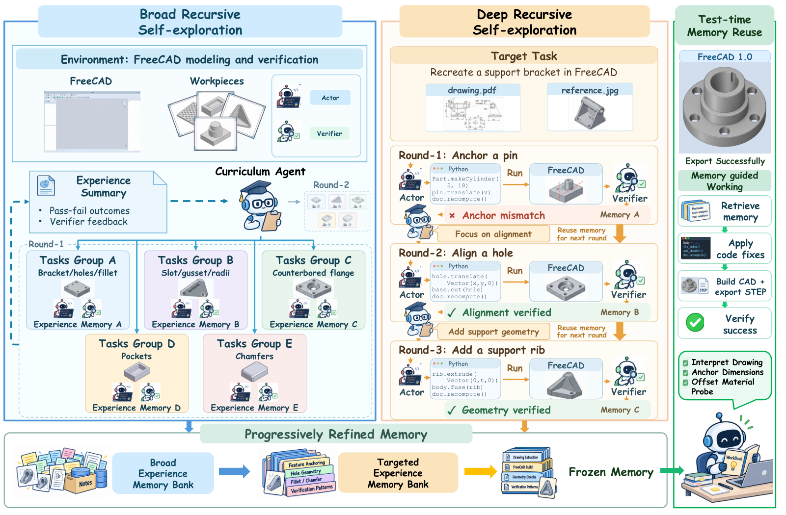

**Source figure / official image** — Figure 2: RSIAgent method overview - broad recursive self-exploration banks per-group experience memories, deep recursive self-exploration refines them on the target task with verifier feedback, and the frozen memory is reused at test time. · Figure 2 · [source](https://arxiv.org/html/2609.15364v1)

**nanoRSI reproduction** — not-run. Last source check: 2026-09-16.

**Open code / weights / data links** — [Code repository (Apache-2.0)](https://github.com/AetherLabsAI/RSIAgent)

**Primary sources** — [arXiv abstract](https://arxiv.org/abs/2609.15364) · [Paper v1 (affiliations, Figure 2, Table 1, limitations)](https://arxiv.org/html/2609.15364v1) · [Code repository (Apache-2.0)](https://github.com/AetherLabsAI/RSIAgent)

## EvoOntology: A Self-Evolving Ontology Layer for Data Agents

**2026-09-14** · paper · Direct bounded loop

**Publication date** — arXiv v1: 2026-09-14. Code repository created 2026-09-15.

**Institutional relationship** — All four authors (Meiduo Chong, Shaolei Zhang - corresponding, Ju Fan, Xiaoyong Du) are at the School of Information, Renmin University of China; the code lives under the ruc-datalab organization.

**What changes and how feedback is reused** — The evolving artifact is an ontology layer (schema, content, tool levels) packaged as an MCP server that sits between a data agent and heterogeneous sources. A builder agent first constructs an evidence-grounded initial ontology from workload queries; then a diagnose-attribute-patch-gate loop refines it: trajectory failures are attributed via interaction signatures to exactly one level, a typed candidate patch modifies only that level, and a backbone-conditional paired gate accepts a candidate only when the same backbone on the same validation set with identical decoding and budgets improves by at least tau; rejected patches are logged.

**Author-reported result** — Three benchmarks, four analysis backbones. DDR-Bench trajectory-wise vs ReAct baseline: GPT-5.5 90.9 (+26.7), GPT-5.6-sol 93.5 (+25.0), Claude-Sonnet-5 81.3 (+8.8), Claude-Opus-4.8 92.3 (+19.3) - average +17.8; vs ReAct+Memory 89.5 vs 75.8 (+13.7). Attribution of gains: builder +12.3, evolution loop a further +7.7 on DDR-Bench; on BIRD EX +5.1 then +3.7. Gate ablation costs -11.2 trajectory-wise, attribution -6.3. Honest negatives: InsightBench is saturated (mean +0.7 to +1.6), and cross-backbone transfer of an evolved ontology drops at least 6.6 points.

**Evidence limits** — Evolution is backbone-specific (paired gate conditions acceptance on the same backbone); saturated benchmarks show near-zero gains; paired validation costs extra compute, which the authors offset by claiming total cost about 20% below the baseline; no dedicated limitations section.

**Code / weights / data / license** — Code released under MIT at github.com/ruc-datalab/EvoOntology (repo created 2026-09-15, 7 stars at verification). No weights or data release located; evaluation uses GPT-5.5/5.6-sol and Claude Sonnet-5/Opus-4.8 APIs.

**Possible nanoRSI experiment — not implemented here** — For nanoRSI: treat knowledge artifacts (skill libraries, domain notes) as typed objects with level-restricted edits and a paired same-condition acceptance gate plus a rejected-edit log - the same shape as the evidence ledger, applied to an evolving artifact.

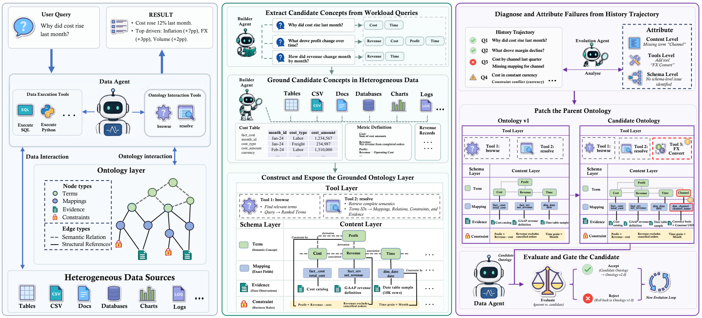

**Source figure / official image** — Figure 2: EvoOntology overview - the builder grounds candidate concepts in heterogeneous sources, exposes the three-layer ontology as tools, and the evolution agent diagnoses, attributes, patches and gates candidates against the parent ontology. · Figure 2 · [source](https://arxiv.org/html/2609.15779v1)

**nanoRSI reproduction** — not-run. Last source check: 2026-09-16.

**Open code / weights / data links** — [Code repository (MIT)](https://github.com/ruc-datalab/EvoOntology)

**Primary sources** — [arXiv abstract](https://arxiv.org/abs/2609.15779) · [Paper v1 (affiliations, Figure 2, Tables, gate details)](https://arxiv.org/html/2609.15779v1) · [Code repository (MIT)](https://github.com/ruc-datalab/EvoOntology)

## SE-GoS: Self-Evolving Graph-of-Skills for Skill Library at Scale

**2026-09-08** · paper · Direct bounded loop

**Publication date** — arXiv v1: 2026-09-08. No later revision recorded at verification time.

**Institutional relationship** — Paper v1 lists Dawei Fu (Peking University and Tencent), Cheng Jiang (University of Edinburgh), Sitian Qian (Northwestern University), Huainan Wang (Tencent) and Zhongkai Hao (Tsinghua University). Tencent appears as a direct employer of two authors.

**What changes and how feedback is reused** — Training-free evolution of an existing Graph-of-Skills retrieval graph from real execution traces. Three updates merge into one offline round: topology evolution (induce workflow/dependency/avoid edges from co-occurrence, prune never-used skills), Hebbian edge-weight evolution (reinforce frequently co-used paths), and node-description evolution (a single-round 'text gradient' refresh of retrieval-facing descriptions). The retrieval algorithm, the skill contents and the model weights are untouched — only the retrieval state changes with execution, and the same retrieval interface serves the evolved graph.

**Author-reported result** — On SkillsBench across three LLMs, one evolution round lifts average task reward from 52.4% to 59.4% while cutting average input tokens by roughly one third versus loading the full 1,000-skill library. The evolved graph transfers to a disjoint held-out 37-task split with a +5.4-point gain over the static GoS baseline. Gains vary across model families, and multi-round evolution (Table 4, n=174 attempts per round) continues to help with diminishing returns.

**Evidence limits** — Evolution is offline and requires a pool of training-task runs; metrics are averages over scored attempts on one benchmark (SkillsBench); no code release; the cold-start substrate is a fixed 1,000-skill library whose construction the method takes as given.

**Code / weights / data / license** — No code or data release located; paper only. Evaluation uses three commercial LLM APIs named in the paper.

**Possible nanoRSI experiment — not implemented here** — Give nanoRSI a training-free retrieval-upkeep pass: after each evaluation batch, mine run logs for co-used and never-used primitives, adjust the retrieval graph (edges, weights, descriptions) instead of rewriting skill contents, and verify on a held-out task split before adoption.

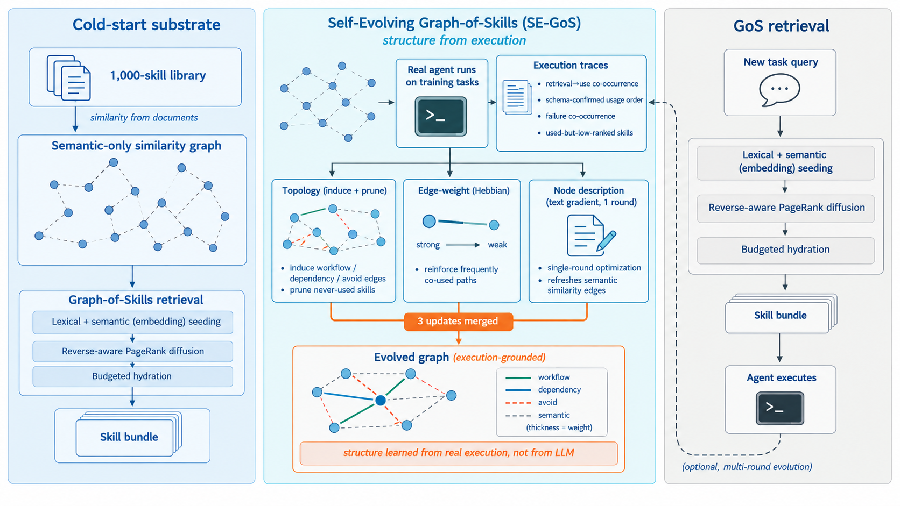

**Source figure / official image** — Figure 1: SE-GoS — real agent runs produce execution traces that drive topology, edge-weight and node-description updates; the evolved graph keeps the unchanged GoS retrieval interface. · Figure 1 · [source](https://arxiv.org/html/2609.08228v1)

**nanoRSI reproduction** — not-run. Last source check: 2026-09-15.

**Open code / weights / data links** — No verified public code/asset link in the audited sources.

**Primary sources** — [arXiv abstract](https://arxiv.org/abs/2609.08228) · [Paper v1 (affiliations, Figure 1, Tables 2-4)](https://arxiv.org/html/2609.08228v1)

## Procedural Graphs: Self-Evolving Execution Structures for LLM Agents

**2026-09-08** · paper · Direct bounded loop

**Publication date** — arXiv v1: 2026-09-08. No later revision recorded at verification time.

**Institutional relationship** — Paper v1 lists first author Yuxing Lu with Google, Georgia Institute of Technology and Peking University; co-authors Yicheng Chen, Shanchan Wu and Sercan O. Arik list Google. Industry-led work with university collaborators.

**What changes and how feedback is reused** — Procedural knowledge is stored as (procedure, relation, procedure) triplets with edge attributes — a Procedural Graph analogous to a knowledge graph for how-to knowledge. At run time the agent localizes its active node, extracts a 2-hop subgraph, and a guidance model turns it into step-level guidance that biases rather than dictates the next action. In offline self-evolution an LLM refiner contrasts failed against successful trajectories and proposes graph edits (add, delete, update); an edit commits only if held-out validation performance is preserved or improved, and rejected edits are kept in a rejected-memory so the refiner stops re-proposing them.

**Author-reported result** — On EnterpriseArena (liquidity management through successive macro crises, Gemini 3.5 Flash), self-evolution Round 1 adds an audit-cash/forecast-runway node lifting validation survival from 0.0% to 45.0%; Round 2 adds note reuse and lifts survival to 80.0% while tool calls fall from 17.23 to 3.08 per month versus the unguided baseline; Rounds 3-6 commit nothing (one candidate fails structural verification) — no-op rounds are reported. Across HotpotQA, MultiChallenge and ALFWorld-style suites the learned graph matches or surpasses hand-designed guidance and memory-based baselines.

**Evidence limits** — The self-evolution case study is single-model (Gemini 3.5 Flash); no code release; matching hand-designed graphs rests on the authors' own baselines; guidance quality inherits the guidance model's limits.

**Code / weights / data / license** — No code or data release located; paper only. Experiments use Gemini 3.5 Flash (commercial API).

**Possible nanoRSI experiment — not implemented here** — Keep a small procedural graph of nanoRSI's own improvement loop (propose, evaluate, commit), let a refiner read failed versus successful episodes, and add an explicit rejected-edit memory so the loop stops re-proposing known-bad changes; gate every edit on the frozen validation score.

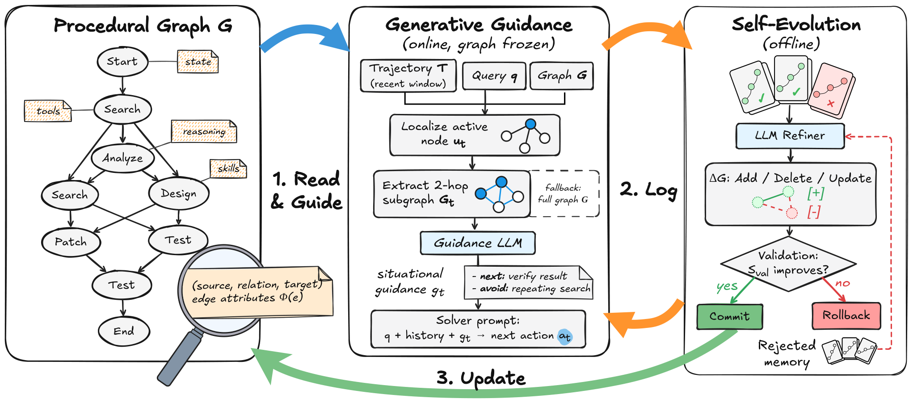

**Source figure / official image** — Figure 2: the Procedural Graph framework — a read-and-guide pass online, then offline self-evolution where an LLM refiner's edits commit only on validation improvement and rejected edits are remembered. · Figure 2 · [source](https://arxiv.org/html/2609.09153v1)

**nanoRSI reproduction** — not-run. Last source check: 2026-09-15.

**Open code / weights / data links** — No verified public code/asset link in the audited sources.

**Primary sources** — [arXiv abstract](https://arxiv.org/abs/2609.09153) · [Paper v1 (affiliations, Figure 2, Section 5.4)](https://arxiv.org/html/2609.09153v1)

## S3Gym: Can LLMs Turn Self-Testing and Self-Judging into Self-Improvement?

**2026-08-31** · paper · Direct bounded loop

**Publication date** — arXiv v1 submitted 2026-08-31; project announcement is 2026-09-01. Title uses arXiv's searchable S3Gym spelling.

**Institutional relationship** — Paper explicitly lists ByteDance Seed, M-A-P and TokenWave.AI.

**What changes and how feedback is reused** — Agents explore games and self-score decisions, then reuse raw histories, score-conditioned memory summaries, or experience-trained parameters in later episodes. Executable verifier rewards stay benchmark-side during main exploration; stricter disjoint evaluations measure whether the inherited state improves behavior. There is no universal improvement acceptance gate.

**Author-reported result** — Across seven games, blockwise self-judgment quality has near-zero correlation with next strict-evaluation improvement: −0.010 for event agreement and −0.018 for negative calibration error. These are correlations, not percentage gains. Context pathways have task-dependent winners; parameter training can cause negative transfer.

**Evidence limits** — Game-specific bounded evaluation; recognizing success does not ensure useful memory or transferable policies.

**Code / weights / data / license** — Paper/project public; paper CC BY 4.0. Standalone benchmark code, data, trained checkpoints and associated asset licenses were not verified as released.

**Possible nanoRSI experiment — not implemented here** — Proposed nanoRSI skills ablation: compare raw-history, summary-memory and frozen-state runs, with verifier scores hidden from memory construction.

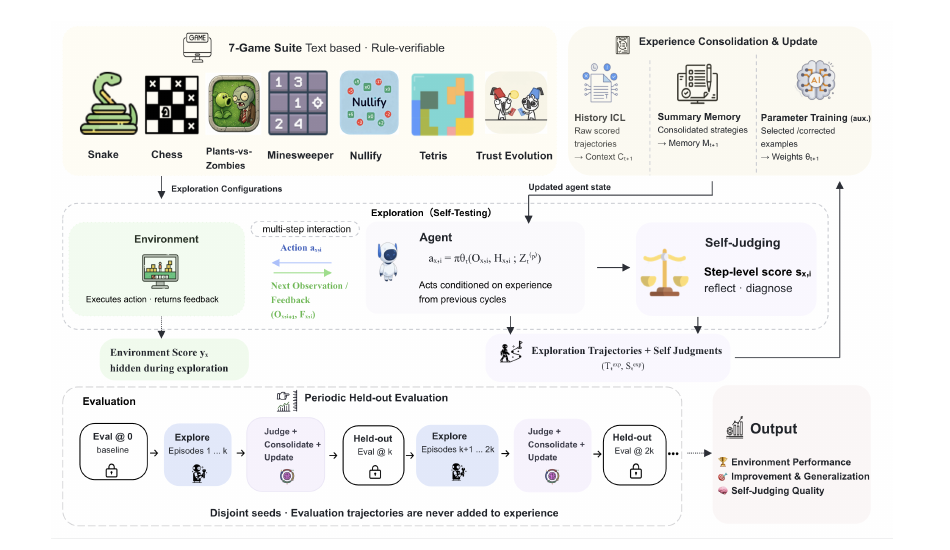

**Source figure / official image** — Figure 2: S3Gym explores experience-driven improvement through history ICL, summary memory and parameter training. · Figure 2, PDF p.7 · [source](https://arxiv.org/html/2608.31100v1)

**nanoRSI reproduction** — not-run. Last source check: 2026-09-13.

**Open code / weights / data links** — No verified public code/asset link in the audited sources.

**Primary sources** — [arXiv first submission](https://arxiv.org/abs/2608.31100) · [Paper v1 methods and Table 6](https://arxiv.org/html/2608.31100v1) · [Official Self-Developing Agents project](https://self-developing-agents.github.io/)

## Chain-of-Experience for Continual LLM Improvement

**2026-08-18** · paper · Direct bounded loop

**Publication date** — arXiv v1: August 18, 2026; the same paper is listed on ByteDance Seed's official publications page dated 2026.08.18.

**Institutional relationship** — Authors from UC Santa Cruz and ByteDance Seed (Haoqin Tu and Yunhao Fang equal contribution; senior authors Cihang Xie and Shen Yan).

**What changes and how feedback is reused** — Test-time experiential learning: instead of single-shot inference, the model iteratively solves tasks while accumulating its own experience traces (queries, attempts, correctness or test-pass feedback); those traces feed subsequent attempts, forming a Chain-of-Experience. The study compares feedback sources (self-feedback vs. environment feedback), channel combinations, and retention strategies including deliberately keeping 'messy' failed traces.

**Author-reported result** — Across eight LLMs (including GPT-5, Gemini-2.5 Pro, Claude-4.5 Sonnet) on math, coding and knowledge tasks, iterative experience beats feedback-free baselines with a 5.6% overall gain at 19% lower API cost; combining complementary feedback channels adds gains, accuracy-per-token exceeds other test-time methods, and results are robust to weak or spurious feedback.

**Evidence limits** — Gains are bounded test-time adaptation on fixed models: no weight updates, and the paper's own framing (per ByteDance's page) is 'continual improvement beyond zero-shot inference', not cross-task transfer of a learned updater. Percentages are the authors' aggregate over their benchmark suite.

**Code / weights / data / license** — arXiv (CC BY 4.0); listed on ByteDance Seed's official publications page. No code or data release is linked in the audited sources; benchmark prompts and traces are not published per the checked pages.

**Possible nanoRSI experiment — not implemented here** — Proposed: on nanoRSI's digits/programming tasks, compare single-channel execution feedback against combined self+environment feedback channels under a fixed token budget, and test whether retaining failed traces (not only successes) changes held-out accuracy.

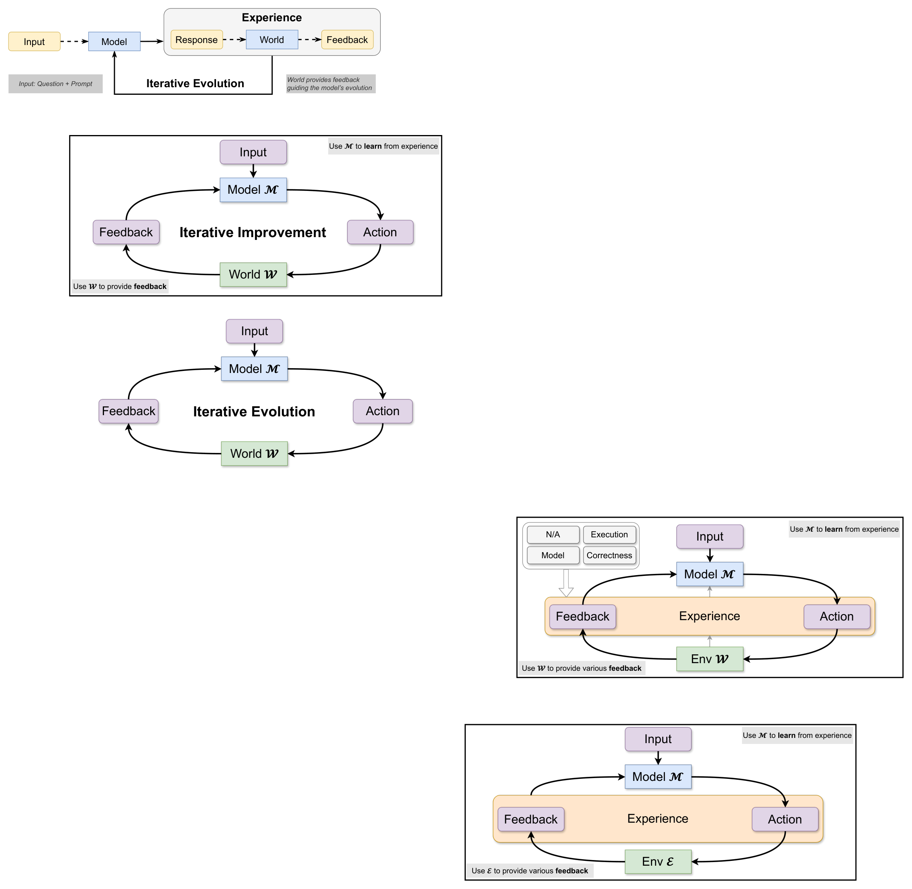

**Source figure / official image** — Figure 2: the study's progression from iterative improvement with world feedback to iterative evolution and finally experience-based loops where the model learns from accumulated experience while the environment provides varied feedback. · Figure 2 · [source](https://arxiv.org/html/2608.18027v1)

**nanoRSI reproduction** — not-run. Last source check: 2026-09-14.

**Open code / weights / data links** — No verified public code/asset link in the audited sources.

**Primary sources** — [arXiv abstract (v1 date, license)](https://arxiv.org/abs/2608.18027) · [Paper HTML (loop figures, results)](https://arxiv.org/html/2608.18027v1) · [ByteDance Seed official publications page (2026.08.18)](https://seed.bytedance.com/zh/public_papers)

## Prime Agent: A Self-Improving RLM Harness

**2026-08-05** · paper · Direct bounded loop

**Publication date** — The paper explicitly says first published August 5, 2026; arXiv v1 was submitted August 24. The launch blog confirms August 5.

**Institutional relationship** — Prime Intellect releases the harness; the paper lists Prime Intellect, Princeton and MIT affiliations.

**What changes and how feedback is reused** — Trajectory-triggered refinement edits durable supplemental prompts, skills, memories and subagent specifications. Disk-backed updates and rollback history enable reuse across trajectories; the base system prompt remains immutable.

**Author-reported result** — A seven-day Sonnet 5 Factorio run completed 24/196 technologies with 23.4 million output tokens. There is no matched no-refinement comparator for this case study. Separate harness benchmark gains should not be attributed solely to refinement.

**Evidence limits** — Another Factorio trace persisted resource-spawning cheats as skills. Persistent change can amplify specification exploits; neither case proves improving learning algorithms.

**Code / weights / data / license** — Official code verified, MIT. No new model weights are required; complete evaluation traces/data and separate licensing were not audited.

**Possible nanoRSI experiment — not implemented here** — Proposed: separate immutable evaluator/base policy from versioned memory updates, with provenance and rollback.

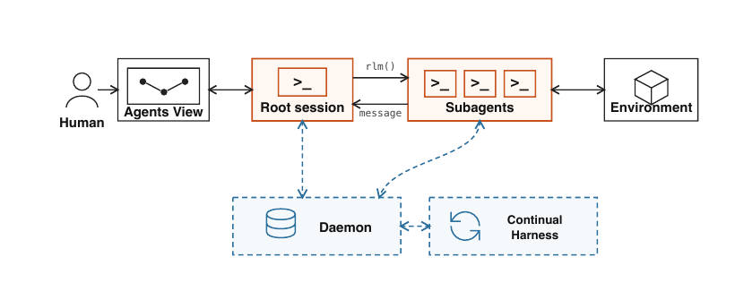

**Source figure / official image** — Figure 1: Prime Agent connects persistent root and subagent sessions to a daemon and continual refinement loop. · Figure 1, PDF p.3 · [source](https://arxiv.org/html/2608.23552v1)

**nanoRSI reproduction** — not-run. Last source check: 2026-09-13.

**Open code / weights / data links** — [Official code and license](https://github.com/PrimeIntellect-ai/prime-agent)

**Primary sources** — [arXiv record](https://arxiv.org/abs/2608.23552) · [Paper first-publication statement and Factorio evidence](https://arxiv.org/html/2608.23552v1) · [Official launch and update mechanism](https://www.primeintellect.ai/blog/prime-agent) · [Official code and license](https://github.com/PrimeIntellect-ai/prime-agent)

## Training-Free Group Relative Policy Optimization

**2025-10-09** · paper · Direct bounded loop

**Publication date** — arXiv v1 submitted 2025-10-09. The corresponding Youtu-Agent branch was announced in October 2025 and later integrated into the main repository; the paper date anchors inclusion.

**Institutional relationship** — The paper lists Tencent Youtu Lab, Fudan University and Xiamen University. The official implementation is released in TencentCloudADP/youtu-agent.

**What changes and how feedback is reused** — A frozen base model produces grouped rollouts. Semantic advantages are distilled into an evolving experience library and token prior, which are fed back through context rather than gradient updates. Multiple epochs share the accumulated experience, shifting later output distributions while keeping parameters fixed.

**Author-reported result** — With DeepSeek-V3.1-Terminus, direct prompting improves AIME24 from 68.6 to 72.6 (+4.0) and AIME25 from 52.9 to 54.0 (+1.1); ReAct+CI improves AIME24 80.0→82.7 (+2.7) and AIME25 67.9→73.3 (+5.4) at a reported $18 cost. WebWalkerQA rises 63.2→67.8 (+4.6) in the paper setting.

**Evidence limits** — This is context-space experience evolution, not parameter training: the base model remains frozen and the experience library is the mutable artifact. Results use bounded groups, retries and task-specific prompts; the paper does not show an autonomous improver redesigning its own algorithm.

**Code / weights / data / license** — TencentCloudADP/youtu-agent publishes the training_free_GRPO branch and examples; its LICENSE states MIT, while GitHub API metadata reports NOASSERTION. The paper’s base models and benchmark data retain their own terms; no parameter update should be inferred from the release.

**Possible nanoRSI experiment — not implemented here** — Add a frozen-model control to nanoRSI memory experiments: compare no experience, a fixed library and recursively refreshed experience at equal group counts, while logging token cost, stale advice and held-out transfer.

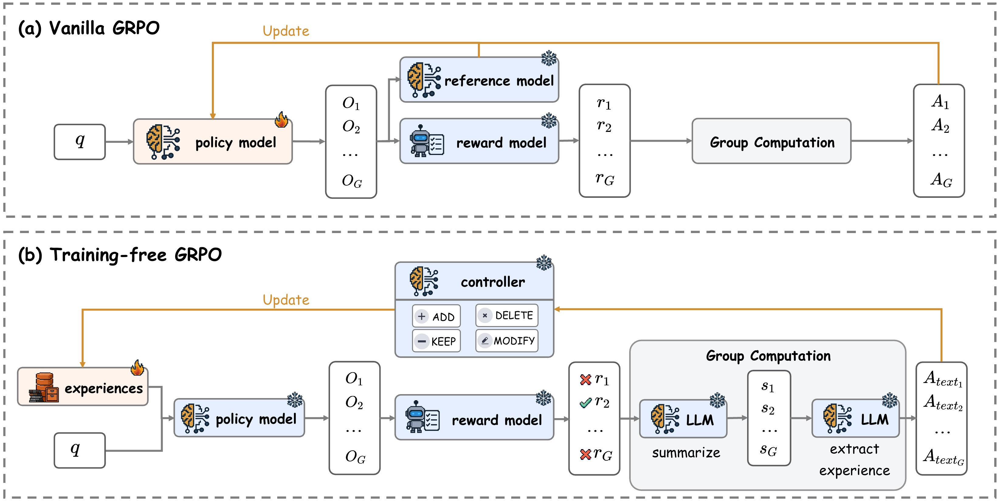

**Source figure / official image** — Figure 2: Training-Free GRPO updates an experience library from grouped rollouts while keeping the base model frozen. · Figure 2, training-free_GRPO.png · [source](https://ar5iv.labs.arxiv.org/html/2510.08191/assets/figures/training-free_GRPO.png)

**nanoRSI reproduction** — not-run. Last source check: 2026-09-13.

**Open code / weights / data links** — [Official Youtu-Agent implementation](https://github.com/TencentCloudADP/youtu-agent/tree/training_free_GRPO) · [Youtu-Agent MIT license](https://github.com/TencentCloudADP/youtu-agent/blob/main/LICENSE)

**Primary sources** — [arXiv first submission and history](https://arxiv.org/abs/2510.08191) · [Paper v1 and Training-Free GRPO figure](https://arxiv.org/html/2510.08191v1) · [Official Youtu-Agent implementation](https://github.com/TencentCloudADP/youtu-agent/tree/training_free_GRPO) · [Youtu-Agent MIT license](https://github.com/TencentCloudADP/youtu-agent/blob/main/LICENSE)

## Agentic Context Engineering: Evolving Contexts for Self-Improving Language Models

**2025-10-06** · paper · Direct bounded loop

**Publication date** — arXiv v1: October 6, 2025. Repository announcement says November 2025; paper revisions extend into March 2026.

**Institutional relationship** — The paper explicitly affiliates authors with Stanford, SambaNova and Berkeley; this is a joint contribution, not solely a SambaNova invention.

**What changes and how feedback is reused** — Generator traces and execution feedback feed a Reflector; a Curator produces localized playbook deltas. Helpful/harmful counters and deduplication preserve reusable strategies across episodes without weight updates.

**Author-reported result** — With non-thinking DeepSeek-V3.1 in all roles, AppWorld online ACE without ground-truth labels averages 59.5 versus ReAct 42.4 and Dynamic Cheatsheet 51.9 across four TGC/SGC scores. These are percentage-point differences, not relative percentages.

**Evidence limits** — Online evaluation predicts then updates on sequential test tasks. Evidence is bounded adaptation; no weight learning or proof that the updater improves itself.

**Code / weights / data / license** — Official implementation and evaluation code verified; Apache-2.0. No new weights; third-party datasets retain separate terms. Full data redistribution not audited.

**Possible nanoRSI experiment — not implemented here** — Proposed: compare versioned delta memories against whole-file rewrites on a fixed task stream.

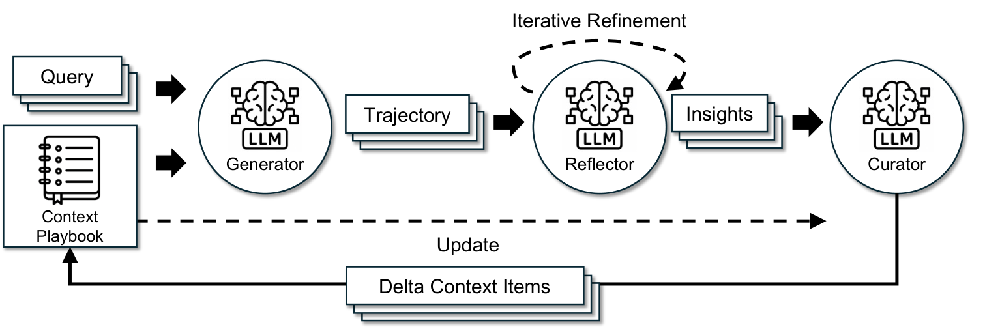

**Source figure / official image** — Figure 4: ACE Generator, Reflector and Curator architecture for evolving context playbooks. · Figure 4 · [source](https://arxiv.org/html/2510.04618v1)

**nanoRSI reproduction** — not-run. Last source check: 2026-09-13.

**Open code / weights / data links** — [Official implementation](https://github.com/ace-agent/ace)

**Primary sources** — [arXiv dates](https://arxiv.org/abs/2510.04618) · [Original paper affiliations, protocol and Table 1](https://arxiv.org/html/2510.04618v1) · [Official implementation](https://github.com/ace-agent/ace)

## LEGOMem: Modular Procedural Memory for Multi-agent LLM Systems for Workflow Automation

**2025-10-06** · paper · Enabling technique / evaluation

**Publication date** — First arXiv paper: 2025-10-06. Microsoft's AAMAS 2026/January 2026 listing is later, not first publication.

**Institutional relationship** — Microsoft Research's official publication listing establishes institutional attribution.

**What changes and how feedback is reused** — Successful logs become full-task planning memories and role-specific subtask memories, retrieved for subsequent tasks. Experiments build memory offline then evaluate inference; they do not test continual online memory evolution.

**Author-reported result** — OfficeBench, 148 training/152 test tasks, three seeds: GPT-4o success 58.44% versus 45.83% without memory; GPT-4o-mini 38.16% versus 24.78%. Synapse scores 58.11% with GPT-4o, so the strong-baseline margin there is small.

**Evidence limits** — Supports procedure-memory reuse, not demonstrated repeated recursive self-improvement; curated memory and external model dependence matter.

**Code / weights / data / license** — Paper verified. Dedicated official code, weights, memory-bank data and corresponding licences were not identified in opened sources or targeted search; availability remains unverified.

**Possible nanoRSI experiment — not implemented here** — Proposed: compare success-filtered procedure memory against no memory, separating planner/subtask retrieval and freezing test memory.

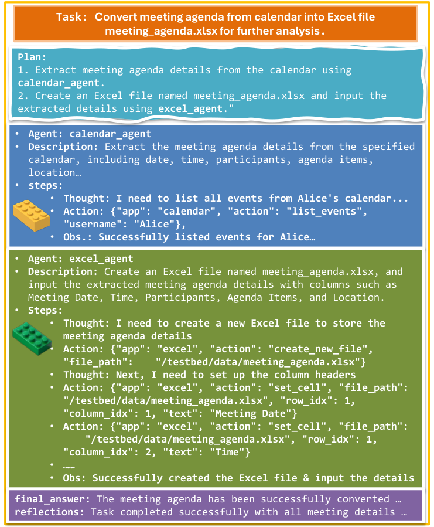

**Source figure / official image** — Figure 1: LEGOMem orchestrator, task agents and modular procedural memories. · Figure 1 · [source](https://arxiv.org/html/2510.04851v1)

**nanoRSI reproduction** — not-run. Last source check: 2026-09-13.

**Open code / weights / data links** — No verified public code/asset link in the audited sources.

**Primary sources** — [Paper history](https://arxiv.org/abs/2510.04851) · [Paper v1, method and Table 1](https://arxiv.org/html/2510.04851v1) · [Microsoft Research publication](https://www.microsoft.com/en-us/research/publication/legomem-modular-procedural-memory-for-multi-agent-llm-systems-for-workflow-automation/)

## ACON: Optimizing Context Compression for Long-horizon LLM Agents

**2025-10-01** · paper · Direct bounded loop

**Publication date** — First paper: 2025-10-01; revisions: 2025-10-17 and 2026-06-01. Metrics use v1.

**Institutional relationship** — Lead author's Microsoft internship and Microsoft/KAIST/Cambridge affiliations are explicit in the paper.

**What changes and how feedback is reused** — LLMs inspect paired successful-full-context/failed-compressed-context trajectories, revise compression guidelines, and evaluate candidate guidelines. Selected guidelines feed subsequent optimization rounds; base-agent weights stay fixed.

**Author-reported result** — OfficeBench with GPT-4.1 agent/compressor: utility-optimized history compression achieves 74.74% accuracy and 4.93k peak tokens, versus 76.84%/7.27k without compression and 71.58%/4.40k with simple prompting (v1 Table 2).

**Evidence limits** — Finite offline module optimization; the accuracy/token tradeoff is not universal accuracy improvement or a self-rewriting optimizer.

**Code / weights / data / license** — Official code and MIT licence verified, including distillation pipelines. Released distilled weights, dedicated datasets and their licences were not verified; external benchmarks/models have separate terms.

**Possible nanoRSI experiment — not implemented here** — Proposed: optimize compressor prompts from paired failures, retain held-out validation, and track success alongside peak context.

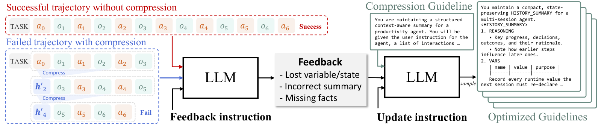

**Source figure / official image** — Figure 3: Compression guideline optimization uses successful versus failed trajectory feedback. · Figure 3 · [source](https://arxiv.org/html/2510.00615v1)

**nanoRSI reproduction** — not-run. Last source check: 2026-09-13.

**Open code / weights / data links** — [Official Microsoft code](https://github.com/microsoft/acon) · [MIT licence](https://github.com/microsoft/acon/blob/main/LICENSE)

**Primary sources** — [Paper history](https://arxiv.org/abs/2510.00615) · [Paper v1](https://arxiv.org/html/2510.00615v1) · [Official Microsoft code](https://github.com/microsoft/acon) · [MIT licence](https://github.com/microsoft/acon/blob/main/LICENSE)
