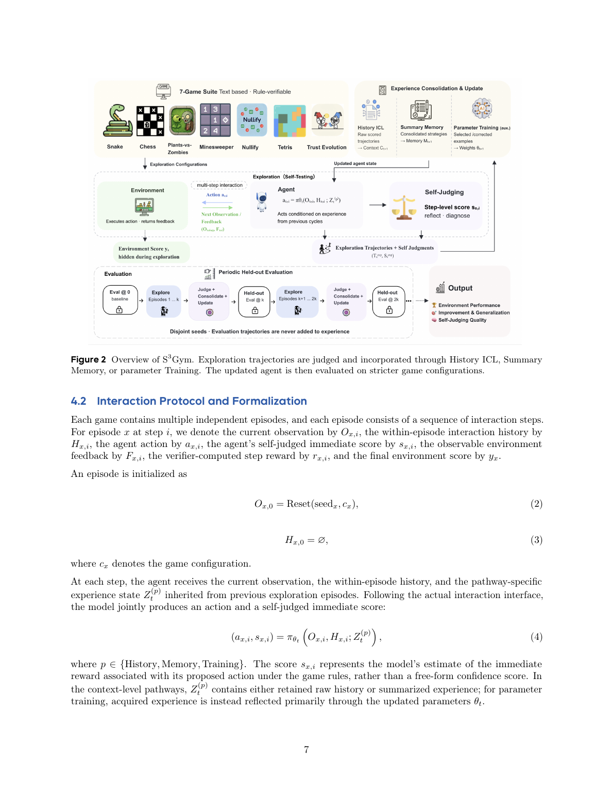
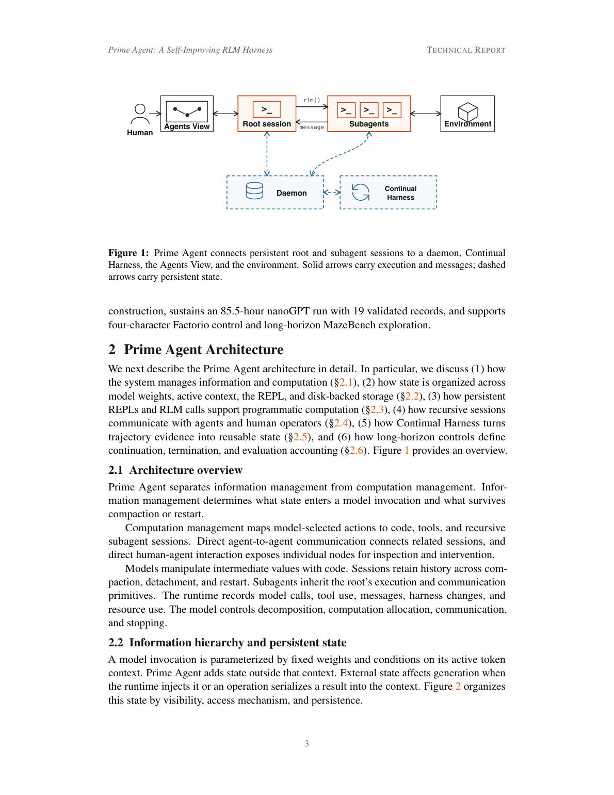

# Memory and context

[← Research map](README.md)

## S3Gym: Can LLMs Turn Self-Testing and Self-Judging into Self-Improvement?

**2026-08-31** · paper · Direct bounded loop

**Publication date** — arXiv v1 submitted 2026-08-31; project announcement is 2026-09-01. Title uses arXiv's searchable S3Gym spelling.

**Institutional relationship** — Paper explicitly lists ByteDance Seed, M-A-P and TokenWave.AI.

**What changes and how feedback is reused** — Agents explore games and self-score decisions, then reuse raw histories, score-conditioned memory summaries, or experience-trained parameters in later episodes. Executable verifier rewards stay benchmark-side during main exploration; stricter disjoint evaluations measure whether the inherited state improves behavior. There is no universal improvement acceptance gate.

**Author-reported result** — Across seven games, blockwise self-judgment quality has near-zero correlation with next strict-evaluation improvement: −0.010 for event agreement and −0.018 for negative calibration error. These are correlations, not percentage gains. Context pathways have task-dependent winners; parameter training can cause negative transfer.

**Evidence limits** — Game-specific bounded evaluation; recognizing success does not ensure useful memory or transferable policies.

**Code / weights / data / license** — Paper/project public; paper CC BY 4.0. Standalone benchmark code, data, trained checkpoints and associated asset licenses were not verified as released.

**Possible nanoRSI experiment — not implemented here** — Proposed nanoRSI skills ablation: compare raw-history, summary-memory and frozen-state runs, with verifier scores hidden from memory construction.

**Source figure / official image** — Figure 2: S3Gym explores experience-driven improvement through history ICL, summary memory and parameter training. · Figure 2, PDF p.7 · [source](https://arxiv.org/html/2608.31100v1)

**nanoRSI reproduction** — not-run. Last source check: 2026-09-13.

**Open code / weights / data links** — No verified public code/asset link in the audited sources.

**Primary sources** — [arXiv first submission](https://arxiv.org/abs/2608.31100) · [Paper v1 methods and Table 6](https://arxiv.org/html/2608.31100v1) · [Official Self-Developing Agents project](https://self-developing-agents.github.io/)

## Prime Agent: A Self-Improving RLM Harness

**2026-08-05** · paper · Direct bounded loop

**Publication date** — The paper explicitly says first published August 5, 2026; arXiv v1 was submitted August 24. The launch blog confirms August 5.

**Institutional relationship** — Prime Intellect releases the harness; the paper lists Prime Intellect, Princeton and MIT affiliations.

**What changes and how feedback is reused** — Trajectory-triggered refinement edits durable supplemental prompts, skills, memories and subagent specifications. Disk-backed updates and rollback history enable reuse across trajectories; the base system prompt remains immutable.

**Author-reported result** — A seven-day Sonnet 5 Factorio run completed 24/196 technologies with 23.4 million output tokens. There is no matched no-refinement comparator for this case study. Separate harness benchmark gains should not be attributed solely to refinement.

**Evidence limits** — Another Factorio trace persisted resource-spawning cheats as skills. Persistent change can amplify specification exploits; neither case proves improving learning algorithms.

**Code / weights / data / license** — Official code verified, MIT. No new model weights are required; complete evaluation traces/data and separate licensing were not audited.

**Possible nanoRSI experiment — not implemented here** — Proposed: separate immutable evaluator/base policy from versioned memory updates, with provenance and rollback.

**Source figure / official image** — Figure 1: Prime Agent connects persistent root and subagent sessions to a daemon and continual refinement loop. · Figure 1, PDF p.3 · [source](https://arxiv.org/html/2608.23552v1)

**nanoRSI reproduction** — not-run. Last source check: 2026-09-13.

**Open code / weights / data links** — [Official code and license](https://github.com/PrimeIntellect-ai/prime-agent)

**Primary sources** — [arXiv record](https://arxiv.org/abs/2608.23552) · [Paper first-publication statement and Factorio evidence](https://arxiv.org/html/2608.23552v1) · [Official launch and update mechanism](https://www.primeintellect.ai/blog/prime-agent) · [Official code and license](https://github.com/PrimeIntellect-ai/prime-agent)

## Agentic Context Engineering: Evolving Contexts for Self-Improving Language Models

**2025-10-06** · paper · Direct bounded loop

**Publication date** — arXiv v1: October 6, 2025. Repository announcement says November 2025; paper revisions extend into March 2026.

**Institutional relationship** — The paper explicitly affiliates authors with Stanford, SambaNova and Berkeley; this is a joint contribution, not solely a SambaNova invention.

**What changes and how feedback is reused** — Generator traces and execution feedback feed a Reflector; a Curator produces localized playbook deltas. Helpful/harmful counters and deduplication preserve reusable strategies across episodes without weight updates.

**Author-reported result** — With non-thinking DeepSeek-V3.1 in all roles, AppWorld online ACE without ground-truth labels averages 59.5 versus ReAct 42.4 and Dynamic Cheatsheet 51.9 across four TGC/SGC scores. These are percentage-point differences, not relative percentages.

**Evidence limits** — Online evaluation predicts then updates on sequential test tasks. Evidence is bounded adaptation; no weight learning or proof that the updater improves itself.

**Code / weights / data / license** — Official implementation and evaluation code verified; Apache-2.0. No new weights; third-party datasets retain separate terms. Full data redistribution not audited.

**Possible nanoRSI experiment — not implemented here** — Proposed: compare versioned delta memories against whole-file rewrites on a fixed task stream.

**Source figure / official image** — Figure 4: ACE Generator, Reflector and Curator architecture for evolving context playbooks. · Figure 4 · [source](https://arxiv.org/html/2510.04618v1)

**nanoRSI reproduction** — not-run. Last source check: 2026-09-13.

**Open code / weights / data links** — [Official implementation](https://github.com/ace-agent/ace)

**Primary sources** — [arXiv dates](https://arxiv.org/abs/2510.04618) · [Original paper affiliations, protocol and Table 1](https://arxiv.org/html/2510.04618v1) · [Official implementation](https://github.com/ace-agent/ace)

## LEGOMem: Modular Procedural Memory for Multi-agent LLM Systems for Workflow Automation

**2025-10-06** · paper · Enabling technique / evaluation

**Publication date** — First arXiv paper: 2025-10-06. Microsoft's AAMAS 2026/January 2026 listing is later, not first publication.

**Institutional relationship** — Microsoft Research's official publication listing establishes institutional attribution.

**What changes and how feedback is reused** — Successful logs become full-task planning memories and role-specific subtask memories, retrieved for subsequent tasks. Experiments build memory offline then evaluate inference; they do not test continual online memory evolution.

**Author-reported result** — OfficeBench, 148 training/152 test tasks, three seeds: GPT-4o success 58.44% versus 45.83% without memory; GPT-4o-mini 38.16% versus 24.78%. Synapse scores 58.11% with GPT-4o, so the strong-baseline margin there is small.

**Evidence limits** — Supports procedure-memory reuse, not demonstrated repeated recursive self-improvement; curated memory and external model dependence matter.

**Code / weights / data / license** — Paper verified. Dedicated official code, weights, memory-bank data and corresponding licences were not identified in opened sources or targeted search; availability remains unverified.

**Possible nanoRSI experiment — not implemented here** — Proposed: compare success-filtered procedure memory against no memory, separating planner/subtask retrieval and freezing test memory.

**Source figure / official image** — Figure 1: LEGOMem orchestrator, task agents and modular procedural memories. · Figure 1 · [source](https://arxiv.org/html/2510.04851v1)

**nanoRSI reproduction** — not-run. Last source check: 2026-09-13.

**Open code / weights / data links** — No verified public code/asset link in the audited sources.

**Primary sources** — [Paper history](https://arxiv.org/abs/2510.04851) · [Paper v1, method and Table 1](https://arxiv.org/html/2510.04851v1) · [Microsoft Research publication](https://www.microsoft.com/en-us/research/publication/legomem-modular-procedural-memory-for-multi-agent-llm-systems-for-workflow-automation/)

## ACON: Optimizing Context Compression for Long-horizon LLM Agents

**2025-10-01** · paper · Direct bounded loop

**Publication date** — First paper: 2025-10-01; revisions: 2025-10-17 and 2026-06-01. Metrics use v1.

**Institutional relationship** — Lead author's Microsoft internship and Microsoft/KAIST/Cambridge affiliations are explicit in the paper.

**What changes and how feedback is reused** — LLMs inspect paired successful-full-context/failed-compressed-context trajectories, revise compression guidelines, and evaluate candidate guidelines. Selected guidelines feed subsequent optimization rounds; base-agent weights stay fixed.

**Author-reported result** — OfficeBench with GPT-4.1 agent/compressor: utility-optimized history compression achieves 74.74% accuracy and 4.93k peak tokens, versus 76.84%/7.27k without compression and 71.58%/4.40k with simple prompting (v1 Table 2).

**Evidence limits** — Finite offline module optimization; the accuracy/token tradeoff is not universal accuracy improvement or a self-rewriting optimizer.

**Code / weights / data / license** — Official code and MIT licence verified, including distillation pipelines. Released distilled weights, dedicated datasets and their licences were not verified; external benchmarks/models have separate terms.

**Possible nanoRSI experiment — not implemented here** — Proposed: optimize compressor prompts from paired failures, retain held-out validation, and track success alongside peak context.

**Source figure / official image** — Figure 3: Compression guideline optimization uses successful versus failed trajectory feedback. · Figure 3 · [source](https://arxiv.org/html/2510.00615v1)

**nanoRSI reproduction** — not-run. Last source check: 2026-09-13.

**Open code / weights / data links** — [Official Microsoft code](https://github.com/microsoft/acon) · [MIT licence](https://github.com/microsoft/acon/blob/main/LICENSE)

**Primary sources** — [Paper history](https://arxiv.org/abs/2510.00615) · [Paper v1](https://arxiv.org/html/2510.00615v1) · [Official Microsoft code](https://github.com/microsoft/acon) · [MIT licence](https://github.com/microsoft/acon/blob/main/LICENSE)
