# Parameters and training data

[← Research map](README.md)

## Mechanism families

| Family | Records |
| --- | ---: |
| [Self-play & curriculum task generation](#family-self-play-curriculum) | 11 |
| [Verifier- and reward-centric loops](#family-verifier-reward) | 5 |
| [Skill-weight co-evolution](#family-skill-weight-coevolution) | 2 |
| [Experience distillation & test-time adaptation](#family-experience-distillation) | 4 |
| [Autonomous training agents & data pipelines](#family-autonomous-training) | 4 |
| [Enabling adaptation mechanisms](#family-enabling-adaptation) | 5 |

## Self-play & curriculum task generation (11)

### SPADE: Self-Play in Adaptive Synthetic Executable Environments

**2026-08-19** · paper · Direct bounded loop

**Publication date** — arXiv v1: 2026-08-19 (2608.19197); v2 2026-08-24; v3 2026-08-31. Numbers cited from v1, re-checked on the abs page.

**Institutional relationship** — Paper: a nine-institution collaboration led from University of Washington (Bo Liu, Natasha Jaques corresponding) with Stanford, Northeastern, CMU, MIT, NUS, SNU, Stevens and UChicago.

**What changes and how feedback is reused** — One LLM plays two roles. The Environment Designer writes complete MDPs as executable Python (Gym-style reset/step) grounded in sampled pretraining-corpus documents plus a memory of past environments with regret scores and skill tags, and emits a privileged hint; the Reasoning Agent plays each environment with and without the hint, and the designer's reward is hint-based regret (the return gap, floored at zero) blended with a flat-top difficulty anchor on win-rate band [0.4, 0.6]. GRPO with per-role advantage normalization, delayed designer updates and asymmetric clipping co-evolves the environment distribution with the agent's frontier.

**Author-reported result** — Qwen3-30B-A3B games suite average: SPADE 58.3 vs base 50.2 (+8.1), fixed-environment RLVE 53.0 and GRPO 51.4 (+5.3 over the strongest fixed-env baseline); tool-use average +7.7 (ACEBench-Agent 75.9 vs 62.0). Ablations: without memory 53.2, without corpus grounding 53.5, without designer training 40.5 (below base). Corpus grounding lifts environment diversity Vendi/nn from 0.04 to 0.68 and cuts physics formula-reveal rate from 25% to 5%.

**Evidence limits** — The authors' own framing: complexity is bounded by model scale (the 'invisible leash'); the optimizer is human-designed GRPO (SPADE does not modify its own learning rule); no formal optimality for the regret curriculum; evaluation on fixed benchmarks rather than open-ended growth.

**Code / weights / data / license** — Code at github.com/spade-rl/spade (MIT, 102 stars at verification); project page spade-rl.github.io; HF checkpoints and environment corpora released.

**Possible nanoRSI experiment — not implemented here** — For nanoRSI: reward the task/environment generator by hint-based regret (how much the hint helps) rather than raw difficulty, and ground generated environments in retrieved corpus documents to keep diversity from collapsing.

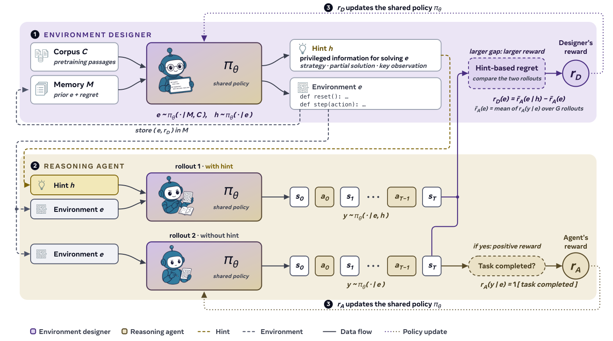

**Source figure / official image** — Figure 4: SPADE - the Environment Designer conditions on memory and corpus to emit an executable environment plus privileged hint; the agent plays with and without the hint, and the return gap is the designer's hint-based regret. · Figure 4 · [source](https://arxiv.org/html/2608.19197v1)

**nanoRSI reproduction** — not-run. Last source check: 2026-09-17.

**Open code / weights / data links** — [Code repository (MIT)](https://github.com/spade-rl/spade)

**Primary sources** — [arXiv abstract](https://arxiv.org/abs/2608.19197) · [Paper v1 (affiliations, Figure 4, tables)](https://arxiv.org/html/2608.19197v1) · [Code repository (MIT)](https://github.com/spade-rl/spade)

### Self-Play Meets Skill Evolution: Self-Evolving Search Agents that Pose, Solve, and Remember

**2026-07-31** · paper · Direct bounded loop

**Publication date** — arXiv v1: 2026-07-31. No later revision recorded at verification time.

**Institutional relationship** — Paper v1: UCAS + Institute of Automation CAS + Peking University + Mininglamp Technology + Tsinghua University + Qilu University of Technology (Shandong Computer Science Center); corresponding authors Guannan He and Changwei Wang.

**What changes and how feedback is reused** — Asymmetric self-play couples three evolving objects: a Challenger poses verifiable search questions from a 50K answer pool; only the solver can retrieve from a skill bank (memory hidden from the challenger to prevent strategy leakage); informative frontier failures are distilled into skills (trigger, avoidance cues, query templates) with cosine deduplication and eviction on net-negative helpfulness. Skills enter on-policy rollouts, reshaping the trajectory distribution for the policy gradient so gains are internalized in solver weights; the strengthened solver shifts the challenger's frontier-shaped difficulty reward, whose new failures rewrite memory - a closed flywheel that commits bank updates only at step boundaries.

**Author-reported result** — Across seven QA benchmarks (3,125 held-out questions): +1.2 to +3.2 average accuracy over SSP across six backbones (e.g., Qwen3-8B 47.5 avg with +7.0 over base); beats SkillRL-Search-7B 51.0 vs 50.1 under a unified protocol; memory-free deployment (SESA-Off) retains +1.8 to +2.2 and re-enabling the bank adds +0.5 to +1.0. Ablations: without failure distillation -2.7.

**Evidence limits** — Gains are not per-benchmark uniform (below SSP on 2Wiki for Qwen3-4B, on Bamboogle for Qwen3-8B); retrieval can distract the solver; coupled-evolution evidence is correlational; solver-only memory access is a design constraint, not ablated.

**Code / weights / data / license** — Code listed at github.com/Zenghuang-Fu/SESA-Self-Evolving-Agents (URL from the paper; repository did not resolve via the GitHub API at verification time). Paper CC BY 4.0.

**Possible nanoRSI experiment — not implemented here** — For nanoRSI: hide evolving memory from the task generator (asymmetric access) so generated tasks cannot exploit memorized answers, and internalize skill gains into weights before declaring recursion.

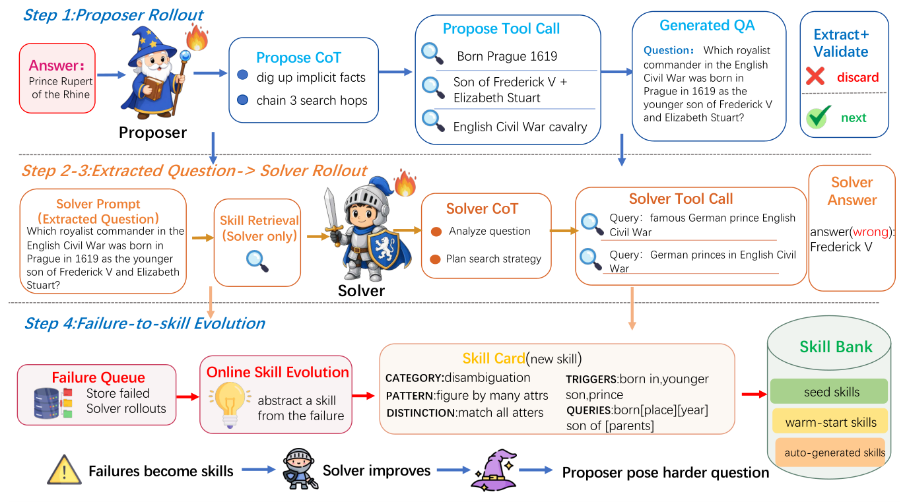

**Source figure / official image** — Figure 2: SESA training loop - memory priming seeds a retrievable skill bank; asymmetric self-play lets the challenger pose search tasks while only the solver retrieves skills; frontier shaping and failure distillation close the flywheel. · Figure 2 · [source](https://arxiv.org/html/2607.29468v1)

**nanoRSI reproduction** — not-run. Last source check: 2026-09-16.

**Open code / weights / data links** — No verified public code/asset link in the audited sources.

**Primary sources** — [arXiv abstract](https://arxiv.org/abs/2607.29468) · [Paper v1 (affiliations, Figure 2, tables)](https://arxiv.org/html/2607.29468v1)

### From RLVR to RLSVR: Task Transformation Induces Self-Verifiable Rewards for Open-Ended LLM Self-Improvement

**2026-07-26** · paper · Direct bounded loop

**Publication date** — arXiv v1: 2026-07-26; v2: 2026-07-31 (numbers cited from v2). Accepted at COLM 2026.

**Institutional relationship** — Paper v2: Duke University, Adobe Inc., Oregon State University, Penn State, NUS, Amazon; one contribution done at Adobe.

**What changes and how feedback is reused** — Transforms open-ended tasks into proxy environments whose latent variable induces exactly checkable rewards: in SpyRL ('Who Is the Spy?'), n-1 civilians see the full input while the spy sees a degraded version, all perform the task, then detectors vote on the spy's identity - the detection reward is deterministic against the environment-assigned spy index, and performing rewards are zero-sum in suspicion votes. GRPO-style optimization with role-advantage estimation and hysteresis-gated alternating updates; no human preference or LLM judge anywhere.

**Author-reported result** — Qwen3-8B win rates vs backbone: 75.4% (summarization) and 77.3% (creative writing); GovReport ROUGE-L 36.7 vs Absolute Zero 33.2, R-Zero 32.1, base 30.2; math also improves (Qwen3-4B: GSM8K 93.4 vs 84.5, GPQA-D 41.3 vs 26.3, average +8.97%); beats rubric-as-reward pipelines (Qwen3.5-27B-RaR) at ~$200-900 less verifier inference cost.

**Evidence limits** — Cross-task transfer fails from math to writing (negative transfer); group-size gains plateau beyond n=5; the degradation operator must stay meaningful but non-degenerate; prolonged self-play carries known degeneration risk, mitigated but not eliminated.

**Code / weights / data / license** — Code at github.com/wangqinsi1/RLSVR/tree/SpyRL (Apache-2.0, 192 stars at verification). Paper CC BY 4.0.

**Possible nanoRSI experiment — not implemented here** — For nanoRSI: when a task lacks a verifier, transform it into a proxy game whose hidden state makes the reward mechanically checkable - verifiability by construction rather than by judging.

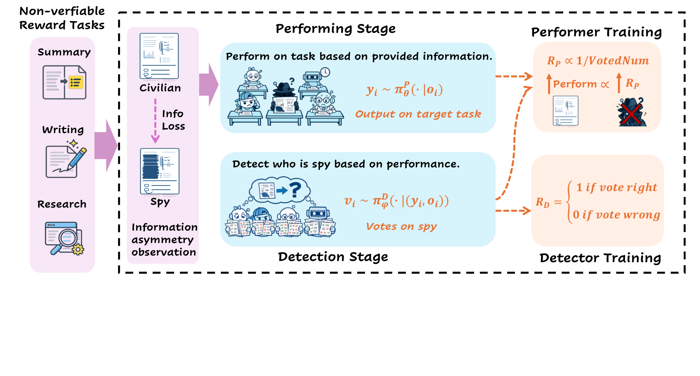

**Source figure / official image** — Figure 2: the two-stage SpyRL game - civilians and the degraded-information spy perform the task, detectors vote, performing rewards are inverse to suspicion votes and detection rewards are deterministically verifiable against the known spy identity. · Figure 2 · [source](https://arxiv.org/html/2607.23802v2)

**nanoRSI reproduction** — not-run. Last source check: 2026-09-16.

**Open code / weights / data links** — [Code repository (Apache-2.0)](https://github.com/wangqinsi1/RLSVR/tree/SpyRL)

**Primary sources** — [arXiv abstract](https://arxiv.org/abs/2607.23802) · [Paper v2 (affiliations, Figure 2, tables)](https://arxiv.org/html/2607.23802v2) · [Code repository (Apache-2.0)](https://github.com/wangqinsi1/RLSVR/tree/SpyRL)

### GPT-Red: Automated Red Teaming via Self-Play at Scale

**2026-07-15** · paper · Direct bounded loop

**Publication date** — Official paper announcement date.

**Institutional relationship** — OpenAI paper and company report.

**What changes and how feedback is reused** — Self-play RL updates an attacker and defender population from failure/resistance rewards. Stronger defenders create harder attacker training; the trained red-teamer then supplies adversarial data for GPT-5.6.

**Author-reported result** — The report gives 0.05% GPT-Red direct-injection success against GPT-5.6 Sol, averaged over attempts on held-out environments. This is one threat model, not a universal attack-failure probability.

**Evidence limits** — Bounded adversarial co-training; no autonomous successor-design proof. Internal models and training scale prevent direct local replication.

**Code / weights / data / license** — Paper public; GPT-Red internal-only. Training code, weights and full data are not released in these sources; no reusable code license established.

**Possible nanoRSI experiment — not implemented here** — Explore benign adversarial fixtures with separate attack-validity, task-success and over-refusal scores.

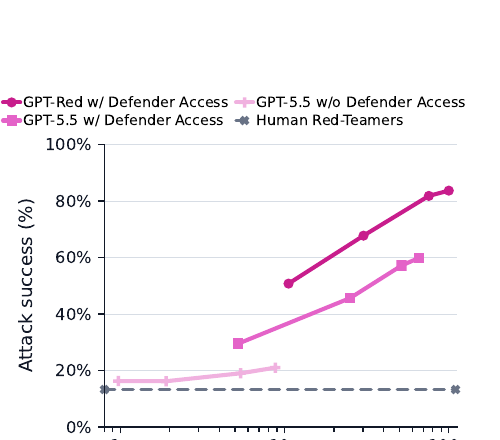

**Source figure / official image** — Figure 1: GPT-Red red-teaming performance as test-time compute increases. · Figure 1, PDF p.1 · [source](https://cdn.openai.com/pdf/gpt-red-automated-red-teaming-via-self-play-at-scale.pdf)

**nanoRSI reproduction** — not-run. Last source check: 2026-09-13.

**Open code / weights / data links** — No verified public code/asset link in the audited sources.

**Primary sources** — [Paper](https://cdn.openai.com/pdf/gpt-red-automated-red-teaming-via-self-play-at-scale.pdf) · [Official report](https://openai.com/index/unlocking-self-improvement-gpt-red/)

### Toward Training Superintelligent Software Agents through Self-Play SWE-RL

**2025-12-21** · paper · Direct bounded loop

**Publication date** — arXiv v1: 2025-12-21; v3: 2026-06-02 (metrics cited from v3). Accepted at ICML 2026.

**Institutional relationship** — Paper v3: Yuxiang Wei (Meta FAIR + UIUC), Zhiqing Sun (Meta TBD Lab), Emily McMilin, Jonas Gehring, David Zhang, Gabriel Synnaeve, Sida Wang (Meta FAIR), Daniel Fried (Meta FAIR + CMU), Lingming Zhang (UIUC).

**What changes and how feedback is reused** — One LLM (CWM-sft 32B) plays both bug-injector and repairer in self-play over sandboxed real repositories, with no human-written issues or tests. The injector explores a repo without tests or issue text, discovers how to run tests, and emits a bug artifact (test script, parser, inject diff, test-weakening diff) validated by consistency checks including inverse mutation testing; the solver sees only the reversed weakening patch as its formal specification and must produce a repair passing restored oracle tests. Failed solve attempts become capped second-order 'higher-order bugs'. Rewards are grounded purely in test outcomes.

**Author-reported result** — +10.4 points on SWE-bench Verified and +7.8 on SWE-Bench Pro over the base model after self-play RL (CWM-sft 32B, 512 H100s); consistently outperforms the human-data baseline across the whole training trajectory and transfers to natural-language issues never seen in self-play. Paired standard error on SWE-bench Verified is acknowledged at around 2%.

**Evidence limits** — Authors state hidden oracles are absent (full tests in the prompt invite reward hacking), only unit-test verification is used, one shared model config plays both roles, and synthesizing natural-language issues collapsed to incoherent patterns. Appendix A documents challenger dominant strategies that stall deep unmitigated self-play.

**Code / weights / data / license** — No code release located; base model CWM-sft is on Hugging Face (facebook/cwm-sft). Training used 512 H100 GPUs and CWM-RL infrastructure, so local reproduction is out of nanoRSI scope.

**Possible nanoRSI experiment — not implemented here** — For nanoRSI: self-play task generation where the mutator must also emit the verifier artifact (test script + weakening patch) and inverse mutation testing validates it - a blueprint for generator-verifier co-production without human labels.

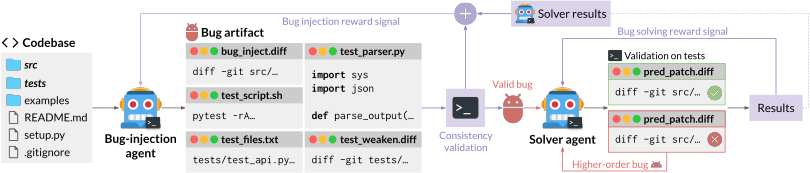

**Source figure / official image** — Figure 1: Self-play SWE-RL overview - one agent injects a bug (with test artifacts) into a sandboxed repo and the same model must repair it against restored oracle tests; test outcomes are the only reward. · Figure 1 · [source](https://arxiv.org/html/2512.18552v3)

**nanoRSI reproduction** — not-run. Last source check: 2026-09-16.

**Open code / weights / data links** — No verified public code/asset link in the audited sources.

**Primary sources** — [arXiv abstract](https://arxiv.org/abs/2512.18552) · [Paper v3 (affiliations, Figure 1, ablations, Appendix A)](https://arxiv.org/html/2512.18552v3)

### Agent0: Unleashing Self-Evolving Agents from Zero Data via Tool-Integrated Reasoning

**2025-11-20** · paper · Direct bounded loop

**Publication date** — arXiv v1: November 20, 2025; official code release: November 29. Distinct from the unrelated July 2025 recommendation paper named Agent0.

**Institutional relationship** — UNC leads the author list; Can Qin and Caiming Xiong list Salesforce Research, and Fang Wu lists Stanford.

**What changes and how feedback is reused** — A curriculum policy generates tasks against a tool-using executor. Ten executor responses estimate uncertainty and pseudo-labels; filtered tasks train the executor, whose new capability changes the next curriculum. Both policies receive iterative training updates.

**Author-reported result** — Qwen3-8B math average rises 49.2→58.2 (+9.0 points; about 18% relative), versus tool-only 53.2. Seven math benchmarks use greedy pass@1 except AMC/AIME mean@32; Table 1 reports peak training performance.

**Evidence limits** — Zero data means no human-curated training set, not no pretrained knowledge. Self-consistency can reinforce errors; results do not establish unbounded improvement.

**Code / weights / data / license** — Official curriculum/executor training code verified; Apache-2.0. Released trained weights and complete generated datasets not verified.

**Possible nanoRSI experiment — not implemented here** — Proposed: test difficulty-adaptive task generation with immutable answer verifiers before attempting costly policy training.

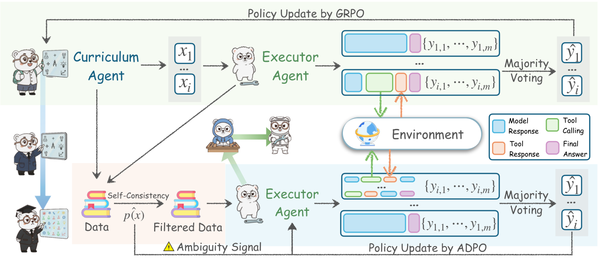

**Source figure / official image** — Figure 2: Agent0 co-evolutionary loop between curriculum generation and executor training. · Figure 2 · [source](https://arxiv.org/html/2511.16043v1)

**nanoRSI reproduction** — not-run. Last source check: 2026-09-13.

**Open code / weights / data links** — [Official series repository and release date](https://github.com/aiming-lab/Agent0) · [Agent0 training implementation](https://github.com/aiming-lab/Agent0/blob/main/Agent0/README.md)

**Primary sources** — [Paper dates](https://arxiv.org/abs/2511.16043) · [Original paper and numerical tables](https://arxiv.org/html/2511.16043v1) · [Official series repository and release date](https://github.com/aiming-lab/Agent0) · [Agent0 training implementation](https://github.com/aiming-lab/Agent0/blob/main/Agent0/README.md)

### EvoLMM: Self-Evolving Large Multimodal Models with Continuous Rewards

**2025-11-20** · paper · Direct bounded loop

**Publication date** — arXiv v1: 2025-11-20; v4: 2026-06-09 (numbers cited from v4).

**Institutional relationship** — Paper v4: ANU, Linkoping University, MBZUAI and Aalto University.

**What changes and how feedback is reused** — One frozen multimodal backbone splits into two LoRA roles trained jointly on raw images with no labels, metadata or reward models: a Proposer generates visually grounded math questions; a Solver answers with N=5 samples. The Solver reward is continuous self-consistency (probability mass to the majority answer plus a verbosity penalty - nonzero gradients even under uncertainty); the Proposer reward is a Gaussian band-pass on Solver answer entropy peaking at moderate difficulty, an automatic curriculum. KL-regularized REINFORCE with EMA baselines; ~6K raw images total.

**Author-reported result** — Qwen2.5-VL-7B: ChartQA 84.00 -> 86.70, MathVista 68.46 -> 70.52, MathVision 23.91 -> 24.81; at 72B: ChartQA 88.20 -> 91.04, MathVista 73.93 -> 76.44. Gains are real but modest, and the paper documents 'Over-Consensus Collapse' - the Solver degenerates toward deterministic answers at large N (N=12).

**Evidence limits** — Ambiguous proposer questions; perception bottlenecks (thin lines, tiny grids, dense legends); stylistic overfitting to chart-style templates; over-consensus collapse at large sample counts.

**Code / weights / data / license** — Code at github.com/mbzuai-oryx/EvoLMM (27 stars, no license file at verification). Paper CC BY 4.0.

**Possible nanoRSI experiment — not implemented here** — For nanoRSI: continuous self-consistency rewards (nonzero gradient under uncertainty) and entropy band-pass curriculum are directly portable to any self-play task generator - and the N-collapse failure mode belongs in the loop's stop conditions.

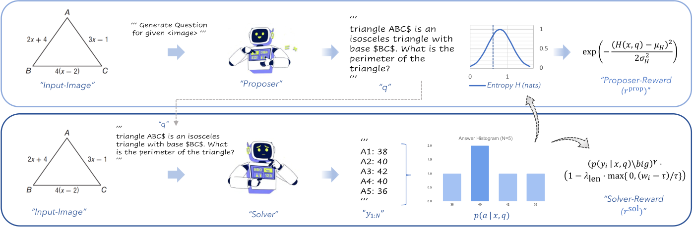

**Source figure / official image** — Figure 2: EvoLMM - the Proposer generates questions from raw images, the Solver answers with multiple samples; rewards are continuous self-consistency (Solver) and an entropy band-pass curriculum (Proposer), optimized with KL-regularized REINFORCE. · Figure 2 · [source](https://arxiv.org/html/2511.16672v4)

**nanoRSI reproduction** — not-run. Last source check: 2026-09-17.

**Open code / weights / data links** — [Code repository](https://github.com/mbzuai-oryx/EvoLMM)

**Primary sources** — [arXiv abstract](https://arxiv.org/abs/2511.16672) · [Paper v4 (affiliations, Figure 2, table)](https://arxiv.org/html/2511.16672v4) · [Code repository](https://github.com/mbzuai-oryx/EvoLMM)

### SIMA 2: A Generalist Embodied Agent for Virtual Worlds

**2025-11-13** · report · Direct bounded loop

**Publication date** — Official research announcement: 2025-11-13; first paper: 2025-12-04. Results use paper v1.

**Institutional relationship** — Google DeepMind's official SIMA-team announcement establishes affiliation.

**What changes and how feedback is reused** — Gemini sets tasks and scores trajectories. Experience trains subsequent SIMA generations, whose new policies collect further experience; demonstrations bootstrap the initial agent.

**Author-reported result** — On fixed ASKA tasks, fewer than one quarter initially exceeded the Gemini reward threshold (>50); later generations exceeded it on every task. This measures model-scored task coverage, not independently verified episode success. These fixed tasks were human-supplied.

**Evidence limits** — Bounded game experiments, model-based evaluation and short memory; no demonstrated improvement of Gemini or the learning algorithm itself.

**Code / weights / data / license** — Paper/demos verified. Training code, weights, experience data and their licences were not identified in opened official sources; proprietary Gemini remains required.

**Possible nanoRSI experiment — not implemented here** — Proposed: version learner generations and scored trajectories; evaluate transfer with an independent held-out task set.

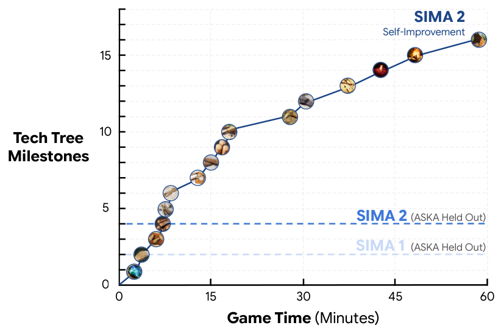

**Source figure / official image** — Figure 16: Self-improvement setup with task setter, reward model, experience dataset and retrained SIMA 2 agent. · Figure 16 · [source](https://arxiv.org/html/2512.04797v1)

**nanoRSI reproduction** — not-run. Last source check: 2026-09-13.

**Open code / weights / data links** — No verified public code/asset link in the audited sources.

**Primary sources** — [Google DeepMind announcement](https://deepmind.google/blog/sima-2-an-agent-that-plays-reasons-and-learns-with-you-in-virtual-3d-worlds/) · [Paper version history](https://arxiv.org/abs/2512.04797) · [Paper v1, section 4.5](https://arxiv.org/html/2512.04797v1)

### AgentEvolver: Towards Efficient Self-Evolving Agent System

**2025-11-13** · paper · Direct bounded loop

**Publication date** — arXiv v1 submitted 2025-11-13; this is the original paper event, not a later repository update.

**Institutional relationship** — The paper explicitly identifies Tongyi Lab, Alibaba Group as its affiliation.

**What changes and how feedback is reused** — Mutates agent policy parameters using self-generated environment tasks. Self-questioning synthesizes and filters tasks; self-navigation retrieves prior experience to guide rollouts; self-attribution supplies differentiated credit alongside outcome rewards. RL updates become the next policy, while the experience pool supports subsequent exploration.

**Author-reported result** — Author Table 1: Qwen2.5-7B average avg@8 across AppWorld and BFCL-v3 rises from 15.8% to 45.2%, a 29.4 percentage-point difference. This compares the base model with the full trained system, not an isolated credit-assignment ablation.

**Evidence limits** — Task/judge quality and environment coverage bound the loop. Evidence concerns agent training, not unlimited autonomous redesign or general RSI.

**Code / weights / data / license** — Code: public ModelScope repository, Apache-2.0. Weights: no standalone paper checkpoint verified. Data: generation/integration code visible; complete training corpus and its license not verified.

**Possible nanoRSI experiment — not implemented here** — Proposed nanoRSI learner experiment: version generated task manifests with each policy checkpoint and compare experience reuse against a frozen-data control.

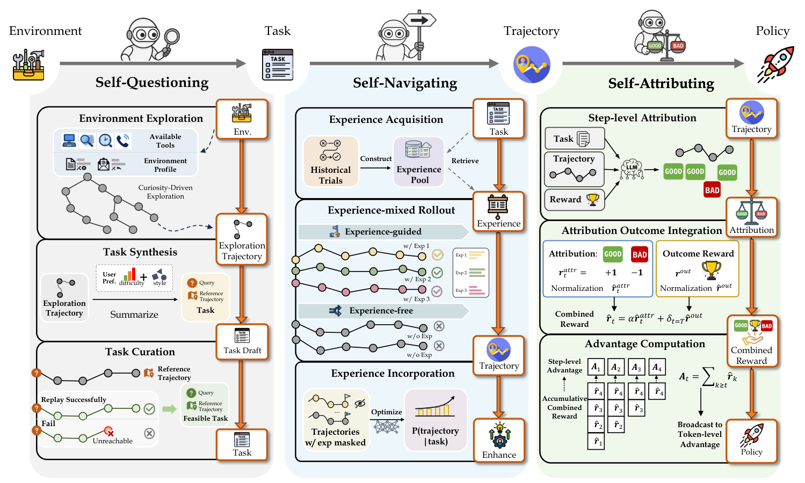

**Source figure / official image** — Figure 2: AgentEvolver combines self-questioning, self-navigating and self-attributing mechanisms. · Figure 2 · [source](https://arxiv.org/html/2511.10395v1)

**nanoRSI reproduction** — not-run. Last source check: 2026-09-13.

**Open code / weights / data links** — [Official AgentEvolver repository](https://github.com/modelscope/AgentEvolver)

**Primary sources** — [arXiv first submission](https://arxiv.org/abs/2511.10395) · [Paper v1: affiliation, methods, Table 1](https://arxiv.org/html/2511.10395v1) · [Official AgentEvolver repository](https://github.com/modelscope/AgentEvolver)

### SPICE: Self-Play in Corpus Environments (adversarial curriculum from raw documents)

**2025-10-28** · paper · Direct bounded loop

**Publication date** — arXiv v1: 2025-10-28. No later revision recorded at verification time.

**Institutional relationship** — Paper v1: Meta FAIR (Bo Liu w/ NUS, Chuanyang Jin, Seungone Kim, Weizhe Yuan, Wenting Zhao, Ilia Kulikov, Xian Li, Sainbayar Sukhbaatar, Jack Lanchantin, Jason Weston).

**What changes and how feedback is reused** — A single RL model plays two roles over a raw corpus: the Challenger mines documents to create (question, verifiable answer) pairs; the Reasoner answers without seeing the document (information asymmetry). The Challenger is rewarded by a Gaussian-shaped variance reward peaking at 50% Reasoner pass rate - an automatic curriculum at the Reasoner's capability frontier - while the Reasoner earns binary correctness. Both roles train jointly with shared weights via DrGRPO with role-specific mean-centered advantages; invalid tasks receive a small negative penalty.

**Author-reported result** — Qwen3-4B-Base: 35.8% -> 44.9% (+9.1); Qwen3-8B-Base +5.7; OctoThinker-3B/8B +10.5/+11.9 - abstract-level +8.9% math and +9.8% general reasoning across families. Beats Strong Challenger (+7.2), R-Zero (+3.7), Absolute Zero (+4.9) on Qwen3-4B. Training dynamics: fixed-Reasoner pass rate falls 55% -> 35% as the Challenger sharpens; corpus grounding adds +3.2.

**Evidence limits** — Corpus limited to 20K documents (each reused ~2-3 times); verification depends on answer types extractable from documents; the R-Zero baseline trained only 5 iterations due to degradation, which may affect baseline fairness.

**Code / weights / data / license** — No code repository on the paper page ('evaluation code and prompts will be released'); components use the open-source Oat framework.

**Possible nanoRSI experiment — not implemented here** — For nanoRSI: reward the task generator by the executor's success variance (peak at 50%) instead of raw difficulty - a one-line change that keeps generated tasks at the frontier of what the current candidate can learn from.

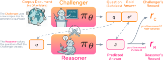

**Source figure / official image** — Figure 2: SPICE overview - one model plays Challenger (mines a document into a question with a verifiable answer) and Reasoner (answers without the document); variance-shaped reward keeps questions at the Reasoner's frontier. · Figure 2 · [source](https://arxiv.org/html/2510.24684v1)

**nanoRSI reproduction** — not-run. Last source check: 2026-09-16.

**Open code / weights / data links** — No verified public code/asset link in the audited sources.

**Primary sources** — [arXiv abstract](https://arxiv.org/abs/2510.24684) · [Paper v1 (affiliations, Figure 2, tables)](https://arxiv.org/html/2510.24684v1)

### Learn the Ropes, Then Trust the Wins: Self-imitation with Progressive Exploration for Agentic Reinforcement Learning

**2025-09-26** · paper · Direct bounded loop

**Publication date** — arXiv v1 submitted 2025-09-26; the public repository was released around the same research release. Inclusion uses the first paper submission.

**Institutional relationship** — The paper lists Tencent Youtu Lab and four university collaborators. Tencent Youtu Lab is the industrial research lead; collaborators and ownership are kept explicit.

**What changes and how feedback is reused** — SPEAR combines a curriculum that schedules intrinsic tool-use rewards for progressive exploration with self-imitation replay for exploitation. Advantage recalibration corrects replay drift, while covariance-based clipping and entropy control stabilize updates. The replay buffer is reused across policy updates, creating a bounded policy-training loop.

**Author-reported result** — The abstract reports up to +16.1/+5.1/+8.6% on ALFWorld and +20.7/+11.8/+13.9% on WebShop over GRPO/GiGPO/Dr.BoT. In a controlled 32K Qwen2.5-32B-Instruct row, AIME24 rises from 67.2 with Dr.BoT to 71.0 (+3.8), and AIME25 from 55.1 to 61.0 (+5.9).

**Evidence limits** — Gains vary by model, task and ablation: self-imitation alone can reduce AIME24 in some rows. The task stream, verifier and reward design remain externally supplied, so this is policy self-improvement under a fixed training harness rather than an autonomous improver redesigning itself.

**Code / weights / data / license** — TencentYoutuResearch/SPEAR code is public and includes SPEAR_LICENSE.txt. The custom terms state that SPEAR is not intended for use within the European Union; GitHub API metadata reports NOASSERTION. Check third-party component terms before reuse; no released checkpoint is assumed beyond what the repository explicitly documents.

**Possible nanoRSI experiment — not implemented here** — Expose replay provenance in nanoRSI learner experiments: compare uniform, frozen-replay and recursively refreshed replay with matched rollout budgets, and report both held-out gains and replay-induced regressions.

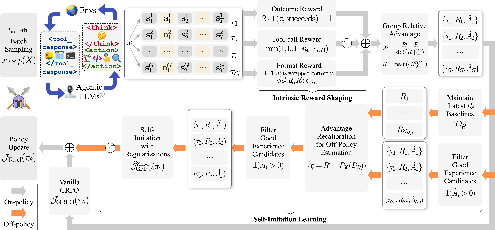

**Source figure / official image** — Figure 2: SPEAR couples progressive exploration with self-imitation replay and stabilized policy updates. · Figure 2, overview.png · [source](https://ar5iv.labs.arxiv.org/html/2509.22601/assets/figures/overview.png)

**nanoRSI reproduction** — not-run. Last source check: 2026-09-13.

**Open code / weights / data links** — [Tencent YoutuResearch SPEAR repository](https://github.com/TencentYoutuResearch/SPEAR) · [SPEAR custom license terms](https://github.com/TencentYoutuResearch/SPEAR/blob/main/SPEAR_LICENSE.txt)

**Primary sources** — [arXiv first submission and history](https://arxiv.org/abs/2509.22601) · [Paper v1 and overview figure](https://arxiv.org/html/2509.22601v1) · [Tencent YoutuResearch SPEAR repository](https://github.com/TencentYoutuResearch/SPEAR) · [SPEAR custom license terms](https://github.com/TencentYoutuResearch/SPEAR/blob/main/SPEAR_LICENSE.txt)

## Verifier- and reward-centric loops (5)

### EvoRS: On-Policy Self-Evolution of Reward Systems for Open-Ended Reinforcement Learning

**2026-09-11** · paper · Direct bounded loop

**Publication date** — arXiv v1: 2026-09-11. No later revision recorded at verification time.

**Institutional relationship** — Paper v1: Fudan University (School of Data Science + Shanghai Key Lab of Data Science; Deqing Yang corresponding) with Nankai University (Cryptology) and Hello Group engineers.

**What changes and how feedback is reused** — The reward system itself is the evolving artifact: an executable Reward-DAG whose rubric nodes (criteria + scoring mechanisms) and composition operators define the RL reward. Every N policy updates, an agentic designer reads on-policy rollouts and node-level reward traces, diagnoses validity/coverage/informativeness failures, and proposes bounded typed edits; 'matched replay' compares current and candidate reward states on the same rollout cases, and only a candidate that repairs the targeted failure while preserving useful reward behavior becomes the next active state. Outcomes feed run-local memory and dynamic skills.

**Author-reported result** — WritingBench 57.001 vs base 54.894 (+2.107, the largest gain, averaged over three judges GPT-5.6-Terra/DeepSeek-V4-Pro/GLM-5.2) and the only method whose hacking rate falls below base (6.5 vs 7.7); CoSER 65.676 vs 60.909 (+4.767), rank-first on all four dimensions. Generalizes across reward models (Qwen3-8B: 66.370 vs RaR 62.044). Ablations: fixed final Reward-DAG costs -0.693/-5.103; dropping candidate selection -3.182; evolution memory -3.264. Cost ~192 A800 GPU-hours per run.

**Evidence limits** — Evaluated on writing and roleplay only; agentic/tool-use extension unvalidated; fixed every-N-step evolution schedule; extra compute for periodic diagnosis/candidate evaluation.

**Code / weights / data / license** — No code release located; paper only. Designer uses Codex SDK with GPT-5.4.

**Possible nanoRSI experiment — not implemented here** — For nanoRSI: the evaluator side can evolve too - version the reward definition as a DAG, let a designer propose typed edits, and accept them only via matched-replay comparison on identical rollouts; log rejected reward edits like rejected skills.

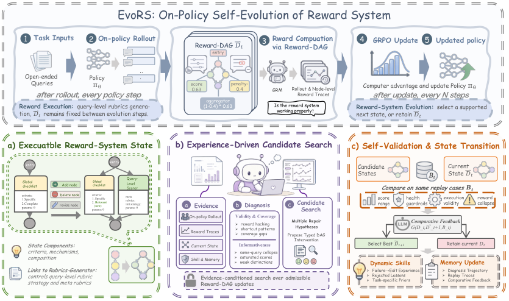

**Source figure / official image** — Figure 4: EvoRS overview - policy learning is coupled with reward-system evolution over an executable Reward-DAG, with candidate states selected by matched replay on the same rollouts. · Figure 4 · [source](https://arxiv.org/html/2609.12459v1)

**nanoRSI reproduction** — not-run. Last source check: 2026-09-16.

**Open code / weights / data links** — No verified public code/asset link in the audited sources.

**Primary sources** — [arXiv abstract](https://arxiv.org/abs/2609.12459) · [Paper v1 (affiliations, Figure 4, Tables 1-3)](https://arxiv.org/html/2609.12459v1)

### Self-Trained Verification for Training- and Test-Time Self-Improvement

**2026-05-28** · paper · Direct bounded loop

**Publication date** — arXiv v1: 2026-05-28; v2: 2026-05-31 (numbers cited from v2).

**Institutional relationship** — Both authors (Chen Henry Wu, Aditi Raghunathan) are at Carnegie Mellon University.

**What changes and how feedback is reused** — Exploits the asymmetry that a model cannot diagnose its own errors cold but can when shown a reference solution. A reference-conditioned verifier (teacher) supervises an unconditioned student via on-policy distillation over (verdict, feedback) distributions plus a verdict-RL term against ground-truth correctness; SFT on teacher traces fails due to off-policy drift. The trained verifier then powers both test-time verification-refinement loops and verifier-in-the-loop (ViL) RL training of the generator - the verifier itself is the self-improved artifact.

**Author-reported result** — Roughly doubles accuracy on hard math (final-round Hardest 5.5% vs 2.7% for Qwen3-32B's pipeline); SciKnowEval Hardest 1.5% -> 21.0% and Hard 11.5% -> 42.4%, beating Qwen3-235B-A22B; ViL adds a further +33% relative pass@1 from an RLVR-converged generator where extending RLVR alone gives no gain; STV-trained 4B verifier nearly matches an 8B one (26.4% vs 27.4%).

**Evidence limits** — Open questions per authors: generalization beyond math to non-verifiable-from-scratch tasks, other supervision signals, larger models, and the compute-optimal split between generator, verifier and test-time rounds.

**Code / weights / data / license** — Code at github.com/AR-FORUM/stv (Apache-2.0, 11 stars at verification); project page ar-forum.github.io/stv-webpage. Paper CC BY 4.0.

**Possible nanoRSI experiment — not implemented here** — For nanoRSI: train the acceptance-verifier by imitating its own reference-conditioned judgments, then gate every candidate change through that self-trained verifier - directly strengthens the frozen-evaluator invariant with a cheap learned checker.

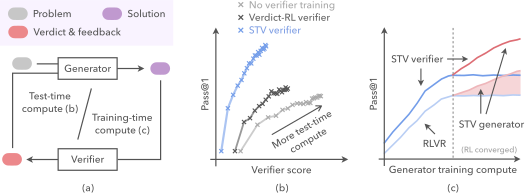

**Source figure / official image** — Figure 1: self-trained verification - a reference-conditioned teacher verifier distills into an unconditioned student, which then drives test-time verification-refinement loops and verifier-in-the-loop RL. · Figure 1 · [source](https://arxiv.org/html/2605.30290v2)

**nanoRSI reproduction** — not-run. Last source check: 2026-09-16.

**Open code / weights / data links** — [Code repository (Apache-2.0)](https://github.com/AR-FORUM/stv)

**Primary sources** — [arXiv abstract](https://arxiv.org/abs/2605.30290) · [Paper v2 (affiliations, Figure 1, all tables)](https://arxiv.org/html/2605.30290v2) · [Code repository (Apache-2.0)](https://github.com/AR-FORUM/stv)

### EvoLM: Self-Evolving Language Models through Co-Evolved Discriminative Rubrics

**2026-05-05** · paper · Direct bounded loop

**Publication date** — arXiv v1 2026-05-05; the ICLR 2026 RSI-workshop spotlight was verified on the accepted list on 2026-09-17, where the paper appears under a shortened title.

**Institutional relationship** — Academic (UW-led with AI2); the open-weight EvoLM-8B line is the artifact.

**What changes and how feedback is reused** — A rubric generator emits instance-specific natural-language criteria and a frozen judge as small as 0.6B scores the policy against them; the generator trains by GRPO with a binary discriminative reward (does the judge correctly rank a preference pair built from the policy's own earlier-vs-later outputs via temporal contrast), and generator and policy co-evolve in alternation with a replay buffer — no human annotation, external reward model or stronger teacher.

**Author-reported result** — A Qwen3-8B generator beats GPT-4.1 rubrics on RewardBench-2 by 25.7%; the co-trained policy reaches 69.3% average on the 12-benchmark OLMo3-Adapt suite (+3.9 over GPT-4.1-prompted rubrics); on out-of-distribution deep-research tasks its rubrics agree with expert human rubrics more than GPT-4.1 does (HealthBench 58.4% vs 52.5%, ResearchQA 59.3% vs 51.0%); the framework extends to OLMo-3-7B and rubrics transfer to unseen policies and judges without retraining.

**Evidence limits** — Author-reported; temporal-contrast preference construction ties supervision quality to checkpoint pacing; judge-quality metrics (RewardBench-2/JudgeBench) are themselves LLM-judgment-based.

**Code / weights / data / license** — Code at github.com/stellalisy/EvoLM (license not verified); weights on Hugging Face (stellalisy/EvoLM-8B); training data not verified.

**Possible nanoRSI experiment — not implemented here** — Temporal contrast is directly portable: build preference pairs from nanoRSI's frozen-vs-candidate outputs and train a small rubric scorer as the cheap gate that replaces per-candidate full rollouts (extends ADOPTION item 19).

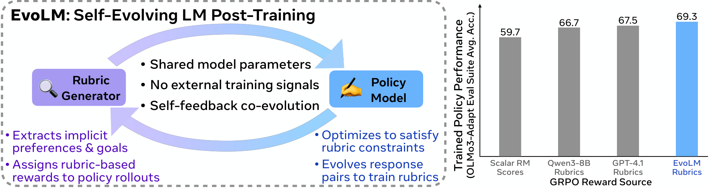

**Source figure / official image** — EvoLM overview: one model co-evolves its own evaluation (rubric generator + frozen judge) and generation capabilities via temporal-contrast preferences from its own checkpoints. · Figure 1 (rubric_fig1.png) · [source](https://arxiv.org/html/2605.03871v1)

**nanoRSI reproduction** — not-run. Last source check: 2026-09-18.

**Open code / weights / data links** — [EvoLM repository](https://github.com/stellalisy/EvoLM)

**Primary sources** — [arXiv abstract](https://arxiv.org/abs/2605.03871) · [Paper HTML (affiliations, results, Figure 1)](https://arxiv.org/html/2605.03871v1) · [EvoLM repository](https://github.com/stellalisy/EvoLM)

### A3: An Automated Alignment Agent for Safety Finetuning

**2026-03-11** · report · Direct bounded loop

**Publication date** — Dated research report; repository creation is not treated as a public release date.

**Institutional relationship** — Jifan Zhang: Fellows Program; Henry Sleight: Constellation; Joe Benton: Anthropic.

**What changes and how feedback is reused** — Agents generate failure hypotheses, split data, then adapt LoRA hyperparameters and data weights using an experiment log and evaluation feedback. The controller improves a target model, not its own weights.

**Author-reported result** — For Qwen-2.5-7B Instruct, external sycophancy evaluation falls from 68.0% to 42.0%; MMLU-Pro changes from 52.9% to 52.4% (report Table 1). Lower sycophancy is better.

**Evidence limits** — Three targeted failures; weaker Llama results expose forgetting. The log description includes OOD feedback, so do not equate every reported OOD split with an untouched final test.

**Code / weights / data / license** — Apache-2.0 code, configs and data directory public. Requires model/API access and a GPU stack; trained checkpoints and full data completeness not verified.

**Possible nanoRSI experiment — not implemented here** — Extend curriculum experiments with capability-retention constraints and a truly frozen final panel.

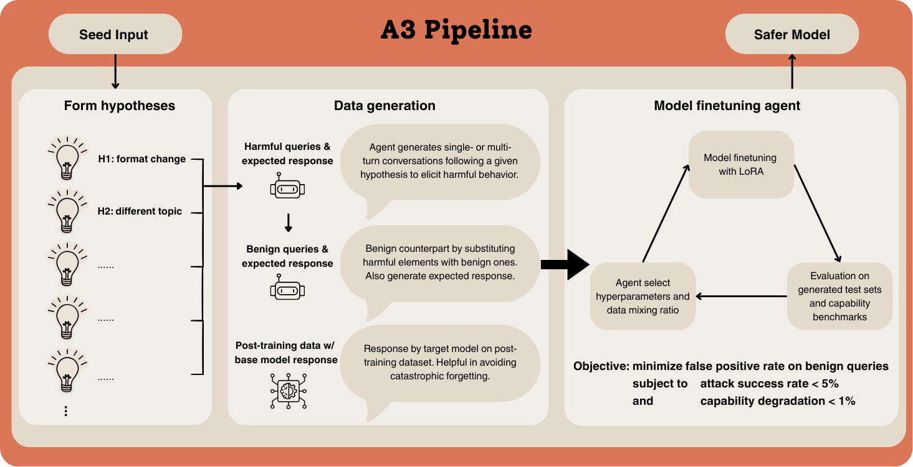

**Source figure / official image** — A3 pipeline: data-generation agent, fine-tuning agent and experiment log adapt to safety failures. · A3 Pipeline figure · [source](https://alignment.anthropic.com/2026/automated-alignment-agent/)

**nanoRSI reproduction** — not-run. Last source check: 2026-09-13.

**Open code / weights / data links** — [Repository](https://github.com/safety-research/A3) · [Code license](https://github.com/safety-research/A3/blob/main/LICENSE)

**Primary sources** — [Research report](https://alignment.anthropic.com/2026/automated-alignment-agent/) · [Repository](https://github.com/safety-research/A3) · [Code license](https://github.com/safety-research/A3/blob/main/LICENSE)

### DeepSeekMath-V2: Towards Self-Verifiable Mathematical Reasoning

**2025-11-27** · paper · Direct bounded loop

**Publication date** — arXiv v1 and the paper's date are 2025-11-27.

**Institutional relationship** — The paper explicitly lists DeepSeek-AI and identifies internship work; the official DeepSeek repository hosts the release.

**What changes and how feedback is reused** — A verifier rewards generator training; harder generated proofs are automatically labeled with increased verification compute to further train the verifier. An expert-seeded meta-verifier checks critique faithfulness. At inference, scored candidate proofs are retained and refined using their critiques; this second loop changes solutions, not weights.

**Author-reported result** — Authors report 118/120 on Putnam 2024 after expert assessment. High-compute search starts with 64 proofs and 64 analyses each, selects 64 top proofs, samples 8 analyses per proof, and runs up to 16 refinement iterations. This is not one-shot performance.

**Evidence limits** — Natural-language verification is fallible and uses expert bootstrap supervision. Proof-search success alone is not recursive improvement of the model.

**Code / weights / data / license** — Public inference code, prompts/predictions, and 685B weights; repository and weights are Apache-2.0. Full training code, human annotations and complete training data were not verified as released.

**Possible nanoRSI experiment — not implemented here** — Proposed nanoRSI learner adapter: version generator, verifier, labels and expert audit separately; compare verifier co-training against a frozen verifier.

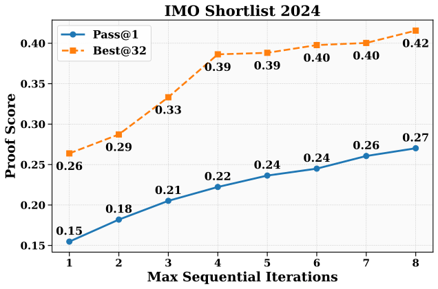

**Source figure / official image** — Figure 2: Proof quality improves as the maximum number of sequential self-verification refinements increases. · Figure 2 · [source](https://arxiv.org/html/2511.22570v1)

**nanoRSI reproduction** — not-run. Last source check: 2026-09-13.

**Open code / weights / data links** — [Official DeepSeek-Math-V2 repository](https://github.com/deepseek-ai/DeepSeek-Math-V2) · [Official weights and Apache-2.0 statement](https://huggingface.co/deepseek-ai/DeepSeek-Math-V2)

**Primary sources** — [arXiv first submission](https://arxiv.org/abs/2511.22570) · [Paper v1 methods and high-compute evaluation](https://arxiv.org/html/2511.22570v1) · [Official DeepSeek-Math-V2 repository](https://github.com/deepseek-ai/DeepSeek-Math-V2) · [Official weights and Apache-2.0 statement](https://huggingface.co/deepseek-ai/DeepSeek-Math-V2)

## Skill-weight co-evolution (2)

### SkillRL: Evolving Agents via Recursive Skill-Augmented Reinforcement Learning

**2026-02-09** · paper · Direct bounded loop

**Publication date** — arXiv v1: 2026-02-09. No later revision recorded at verification time.

**Institutional relationship** — Paper v1: UNC-Chapel Hill leads (Peng Xia ... Huaxiu Yao, aiming-lab); co-authors span UChicago, UCSD, NEC Labs America, UC Berkeley and UC Santa Cruz.

**What changes and how feedback is reused** — A hierarchical SkillBank distilled from trajectories (general strategies plus task-specific skills retrieved by embedding similarity) is used in-context during rollouts while the RL policy is trained with GRPO - and the library itself keeps co-evolving: after each validation epoch, failed-trajectory categories trigger skill generation/refinement (max 3 new skills per evolution round), so skills and weights improve each other. Skill distillation compresses context 10-20x.

**Author-reported result** — ALFWorld 89.9% overall success vs GRPO 77.6% (+12.3 absolute; Mem0+GRPO 54.7%); WebShop 85.2 score / 72.7% success vs GRPO 79.3/66.1; search-augmented QA average 47.1% vs Search-R1 38.5% and EvolveR 43.1% (Bamboogle 73.8 vs EvolveR 54.4). Ablations: no library drops ALFWorld to 61.7; no dynamic evolution to 84.4; library grows 55 -> 100 skills.

**Evidence limits** — No explicit limitations section. Implicit: depends on a strong teacher (OpenAI o3) for distillation, binary rewards, skill growth capped by hyperparameters, Qwen2.5-7B-Instruct base.

**Code / weights / data / license** — Code at github.com/aiming-lab/SkillRL (MIT, 976 stars at verification).

**Possible nanoRSI experiment — not implemented here** — For nanoRSI: the missing bridge between its skills and model tracks - validate skills against frozen-rollout baselines first, then co-evolve the library with the learner and log which side contributes what.

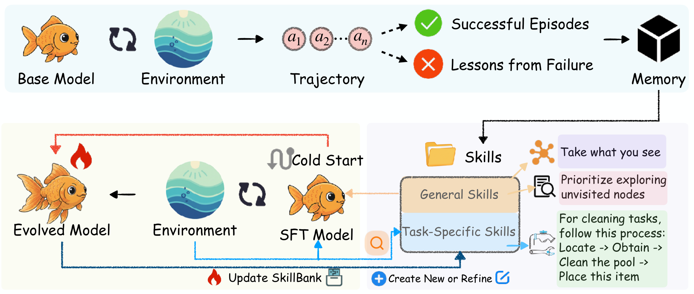

**Source figure / official image** — Figure 2: SkillRL framework - trajectories are distilled into a hierarchical skill bank, cold-start SFT teaches skill use, and RL training co-evolves the policy with the library driven by validation failures. · Figure 2 · [source](https://arxiv.org/html/2602.08234v1)

**nanoRSI reproduction** — not-run. Last source check: 2026-09-16.

**Open code / weights / data links** — [Code repository (MIT)](https://github.com/aiming-lab/SkillRL)

**Primary sources** — [arXiv abstract](https://arxiv.org/abs/2602.08234) · [Paper v1 (affiliations, Figure 2, Tables 1-5)](https://arxiv.org/html/2602.08234v1) · [Code repository (MIT)](https://github.com/aiming-lab/SkillRL)

### SAGE: Reinforcement Learning for Self-Improving Agent with Skill Library

**2025-12-18** · paper · Direct bounded loop

**Publication date** — arXiv v1: 2025-12-18; ACL 2026 long paper. Artifact hosted under amazon-science.

**Institutional relationship** — Paper v1: AWS Agentic AI (Qiaojing Yan, Yawei Wang, Yijun Tian, ..., Panpan Xu corresponding, Lin Lee Cheong); first author Jiongxiao Wang (UW-Madison) did the work during an AWS internship.

**What changes and how feedback is reused** — Skill-Augmented GRPO: the agent defines and calls function skills (CodeAct-style, following DynaSaur), and sequential rollouts run each agent across a chain of similar tasks so skills generated on task one are reused on task two - reward from successful later skill use back-propagates credit to earlier skill generation. The skill-integrated reward adds bonuses for generating a skill that gets successfully reused and for successfully using retrieved skills. GRPO is modified to use reward-mean advantages without std normalization or KL penalty, computed across the task chain with per-task skill libraries.

**Author-reported result** — AppWorld (Qwen2.5-32B-Instruct): vs baseline GRPO, +8.9% Scenario Goal Completion with 26% fewer interaction steps and 59% fewer tokens (Test Normal 60.7% vs 51.8% SGC at 1,475 vs 3,613 tokens; Test Challenge 32.4% vs 26.9%). Beats LOOP (53.6% SGC) and GPT-4o ReAct (32.1%); chain-length ablation shows 3-task chains (54.8% SGC) underperform 2-task chains.

**Evidence limits** — Experiments use only AppWorld; the authors note different scenarios may need different agent designs.

**Code / weights / data / license** — Artifact at github.com/amazon-science/SAGE (23 stars; license reported NOASSERTION by the GitHub API - verify terms before reuse).

**Possible nanoRSI experiment — not implemented here** — For nanoRSI: evaluate skills across chains of related tasks rather than isolated episodes, and pay reward credit back to the skill-generating step - a direct answer to 'how do generated skills get selected?'

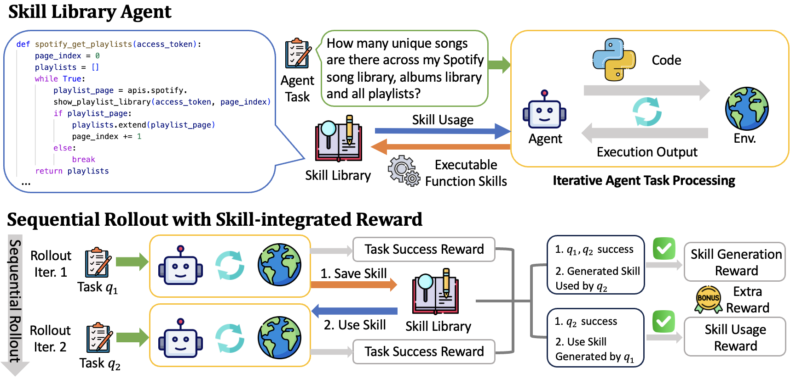

**Source figure / official image** — Figure 1: the Skill Library Agent and sequential rollout with skill-integrated reward - skills generated on an earlier task in the chain are reused on the next, and successful reuse pays reward credit back to skill generation. · Figure 1 · [source](https://arxiv.org/html/2512.17102v1)

**nanoRSI reproduction** — not-run. Last source check: 2026-09-16.

**Open code / weights / data links** — [Artifact repository](https://github.com/amazon-science/SAGE)

**Primary sources** — [arXiv abstract](https://arxiv.org/abs/2512.17102) · [Paper v1 (affiliations, Figure 1, tables)](https://arxiv.org/html/2512.17102v1) · [Artifact repository](https://github.com/amazon-science/SAGE)

## Experience distillation & test-time adaptation (4)

### Experience Funnel: A State-Policy Alternating Loop for Self-Evolving Agents

**2026-09-08** · paper · Direct bounded loop

**Publication date** — arXiv v1: 2026-09-08. No later revision recorded at verification time. Surfaced as a lead on 2026-09-15 (abstract lacked affiliation and numbers); verified against the HTML full text on 2026-09-16.

**Institutional relationship** — Paper v1: Wenbo Gao and James Chung-wai Cheung are at The Hong Kong Polytechnic University; the Huawei group includes Zhaomou Song, Renxi Liu, Xing Li, Xianzhi Yu, Xiaoguang Li, Weizhe Lin (corresponding), Yaoyuan Wang; Zhiyuan Ji is affiliated with both Huawei and Renmin University of China.

**What changes and how feedback is reused** — A two-timescale loop over a deployed (textual state, policy) pair. Fast: trajectories are aggregated into a task-specific textual state summarizing recurring procedures, failure modes and corrective strategies, and candidate state edits must pass validation on held-out interactions before acceptance. Slow: Transition-Aware Skill Distillation compares rollouts under no state, the previous state and the updated state, labeling each experience newly-useful (0,1), persistently-useful (1,1), regressive (1,0) or inactive (0,0); token-level Jensen-Shannon divergence localizes state-responsive decisions, and a state-conditioned teacher distills only the useful rollouts into the state-free student policy, combined with a state-free RL reward. The updated pair redeploys for the next round.

**Author-reported result** — Three benchmarks (SearchQA, ALFWorld, WebShop) with a Qwen3.5-4B student and frozen Qwen3.5-27B teacher on Ascend 910B3 NPUs: average 57.6% vs SkillRL 56.2, OPID 55.4, SkillOpt 53.9 and base 33.7. The state-free policy itself rises 58.1% -> 61.3% on SearchQA over five rounds (residual state contributes nothing after consolidation: 61.3 with full state vs 61.3 with residual). Ablation: state-only 61.1, policy-only 62.8, full loop 63.6; experience selection (0,1)+(1,1) reaches 63.0 vs 58.9 unfiltered. Honest no-op accounting: of five evolution rounds only rounds 1 and 4 were accepted; rounds 2, 3 and 5 were rejected.

**Evidence limits** — No code release; the margin over SkillRL is +1.4 points; per-benchmark numbers show SearchQA carries most of the gain (WebShop 42.4 remains low). Rejected rounds are reported but not analyzed in depth.

**Code / weights / data / license** — No code, weights or data release located; paper only. Experiments run on Huawei Ascend 910B3 NPUs with Qwen3.5-4B/27B checkpoints.

**Possible nanoRSI experiment — not implemented here** — For nanoRSI's parameter track: adopt the counterfactual state comparison (rollouts under no-state vs previous-state vs updated-state) as the acceptance test for whether a context change deserves distillation, keeping weight updates gated the same way skill commits are.

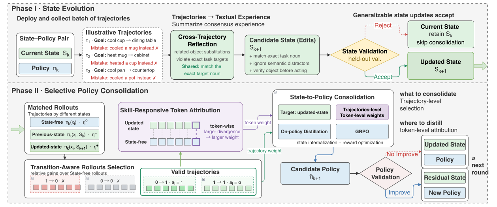

**Source figure / official image** — Figure 1: the state-policy consolidation loop - Phase I aggregates trajectories into a validated textual state; Phase II labels matched rollouts by transition type and distills state-responsive behavior into the state-free policy. · Figure 1 · [source](https://arxiv.org/html/2609.08919v1)

**nanoRSI reproduction** — not-run. Last source check: 2026-09-16.

**Open code / weights / data links** — No verified public code/asset link in the audited sources.

**Primary sources** — [arXiv abstract](https://arxiv.org/abs/2609.08919) · [Paper v1 (affiliations, Figure 1, Tables, ablations)](https://arxiv.org/html/2609.08919v1)

### Self-Evolving LLM Agents with In-Distribution Optimization

**2026-06-05** · paper · Direct bounded loop

**Publication date** — arXiv v1: 2026-06-05. Accepted at ICML 2026.

**Institutional relationship** — Paper v1: TU Eindhoven (Yudi Zhang, Mykola Pechenizkiy), Meng Fang (TU/e + University of Liverpool, corresponding), Zhenfang Chen (MIT-IBM Watson AI Lab).

**What changes and how feedback is reused** — Each self-evolution round trains an in-distribution critic by weighted Implicit Q-Learning on a hybrid of expert demonstrations and the agent's own trajectories (no max over out-of-distribution actions; step weights upweight informative later steps of successful trajectories), derives step-level process rewards via GAE over environment rewards only, and updates the policy with behavior-proximal policy optimization - asymmetric clipping that aggressively suppresses negative-advantage actions - so distribution shift across rounds is explicitly controlled. Policy, critic and dataset co-evolve over 2-3 iterations.

**Author-reported result** — Llama-2-7B-Chat backbone: average 79.4 vs QLASS 74.5, ETO 69.4, Best-of-N 65.4, PPO 45.3 (ALFWorld seen/unseen 90.7/89.6; ScienceWorld unseen 69.7; WebShop 70.5). Sample efficiency: Q-Evolve reaches 88.6/87.3 on ALFWorld (Qwen2.5-7B) with 13K environment steps versus 320K for PPO/RLOO/GRPO and ~600K for QLASS.

**Evidence limits** — Retrospective rewards depend on structured environment feedback; greedy rollouts reduce trajectory diversity across iterations; cross-iteration distribution drift is not explicitly corrected.

**Code / weights / data / license** — Project page qevolve.github.io. No code repository stated on the arXiv page; paper CC BY-NC-SA 4.0 (noncommercial terms).

**Possible nanoRSI experiment — not implemented here** — For nanoRSI's model track: keep each learning round's critic trained in-distribution on the current policy's own rollouts (plus demos) and use asymmetric clipping - a recipe for multi-round stability without off-policy drift.

**Source figure / official image** — Figure 2: Q-Evolve framework - warmup behavior cloning, then iterative loops over hybrid demonstrations and self-trajectories with retrospective labeling, in-distribution critic learning, token-level advantage redistribution, and co-evolution of policy, critic and dataset. · Figure 2 · [source](https://arxiv.org/html/2606.07367v1)

**nanoRSI reproduction** — not-run. Last source check: 2026-09-16.

**Open code / weights / data links** — No verified public code/asset link in the audited sources.

**Primary sources** — [arXiv abstract](https://arxiv.org/abs/2606.07367) · [Paper v1 (affiliations, Figure 2, Tables 2/5/6)](https://arxiv.org/html/2606.07367v1)

### EvolveR: Self-Evolving LLM Agents through an Experience-Driven Lifecycle

**2025-10-17** · paper · Direct bounded loop

**Publication date** — arXiv v1: 2025-10-17; v3: 2026-05-16 (numbers cited from v3). Accepted at ICML 2026.

**Institutional relationship** — Paper v3: Shanghai AI Laboratory leads (Botian Shi corresponding) with Zhejiang University, ECNU, Fudan, SJTU and USTC co-authors.

**What changes and how feedback is reused** — A closed experience lifecycle alternating two phases: offline, with parameters frozen, the agent's own policy reviews past trajectories under expert-persona prompts and distills them into 'guiding' (success) or 'cautionary' (failure) principles - natural-language descriptions with knowledge triples, deduplicated by embedding similarity plus LLM equivalence checks and pruned by a dynamic usefulness score; online, retrieved principles shape reasoning and trajectories feed the next distillation cycle; GRPO updates the policy so it learns to use its own distilled wisdom.

**Author-reported result** — Qwen2.5-3B search-agent average 0.382 vs Search-R1-instruct 0.325, rejection sampling 0.265, RAG 0.270; Qwen2.5-7B average 0.417 vs 0.385. Ablations (3B): without experience retrieval 0.340; RL-only 0.325; teacher-distilled (GPT-4o-mini) 0.370 vs self-distilled 0.382 - the agent's own distillation beats the external teacher's.

**Evidence limits** — Self-distillation quality is bounded by the base model; validated on QA tasks only (embodied/creative untested); lifelong computational efficiency open; safety of self-evolved strategies depends on the reward function.

**Code / weights / data / license** — Paper lists github.com/Edaizi/EvolveR; the repository did not resolve via the GitHub API at verification time. No license established.

**Possible nanoRSI experiment — not implemented here** — For nanoRSI: the offline distillation phase with frozen parameters is directly portable - turn accepted trajectories into deduplicated principle cards with a dynamic usefulness score that prunes dead entries.

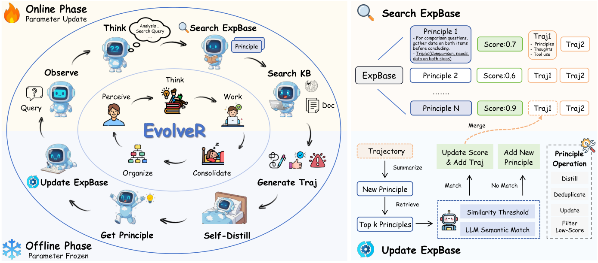

**Source figure / official image** — Figure 2: EvolveR's experience lifecycle - an online phase (RL policy updates) alternates with an offline phase (frozen parameters, self-distillation of trajectories into principles, experience-base maintenance). · Figure 2 · [source](https://arxiv.org/html/2510.16079v3)

**nanoRSI reproduction** — not-run. Last source check: 2026-09-16.

**Open code / weights / data links** — No verified public code/asset link in the audited sources.

**Primary sources** — [arXiv abstract](https://arxiv.org/abs/2510.16079) · [Paper v3 (affiliations, Figure 2, tables)](https://arxiv.org/html/2510.16079v3)

### Self-Improving LLM Agents at Test-Time

**2025-10-09** · paper · Direct bounded loop

**Publication date** — arXiv v1: 2025-10-09. ACL 2026 Findings.

**Institutional relationship** — All five authors (Emre Can Acikgoz, Cheng Qian, Heng Ji, Dilek Hakkani-Tur, Gokhan Tur) are at UIUC.

**What changes and how feedback is reused** — Per uncertain test instance, a three-stage self-improvement loop runs entirely at inference: self-awareness flags low-margin samples via relative softmax scoring over candidate-action NLLs; self-data augmentation has the model itself generate K similar input-output pairs from the flagged sample (never seeing gold labels); self-improvement applies temporary LoRA fine-tuning on the synthetic data, answers with the adapted weights, then resets parameters to the original values.

**Author-reported result** — +5.48% average absolute accuracy across agent benchmarks over prompting (ToolAlpaca +5.84%, NexusRaven +6.05%, SealTool +5.76%, API-Bank +4.26%); on SealTool it surpasses SFT (72.43% vs 70.20%) using 68x fewer samples (190 synthetic examples vs ~13K training split).

**Evidence limits** — Sensitive to the uncertainty threshold (autonomously learning it is open); bounded by base-model capacity - knowledge absent from pretraining cannot be recovered; small-sample training yields high variance (five seeds averaged).

**Code / weights / data / license** — No code release mentioned in the paper.

**Possible nanoRSI experiment — not implemented here** — For nanoRSI: a minimal per-instance loop - uncertainty-triggered synthetic self-data plus temporary adapter, reset after answering - is testable on the digits/artifact tasks with no training infrastructure.

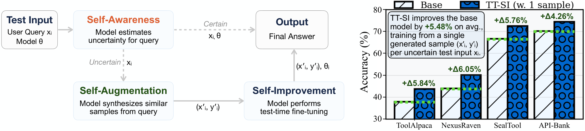

**Source figure / official image** — Figure 1: the TT-SI framework - self-awareness detects uncertain samples, self-data augmentation generates similar examples, and test-time fine-tuning temporarily adapts weights per instance. · Figure 1 · [source](https://arxiv.org/html/2510.07841v1)

**nanoRSI reproduction** — not-run. Last source check: 2026-09-16.

**Open code / weights / data links** — No verified public code/asset link in the audited sources.

**Primary sources** — [arXiv abstract](https://arxiv.org/abs/2510.07841) · [Paper v1 (affiliations, Figure 1, per-benchmark gains)](https://arxiv.org/html/2510.07841v1)

## Autonomous training agents & data pipelines (4)

### ScienceIDE: Turning World's Scientific Codebase into Agent Learnable Environments

**2026-09-16** · paper · Enabling technique / evaluation

**Publication date** — v1 2026-09-16; 45 authors across 25 institutions with PhAI Labs/AItonomy as the artifact organization (contact team@aitonomy.org, yang@phai-labs.com); listed organizations are the headline subset, the full map is in the paper's author block.

**Institutional relationship** — PhAI Labs/aitofound-led consortium in the ScienceBuddy lineage; the environment infrastructure and PhAI-IDE models are the artifacts.

**What changes and how feedback is reused** — Infrastructure converts scientific code repositories into programmable agent environments: expert-defined cases and acceptance criteria drive task generation, execution and verification; verified interaction trajectories then serve SFT, RL and evaluation as one shared foundation.

**Author-reported result** — Trains PhAI-IDE-72B/9B/4B from verified trajectories; the family reports gains on held-out scientific-code repair and selected general-purpose code/reasoning/knowledge benchmarks (qualitative at abstract level, no single headline number), with online verifier feedback reported to substantially improve held-out scientific reward.

**Evidence limits** — Author-reported; results verified here at abstract level only; gains framed as positive transfer from scientific experience, not as a measured self-improvement loop.

**Code / weights / data / license** — Code at github.com/aitofound/ScienceIDE (license not verified); PhAI-IDE-4B/9B/72B announced in the repository README; environment data availability not verified.

**Possible nanoRSI experiment — not implemented here** — The acceptance-criteria-first recipe maps onto nanoRSI fixtures: generate executable task+verifier pairs from a corpus, admit only verified trajectories into the improvement loop.

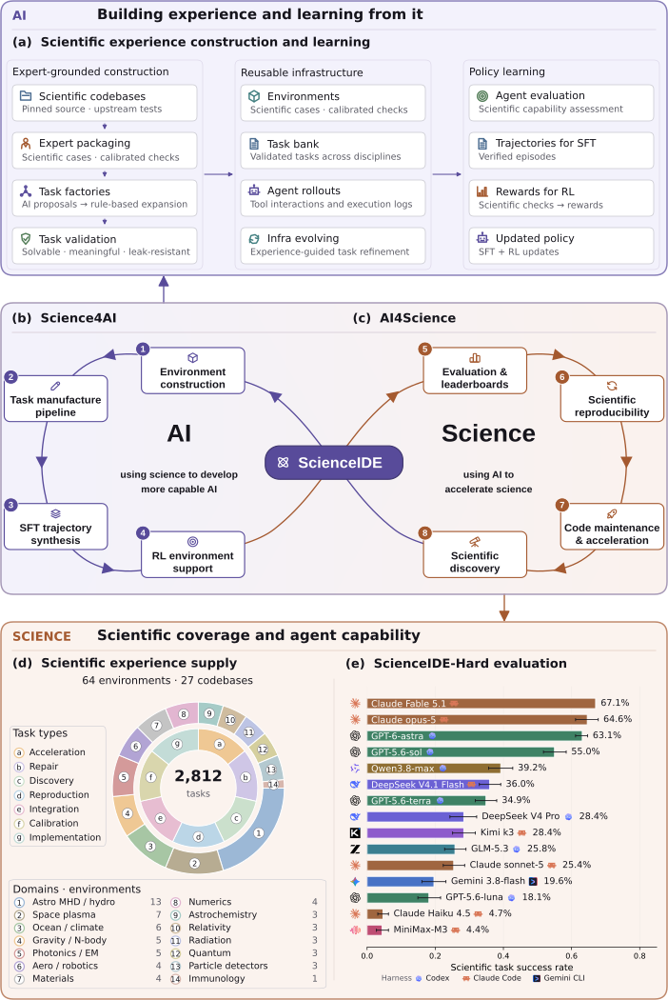

**Source figure / official image** — Figure 1 summarizes ScienceIDE: expert-grounded construction of environments, Science4AI turning scientific experience into agent capability, AI4Science application, and domain/task coverage. · Figure 1 (scienceide_summary.svg) · [source](https://arxiv.org/html/2609.19134v1)

**nanoRSI reproduction** — not-run. Last source check: 2026-09-18.

**Open code / weights / data links** — [ScienceIDE repository](https://github.com/aitofound/ScienceIDE)

**Primary sources** — [arXiv abstract](https://arxiv.org/abs/2609.19134) · [Paper HTML (author block, Figure 1)](https://arxiv.org/html/2609.19134v1) · [ScienceIDE repository](https://github.com/aitofound/ScienceIDE)

### NeoHorse-1: Towards Recursive Self-Improvement via Agentic Post-Training with Routing Harness

**2026-09-08** · paper · Direct bounded loop

**Publication date** — arXiv v1: September 8, 2026, submitted by the NeoHorse Team. Models were released on Hugging Face around the same date; the GitHub repository was created September 4, 2026.

**Institutional relationship** — Corporate–university joint team: TokenRhythm Technologies and Infinigence AI lead, with Tsinghua, Peking University, CUHK and Alibaba Group authors; two investment firms (Visionplus Capital, WX Capital) also appear in the affiliation list.

**What changes and how feedback is reused** — A routing harness backed by a heterogeneous model pool logs capability-demand signals from real agentic traffic. Those records become training examples (structural validation, six-dimension semantic scoring, subscene labeling), routing scores order a three-stage SFT curriculum and routing-guided on-policy distillation, and a capability-guided allocation step turns evaluation feedback into the next training mixture; updated checkpoints return to the harness, 'closing an evaluation–selection–update loop'.

**Author-reported result** — Post-training lifts the macro-average over ten benchmarks (six agentic, two coding, two instruction-following) from 58.94 to 64.87 at 4B and from 65.60 to 69.04 at 9B, with Qwen3.5-4B/9B bases; the post-trained 4B narrows the gap to the untrained 9B base. Comparators per track include Gemma-4, Granite-4.2, Spark-X2.5 and others.

**Evidence limits** — The authors state this is 'an initial attempt at recursive self-improvement rather than a definitive demonstration': results cover one pass of the evaluation–selection–update loop, so accumulation across successive iterations is untested; validation is limited to agentic/coding/tool-use/instruction-following capabilities.

**Code / weights / data / license** — Code verified at github.com/TokenRhythm/NeoHorse (Apache-2.0, created 2026-09-04) and model weights on the Hugging Face TokenRhythm NeoHorse-1 collection; training data sources and their redistribution terms are not documented in the audited sources.

**Possible nanoRSI experiment — not implemented here** — Proposed: on a fixed task stream, compare capability-guided training-data allocation against uniform sampling and a frozen data mixture with matched token budgets, logging whether the allocator's choices transfer to held-out tasks.

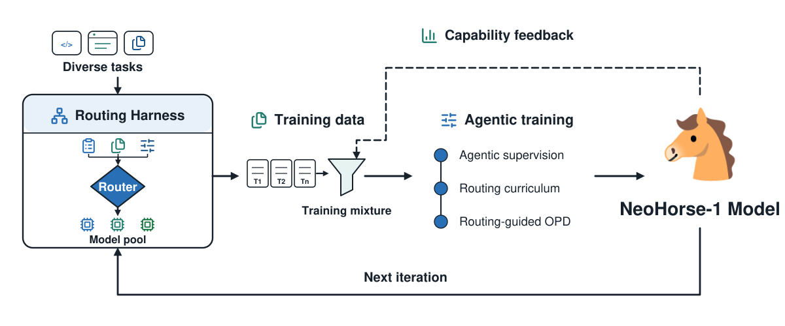

**Source figure / official image** — Figure 2: the routing-guided agentic training loop — diverse tasks run through a routing harness over a model pool, interaction records become a training mixture, capability feedback steers the next distribution, and updated models return to the harness. · Figure 2 · [source](https://arxiv.org/html/2609.08183v1)

**nanoRSI reproduction** — not-run. Last source check: 2026-09-14.

**Open code / weights / data links** — [Official implementation (Apache-2.0)](https://github.com/TokenRhythm/NeoHorse)

**Primary sources** — [arXiv abstract (v1 date)](https://arxiv.org/abs/2609.08183) · [Paper HTML (loop description, scores, limitations)](https://arxiv.org/html/2609.08183v1) · [Official implementation (Apache-2.0)](https://github.com/TokenRhythm/NeoHorse)

### Aspire: Can Models Self-Evolve from Vague Goals?

**2026-08-31** · paper · Direct bounded loop

**Publication date** — arXiv v1: 2026-08-31. Shared project announcement: 2026-09-01.

**Institutional relationship** — The paper explicitly lists the four research affiliations, including ByteDance Seed.

**What changes and how feedback is reused** — Given a vague goal, an agent chooses data, training methods and parent checkpoints, or edits a harness. The controller verifies lineage and freezes candidates. Score-gated weight campaigns retain an eligible checkpoint only if its measured gain is positive, otherwise restoring the incoming state; harness evaluation is post-freeze and does not imply recursive handoff.

**Author-reported result** — Hidden evaluation contains 520 expert-authored items across six goals. With Qwen3.5-4B fixed as runtime, the best successor harness scores 27.22 task-macro versus 28.64 for original Qwen-Agent; all three valid successors trail the reference.

**Evidence limits** — Nonnegative retained gains can be created by rollback selection; they do not mean every attempted update helped. Vague goals and proxy validation can induce regressions.

**Code / weights / data / license** — Paper/project public; paper CC BY-NC-ND 4.0. Complete benchmark code, hidden data, trained checkpoints and asset licenses were not verified as publicly downloadable.

**Possible nanoRSI experiment — not implemented here** — Proposed nanoRSI learner reporting: separate raw candidate delta from retained-state delta, export failed attempts, and test vague versus explicit goals.

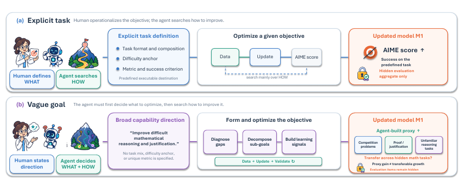

**Source figure / official image** — Figure 1: From explicit-task optimization to vague-goal-driven self-evolution. · Figure 1, PDF p.2 · [source](https://arxiv.org/html/2608.31111v1)

**nanoRSI reproduction** — not-run. Last source check: 2026-09-13.

**Open code / weights / data links** — No verified public code/asset link in the audited sources.

**Primary sources** — [arXiv first submission](https://arxiv.org/abs/2608.31111) · [Paper v1 retention protocol and Table 1](https://arxiv.org/html/2608.31111v1) · [Official Self-Developing Agents project](https://self-developing-agents.github.io/)

### From Self-Evolving Synthetic Data to Verifiable-Reward RL: Post-Training Multi-turn Interactive Tool-Using Agents

**2026-01-30** · paper · Direct bounded loop

**Publication date** — arXiv v1: 2026-01-30; v3: 2026-03-10 (numbers cited from v3).

**Institutional relationship** — Paper v3: Jiaxuan Gao, Shusheng Xu, Yi Wu at Tsinghua University; Jiaao Chen, Di Jin at Eigen AI (corresponding); Chuyi He independent.

**What changes and how feedback is reused** — A hierarchical multi-agent engine generates diversified synthesis-evaluation plan pairs; worker agents run task synthesis, task verification, trajectory rollout (with a user simulator) and trajectory verification (attributing failure to task vs trajectory); each instance gets an executable per-instance checker comparing final state against ground truth for binary reward. A reflection module updates both synthesis and evaluation plans from failures each iteration - the data pipeline itself evolves - before GRPO-style RL on the verifiable rewards.

**Author-reported result** — Qwen3-235B-A22B-2507 + RL: 73.0% pass^1 on tau2-bench Airline (matches Gemini 3.0 Pro, exceeds GPT-5 at 62.5%), 98.3% Telecom (best reported); mix-trained average 81.3% surpassing Qwen3-Max-Thinking (80.7%) and GPT-5 (80.0%). Ablations (Airline SFT, 30B-A3B): full 56.0% vs without validation 50.0%, without evolution 44.0%, 4 fixed prompt sets 42.5%, human-expert pipeline 52.0% - the evolving engine beats human-authored data.

**Evidence limits** — Retail remains hardest (Claude Sonnet 4.5 leads at 86.2% vs their 75.0%); smaller models degrade under mix training (30B-A3B average 71.5% -> 63.7%); off-the-shelf user simulators unstable in dual-control settings.

**Code / weights / data / license** — Example code under github.com/inclusionAI/AReaL/tree/main/examples/tau2 (CC BY-NC-SA 4.0 - noncommercial terms; do not copy into nanoRSI).

**Possible nanoRSI experiment — not implemented here** — For nanoRSI: per-instance executable checkers plus a reflection loop that revises the task generator itself - the same two surfaces (task validity, trajectory attribution) a minimal self-evolving data loop needs.

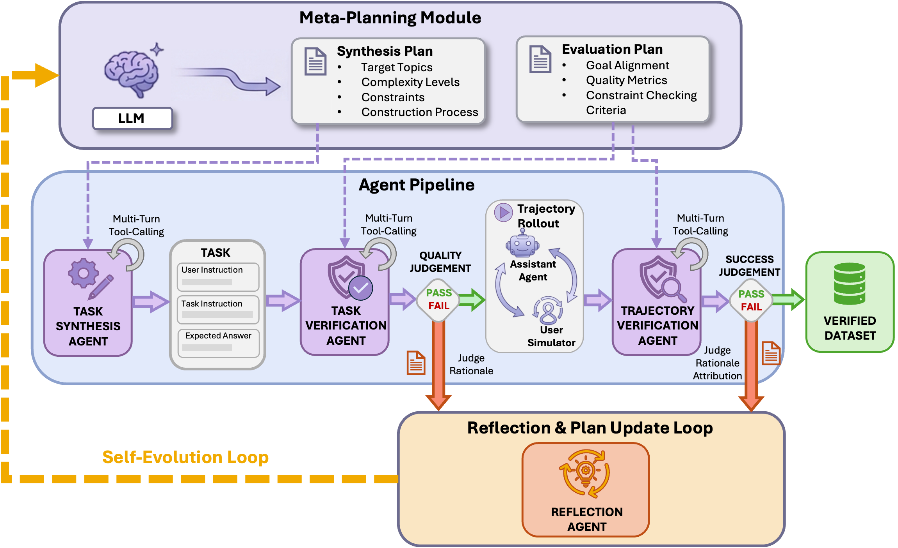

**Source figure / official image** — Figure 1: the self-evolving data engine - meta-planning emits synthesis-evaluation plan pairs, workers synthesize/verify tasks and trajectories, and a reflection module updates the plans from failures in a closed loop. · Figure 1 · [source](https://arxiv.org/html/2601.22607v3)

**nanoRSI reproduction** — not-run. Last source check: 2026-09-16.

**Open code / weights / data links** — [Example code (CC BY-NC-SA 4.0)](https://github.com/inclusionAI/AReaL/tree/main/examples/tau2)

**Primary sources** — [arXiv abstract](https://arxiv.org/abs/2601.22607) · [Paper v3 (affiliations, Figure 1, tables)](https://arxiv.org/html/2601.22607v3) · [Example code (CC BY-NC-SA 4.0)](https://github.com/inclusionAI/AReaL/tree/main/examples/tau2)

## Enabling adaptation mechanisms (5)

### Doc-to-LoRA: Learning to Instantly Internalize Contexts

**2026-02-13** · paper · Enabling technique / evaluation

**Publication date** — arXiv v1: February 13, 2026. The combined February project page also discusses Text-to-LoRA, whose June 2025 original remains outside the window.

**Institutional relationship** — The official project page identifies Sakana authors; Shinnosuke Uesaka additionally lists Minerva University.

**What changes and how feedback is reused** — A meta-trained hypernetwork maps document activations to LoRA weights. Teacher/student distillation supplies training feedback; deployment reuses generated adapters for later queries without rereading the document or per-document gradients.

**Author-reported result** — On 2WikiMultihopQA, iterative D2L reports 0.844 normalized ROUGE-L, 3.791 GB additional update memory and 0.551 s latency. Oracle context distillation reports 0.901, 7.820 GB and 40.171 s; normalized performance is relative to contextual inference.

**Evidence limits** — An amortized adaptation mechanism, not a recursive loop: deployment does not improve the hypernetwork. Accuracy and adapter capacity remain constraints.

**Code / weights / data / license** — Official code: MIT. Hugging Face checkpoint files verified; model-card license absent. Data-generation/evaluation scripts exist; complete dataset redistribution not audited.

**Possible nanoRSI experiment — not implemented here** — Proposed: explore versioned document adapters as a later memory backend, benchmarking factual retention against retrieval.

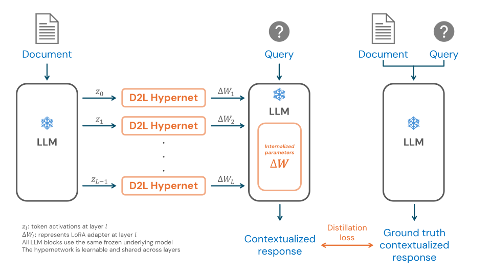

**Source figure / official image** — Overview of Doc-to-LoRA: a hypernetwork maps document activations to LoRA weights for fast internalization. · Overview figure · [source](https://arxiv.org/html/2602.15902v1)

**nanoRSI reproduction** — not-run. Last source check: 2026-09-13.

**Open code / weights / data links** — [Official code](https://github.com/SakanaAI/doc-to-lora) · [Official checkpoint inventory](https://huggingface.co/SakanaAI/doc-to-lora/tree/main)

**Primary sources** — [Original paper date](https://arxiv.org/abs/2602.15902) · [Paper Table 1](https://arxiv.org/html/2602.15902v1) · [Official project and affiliations](https://pub.sakana.ai/doc-to-lora/) · [Official code](https://github.com/SakanaAI/doc-to-lora) · [Official checkpoint inventory](https://huggingface.co/SakanaAI/doc-to-lora/tree/main)

### TRINITY: An Evolved LLM Coordinator

**2025-12-04** · paper · Enabling technique / evaluation

**Publication date** — arXiv v1: December 4, 2025; Sakana's April 26, 2026 announcement is later dissemination.

**Institutional relationship** — Most authors list Sakana; Qi Sun also lists Science Tokyo. Peter Schwendeman lists Michigan and work during a Sakana internship.

**What changes and how feedback is reused** — Sep-CMA-ES perturbs a small coordinator head, scores terminal task outcomes and recombines candidate parameters. The retained coordinator repeatedly selects a model and Thinker/Worker/Verifier role; underlying foundation-model weights stay fixed.

**Author-reported result** — LiveCodeBench v6: 86.2% pass@1 versus GPT-5 83.8%, using uncapped outputs and no coordinator retraining. Under the separate 4,096-token, five-turn comparison, TRINITY scores 61%; do not conflate these settings.

**Evidence limits** — An offline optimizer learns coordination on human-selected benchmarks; the deployed agent is not shown modifying its own learning algorithm.

**Code / weights / data / license** — Paper public. Official implementation, coordinator weights, redistributed data and their licenses not verified; third-party implementations are not official releases.

**Possible nanoRSI experiment — not implemented here** — Proposed: evaluate a tiny evolvable role/model router against static routing at equal token budgets.

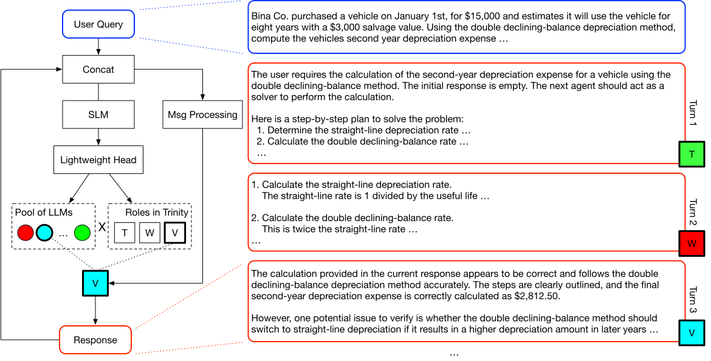

**Source figure / official image** — Figure 1: Cyclical coordination architecture with a compact coordinator selecting model and role each turn. · Figure 1 · [source](https://arxiv.org/html/2512.04695v1)

**nanoRSI reproduction** — not-run. Last source check: 2026-09-13.

**Open code / weights / data links** — No verified public code/asset link in the audited sources.

**Primary sources** — [Original paper date](https://arxiv.org/abs/2512.04695) · [Original paper methods and experimental conditions](https://arxiv.org/html/2512.04695v1) · [Official Sakana announcement](https://sakana.ai/trinity/)

### Conductor / Fugu: An LLM Trained to Orchestrate (and Include) Itself

**2025-12-04** · paper · Enabling technique / evaluation

**Publication date** — Conductor arXiv v1: 2025-12-04; v5: 2026-05-06 (ICLR 2026). The Fugu product tech report (arXiv 2606.21228, June 2026) ships the coordinator behind an OpenAI-compatible API. First RSI-Lab-lineage mechanism output verified since the lab's June 5 announcement.

**Institutional relationship** — Paper v5: Sakana AI (Japan) with University of Michigan and Institute of Science Tokyo; equal-contribution authors include interns at Sakana AI.

**What changes and how feedback is reused** — A 7B model (Qwen2.5-7B) is trained for 200 GRPO iterations to output complete coordination strategies as three Python lists - worker model IDs, natural-language subtask instructions, and access lists - thereby learning to design communication topologies between stronger workers and to prompt-engineer their instructions, trained end-to-end on task reward with randomized agent pools. Because the Conductor can specify itself as a worker, discovered topologies can be recursive, giving dynamic test-time scaling.

**Author-reported result** — Conductor (7B coordinating GPT-5/Claude/Gemini-class workers): LiveCodeBench 83.93, GPQA-D 87.5, AIME25 93.3, average 77.27 - above GPT-5 (74.78) and every individual worker; versus multi-agent baselines in a constrained setting: MASRouter 56.89, MoA 62.13, RouterDC 52.41, Smoothie 56.48 vs Conductor 72.35 average.

**Evidence limits** — Depends on expensive frontier workers (the authors flag an economic-divide concern); the fine-grained topology variant produced no significant gains; a 7B Conductor caps planning quality. Fugu numbers come from the vendor's own tech report.

**Code / weights / data / license** — Conductor paper: base model and datasets stated public, no standalone code repo located. Fugu is served as a product API; its tech report is arXiv 2606.21228.

**Possible nanoRSI experiment — not implemented here** — For nanoRSI: orchestration-as-a-learned-skill - if populations of candidate harnesses exist, a small trained selector that writes subtask assignments (and may include itself) is a cheap population-level meta-controller to compare against rule-based selection.

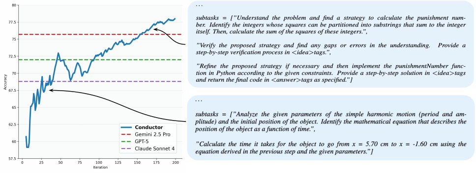

**Source figure / official image** — Figure 3: Conductor training - GRPO updates the 7B coordinator on rewards from full multi-agent rollouts over randomized worker pools, teaching it to write topology + instructions that can recursively include itself. · Figure 3 · [source](https://arxiv.org/html/2512.04388v5)

**nanoRSI reproduction** — not-run. Last source check: 2026-09-17.

**Open code / weights / data links** — No verified public code/asset link in the audited sources.

**Primary sources** — [Conductor arXiv abstract](https://arxiv.org/abs/2512.04388) · [Paper v5 (affiliations, training figure, Tables 1/7)](https://arxiv.org/html/2512.04388v5) · [Fugu product page](https://sakana.ai/fugu/) · [Fugu Max release post](https://sakana.ai/fugu-max-release/)

### Discovering state-of-the-art reinforcement learning algorithms

**2025-10-22** · paper · Enabling technique / evaluation

**Publication date** — Online publication: 2025-10-22; December issue date is later. Manuscript receipt in December 2024 is not public publication.

**Institutional relationship** — Primary article lists all authors at Google DeepMind.

**What changes and how feedback is reused** — A meta-network supplies policy/prediction update targets. Meta-gradients maximize agents' collective return; updated rules train subsequent agents. The frozen discovered rule transfers to new environments.

**Author-reported result** — Extended Data Fig. 4 reports reaching MuZero's final Atari performance with approximately 40% less evaluation TPU computation: 57 games, 200M environment steps. This excludes the separate discovery cost.

**Evidence limits** — Bounded learning-rule discovery under a fixed human-designed meta-objective/framework; not evidence of general recursively self-modifying intelligence.

**Code / weights / data / license** — Official meta-training/evaluation code and Disco103 meta-parameters verified. Software: Apache-2.0; other repository materials: CC BY 4.0. Environment/data terms are separate. Full-scale reproduction is computationally substantial.

**Possible nanoRSI experiment — not implemented here** — Proposed: separate learner weights from update-rule parameters and test an outer objective in tiny environments before scaling.

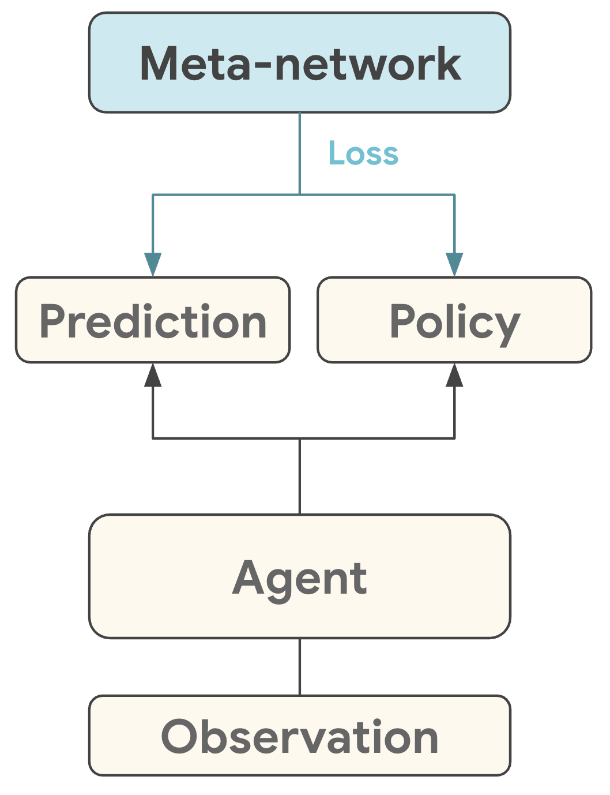

**Source figure / official image** — Official DiscoRL method diagram: a meta-network learns update targets from population experience. · Official project method figure · [source](https://google-deepmind.github.io/disco_rl/)

**nanoRSI reproduction** — not-run. Last source check: 2026-09-13.

**Open code / weights / data links** — [Official code and licence statements](https://github.com/google-deepmind/disco_rl)

**Primary sources** — [Primary Nature article at PMC](https://pmc.ncbi.nlm.nih.gov/articles/PMC12695655/) · [Publication metadata](https://pubmed.ncbi.nlm.nih.gov/41125136/) · [Author project and artifact availability](https://google-deepmind.github.io/disco_rl/) · [Official code and licence statements](https://github.com/google-deepmind/disco_rl)

### Self-Evolving LLMs via Continual Instruction Tuning

**2025-09-14** · paper · Enabling technique / evaluation

**Publication date** — arXiv v1: 2025-09-14; latest recorded revision 2025-10-15 (v4). Original submission is used for inclusion.

**Institutional relationship** — Paper v1 explicitly assigns authors to BUPT and Tencent AI Lab. Tencent is a collaborating institution and application setting.

**What changes and how feedback is reused** — Sequential instruction tuning updates task-specific and shared LoRA experts. A task-aware adversarial discriminator helps separate transferable knowledge from task-specific information; retained experts carry earlier knowledge into subsequent tasks. No autonomous task-generation/evaluation/improver-retraining loop is established, so classify this as enabling continual learning.

**Author-reported result** — The paper evaluates sequential learning and Tencent content-review applications. No numerical claim is retained here: its abstract describes review-cost reduction while the experimental discussion describes offline stripping-rate improvements, which need harmonization before quoting a business effect.

**Evidence limits** — Preserving knowledge under externally supplied task streams is not evidence of autonomous recursive self-improvement. Industrial data access limits reproducibility.

**Code / weights / data / license** — Public BAI-LAB/MoE-CL implementation verified. Weights and industrial data: not verified public. No code license was located on the opened repository page; do not assume reuse permission.

**Possible nanoRSI experiment — not implemented here** — Proposed nanoRSI learner control: evaluate a fixed externally supplied task stream, retaining per-task regression scores to distinguish continual learning from direct self-improvement.

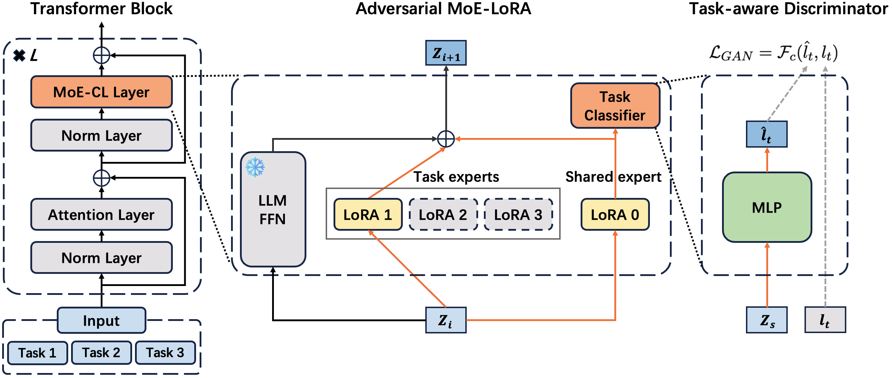

**Source figure / official image** — Figure 1: MoE-CL combines task-specific LoRA experts, a shared expert and a task-aware discriminator. · Figure 1 · [source](https://arxiv.org/html/2509.18133v1)

**nanoRSI reproduction** — not-run. Last source check: 2026-09-13.

**Open code / weights / data links** — [Author implementation](https://github.com/BAI-LAB/MoE-CL)

**Primary sources** — [arXiv submission and revision history](https://arxiv.org/abs/2509.18133) · [Paper v1 affiliations and experiments](https://arxiv.org/html/2509.18133v1) · [Author implementation](https://github.com/BAI-LAB/MoE-CL)
