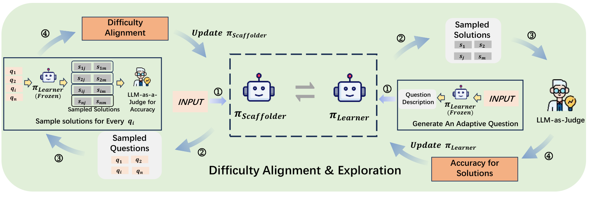
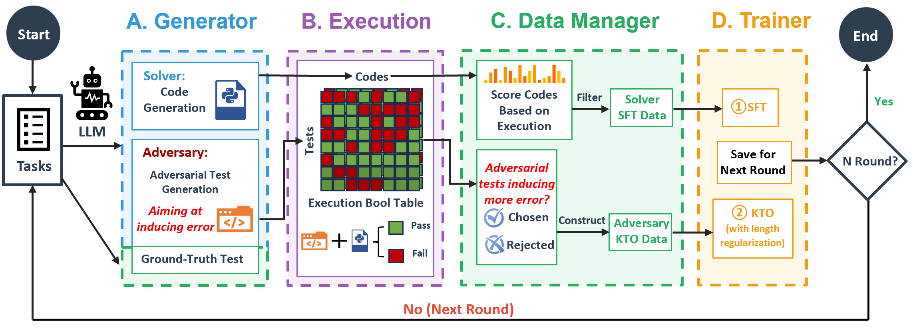
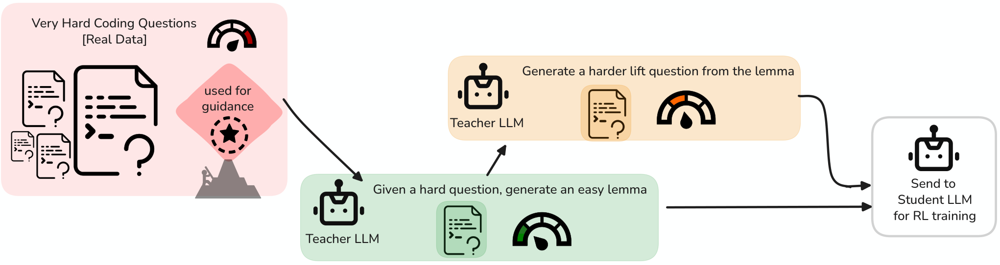
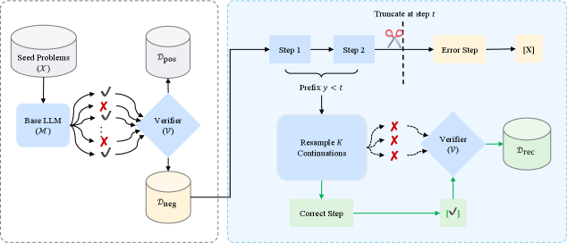
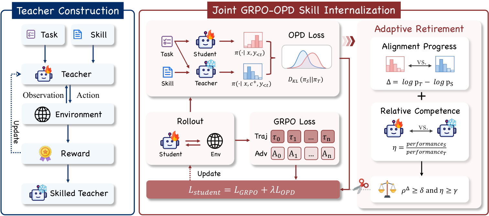
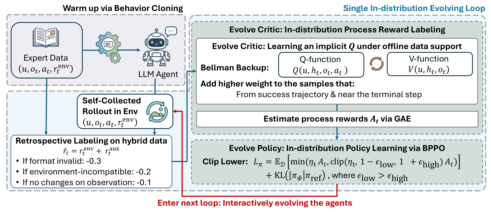
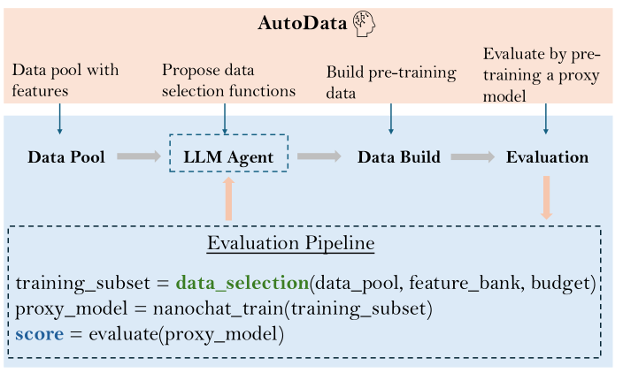
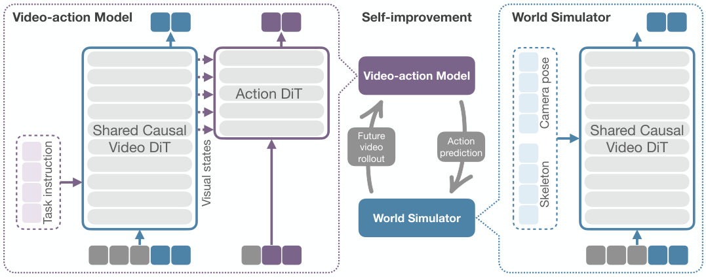
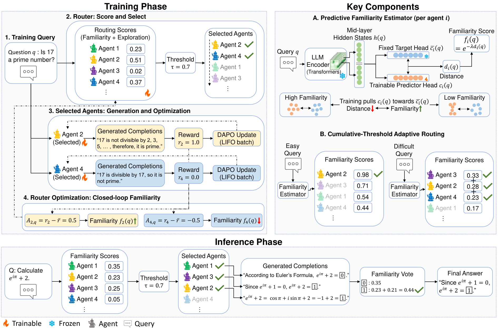

# 参数与训练数据

[← 研究地图](README.zh-CN.md)

## 机制家族

| 家族 | 条目数 |
| --- | ---: |
| [自博弈与课程任务生成](#family-self-play-curriculum) | 14 |
| [验证器与奖励进化](#family-verifier-reward) | 5 |
| [技能-权重共进化](#family-skill-weight-coevolution) | 2 |
| [经验蒸馏与测试时适应](#family-experience-distillation) | 6 |
| [自主训练智能体与数据管线](#family-autonomous-training) | 6 |
| [支撑性适应机制](#family-enabling-adaptation) | 7 |

## 自博弈与课程任务生成 (14)

### STRETCH the Boundaries: A Unified Self-Taught Framework for Progressive LLM Evolution

**2026-09-16** · paper · 直接有界闭环

**日期说明** — arXiv v1 2026-09-16。

**机构关系** — 学术工作（伯明翰大学计算机学院）。

**改变对象与反馈复用** — 同一模型在同参数空间交替扮演 Scaffolder 与 Learner：GRPO 训练的出题奖励钉在学习者 50% 成功率，把任务保持在拉伸区；epoch 级 Golden Experience Replay（成功题/轨迹对 SFT）稳住双循环。

**作者报告结果** — Qwen2.5-7B-Instruct 在 Mano Complex：67.9 ER / 63.6 SA，对照 R-Zero 64.8/61.7、Absolute Zero 63.4/60.1；Complex OR 58.7/55.0 vs StepORLM 57.3/52.6；六个自博弈 epoch、LoRA rank16、2×H100。

**证据边界** — 作者自报，相对 R-Zero/AZR 在运营推理基准上优势不大；判分/模拟器依赖 GPT-4o-mini；代码仓库无 LICENSE 文件。

**代码／权重／数据／许可** — 代码位于 github.com/GuanNiPiShi123/STRETCH（核验时无 LICENSE——仅可借鉴思想）；论文 arXiv 非独家许可。

**可用于 nanoRSI 的实验方向——本次未实现** — 50% 成功率的奖励峰值可为 nanoRSI 探针任务生成提供可调难度目标——保持半数可解的任务流让每次评估的信息量最大。

**原文图／官方图片** — STRETCH 的双循环异步更新：Scaffolder 环对齐题目难度，Learner 环提升解题，epoch 间做黄金经验回放。 · Figure 2 (Method_v2_cropped.png) · [source](https://arxiv.org/html/2609.18642v1)

**nanoRSI 复现状态** — not-run. 来源最近核验：2026-09-19.

**开源代码／权重／数据链接** — [Code repository](https://github.com/GuanNiPiShi123/STRETCH)

**一手来源** — [arXiv abstract](https://arxiv.org/abs/2609.18642) · [Paper HTML (affiliations, Table 1, Figure 2)](https://arxiv.org/html/2609.18642v1) · [Code repository](https://github.com/GuanNiPiShi123/STRETCH)

### SPADE: Self-Play in Adaptive Synthetic Executable Environments

**2026-08-19** · paper · 直接有界闭环

**日期说明** — arXiv v1：2026-08-19（2608.19197）；v2 2026-08-24；v3 2026-08-31。数字引自 v1，并已在 abs 页复核。

**机构关系** — 论文：以华盛顿大学为首（通讯 Bo Liu、Natasha Jaques）的九机构合作，含斯坦福、东北、CMU、MIT、NUS、SNU、Stevens 与芝大。

**改变对象与反馈复用** — 同一 LLM 演两角。环境设计者把完整 MDP 写成可执行 Python（Gym 风格 reset/step），锚定在采样的预训练语料文档 + 带后悔分与技能标签的历史环境记忆上，并输出特权提示；推理智能体分别在有/无提示下玩该环境，设计者奖励为基于提示的后悔（回报差，下限为零）混以胜率带 [0.4,0.6] 上的平顶难度锚。带角色优势归一化、延迟设计者更新与非对称裁剪的 GRPO 让环境分布与智能体能力前沿共进化。

**作者报告结果** — Qwen3-30B-A3B 游戏套件均值：SPADE 58.3 对基线 50.2（+8.1）、固定环境 RLVE 53.0 与 GRPO 51.4（超最强固定环境基线 +5.3）；工具使用均值 +7.7（ACEBench-Agent 75.9 对 62.0）。消融：去记忆 53.2、去语料锚定 53.5、去设计者训练 40.5（低于基线）。语料锚定把环境多样性 Vendi/nn 从 0.04 提到 0.68，物理公式泄露率从 25% 降到 5%。

**证据边界** — 作者自述：复杂度受模型规模约束（'看不见的皮带'）；优化器是人工设计的 GRPO（SPADE 不修改自身学习规则）；后悔课程无形式化最优性；在固定基准而非开放增长上评测。

**代码／权重／数据／许可** — 代码在 github.com/spade-rl/spade（MIT，核验时 102 星）；项目页 spade-rl.github.io；发布 HF 权重与环境语料。

**可用于 nanoRSI 的实验方向——本次未实现** — 对 nanoRSI：用基于提示的后悔（提示带来多少提升）而非原始难度奖励任务/环境生成器，并让生成环境锚定在检索到的语料文档上，防止多样性塌缩。

**原文图／官方图片** — 图 4：SPADE——环境设计者以记忆与语料为条件产出可执行环境与特权提示；智能体在有/无提示下各玩一次，回报差即设计者的基于提示的后悔。 · Figure 4 · [source](https://arxiv.org/html/2608.19197v1)

**nanoRSI 复现状态** — not-run. 来源最近核验：2026-09-17.

**开源代码／权重／数据链接** — [Code repository (MIT)](https://github.com/spade-rl/spade)

**一手来源** — [arXiv abstract](https://arxiv.org/abs/2608.19197) · [Paper v1 (affiliations, Figure 4, tables)](https://arxiv.org/html/2608.19197v1) · [Code repository (MIT)](https://github.com/spade-rl/spade)

### Self-Play Meets Skill Evolution: Self-Evolving Search Agents that Pose, Solve, and Remember

**2026-07-31** · paper · 直接有界闭环

**日期说明** — arXiv v1：2026-07-31。核验时无更新版本。

**机构关系** — 论文 v1：中科院大学 + 自动化所 + 北京大学 + 明略科技 + 清华大学 + 齐鲁工业大学（山东省计算中心）；通讯 Guannan He 与 Changwei Wang。

**改变对象与反馈复用** — 非对称自博弈耦合三个进化对象：挑战者从 5 万答案池提出可验证的搜索问题；只有求解者能检索技能库（记忆对挑战者隐藏以防策略泄漏）； informative 的前沿失败被蒸馏为技能（触发条件、规避线索、查询模板），余弦去重并按净负贡献逐出。技能进入在线策略 rollout，重塑策略梯度的轨迹分布，使增益内化进求解者权重；变强的求解者又改变挑战者以前沿塑形的难度奖励，新失败再重写记忆——只在步边界提交库更新的闭环飞轮。

**作者报告结果** — 七个 QA 基准（3,125 道留出题）：六个骨干上比 SSP 平均 +1.2~+3.2（如 Qwen3-8B 均值 47.5、超基线 +7.0）；统一协议下 51.0 对 SkillRL-Search-7B 的 50.1；免记忆部署（SESA-Off）保留 +1.8~+2.2，重新启用技能库再加 +0.5~+1.0。消融：去失败蒸馏 -2.7。

**证据边界** — 增益非逐基准均匀（Qwen3-4B 在 2Wiki、Qwen3-8B 在 Bamboogle 低于 SSP）；检索可能干扰求解者；耦合进化证据为相关性；仅求解者可访记忆是设计约束而非消融项。

**代码／权重／数据／许可** — 论文列出代码 github.com/Zenghuang-Fu/SESA-Self-Evolving-Agents（论文给出的 URL；核验时经 GitHub API 未能解析）。论文 CC BY 4.0。

**可用于 nanoRSI 的实验方向——本次未实现** — 对 nanoRSI：对任务生成器隐藏进化中的记忆（非对称访问），使生成任务无法利用记忆答案；并在宣布递归前把技能增益内化进权重。

**原文图／官方图片** — 图 2：SESA 训练环——记忆启动播种可检索技能库；非对称自博弈让挑战者出题、仅求解者检索技能；前沿塑形与失败蒸馏闭合飞轮。 · Figure 2 · [source](https://arxiv.org/html/2607.29468v1)

**nanoRSI 复现状态** — not-run. 来源最近核验：2026-09-16.

**开源代码／权重／数据链接** — 核验来源中没有确认的公开代码／资产链接。

**一手来源** — [arXiv abstract](https://arxiv.org/abs/2607.29468) · [Paper v1 (affiliations, Figure 2, tables)](https://arxiv.org/html/2607.29468v1)

### From RLVR to RLSVR: Task Transformation Induces Self-Verifiable Rewards for Open-Ended LLM Self-Improvement

**2026-07-26** · paper · 直接有界闭环

**日期说明** — arXiv v1：2026-07-26；v2：2026-07-31（数字引自 v2）。COLM 2026 接收。

**机构关系** — 论文 v2：杜克大学、Adobe、俄勒冈州立、宾州州立、新加坡国立、Amazon；其中一项贡献完成于 Adobe。

**改变对象与反馈复用** — 把开放式任务变换为'潜变量诱导精确可查奖励'的代理环境：SpyRL（谁是卧底）中 n-1 个平民看完整输入、卧底看降级版，各自作答后检测者投票猜卧底——检测奖励对环境指定的卧底编号确定性可查，表演奖励按怀疑票零和分配。GRPO 式优化配角色优势估计与迟滞门控的交替更新；全程无人类偏好、无 LLM 裁判。

**作者报告结果** — Qwen3-8B 对骨干胜率：摘要 75.4%、创意写作 77.3%；GovReport ROUGE-L 36.7 对 Absolute Zero 33.2、R-Zero 32.1、基线 30.2；数学同升（Qwen3-4B：GSM8K 93.4 对 84.5、GPQA-D 41.3 对 26.3，平均 +8.97%）；以少约 200-900 美元的验证器推理成本胜过 rubric-as-reward 流水线（Qwen3.5-27B-RaR）。

**证据边界** — 数学到写作的跨任务迁移失败（负迁移）；组规模收益 n>5 后饱和；降级算子必须保持有意义且不退化；长期自博弈有已知退化风险，仅缓解未消除。

**代码／权重／数据／许可** — 代码在 github.com/wangqinsi1/RLSVR/tree/SpyRL（Apache-2.0，核验时 192 星）。论文 CC BY 4.0。

**可用于 nanoRSI 的实验方向——本次未实现** — 对 nanoRSI：任务缺验证器时，把它变换为'隐藏状态使奖励机械可查'的代理博弈——用构造获得可验证性，而非靠裁判。

**原文图／官方图片** — 图 2：两阶段 SpyRL 博弈——平民与信息降级的卧底各自作答、检测者投票；表演奖励与怀疑票成反比，检测奖励对已知卧底身份确定性可查。 · Figure 2 · [source](https://arxiv.org/html/2607.23802v2)

**nanoRSI 复现状态** — not-run. 来源最近核验：2026-09-16.

**开源代码／权重／数据链接** — [Code repository (Apache-2.0)](https://github.com/wangqinsi1/RLSVR/tree/SpyRL)

**一手来源** — [arXiv abstract](https://arxiv.org/abs/2607.23802) · [Paper v2 (affiliations, Figure 2, tables)](https://arxiv.org/html/2607.23802v2) · [Code repository (Apache-2.0)](https://github.com/wangqinsi1/RLSVR/tree/SpyRL)

### GPT-Red: Automated Red Teaming via Self-Play at Scale

**2026-07-15** · paper · 直接有界闭环

**日期说明** — 官方论文发布日。

**机构关系** — OpenAI 论文及公司报告。

**改变对象与反馈复用** — 自博弈 RL 依据攻击成功与抵抗成功的奖励更新攻击者和防守模型群体；更强防守者提供更难训练信号，再用训练后的红队生成 GPT-5.6 的对抗训练数据。

**作者报告结果** — 报告中，GPT-5.6 Sol 面对 GPT-Red 直接注入的成功攻击率为 0.05%，按保留环境内的攻击尝试取平均；不能解释为任意攻击都只有这一成功概率。

**证据边界** — 属于有界对抗共同训练，未证明自主设计下一代模型；内部模型及训练规模限制本地复现。

**代码／权重／数据／许可** — 论文公开；GPT-Red 仅供内部使用。所引来源未发布完整训练代码、权重与数据，未确认可复用代码许可。

**可用于 nanoRSI 的实验方向——本次未实现** — 可探索无害对抗样例，并分别衡量样例有效性、任务完成率和误拒率。

**原文图／官方图片** — 图 1：随着测试时计算量增加，GPT-Red 的红队攻击表现变化。 · Figure 1, PDF p.1 · [source](https://cdn.openai.com/pdf/gpt-red-automated-red-teaming-via-self-play-at-scale.pdf)

**nanoRSI 复现状态** — not-run. 来源最近核验：2026-09-13.

**开源代码／权重／数据链接** — 核验来源中没有确认的公开代码／资产链接。

**一手来源** — [Paper](https://cdn.openai.com/pdf/gpt-red-automated-red-teaming-via-self-play-at-scale.pdf) · [Official report](https://openai.com/index/unlocking-self-improvement-gpt-red/)

### ACE: Self-Evolving LLM Coding Framework via Adversarial Unit Test Generation and Preference Optimization

**2026-04-17** · paper · 直接有界闭环

**日期说明** — arXiv v1 2026-04-17、v2 2026-05-21（当前）；abs 页无接收声明。与本库无关的 Agentic Context Engineering 条目同名缩写 ACE。

**机构关系** — 学术工作（复旦大学数据科学学院）。

**改变对象与反馈复用** — 单个 LLM 交替扮演 Solver（写代码）与 Adversary（构造对抗单元测试）；执行 pass/fail 布尔表驱动 Solver 侧 SFT 过滤与 Adversary 侧 KTO 偏好优化，多轮递归自改进，无需 ground-truth 代码或外部奖励模型。

**作者报告结果** — 共享底座的双 LoRA 适配器：Qwen3-4B 经 5 轮自进化 CodeContests pass@1 46.7（instruct 41.7、ReasonFlux-Coder-4B 24.0）、LiveCodeBench 37.5；Qwen2.5-7B 在 OOD LiveCodeBench 38.9，对照 ReasonFlux-Coder-7B 33.5、instruct 30.4。

**证据边界** — 作者自报；对抗测试的强度受限于对抗者策略（测试质量无外部核验）；未找到代码发布。

**代码／权重／数据／许可** — arXiv 论文公开；核验时未发现代码或权重发布。

**可用于 nanoRSI 的实验方向——本次未实现** — nanoRSI 可让提案者在候选编辑之外同时产出对抗探针用例：两者的执行结果共同构成验收信号，在最小任务集上去掉对裁判模型的依赖。

**原文图／官方图片** — 单个 LLM 交替扮演 Solver 与 Adversary；在 ground-truth 与对抗测试上的执行结果驱动 SFT 过滤与 KTO 偏好优化。 · Figure 2 (method_pipeline.png) · [source](https://arxiv.org/html/2605.16299v2)

**nanoRSI 复现状态** — not-run. 来源最近核验：2026-09-19.

**开源代码／权重／数据链接** — 核验来源中没有确认的公开代码／资产链接。

**一手来源** — [arXiv abstract](https://arxiv.org/abs/2605.16299) · [Paper HTML (affiliations, Table 2, Figure 2)](https://arxiv.org/html/2605.16299v2)

### GASP: Guided Asymmetric Self-Play For Coding LLMs

**2026-03-16** · paper · 直接有界闭环

**日期说明** — arXiv v1 2026-03-16；abs Comments 明确写有 ICLR 2026 递归自改进研讨会（RSI 2026）Spotlight 与 Lifelong Agents（LLA 2026）研讨会接收。

**机构关系** — 学术工作（图宾根 ELLIS/MPI 集群）。

**改变对象与反馈复用** — 锚定真实难题的非对称自博弈：对标准 RLVR 解不出的 goalpost 题，教师先生成较易的 lemma 变体、再生成更难的 lift 变体构成课程；学生解答经拒绝采样回炉训练，全程无需外部数据。

**作者报告结果** — Qwen2.5-Coder-7B 在 LiveCodeBench v5（216 题、3 种子）：pass@20 33.69±0.28，对照 AZR 31.15、真实数据 RL 33.10、底座 29.68；GASP+真实数据 RL 最佳 34.46；pass@1 18.26 vs AZR 17.49。pass@100 解出 146 道 goalpost 中的 11 道（基线按构造为 0）；HumanEval+ 上 AZR 仍胜（83.54 vs 79.67）。

**证据边界** — 增益在单一编码基准族上绝对点数不大；HumanEval+ 的退化论文如实报告；未找到代码发布。

**代码／权重／数据／许可** — arXiv 论文公开；核验时未发现代码或权重发布。

**可用于 nanoRSI 的实验方向——本次未实现** — goalpost 机制可映射到 nanoRSI 探针任务：维护未解冻结任务清单，让提案者朝它们生成 lemma/lift 变体，把攻破的 goalpost 数作为搜索进度读数。

**原文图／官方图片** — 自博弈由真实难题 goalpost 引导：教师先生成较易的 lemma 变体，再朝 goalpost 生成更难的 lift 变体。 · Figure 1 (overview_fig.png) · [source](https://arxiv.org/html/2603.15957v1)

**nanoRSI 复现状态** — not-run. 来源最近核验：2026-09-19.

**开源代码／权重／数据链接** — 核验来源中没有确认的公开代码／资产链接。

**一手来源** — [arXiv abstract](https://arxiv.org/abs/2603.15957) · [Paper HTML (affiliations, Table 1, Figure 1)](https://arxiv.org/html/2603.15957v1)

### Toward Training Superintelligent Software Agents through Self-Play SWE-RL

**2025-12-21** · paper · 直接有界闭环

**日期说明** — arXiv v1：2025-12-21；v3：2026-06-02（指标引自 v3）。ICML 2026 接收。

**机构关系** — 论文 v3：Yuxiang Wei（Meta FAIR + UIUC）、Zhiqing Sun（Meta TBD Lab）、Emily McMilin、Jonas Gehring、David Zhang、Gabriel Synnaeve、Sida Wang（Meta FAIR）、Daniel Fried（Meta FAIR + CMU）、Lingming Zhang（UIUC）。

**改变对象与反馈复用** — 单个 LLM（CWM-sft 32B）在沙箱化的真实仓库上同时扮演缺陷注入者与修复者，无需人工 issue 或测试。注入者在不看测试与 issue 的情况下探索仓库、发现测试运行方式，产出缺陷工件（测试脚本、解析器、注入 diff、测试弱化 diff），经一致性检查（含逆变异测试）验证；修复者只看反转的弱化补丁作为形式规格，必须给出通过恢复后 oracle 测试的修复。失败的求解尝试转化为有上限的二阶'高阶缺陷'。奖励完全锚定在测试结果上。

**作者报告结果** — 自博弈 RL 后（CWM-sft 32B、512 张 H100）SWE-bench Verified +10.4 分、SWE-Bench Pro +7.8 分；整条训练轨迹上持续优于人类数据基线，并迁移到自博弈中从未见过的自然语言 issue。论文自述 SWE-bench Verified 配对标准误约 2%。

**证据边界** — 作者自述缺少隐藏 oracle（完整测试进提示会诱发奖励黑客）、只用单元测试验证、双角色共享同一模型配置、合成自然语言 issue 会退化成无意义模式。附录 A 记录了挑战者的主导策略会使无缓解的自博弈停滞。

**代码／权重／数据／许可** — 未找到代码发布；基座模型 CWM-sft 在 Hugging Face（facebook/cwm-sft）。训练用 512 张 H100 与 CWM-RL 基础设施，超出 nanoRSI 本地复现范围。

**可用于 nanoRSI 的实验方向——本次未实现** — 对 nanoRSI：让变异者同时产出验证器工件（测试脚本 + 弱化补丁）并用逆变异测试校验的自博弈任务生成——无人工标注下生成器-验证器协同生产的蓝图。

**原文图／官方图片** — 图 1：Self-play SWE-RL 总览——同一智能体向沙箱仓库注入缺陷（含测试工件），再由同型模型对照恢复后的 oracle 测试完成修复；测试结果是唯一奖励。 · Figure 1 · [source](https://arxiv.org/html/2512.18552v3)

**nanoRSI 复现状态** — not-run. 来源最近核验：2026-09-16.

**开源代码／权重／数据链接** — 核验来源中没有确认的公开代码／资产链接。

**一手来源** — [arXiv abstract](https://arxiv.org/abs/2512.18552) · [Paper v3 (affiliations, Figure 1, ablations, Appendix A)](https://arxiv.org/html/2512.18552v3)

### Agent0: Unleashing Self-Evolving Agents from Zero Data via Tool-Integrated Reasoning

**2025-11-20** · paper · 直接有界闭环

**日期说明** — arXiv 首版为 2025 年 11 月 20 日，官方代码发布于 11 月 29 日；与 2025 年 7 月同名推荐系统论文不同。

**机构关系** — 作者名单由 UNC 团队主导；Can Qin、Caiming Xiong 单位为 Salesforce Research，Fang Wu 为斯坦福。

**改变对象与反馈复用** — 课程策略面向使用工具的执行器生成任务；十次执行器回答估计不确定性并产生伪标签，筛选任务用于训练执行器，新能力再改变下一轮课程，两种策略迭代更新。

**作者报告结果** — Qwen3-8B 数学平均分从 49.2 升至 58.2（增加 9.0 个百分点，约相对提高 18%），仅加工具为 53.2。七个数学基准除 AMC/AIME 使用 mean@32 外均为贪心 pass@1；表 1 报告训练过程峰值。

**证据边界** — 零数据指不使用人工整理的训练集，并不代表没有预训练知识；自一致性可能强化错误，结果不证明无界改进。

**代码／权重／数据／许可** — 已确认官方课程及执行器训练代码，Apache-2.0 许可；未确认训练后权重及完整生成数据集的发布。

**可用于 nanoRSI 的实验方向——本次未实现** — 建议：先用不可修改的答案验证器检验难度自适应任务生成，再考虑昂贵的策略训练。

**原文图／官方图片** — 图 2：Agent0 在课程生成与执行器训练之间的共同进化闭环。 · Figure 2 · [source](https://arxiv.org/html/2511.16043v1)

**nanoRSI 复现状态** — not-run. 来源最近核验：2026-09-13.

**开源代码／权重／数据链接** — [Official series repository and release date](https://github.com/aiming-lab/Agent0) · [Agent0 training implementation](https://github.com/aiming-lab/Agent0/blob/main/Agent0/README.md)

**一手来源** — [Paper dates](https://arxiv.org/abs/2511.16043) · [Original paper and numerical tables](https://arxiv.org/html/2511.16043v1) · [Official series repository and release date](https://github.com/aiming-lab/Agent0) · [Agent0 training implementation](https://github.com/aiming-lab/Agent0/blob/main/Agent0/README.md)

### EvoLMM: Self-Evolving Large Multimodal Models with Continuous Rewards

**2025-11-20** · paper · 直接有界闭环

**日期说明** — arXiv v1：2025-11-20；v4：2026-06-09（数字引自 v4）。

**机构关系** — 论文 v4：澳大利亚国立大学、林雪平大学、MBZUAI 与阿尔托大学。

**改变对象与反馈复用** — 单一冻结多模态基座拆成两个 LoRA 角色，仅用原始图像联合训练，零标注、零元数据、零奖励模型：提案者生成视觉落地的数学问题；求解者以 N=5 采样作答。求解者奖励是连续自一致性（多数答案的概率质量 + 冗长惩罚——不确定时仍有非零梯度）；提案者奖励是求解者答案熵的高斯带通（峰在中等难度），形成自动课程。KL 正则 REINFORCE + EMA 基线；总共约 6K 张原始图像。

**作者报告结果** — Qwen2.5-VL-7B：ChartQA 84.00 -> 86.70、MathVista 68.46 -> 70.52、MathVision 23.91 -> 24.81；72B：ChartQA 88.20 -> 91.04、MathVista 73.93 -> 76.44。增益真实但温和，且论文记录了'过度共识塌缩'——N 大时（N=12）求解者退化为确定性作答。

**证据边界** — 提案者问题偶有歧义；感知瓶颈（细线、小网格、密集图例）；对图表风格模板的风格过拟合；大采样数下过度共识塌缩。

**代码／权重／数据／许可** — 代码在 github.com/mbzuai-oryx/EvoLMM（27 星，核验时无许可证文件）。论文 CC BY 4.0。

**可用于 nanoRSI 的实验方向——本次未实现** — 对 nanoRSI：连续自一致性奖励（不确定时仍有非零梯度）与熵带通课程可直接移植到任何自博弈任务生成器；N 塌缩失败模式应写入环的停止条件。

**原文图／官方图片** — 图 2：EvoLMM——提案者从原始图像出题、求解者多样本作答；奖励为连续自一致性（求解者）与熵带通课程（提案者），KL 正则 REINFORCE 优化。 · Figure 2 · [source](https://arxiv.org/html/2511.16672v4)

**nanoRSI 复现状态** — not-run. 来源最近核验：2026-09-17.

**开源代码／权重／数据链接** — [Code repository](https://github.com/mbzuai-oryx/EvoLMM)

**一手来源** — [arXiv abstract](https://arxiv.org/abs/2511.16672) · [Paper v4 (affiliations, Figure 2, table)](https://arxiv.org/html/2511.16672v4) · [Code repository](https://github.com/mbzuai-oryx/EvoLMM)

### SIMA 2: A Generalist Embodied Agent for Virtual Worlds

**2025-11-13** · report · 直接有界闭环

**日期说明** — 官方研究发布于2025-11-13；论文首发于2025-12-04。结果采用论文v1。

**机构关系** — Google DeepMind的SIMA团队官方发布确认机构归属。

**改变对象与反馈复用** — Gemini生成任务并评价轨迹；积累的经验用于训练后续SIMA世代，新策略继续采集经验。初始智能体由人类示范启动。

**作者报告结果** — 在固定ASKA任务中，初始不足四分之一的任务超过Gemini奖励阈值（>50），后续世代全部超过阈值。这是模型评分下的任务覆盖率，不能当作独立验证的回合成功率；该组固定任务来自人类。

**证据边界** — 证据限于游戏实验、模型评价器和较短记忆；未展示Gemini或学习算法本身的改进。

**代码／权重／数据／许可** — 已确认公开论文和演示；已打开的官方来源未发现训练代码、权重、经验数据及其许可；仍依赖专有Gemini。

**可用于 nanoRSI 的实验方向——本次未实现** — 建议实验：分别记录学习器世代和评分轨迹，并用独立保留任务集验证迁移。

**原文图／官方图片** — 图 16：自进化设置包含任务设置器、奖励模型、经验数据集和重新训练的 SIMA 2 Agent。 · Figure 16 · [source](https://arxiv.org/html/2512.04797v1)

**nanoRSI 复现状态** — not-run. 来源最近核验：2026-09-13.

**开源代码／权重／数据链接** — 核验来源中没有确认的公开代码／资产链接。

**一手来源** — [Google DeepMind announcement](https://deepmind.google/blog/sima-2-an-agent-that-plays-reasons-and-learns-with-you-in-virtual-3d-worlds/) · [Paper version history](https://arxiv.org/abs/2512.04797) · [Paper v1, section 4.5](https://arxiv.org/html/2512.04797v1)

### AgentEvolver: Towards Efficient Self-Evolving Agent System

**2025-11-13** · paper · 直接有界闭环

**日期说明** — arXiv v1 首次提交于 2025-11-13；采用论文首发事件，不使用仓库后续更新日期。

**机构关系** — 论文明确署名阿里巴巴集团通义实验室。

**改变对象与反馈复用** — 通过自主生成的环境任务更新智能体策略参数：自我提问生成并筛选任务，自我导航检索历史经验指导轨迹，自我归因结合结果奖励分配细粒度信用。强化学习后的策略和经验池用于后续探索。

**作者报告结果** — 作者表 1：Qwen2.5-7B 在 AppWorld 与 BFCL-v3 上的平均 avg@8 从 15.8% 升至 45.2%，差值为 29.4 个百分点。这是基础模型与完整训练系统的比较，并非单独归因机制的效果。

**证据边界** — 闭环受任务生成、裁判质量及环境覆盖范围约束；证据针对智能体训练，不证明无限自主重构或通用 RSI。

**代码／权重／数据／许可** — 代码：ModelScope 公开仓库，Apache-2.0。权重：未核验到论文独立检查点。数据：可见生成及集成代码，完整训练集及其许可未核验。

**可用于 nanoRSI 的实验方向——本次未实现** — 拟议 nanoRSI learner 实验：为每个策略检查点记录生成任务清单版本，并以固定数据对照组评估经验复用。

**原文图／官方图片** — 图 2：AgentEvolver 结合自我提问、自我导航和自我归因机制。 · Figure 2 · [source](https://arxiv.org/html/2511.10395v1)

**nanoRSI 复现状态** — not-run. 来源最近核验：2026-09-13.

**开源代码／权重／数据链接** — [Official AgentEvolver repository](https://github.com/modelscope/AgentEvolver)

**一手来源** — [arXiv first submission](https://arxiv.org/abs/2511.10395) · [Paper v1: affiliation, methods, Table 1](https://arxiv.org/html/2511.10395v1) · [Official AgentEvolver repository](https://github.com/modelscope/AgentEvolver)

### SPICE: Self-Play In Corpus Environments Improves Reasoning

**2025-10-28** · paper · 直接有界闭环

**日期说明** — arXiv v1：2025-10-28。核验时无更新版本。

**机构关系** — 论文 v1：Meta FAIR（Bo Liu 兼 NUS、Chuanyang Jin、Seungone Kim、Weizhe Yuan、Wenting Zhao、Ilia Kulikov、Xian Li、Sainbayar Sukhbaatar、Jack Lanchantin、Jason Weston）。

**改变对象与反馈复用** — 单一 RL 模型在原始语料上扮演两角：挑战者从文档挖出（问题，可验证答案）对；推理者不看文档作答（信息不对称）。挑战者获得峰在推理者 50% 通过率的高斯方差奖励——正好落在推理者能力前沿的自动课程——推理者拿二元正确性奖励。双角色共享权重、经 DrGRPO（角色专属均值中心优势）联合训练；无效任务给小额负罚。

**作者报告结果** — Qwen3-4B-Base：35.8% -> 44.9%（+9.1）；Qwen3-8B-Base +5.7；OctoThinker-3B/8B +10.5/+11.9——摘要口径跨家族数学 +8.9%、通用推理 +9.8%。Qwen3-4B 上胜 Strong Challenger（+7.2）、R-Zero（+3.7）、Absolute Zero（+4.9）。训练动态：挑战者变强时固定推理者通过率从 55% 降到 35%；语料落地加 +3.2。

**证据边界** — 语料仅 2 万文档（每篇复用约 2-3 次）；验证依赖可从文档抽取的答案类型；R-Zero 基线因退化只训了 5 轮，可能影响基线公平性。

**代码／权重／数据／许可** — 论文页无代码仓库（'评测代码与提示将发布'）；组件使用开源 Oat 框架。

**可用于 nanoRSI 的实验方向——本次未实现** — 对 nanoRSI：用执行者的成功率方差（峰值 50%）而非原始难度奖励任务生成器——一行改动即可让生成任务始终落在当前候选可学习的边界上。

**原文图／官方图片** — 图 2：SPICE 总览——同一模型分别扮演挑战者（把文档挖成带可验证答案的问题）与推理者（不看文档作答）；方差塑形奖励使问题始终处于推理者能力边界。 · Figure 2 · [source](https://arxiv.org/html/2510.24684v1)

**nanoRSI 复现状态** — not-run. 来源最近核验：2026-09-21.

**开源代码／权重／数据链接** — 核验来源中没有确认的公开代码／资产链接。

**一手来源** — [arXiv abstract](https://arxiv.org/abs/2510.24684) · [Paper v1 (affiliations, Figure 2, tables)](https://arxiv.org/html/2510.24684v1)

### Learn the Ropes, Then Trust the Wins: Self-imitation with Progressive Exploration for Agentic Reinforcement Learning

**2025-09-26** · paper · 直接有界闭环

**日期说明** — arXiv v1 首次提交于 2025-09-26；公开仓库在同一研究发布期开放。按论文首发日期纳入。

**机构关系** — 论文列出腾讯 Youtu Lab 及四所高校合作方。腾讯 Youtu Lab 为产业研究方；合作关系和成果归属保持明确区分。

**改变对象与反馈复用** — SPEAR 将按课程调度工具使用内在奖励的渐进探索，与自模仿回放的利用阶段结合。优势重校准修正回放分布漂移，协方差裁剪和熵控制稳定更新；回放缓冲区跨策略更新复用，形成有界的策略训练闭环。

**作者报告结果** — 摘要报告 ALFWorld 相比 GRPO/GiGPO/Dr.BoT 最高提升 +16.1/+5.1/+8.6%，WebShop 最高提升 +20.7/+11.8/+13.9%。在 32K Qwen2.5-32B-Instruct 对照行中，AIME24 从 Dr.BoT 的 67.2 升至 71.0（+3.8），AIME25 从 55.1 升至 61.0（+5.9）。

**证据边界** — 收益依赖模型、任务和消融设置：部分行中单独加入自模仿会降低 AIME24。任务流、验证器和奖励设计仍由外部提供，因此这是固定训练框架内的策略改进，不是改进器自主重设计。

**代码／权重／数据／许可** — TencentYoutuResearch/SPEAR 代码公开，并包含 SPEAR_LICENSE.txt。自定义条款写明 SPEAR 不适用于欧盟境内；GitHub API 元数据为 NOASSERTION。复用前需检查第三方组件条款；除仓库明确说明外，不假定存在可自由使用的检查点。

**可用于 nanoRSI 的实验方向——本次未实现** — 在 nanoRSI 学习器实验中公开回放来源：在匹配 rollout 预算下比较均匀采样、冻结回放和递归刷新回放，同时报告隐藏集收益与回放造成的退化。

**原文图／官方图片** — 图 2：SPEAR 将渐进探索、自模仿回放与稳定化策略更新结合。 · Figure 2, overview.png · [source](https://ar5iv.labs.arxiv.org/html/2509.22601/assets/figures/overview.png)

**nanoRSI 复现状态** — not-run. 来源最近核验：2026-09-13.

**开源代码／权重／数据链接** — [Tencent YoutuResearch SPEAR repository](https://github.com/TencentYoutuResearch/SPEAR) · [SPEAR custom license terms](https://github.com/TencentYoutuResearch/SPEAR/blob/main/SPEAR_LICENSE.txt)

**一手来源** — [arXiv first submission and history](https://arxiv.org/abs/2509.22601) · [Paper v1 and overview figure](https://arxiv.org/html/2509.22601v1) · [Tencent YoutuResearch SPEAR repository](https://github.com/TencentYoutuResearch/SPEAR) · [SPEAR custom license terms](https://github.com/TencentYoutuResearch/SPEAR/blob/main/SPEAR_LICENSE.txt)

## 验证器与奖励进化 (5)

### EvoRS: On-Policy Self-Evolution of Reward Systems for Open-Ended Reinforcement Learning

**2026-09-11** · paper · 直接有界闭环

**日期说明** — arXiv v1：2026-09-11。核验时无更新版本。

**机构关系** — 论文 v1：复旦大学（数据科学学院 + 上海市数据科学重点实验室；通讯 Deqing Yang），合作方含南开大学（密码学）与 Hello Group 工程师。

**改变对象与反馈复用** — 奖励系统本身即进化对象：一个可执行的 Reward-DAG，其评分规则节点（判据 + 打分机制）与组合算子共同定义 RL 奖励。每 N 次策略更新，一个智能体设计器读在线策略 rollout 与节点级奖励轨迹，诊断有效性/覆盖/信息量失败并提议有界类型化编辑；'匹配回放'在同一批 rollout 上对比当前与候选奖励状态，只有既修复目标失败又保留有用奖励行为的候选才成为下一活动状态。结果进入运行内记忆与动态技能。

**作者报告结果** — WritingBench 57.001 对基线 54.894（+2.107，三评审均值：GPT-5.6-Terra/DeepSeek-V4-Pro/GLM-5.2），且是唯一黑客率低于基线的方法（6.5 对 7.7）；CoSER 65.676 对 60.909（+4.767），四维全部第一。跨奖励模型泛化（Qwen3-8B：66.370 对 RaR 62.044）。消融：固定最终 Reward-DAG 损失 -0.693/-5.103；去候选选择 -3.182；去进化记忆 -3.264。约 192 A800 GPU 时/次。

**证据边界** — 仅在写作与角色扮演上评测；智能体/工具场景未验证；固定每 N 步的进化节奏；周期性诊断与候选评估有额外算力开销。

**代码／权重／数据／许可** — 未找到代码发布，仅有论文。设计器经 Codex SDK 调用 GPT-5.4。

**可用于 nanoRSI 的实验方向——本次未实现** — 对 nanoRSI：评估器一侧同样可以进化——把奖励定义版本化为 DAG，设计器提议类型化编辑，且只在相同 rollout 上做匹配回放对比后接受；像拒绝技能一样记录被拒的奖励编辑。

**原文图／官方图片** — 图 4：EvoRS 总览——策略学习与可执行 Reward-DAG 上的奖励系统进化耦合，候选状态经同批 rollout 匹配回放筛选。 · Figure 4 · [source](https://arxiv.org/html/2609.12459v1)

**nanoRSI 复现状态** — not-run. 来源最近核验：2026-09-16.

**开源代码／权重／数据链接** — 核验来源中没有确认的公开代码／资产链接。

**一手来源** — [arXiv abstract](https://arxiv.org/abs/2609.12459) · [Paper v1 (affiliations, Figure 4, Tables 1-3)](https://arxiv.org/html/2609.12459v1)

### Self-Trained Verification for Training- and Test-Time Self-Improvement

**2026-05-28** · paper · 直接有界闭环

**日期说明** — arXiv v1：2026-05-28；v2：2026-05-31（数字引自 v2）。

**机构关系** — 两位作者（Chen Henry Wu、Aditi Raghunathan）均属卡内基梅隆大学。

**改变对象与反馈复用** — 利用'模型无法冷诊断自身错误、但看到参考解就可以'的不对称性。参考条件化验证器（教师）通过 (verdict, feedback) 分布的在线策略蒸馏 + 对照真值的 verdict-RL 项监督无条件化学生；直接 SFT 教师轨迹会因离策略漂移而失败。训练出的验证器同时驱动测试时验证-精炼环与验证器在环（ViL）的生成器 RL 训练——验证器本身即自改进产物。

**作者报告结果** — 困难数学上准确率约翻倍（末轮 Hardest 5.5% 对 Qwen3-32B 流水线 2.7%）；SciKnowEval Hardest 1.5% -> 21.0%、Hard 11.5% -> 42.4%，超过 Qwen3-235B-A22B；对已收敛 RLVR 生成器，ViL 再加 +33% 相对 pass@1，而继续 RLVR 无增益；STV 训练的 4B 验证器接近 8B（26.4% 对 27.4%）。

**证据边界** — 作者自述开放问题：能否推广到'从头不可验证'的任务之外、其他监督信号、更大模型，以及生成器/验证器/测试时轮次的最优算力分配。

**代码／权重／数据／许可** — 代码在 github.com/AR-FORUM/stv（Apache-2.0，核验时 11 星）；项目页 ar-forum.github.io/stv-webpage。论文 CC BY 4.0。

**可用于 nanoRSI 的实验方向——本次未实现** — 对 nanoRSI：让验收验证器模仿自身'参考条件化'的判断来训练，再用这个自训练验证器闸门每个候选变更——用廉价的学习型检查器直接强化冻结评估器不变量。

**原文图／官方图片** — 图 1：自训练验证——参考条件化教师验证器蒸馏进无条件化学生，后者再驱动测试时验证-精炼环与验证器在环 RL。 · Figure 1 · [source](https://arxiv.org/html/2605.30290v2)

**nanoRSI 复现状态** — not-run. 来源最近核验：2026-09-16.

**开源代码／权重／数据链接** — [Code repository (Apache-2.0)](https://github.com/AR-FORUM/stv)

**一手来源** — [arXiv abstract](https://arxiv.org/abs/2605.30290) · [Paper v2 (affiliations, Figure 1, all tables)](https://arxiv.org/html/2605.30290v2) · [Code repository (Apache-2.0)](https://github.com/AR-FORUM/stv)

### EvoLM: Self-Evolving Language Models through Co-Evolved Discriminative Rubrics

**2026-05-05** · paper · 直接有界闭环

**日期说明** — arXiv v1 2026-05-05；ICLR 2026 RSI 工作坊 spotlight 于 2026-09-17 在接收列表核验，列表中以缩短标题 'Self-Evolving Rubrics' 出现。

**机构关系** — 学术工作（华盛顿大学牵头、AI2 参与）；产物为开放权重的 EvoLM-8B 系列。

**改变对象与反馈复用** — 规则生成器输出逐实例的自然语言评判标准，小至 0.6B 的冻结评判者据此给策略打分；生成器以二元判别奖励（评判者能否正确排序由策略自身前后检查点经时间对比构成的偏好对）经 GRPO 训练，生成器与策略交替共进化并配回放缓冲——无人类标注、外部奖励模型或更强教师。

**作者报告结果** — Qwen3-8B 生成器在 RewardBench-2 上超过 GPT-4.1 规则 25.7%；共训练策略在 12 基准 OLMo3-Adapt 套件均分 69.3%（比 GPT-4.1 提示规则高 3.9）；在分布外深度研究任务上其规则与专家人类规则的一致率高于 GPT-4.1（HealthBench 58.4% 对 52.5%、ResearchQA 59.3% 对 51.0%）；框架可迁移到 OLMo-3-7B，规则无需重训即可迁移到未见策略与评判者。

**证据边界** — 作者自报；时间对比的偏好构造把监督质量与检查点节奏绑定；评判质量指标（RewardBench-2/JudgeBench）本身基于 LLM 评判。

**代码／权重／数据／许可** — 代码在 github.com/stellalisy/EvoLM（许可证未核验）；权重在 Hugging Face（stellalisy/EvoLM-8B）；训练数据未核验。

**可用于 nanoRSI 的实验方向——本次未实现** — 时间对比可直接移植：用 nanoRSI 冻结版对候选版的输出构造偏好对，训练小规则评分器作为替代逐候选全滚动的廉价闸门（扩展 ADOPTION 第 19 项）。

**原文图／官方图片** — EvoLM 概览：单个模型借自身检查点的时间对比偏好，共进化自己的评测（规则生成器+冻结评判者）与生成能力。 · Figure 1 (rubric_fig1.png) · [source](https://arxiv.org/html/2605.03871v1)

**nanoRSI 复现状态** — not-run. 来源最近核验：2026-09-18.

**开源代码／权重／数据链接** — [EvoLM repository](https://github.com/stellalisy/EvoLM)

**一手来源** — [arXiv abstract](https://arxiv.org/abs/2605.03871) · [Paper HTML (affiliations, results, Figure 1)](https://arxiv.org/html/2605.03871v1) · [EvoLM repository](https://github.com/stellalisy/EvoLM)

### A3: An Automated Alignment Agent for Safety Finetuning

**2026-03-11** · report · 直接有界闭环

**日期说明** — 采用研究报告标注日期，不把仓库创建时间当作公开发布日。

**机构关系** — Jifan Zhang 属 Fellows Program；Henry Sleight 属 Constellation；Joe Benton 属 Anthropic。

**改变对象与反馈复用** — Agent 生成失败假设、划分数据，再依据实验日志与评测反馈调整 LoRA 超参数和数据权重；控制器改进的是目标模型，而非控制器自身权重。

**作者报告结果** — 在 Qwen-2.5-7B Instruct 上，外部迎合性评测从 68.0% 降至 42.0%，MMLU-Pro 从 52.9% 变为 52.4%（报告表 1）；迎合性越低越好。

**证据边界** — 仅覆盖三类目标失败；Llama 实验收益较弱并暴露遗忘问题。日志说明包含 OOD 反馈，不能把所有 OOD 划分都等同于完全未参与选择的最终测试。

**代码／权重／数据／许可** — Apache-2.0 代码、配置与数据目录公开；需模型/API 和 GPU 软件栈。未核实训练后检查点及完整数据是否齐备。

**可用于 nanoRSI 的实验方向——本次未实现** — 可为课程实验加入能力保持约束，并保留真正冻结的最终测试集。

**原文图／官方图片** — A3 流程：数据生成 Agent、微调 Agent 和实验日志围绕安全问题进行适应。 · A3 Pipeline figure · [source](https://alignment.anthropic.com/2026/automated-alignment-agent/)

**nanoRSI 复现状态** — not-run. 来源最近核验：2026-09-13.

**开源代码／权重／数据链接** — [Repository](https://github.com/safety-research/A3) · [Code license](https://github.com/safety-research/A3/blob/main/LICENSE)

**一手来源** — [Research report](https://alignment.anthropic.com/2026/automated-alignment-agent/) · [Repository](https://github.com/safety-research/A3) · [Code license](https://github.com/safety-research/A3/blob/main/LICENSE)

### DeepSeekMath-V2: Towards Self-Verifiable Mathematical Reasoning

**2025-11-27** · paper · 直接有界闭环

**日期说明** — arXiv v1 与论文日期均为 2025-11-27。

**机构关系** — 论文明列 DeepSeek-AI，并注明实习期间完成的工作；发布由 DeepSeek 官方仓库承载。

**改变对象与反馈复用** — 验证器为生成器训练提供奖励；提高验证计算量，自动标注新生成的难验证证明，再训练验证器。专家标注启动的元验证器检查批评是否可信。推理时保留高分证明并据批评继续修改；这一层改变解答而非权重。

**作者报告结果** — 作者报告经专家评估后 Putnam 2024 得分 118/120。高计算量搜索从 64 份证明及每份 64 次分析开始，选取前 64 份证明，每份抽取 8 次分析，最多迭代 16 轮；并非单次生成成绩。

**证据边界** — 自然语言验证仍可能出错，并依赖专家初始监督；证明搜索成功本身不等于模型递归改进。

**代码／权重／数据／许可** — 推理代码、提示词/预测及 685B 权重公开；仓库与权重为 Apache-2.0。未核验到完整训练代码、人工标注或完整训练数据的发布。

**可用于 nanoRSI 的实验方向——本次未实现** — 拟议 nanoRSI learner 适配器：分别版本化生成器、验证器、标签及专家审计，对比共同训练与冻结验证器。

**原文图／官方图片** — 图 2：随着连续自验证改进次数上限增加，证明质量的变化。 · Figure 2 · [source](https://arxiv.org/html/2511.22570v1)

**nanoRSI 复现状态** — not-run. 来源最近核验：2026-09-13.

**开源代码／权重／数据链接** — [Official DeepSeek-Math-V2 repository](https://github.com/deepseek-ai/DeepSeek-Math-V2) · [Official weights and Apache-2.0 statement](https://huggingface.co/deepseek-ai/DeepSeek-Math-V2)

**一手来源** — [arXiv first submission](https://arxiv.org/abs/2511.22570) · [Paper v1 methods and high-compute evaluation](https://arxiv.org/html/2511.22570v1) · [Official DeepSeek-Math-V2 repository](https://github.com/deepseek-ai/DeepSeek-Math-V2) · [Official weights and Apache-2.0 statement](https://huggingface.co/deepseek-ai/DeepSeek-Math-V2)

## 技能-权重共进化 (2)

### SkillRL: Evolving Agents via Recursive Skill-Augmented Reinforcement Learning

**2026-02-09** · paper · 直接有界闭环

**日期说明** — arXiv v1：2026-02-09。核验时无更新版本。

**机构关系** — 论文 v1：北卡罗来纳大学教堂山分校牵头（Peng Xia ... Huaxiu Yao，aiming-lab）；合作者来自芝加哥大学、UCSD、NEC Labs America、UC 伯克利与 UC 圣克鲁兹。

**改变对象与反馈复用** — 从轨迹蒸馏出分层 SkillBank（通用策略 + 按嵌入相似度检索的任务技能），在 rollout 中以上下文形式使用，同时用 GRPO 训练策略——技能库本身持续共进化：每个验证 epoch 后，失败轨迹类别触发技能生成/精炼（每轮最多 3 个新技能），技能与权重互相成就。技能蒸馏压缩上下文 10-20 倍。

**作者报告结果** — ALFWorld 总成功率 89.9% 对 GRPO 77.6%（绝对 +12.3；Mem0+GRPO 54.7%）；WebShop 85.2 分/72.7% 成功率对 GRPO 79.3/66.1；搜索增强 QA 均值 47.1% 对 Search-R1 38.5%、EvolveR 43.1%（Bamboogle 73.8 对 54.4）。消融：去掉技能库 ALFWorld 掉到 61.7；去掉动态进化掉到 84.4；库从 55 长到 100 个技能。

**证据边界** — 无专门局限性章节。隐含：蒸馏依赖强教师（OpenAI o3）、二元奖励、技能增长受超参上限约束、基座为 Qwen2.5-7B-Instruct。

**代码／权重／数据／许可** — 代码在 github.com/aiming-lab/SkillRL（MIT，核验时 976 星）。

**可用于 nanoRSI 的实验方向——本次未实现** — 对 nanoRSI：这是技能轨与模型轨之间缺失的桥梁——先让技能对照冻结 rollout 基线验证，再让库与学习器共进化，并记录两侧各自贡献。

**原文图／官方图片** — 图 2：SkillRL 框架——轨迹蒸馏进分层技能库，冷启动 SFT 教会技能使用，RL 训练在验证失败驱动下让策略与技能库共同进化。 · Figure 2 · [source](https://arxiv.org/html/2602.08234v1)

**nanoRSI 复现状态** — not-run. 来源最近核验：2026-09-16.

**开源代码／权重／数据链接** — [Code repository (MIT)](https://github.com/aiming-lab/SkillRL)

**一手来源** — [arXiv abstract](https://arxiv.org/abs/2602.08234) · [Paper v1 (affiliations, Figure 2, Tables 1-5)](https://arxiv.org/html/2602.08234v1) · [Code repository (MIT)](https://github.com/aiming-lab/SkillRL)

### Reinforcement Learning for Self-Improving Agent with Skill Library

**2025-12-18** · paper · 直接有界闭环

**日期说明** — arXiv v1：2025-12-18；ACL 2026 长文。代码工件托管于 amazon-science。

**机构关系** — 论文 v1：AWS Agentic AI（Qiaojing Yan、Yawei Wang、Yijun Tian 等，通讯 Panpan Xu、Lin Lee Cheong）；一作 Jiongxiao Wang（威斯康星麦迪逊）于 AWS 实习期间完成。

**改变对象与反馈复用** — 技能增强 GRPO：智能体定义并调用函数式技能（CodeAct 风格，沿用 DynaSaur），顺序 rollout 让同一智能体跨相似任务链执行，任务一生成的技能在任务二被复用——后续技能使用的成功奖励把信用回传给更早的技能生成。技能整合奖励为'生成的技能被成功复用'与'成功使用检索到的技能'加成。GRPO 改为用奖励均值优势（无 std 归一化、无 KL 惩罚），跨任务链、按任务技能库计算。

**作者报告结果** — AppWorld（Qwen2.5-32B-Instruct）：对基线 GRPO，Scenario Goal Completion +8.9%、交互步数少 26%、token 少 59%（Test Normal 60.7% 对 51.8% SGC，1,475 对 3,613 token；Test Challenge 32.4% 对 26.9%）。胜 LOOP（53.6% SGC）与 GPT-4o ReAct（32.1%）；链长消融显示 3 任务链（54.8% SGC）不如 2 任务链。

**证据边界** — 实验仅在 AppWorld 上进行；作者自述不同场景可能需要不同智能体设计。

**代码／权重／数据／许可** — 工件在 github.com/amazon-science/SAGE（23 星；GitHub API 报告许可 NOASSERTION——复用前须核对条款）。

**可用于 nanoRSI 的实验方向——本次未实现** — 对 nanoRSI：在相关任务链上而非孤立回合评估技能，并把奖励信用回传给生成技能的步骤——直接回答'生成的技能如何被选择'。

**原文图／官方图片** — 图 1：技能库智能体与带技能整合奖励的顺序 rollout——链上前置任务生成的技能被下一任务复用，成功复用把奖励信用回传给技能生成。 · Figure 1 · [source](https://arxiv.org/html/2512.17102v1)

**nanoRSI 复现状态** — not-run. 来源最近核验：2026-09-21.

**开源代码／权重／数据链接** — [Artifact repository](https://github.com/amazon-science/SAGE)

**一手来源** — [arXiv abstract](https://arxiv.org/abs/2512.17102) · [Paper v1 (affiliations, Figure 1, tables)](https://arxiv.org/html/2512.17102v1) · [Artifact repository](https://github.com/amazon-science/SAGE)

## 经验蒸馏与测试时适应 (6)

### Reflective Recovery: A Self-Supervised Method for Reasoning by Learning from Mistakes

**2026-09-18** · paper · 直接有界闭环

**日期说明** — v1 提交于 2026-07-24，被 arXiv 扣留至 2026-09-18 才公告（OAI datestamp）；按被扣留论文惯例记首次公开日。

**机构关系** — 学术：Qirui Chen（浙江大学与港大）、Renjie Pi（港科大）、Jiahui Gao 与孔令鹏（港大）。

**改变对象与反馈复用** — 把失败推理轨迹转化为恢复训练数据：失败尝试的初始片段与提示配对，用于引导模型走向正确解。因片段含错误，模型无需外部评论家或奖励模型即可学会检测并修复错误——针对模仿学习的规模塌缩：问题集有限时增加完美样本不再带来提升。

**作者报告结果** — 在 DeepSeek-R1-Distill-Qwen-7B 上，AIME 2025 准确率从 30.0% 升至 37.5%，Minerva 从 37.6% 升至 47.8%（对照为未使用该方法的同一基模型）；论文称这打破了规模塌缩屏障并产生涌现式自我纠错行为。

**证据边界** — 摘要级数字仅报告单一 7B 主干家族；未找到代码；九月才公开、社区审视尚新；所引结果仅在数学推理基准上测得。

**代码／权重／数据／许可** — 核验时未找到代码。

**可用于 nanoRSI 的实验方向——本次未实现** — 把 nanoRSI 的被拒候选档案回灌为训练式信号：将每个被拒提案的失败前缀与最终被接受的修复配对，使提案策略从自身错误学恢复，无需新标注。

**原文图／官方图片** — Reflective Recovery 管线：失败轨迹收集把滚动分为正负例；失败前缀在出错步截断并重采样为恢复训练数据。 · Figure 1 (x1.png) · [source](https://arxiv.org/html/2609.19156v1)

**nanoRSI 复现状态** — not-run. 来源最近核验：2026-09-20.

**开源代码／权重／数据链接** — 核验来源中没有确认的公开代码／资产链接。

**一手来源** — [arXiv abstract](https://arxiv.org/abs/2609.19156) · [arXiv HTML v1](https://arxiv.org/html/2609.19156v1)

### RetireOPD: Self-Retiring On-Policy Distillation for Agentic Reinforcement Learning

**2026-09-17** · paper · 支撑技术／评测

**日期说明** — arXiv v1 2026-09-17；代码位于 ZJU-REAL/SDAR 仓库（2026-05-14 为该组自蒸馏线创建，活跃至 2026-09-18）。

**机构关系** — 学术牵头（浙江大学），阿里巴巴合著。

**改变对象与反馈复用** — 先用环境奖励训练技能条件教师；无技能学生通过 RL 加在线策略技能蒸馏联合学习；师生差异收敛后教师自动退役、训练继续纯 RL——技能最终内化进权重。

**作者报告结果** — Qwen2.5 1.5B-7B 全档：ALFWorld 成功率较 RL（GRPO）基线 +14.1%~+18.8%、WebShop 准确率 +11.8%~+19.0%；学生仅在每档设置都超过自己的技能条件教师。

**证据边界** — 作者自报于 ALFWorld/WebShop；退役判据是散度启发式，非平稳任务上可能提前触发；本质是技能到权重的内化支撑而非自改进闭环。

**代码／权重／数据／许可** — Apache-2.0 代码位于 github.com/ZJU-REAL/SDAR（核验时 383 星）。

**可用于 nanoRSI 的实验方向——本次未实现** — 退役是 ADOPTION 26 缺的生命周期另一半：给巩固后的技能工件一个自动过期测试（冻结策略是否仍胜过无工件策略？），内化完成即退役。

**原文图／官方图片** — RetireOPD 总览：技能条件教师构建、联合技能内化与教师自动退役。 · Figure 3 (method.png) · [source](https://arxiv.org/html/2609.20784v1)

**nanoRSI 复现状态** — not-run. 来源最近核验：2026-09-19.

**开源代码／权重／数据链接** — [Code repository](https://github.com/ZJU-REAL/SDAR)

**一手来源** — [arXiv abstract](https://arxiv.org/abs/2609.20784) · [Paper HTML (affiliations, Figure 3, results)](https://arxiv.org/html/2609.20784v1) · [Code repository](https://github.com/ZJU-REAL/SDAR)

### Experience Funnel: A State-Policy Alternating Loop for Self-Evolving Agents

**2026-09-08** · paper · 直接有界闭环

**日期说明** — arXiv v1：2026-09-08。核验时无更新版本。2026-09-15 作为线索记录（摘要缺机构与数字），2026-09-16 对照 HTML 全文核验后收录。

**机构关系** — 论文 v1：Wenbo Gao 与 James Chung-wai Cheung 隶属香港理工大学；华为团队包括 Zhaomou Song、Renxi Liu、Xing Li、Xianzhi Yu、Xiaoguang Li、Weizhe Lin（通讯）、Yaoyuan Wang；Zhiyuan Ji 同时隶属华为与中国人民大学。

**改变对象与反馈复用** — 对已部署的（文本状态、策略）对做双时间尺度循环。快：把轨迹聚合成总结复现流程、失败模式与纠偏策略的任务级文本状态，候选状态编辑必须先在留出交互上通过验证。慢：转换感知技能蒸馏在无状态、旧状态、新状态三种条件下对比 rollout，把每条经验标注为新有用 (0,1)、持续有用 (1,1)、退化 (1,0)、失活 (0,0)；token 级 Jensen-Shannon 散度定位状态敏感决策，状态条件化教师只把有用 rollout 蒸馏进无状态学生策略，并叠加无状态 RL 奖励。更新后的对重新部署进入下一轮。

**作者报告结果** — 三个基准（SearchQA、ALFWorld、WebShop），Qwen3.5-4B 学生、冻结 Qwen3.5-27B 教师，昇腾 910B3：平均 57.6% 对 SkillRL 56.2、OPID 55.4、SkillOpt 53.9、基座 33.7。无状态策略本身在 SearchQA 五轮内 58.1% -> 61.3%（巩固后残余状态无增益：全状态 61.3 = 残余状态 61.3）。消融：仅状态 61.1、仅策略 62.8、完整环 63.6；经验选择 (0,1)+(1,1) 达 63.0 对未过滤 58.9。诚实空转记录：五轮进化只有第 1、4 轮被接受，第 2、3、5 轮被拒绝。

**证据边界** — 无代码发布；对 SkillRL 的领先仅 +1.4 分；分基准数字显示增量主要来自 SearchQA（WebShop 42.4 仍低）。被拒绝的轮次如实报告但未深入分析。

**代码／权重／数据／许可** — 未找到代码、权重或数据发布，仅有论文。实验在华为昇腾 910B3 上用 Qwen3.5-4B/27B 权重进行。

**可用于 nanoRSI 的实验方向——本次未实现** — 对 nanoRSI 参数轨：用反事实状态对比（无状态 / 旧状态 / 新状态三种 rollout）作为上下文变更是否值得蒸馏的验收测试，让权重更新像技能提交一样过闸门。

**原文图／官方图片** — 图 1：状态-策略巩固环——阶段一将轨迹聚合为经验证文本状态；阶段二按转换类型标注配对 rollout，并把状态敏感行为蒸馏进无状态策略。 · Figure 1 · [source](https://arxiv.org/html/2609.08919v1)

**nanoRSI 复现状态** — not-run. 来源最近核验：2026-09-16.

**开源代码／权重／数据链接** — 核验来源中没有确认的公开代码／资产链接。

**一手来源** — [arXiv abstract](https://arxiv.org/abs/2609.08919) · [Paper v1 (affiliations, Figure 1, Tables, ablations)](https://arxiv.org/html/2609.08919v1)

### Self-Evolving LLM Agents with In-Distribution Optimization

**2026-06-05** · paper · 直接有界闭环

**日期说明** — arXiv v1：2026-06-05。ICML 2026 接收。

**机构关系** — 论文 v1：代尔夫特外的埃因霍温理工大学（Yudi Zhang、Mykola Pechenizkiy），Meng Fang（TU/e + 利物浦大学，通讯），陈振芳（MIT-IBM Watson AI Lab）。

**改变对象与反馈复用** — 每轮自进化在专家演示与自身轨迹的混合集上用加权隐式 Q-Learning 训练分布内评论家（不对分布外动作取 max；步权上调成功轨迹中信息量大的后段步骤），仅在环境奖励上做 GAE 得到步骤级过程奖励，再用行为近端策略优化——非对称裁剪激进压制负优势动作——显式控制跨轮分布漂移。策略、评论家与数据集在 2-3 轮迭代中共进化。

**作者报告结果** — Llama-2-7B-Chat 骨干：均值 79.4 对 QLASS 74.5、ETO 69.4、Best-of-N 65.4、PPO 45.3（ALFWorld seen/unseen 90.7/89.6；ScienceWorld unseen 69.7；WebShop 70.5）。样本效率：ALFWorld（Qwen2.5-7B）仅 13K 环境步达 88.6/87.3，对 PPO/RLOO/GRPO 的 320K 与 QLASS 的约 600K。

**证据边界** — 回溯奖励依赖结构化环境反馈；贪婪 rollout 降低跨轮轨迹多样性；跨轮分布漂移未显式纠正。

**代码／权重／数据／许可** — 项目页 qevolve.github.io。arXiv 页未列代码仓库；论文 CC BY-NC-SA 4.0（非商业条款）。

**可用于 nanoRSI 的实验方向——本次未实现** — 对 nanoRSI 模型轨：每轮学习都用当前策略自身 rollout（加演示）训练分布内评论家，并用非对称裁剪——多轮稳定、无离策略漂移的配方。

**原文图／官方图片** — 图 2：Q-Evolve 框架——行为克隆热身后，在演示与自轨迹混合集上迭代：回溯标注、分布内评论家、token 级优势再分配，策略/评论家/数据集共进化。 · Figure 2 · [source](https://arxiv.org/html/2606.07367v1)

**nanoRSI 复现状态** — not-run. 来源最近核验：2026-09-16.

**开源代码／权重／数据链接** — 核验来源中没有确认的公开代码／资产链接。

**一手来源** — [arXiv abstract](https://arxiv.org/abs/2606.07367) · [Paper v1 (affiliations, Figure 2, Tables 2/5/6)](https://arxiv.org/html/2606.07367v1)

### EvolveR: Self-Evolving LLM Agents through an Experience-Driven Lifecycle

**2025-10-17** · paper · 直接有界闭环

**日期说明** — arXiv v1：2025-10-17；v3：2026-05-16（数字引自 v3）。ICML 2026 接收。

**机构关系** — 论文 v3：上海人工智能实验室牵头（通讯 Botian Shi），合作者来自浙江大学、华东师大、复旦、上交与中国科大。

**改变对象与反馈复用** — 闭环经验生命周期，两阶段交替：离线阶段参数冻结，智能体以专家人设回顾历史轨迹，蒸馏成'指导性'（成功）与'警示性'（失败）原则——自然语言描述 + 知识三元组，经嵌入相似度与 LLM 等价性双重去重、按动态有用性分数剪枝；在线阶段检索到的原则参与推理，轨迹再喂给下一轮蒸馏；GRPO 更新策略，使其学会使用自己蒸馏的智慧。

**作者报告结果** — Qwen2.5-3B 搜索智能体均值 0.382 对 Search-R1-instruct 0.325、拒绝采样 0.265、RAG 0.270；Qwen2.5-7B 均值 0.417 对 0.385。消融（3B）：去经验检索 0.340；仅 RL 0.325；外师蒸馏（GPT-4o-mini）0.370 对自蒸馏 0.382——自蒸馏胜过外部教师。

**证据边界** — 自蒸馏质量受基座能力上界约束；仅在 QA 上验证（具身/创意未测）；终身算力效率未解；自进化策略的安全性依赖奖励函数。

**代码／权重／数据／许可** — 论文列出 github.com/Edaizi/EvolveR；核验时经 GitHub API 未能解析，许可未确立。

**可用于 nanoRSI 的实验方向——本次未实现** — 对 nanoRSI：参数冻结的离线蒸馏阶段可直接移植——把被接受的轨迹变成去重原则卡，并用动态有用性分数剪除死条目。

**原文图／官方图片** — 图 2：EvolveR 经验生命周期——在线阶段（RL 策略更新）与离线阶段（参数冻结、轨迹自蒸馏为原则、经验库维护）交替。 · Figure 2 · [source](https://arxiv.org/html/2510.16079v3)

**nanoRSI 复现状态** — not-run. 来源最近核验：2026-09-16.

**开源代码／权重／数据链接** — 核验来源中没有确认的公开代码／资产链接。

**一手来源** — [arXiv abstract](https://arxiv.org/abs/2510.16079) · [Paper v3 (affiliations, Figure 2, tables)](https://arxiv.org/html/2510.16079v3)

### Self-Improving LLM Agents at Test-Time

**2025-10-09** · paper · 直接有界闭环

**日期说明** — arXiv v1：2025-10-09。ACL 2026 Findings。

**机构关系** — 五位作者（Emre Can Acikgoz、Cheng Qian、Heng Ji、Dilek Hakkani-Tur、Gokhan Tur）均属伊利诺伊大学厄巴纳-香槟分校。

**改变对象与反馈复用** — 对每个不确定的测试样本，三阶段自改进全程在推理期完成：自我感知用候选动作 NLL 的相对 softmax 打分标记低边际样本；自我数据增强让模型自己（从不看金标）从被标记样本生成 K 个相似输入-输出对；自我改进在合成数据上做临时 LoRA 微调，用适配后的权重作答，再把参数重置回原值。

**作者报告结果** — 相对提示基线平均绝对 +5.48%（ToolAlpaca +5.84%、NexusRaven +6.05%、SealTool +5.76%、API-Bank +4.26%）；SealTool 上以少 68 倍样本（190 个合成样本对约 1.3 万训练集）超过 SFT（72.43% 对 70.20%）。

**证据边界** — 对不确定性阈值敏感（自主学习阈值仍是开放问题）；受基座能力上界约束——预训练中没有的知识无法恢复；小样本训练方差大（五个种子取平均）。

**代码／权重／数据／许可** — 论文未提及代码发布。

**可用于 nanoRSI 的实验方向——本次未实现** — 对 nanoRSI：最小逐样本环——不确定性触发的合成自数据 + 临时适配器、答完即重置——可在数字/工件任务上验证，无需训练基础设施。

**原文图／官方图片** — 图 1：TT-SI 框架——自我感知检测不确定样本、自我数据增强生成相似例、测试时微调逐样本临时适配权重。 · Figure 1 · [source](https://arxiv.org/html/2510.07841v1)

**nanoRSI 复现状态** — not-run. 来源最近核验：2026-09-16.

**开源代码／权重／数据链接** — 核验来源中没有确认的公开代码／资产链接。

**一手来源** — [arXiv abstract](https://arxiv.org/abs/2510.07841) · [Paper v1 (affiliations, Figure 1, per-benchmark gains)](https://arxiv.org/html/2510.07841v1)

## 自主训练智能体与数据管线 (6)

### AutoData: Agentic Search for Pre-training Data Selection

**2026-09-17** · paper · 支撑技术／评测

**日期说明** — v1 提交于 2026-09-17，公告日 2026-09-18（OAI datestamp）；五名作者中四名（含通讯作者吴宇翔）来自 Weco AI，把 AIDE 谱系从模型与训练代码优化延伸到数据管线。

**机构关系** — 企业一手联合高校（Weco AI；Yan Meng 来自阿姆斯特丹大学）。

**改变对象与反馈复用** — 把预训练数据选择表述为启发式工程：AIDE 式 LLM 代理在带特征标注的文档池上搜索由打分、分层与随机选择规则组成的程序空间。每个候选选集训练一个小代理模型，验证反馈（val-bpb 或下游 CORE）驱动搜索迭代，一夜完成；返回的选择算法随后无需重调即可放大到更大规模。

**作者报告结果** — 一夜搜索所得选择算法优于人工设计管线——DCDS、困惑度过滤、RegMix 与默认 ClimbMix 排序——在 125M 到 897M 上取得最优 val-bpb，对全部基线的改善具统计显著性，并提升下游 CORE；配方跨规模迁移无需重调。

**证据边界** — 搜索在至多 897M 的代理规模上以代理目标验证；特征池依赖逐文档标注质量；核验时未找到代码。

**代码／权重／数据／许可** — 核验时未找到代码。

**可用于 nanoRSI 的实验方向——本次未实现** — 把该模式移植到技能库治理：让代理在技能库上搜索紧凑的选择器程序（打分、分层、随机保留），以小型冻结评估器为反馈，把胜出选择器留作技能库的垃圾回收器。

**原文图／官方图片** — AutoData 概览：LLM 代理在带特征标注的文档池上提出数据选择函数；每个选集预训练一个代理模型，其验证反馈用于改进下一轮提案。 · Figure 1 (overview.svg) · [source](https://arxiv.org/html/2609.19754v1)

**nanoRSI 复现状态** — not-run. 来源最近核验：2026-09-20.

**开源代码／权重／数据链接** — 核验来源中没有确认的公开代码／资产链接。

**一手来源** — [arXiv abstract](https://arxiv.org/abs/2609.19754) · [arXiv HTML v1](https://arxiv.org/html/2609.19754v1)

### ScienceIDE: Turning World's Scientific Codebase into Agent Learnable Environments

**2026-09-16** · paper · 支撑技术／评测

**日期说明** — v1 2026-09-16；45 位作者分布 25 家机构，产物组织为 PhAI Labs/AItonomy（联系邮箱 team@aitonomy.org、yang@phai-labs.com）；此处列头部机构子集，完整映射见论文作者块。

**机构关系** — PhAI Labs/aitofound 牵头的联合体，属 ScienceBuddy 谱系；产物是环境基础设施与 PhAI-IDE 模型。

**改变对象与反馈复用** — 把科学代码仓库转换为可编程智能体环境：专家定义的案例与验收准则驱动任务生成、执行与校验；经过验证的交互轨迹作为统一底座供 SFT、RL 与评测使用。

**作者报告结果** — 用验证轨迹训练 PhAI-IDE-72B/9B/4B；模型族在留出科学代码修复与若干通用代码/推理/知识基准上报告增益（摘要层面为定性描述、无单一头条数字），并报告在线验证者反馈显著改善留出科学奖励。

**证据边界** — 作者自报；本次仅核验到摘要层面；增益被表述为科学经验的正迁移，不是受测的自改进循环。

**代码／权重／数据／许可** — 代码在 github.com/aitofound/ScienceIDE（许可证未核验）；仓库 README 宣布 PhAI-IDE-4B/9B/72B；环境数据可得性未核验。

**可用于 nanoRSI 的实验方向——本次未实现** — 验收准则先行的做法可映射到 nanoRSI 的 fixture：从语料生成可执行的任务+验证器对，仅让验证过的轨迹进入改进循环。

**原文图／官方图片** — 图 1 概览 ScienceIDE：专家奠基的环境构建、以科学经验换取智能体能力的 Science4AI、AI4Science 应用与领域/任务覆盖。 · Figure 1 (scienceide_summary.svg) · [source](https://arxiv.org/html/2609.19134v1)

**nanoRSI 复现状态** — not-run. 来源最近核验：2026-09-18.

**开源代码／权重／数据链接** — [ScienceIDE repository](https://github.com/aitofound/ScienceIDE)

**一手来源** — [arXiv abstract](https://arxiv.org/abs/2609.19134) · [Paper HTML (author block, Figure 1)](https://arxiv.org/html/2609.19134v1) · [ScienceIDE repository](https://github.com/aitofound/ScienceIDE)

### XPACE: Joint World and Action Modeling from Heterogeneous Experience

**2026-09-15** · paper · 直接有界闭环

**日期说明** — arXiv v1 2026-09-15，cs.RO；十六位作者全部来自小鹏机器人。

**机构关系** — 企业一手成果（小鹏机器人）。

**改变对象与反馈复用** — 共享视频 backbone 联合训练策略与世界模拟器；经 self-gradient-forcing 适配后，模拟器在专家演示周围渲染偏离-恢复轨迹，过滤后用于 DAgger 式策略精调——在异构经验金字塔上形成世界模型驱动的自改进闭环。

**作者报告结果** — 真机 3 任务 × 20 试验：平均成功率 68.3%、进度 0.84，对照 DreamZero 40.0%/0.68、GR00T 6.7%/0.36；自改进闭环把平均成功率 61.7%→86.7%、进度 0.81→0.93（倒茶 50%→95%）。

**证据边界** — 作者自报于三个真机操作任务；未找到代码或权重发布；闭环依赖保真度尚可的预训练世界模型。

**代码／权重／数据／许可** — arXiv 论文公开；核验时未发现代码或权重发布。

**可用于 nanoRSI 的实验方向——本次未实现** — 偏离-恢复配方是一种免环境数据生成器：重放已记录的 nanoRSI 候选轨迹，在接受解附近施加扰动，保留成功恢复的修复——不跑新环境就得到合成负例。

**原文图／官方图片** — MoT 架构、运行模式与 XPACE 自改进循环：模拟模式渲染恢复数据用于精调策略。 · Figure 4 (model_v3.png) · [source](https://arxiv.org/html/2609.17372v1)

**nanoRSI 复现状态** — not-run. 来源最近核验：2026-09-19.

**开源代码／权重／数据链接** — 核验来源中没有确认的公开代码／资产链接。

**一手来源** — [arXiv abstract](https://arxiv.org/abs/2609.17372) · [Paper HTML (Figure 4/12, results)](https://arxiv.org/html/2609.17372v1)

### NeoHorse-1: Towards Recursive Self-Improvement via Agentic Post-Training with Routing Harness

**2026-09-08** · paper · 直接有界闭环

**日期说明** — arXiv v1 为 2026 年 9 月 8 日，由 NeoHorse Team 提交。模型约同期发布于 Hugging Face；GitHub 仓库创建于 2026 年 9 月 4 日。

**机构关系** — 企业-高校联合团队：TokenRhythm Technologies 与无问芯穹主导，作者来自清华、北大、港中文与阿里集团；机构列表中还包括两家投资机构（Visionplus Capital、WX Capital）。

**改变对象与反馈复用** — 由异构模型池支撑的路由 harness 记录真实智能体流量中的能力需求信号；这些记录经结构校验、六维语义打分与子场景标注转为训练样本，路由分数编排三阶段 SFT 课程与路由引导的在线策略蒸馏，能力引导分配再依据评测反馈生成下一轮训练配比；新检查点回到 harness，"闭合评测–选择–更新环"。

**作者报告结果** — 后训练使十个基准（六个智能体、两个代码、两个指令遵循）的宏平均从 4B 的 58.94 升至 64.87，9B 从 65.60 升至 69.04（底座为 Qwen3.5-4B/9B）；后训练后的 4B 明显缩小与未训练 9B 底座的差距。各轨道对照包括 Gemma-4、Granite-4.2、Spark-X2.5 等。

**证据边界** — 作者自述这是"对递归自改进的初步尝试而非决定性证明"：结果只覆盖评测–选择–更新环的单次执行，多轮迭代能否持续累积未经验证；验证范围也限于智能体/代码/工具/指令领域能力。

**代码／权重／数据／许可** — 代码已核验：github.com/TokenRhythm/NeoHorse（Apache-2.0，2026-09-04 创建），模型权重在 Hugging Face TokenRhythm NeoHorse-1 合集；训练数据来源及其再分发条款在已核验来源中未说明。

**可用于 nanoRSI 的实验方向——本次未实现** — 建议：在固定任务流上，以匹配的 token 预算比较能力引导的训练数据分配、均匀采样与冻结数据配比，并记录分配器的选择能否迁移到隐藏任务。

**原文图／官方图片** — 图 2：路由引导的智能体训练环——多样任务经模型池上的路由 harness 执行，交互记录成为训练配比，能力反馈引导下一轮分布，更新后的模型回到 harness。 · Figure 2 · [source](https://arxiv.org/html/2609.08183v1)

**nanoRSI 复现状态** — not-run. 来源最近核验：2026-09-14.

**开源代码／权重／数据链接** — [Official implementation (Apache-2.0)](https://github.com/TokenRhythm/NeoHorse)

**一手来源** — [arXiv abstract (v1 date)](https://arxiv.org/abs/2609.08183) · [Paper HTML (loop description, scores, limitations)](https://arxiv.org/html/2609.08183v1) · [Official implementation (Apache-2.0)](https://github.com/TokenRhythm/NeoHorse)

### Aspire: Can Models Self-Evolve from Vague Goals?

**2026-08-31** · paper · 直接有界闭环

**日期说明** — arXiv v1：2026-08-31；共用项目公告：2026-09-01。

**机构关系** — 论文明列包括 ByteDance Seed 在内的四个研究机构。

**改变对象与反馈复用** — 智能体根据模糊目标选择数据、训练方法及父检查点，或修改框架。控制器核验谱系并冻结候选。在评分门控的权重流程中，仅保留实测正收益且合格的检查点，否则恢复输入状态；框架在冻结后评测，不代表递归交接。

**作者报告结果** — 隐藏评测包含六个目标下的 520 道专家题。固定 Qwen3.5-4B 为执行模型，最佳后继框架任务宏平均为 27.22，低于原始 Qwen-Agent 的 28.64；三个有效后继版本均落后于参考框架。

**证据边界** — 保留收益非负可能来自回滚选择，不代表每次修改都有效；模糊目标与代理评测可能导致退化。

**代码／权重／数据／许可** — 论文及项目页公开；论文为 CC BY-NC-ND 4.0。未核验到完整基准代码、隐藏数据、训练检查点及资产许可可公开下载。

**可用于 nanoRSI 的实验方向——本次未实现** — 拟议 nanoRSI learner 报告：分开记录候选原始变化与保留状态变化，导出失败尝试，并对比模糊目标与明确目标。

**原文图／官方图片** — 图 1：从明确任务优化走向模糊目标驱动的自进化。 · Figure 1, PDF p.2 · [source](https://arxiv.org/html/2608.31111v1)

**nanoRSI 复现状态** — not-run. 来源最近核验：2026-09-13.

**开源代码／权重／数据链接** — 核验来源中没有确认的公开代码／资产链接。

**一手来源** — [arXiv first submission](https://arxiv.org/abs/2608.31111) · [Paper v1 retention protocol and Table 1](https://arxiv.org/html/2608.31111v1) · [Official Self-Developing Agents project](https://self-developing-agents.github.io/)

### From Self-Evolving Synthetic Data to Verifiable-Reward RL: Post-Training Multi-turn Interactive Tool-Using Agents

**2026-01-30** · paper · 直接有界闭环

**日期说明** — arXiv v1：2026-01-30；v3：2026-03-10（数字引自 v3）。

**机构关系** — 论文 v3：Jiaxuan Gao、Shusheng Xu、Yi Wu 属清华大学；Jiaao Chen、Di Jin 属 Eigen AI（通讯）；Chuyi He 为独立研究者。

**改变对象与反馈复用** — 层级多智能体引擎生成多样化的'合成-评测'计划对；工人智能体执行任务合成、任务验证、轨迹 rollout（带用户模拟器）与轨迹验证（把失败归因到任务或轨迹）；每个实例得到一个可执行的逐实例检查器，对比最终状态与真值产生二元奖励。每次迭代由反思模块据失败更新合成与评测计划——数据管线本身在进化——随后在可验证奖励上做 GRPO 式 RL。

**作者报告结果** — Qwen3-235B-A22B-2507 + RL：tau2-bench Airline 73.0% pass^1（追平 Gemini 3.0 Pro、超 GPT-5 的 62.5%），Telecom 98.3%（已报告最优）；混合训练均值 81.3% 超 Qwen3-Max-Thinking（80.7%）与 GPT-5（80.0%）。消融（Airline SFT，30B-A3B）：完整 56.0% 对无验证 50.0%、无进化 44.0%、4 组固定提示 42.5%、人类专家管线 52.0%——进化引擎胜过人工数据。

**证据边界** — Retail 仍最难（Claude Sonnet 4.5 以 86.2% 领先其 75.0%）；小模型混合训练退化（30B-A3B 均值 71.5% -> 63.7%）；现成用户模拟器在双控场景不稳。

**代码／权重／数据／许可** — 示例代码在 github.com/inclusionAI/AReaL/tree/main/examples/tau2（CC BY-NC-SA 4.0——非商业条款，不得复制进 nanoRSI）。

**可用于 nanoRSI 的实验方向——本次未实现** — 对 nanoRSI：逐实例可执行检查器 + 修订任务生成器本身的反思环——最小自进化数据环同样需要这两个面（任务有效性、轨迹归因）。

**原文图／官方图片** — 图 1：自进化数据引擎——元规划产出'合成-评测'计划对，工人做任务与轨迹的合成/验证，反思模块据失败闭环更新计划。 · Figure 1 · [source](https://arxiv.org/html/2601.22607v3)

**nanoRSI 复现状态** — not-run. 来源最近核验：2026-09-16.

**开源代码／权重／数据链接** — [Example code (CC BY-NC-SA 4.0)](https://github.com/inclusionAI/AReaL/tree/main/examples/tau2)

**一手来源** — [arXiv abstract](https://arxiv.org/abs/2601.22607) · [Paper v3 (affiliations, Figure 1, tables)](https://arxiv.org/html/2601.22607v3) · [Example code (CC BY-NC-SA 4.0)](https://github.com/inclusionAI/AReaL/tree/main/examples/tau2)

## 支撑性适应机制 (7)

### Infinite-Parameter LLMs: Generating and Adapting Weights from Live Data

**2026-09-16** · paper · 支撑技术／评测

**日期说明** — arXiv v1 2026-09-16。

**机构关系** — 企业-学术（Boltzbit 与剑桥；Hernández-Lobato 双重隶属）。

**改变对象与反馈复用** — 超网络编码器把运行时交互数据编译为隐码并在线贝叶斯更新信念，再为冻结基座 FFN 生成 LoRA（r=8）权重增量——权重由数据再生成而非从存储库中选择，参数化无上界。

**作者报告结果** — Qwen3-8B 冻结基座，MS MARCO（十段落）F1：data-to-weights 48.0 vs 上下文内 33.6 vs 闭卷 16.8；SQuAD（单段干净证据）上诚实给出边界：上下文内 85.3 vs data-to-weights 51.8；稀释下学习路由 53.3 vs 稠密检索 45.3。

**证据边界** — 论文为 CC BY-NC-ND 4.0（非商业——对本 Apache-2.0 仓库仅可借鉴思想）；评测限于问答型证据任务；未找到代码或权重发布。

**代码／权重／数据／许可** — arXiv 论文公开（CC BY-NC-ND 4.0）；核验时未发现代码或权重发布。

**可用于 nanoRSI 的实验方向——本次未实现** — 稀释边界启发 nanoRSI 实验：把长而噪的证据缓存为紧凑派生状态 vs 在上下文中重读，测量缓存开始胜出的交叉点。

**原文图／官方图片** — 围绕隐码信念组织的架构：活数据读入信念，按需生成低秩权重增量。 · Figure 3 (inline SVG) · [source](https://arxiv.org/html/2609.18842v1)

**nanoRSI 复现状态** — not-run. 来源最近核验：2026-09-19.

**开源代码／权重／数据链接** — 核验来源中没有确认的公开代码／资产链接。

**一手来源** — [arXiv abstract](https://arxiv.org/abs/2609.18842) · [Paper HTML (affiliations, Table 4, Figure 3)](https://arxiv.org/html/2609.18842v1)

### CERA-MoA: Co-Evolving Routing Mechanisms with Continually Learning LLM Agents

**2026-09-16** · paper · 支撑技术／评测

**日期说明** — arXiv v1 2026-09-16；机构信息在论文正文（清华交叉信息院、上交人工智能学院、上海期智研究院），abs 页不显示。

**机构关系** — 学术工作（清华交叉信息院 × 上交 × 上海期智研究院）。

**改变对象与反馈复用** — 基于中层隐藏态的预测性熟悉度估计器驱动累积阈值自适应路由，只激活持续 RL 训练的 agent 中最小胜任子集以诱导特化，路由机制本身与学习者共同演化。

**作者报告结果** — Qwen3-4B 九个分布内基准：ID 均值 63.2，对照 AT-GRPO 61.0、RouteMoA 53.1、裸模型 49.6；OOD 均值 72.8 vs 71.5；自适应阈值把平均 token 降到 367.77（固定 top-2 为 666.37），精度相当。

**证据边界** — 作者自报；相对最强基线增益约 2 点；共同演化发生在单次训练内的路由与 agent 之间，而非跨自改进代际；未找到代码发布。

**代码／权重／数据／许可** — arXiv 论文公开（CC BY 4.0）；核验时未发现代码发布。

**可用于 nanoRSI 的实验方向——本次未实现** — 熟悉度估计器是 nanoRSI 技能路由的廉价信号：把任务路由到历史 rollout 看着熟悉的最小技能集，并把路由漂移记为技能过时的证据。

**原文图／官方图片** — CERA-MoA 总览：熟悉度驱动的自适应路由选择最小胜任 agent 子集，agent 持续学习。 · Figure 1 (cera-moa.png) · [source](https://arxiv.org/html/2609.18779v1)

**nanoRSI 复现状态** — not-run. 来源最近核验：2026-09-19.

**开源代码／权重／数据链接** — 核验来源中没有确认的公开代码／资产链接。

**一手来源** — [arXiv abstract](https://arxiv.org/abs/2609.18779) · [Paper HTML (in-body affiliations, Tables 2/4, Figure 1)](https://arxiv.org/html/2609.18779v1)

### Doc-to-LoRA: Learning to Instantly Internalize Contexts

**2026-02-13** · paper · 支撑技术／评测

**日期说明** — arXiv 首版为 2026 年 2 月 13 日。二月合并项目页也介绍 Text-to-LoRA，但后者 2025 年 6 月的原作仍在时间窗口之外。

**机构关系** — 官方项目页确认 Sakana 作者单位，Shinnosuke Uesaka 同时列出 Minerva University。

**改变对象与反馈复用** — 元训练后的超网络将文档激活映射为 LoRA 权重；师生蒸馏提供训练反馈，部署时复用适配器回答后续问题，无需重读文档或逐文档计算梯度。

**作者报告结果** — 在 2WikiMultihopQA 上，迭代式 D2L 报告归一化 ROUGE-L 为 0.844、额外更新显存 3.791 GB、延迟 0.551 秒；使用真实问题的理想上下文蒸馏分别为 0.901、7.820 GB、40.171 秒。归一化表现以携带上下文推理为参照。

**证据边界** — 这是摊销更新成本的适应机制，而非递归循环；部署不会改进超网络本身，准确率和适配器容量仍构成限制。

**代码／权重／数据／许可** — 官方代码为 MIT；已确认 Hugging Face 检查点文件，但模型卡缺少许可。存在数据生成及评测脚本，未完整审计数据集再分发。

**可用于 nanoRSI 的实验方向——本次未实现** — 建议：后续探索版本化文档适配器作为记忆后端，并与检索方案比较事实保留能力。

**原文图／官方图片** — Doc-to-LoRA 总览：超网络将文档激活映射到 LoRA 权重，实现快速内化。 · Overview figure · [source](https://arxiv.org/html/2602.15902v1)

**nanoRSI 复现状态** — not-run. 来源最近核验：2026-09-13.

**开源代码／权重／数据链接** — [Official code](https://github.com/SakanaAI/doc-to-lora) · [Official checkpoint inventory](https://huggingface.co/SakanaAI/doc-to-lora/tree/main)

**一手来源** — [Original paper date](https://arxiv.org/abs/2602.15902) · [Paper Table 1](https://arxiv.org/html/2602.15902v1) · [Official project and affiliations](https://pub.sakana.ai/doc-to-lora/) · [Official code](https://github.com/SakanaAI/doc-to-lora) · [Official checkpoint inventory](https://huggingface.co/SakanaAI/doc-to-lora/tree/main)

### TRINITY: An Evolved LLM Coordinator

**2025-12-04** · paper · 支撑技术／评测

**日期说明** — arXiv 首版为 2025 年 12 月 4 日；Sakana 在 2026 年 4 月 26 日的公告属于后续传播。

**机构关系** — 多数作者单位为 Sakana；Qi Sun 同时列出东京科学大学。Peter Schwendeman 为密歇根大学，注明工作在 Sakana 实习期间完成。

**改变对象与反馈复用** — Sep-CMA-ES 扰动小型协调器头，以任务终局结果评分并重组候选参数；保留的协调器反复选择模型及思考者、执行者或验证者角色，底层基础模型权重保持固定。

**作者报告结果** — LiveCodeBench v6 上，取消输出长度限制且不重新训练协调器时，pass@1 为 86.2%，GPT-5 为 83.8%。另一个每次 4,096 token、最多五轮的对照设置下得分为 61%，不可混用两种条件。

**证据边界** — 这是在人类选择的基准上离线优化协调策略，未展示部署后的智能体修改自身学习算法。

**代码／权重／数据／许可** — 论文公开；未确认官方实现、协调器权重、再分发数据及其许可。第三方实现不能视为官方发布。

**可用于 nanoRSI 的实验方向——本次未实现** — 建议：在相同 token 预算下比较小型可进化角色/模型路由器与静态路由。

**原文图／官方图片** — 图 1：循环协调架构，每轮由紧凑协调器选择模型和角色。 · Figure 1 · [source](https://arxiv.org/html/2512.04695v1)

**nanoRSI 复现状态** — not-run. 来源最近核验：2026-09-13.

**开源代码／权重／数据链接** — 核验来源中没有确认的公开代码／资产链接。

**一手来源** — [Original paper date](https://arxiv.org/abs/2512.04695) · [Original paper methods and experimental conditions](https://arxiv.org/html/2512.04695v1) · [Official Sakana announcement](https://sakana.ai/trinity/)

### Learning to Orchestrate Agents in Natural Language with the Conductor

**2025-12-04** · paper · 支撑技术／评测

**日期说明** — Conductor arXiv v1：2025-12-04；v5：2026-05-06（ICLR 2026）。Fugu 产品技术报告（arXiv 2606.21228，2026 年 6 月）把该协调器以 OpenAI 兼容 API 形式交付。这是 RSI Lab 6 月 5 日公告后首批经核验的谱系机制产出。

**机构关系** — 论文 v5：Sakana AI（日本）与密歇根大学、东京科研大学；同等贡献作者含 Sakana AI 实习生。

**改变对象与反馈复用** — 一个 7B 模型（Qwen2.5-7B）经 200 轮 GRPO 训练，以三张 Python 列表输出完整协调策略——工人模型 ID、自然语言子任务指令、访问列表——从而学会在更强的工人之间设计通信拓扑并为其提示工程，以随机化智能体池上的任务奖励端到端训练。由于 Conductor 可以把自己也指定为工人，发现的拓扑可递归嵌套，实现动态测试时扩展。

**作者报告结果** — Conductor（7B 协调 GPT-5/Claude/Gemini 级工人）：LiveCodeBench 83.93、GPQA-D 87.5、AIME25 93.3、均值 77.27——高于 GPT-5（74.78）与任一单工人；受限设定下对多智能体基线：MASRouter 56.89、MoA 62.13、RouterDC 52.41、Smoothie 56.48 对 Conductor 均值 72.35。

**证据边界** — 依赖昂贵的前沿工人（作者自述加剧数字鸿沟的担忧）；细粒度拓扑变体无显著收益；7B 协调器限制规划质量。Fugu 数字来自厂商自家的技术报告。

**代码／权重／数据／许可** — Conductor 论文称基座与数据集公开，未找到独立代码仓库。Fugu 以产品 API 交付，技术报告为 arXiv 2606.21228。

**可用于 nanoRSI 的实验方向——本次未实现** — 对 nanoRSI：'协调即习得技能'——若存在候选 harness 种群，一个训练出的小型选择器（可把自身纳入编排）是可与规则选择对照的廉价种群级元控制器。

**原文图／官方图片** — 图 3：Conductor 训练——GRPO 在随机化工人池的完整多智能体 rollout 奖励上更新 7B 协调器，教它写出可递归包含自身的拓扑与指令。 · Figure 3 · [source](https://arxiv.org/html/2512.04388v5)

**nanoRSI 复现状态** — not-run. 来源最近核验：2026-09-21.

**开源代码／权重／数据链接** — 核验来源中没有确认的公开代码／资产链接。

**一手来源** — [Conductor arXiv abstract](https://arxiv.org/abs/2512.04388) · [Paper v5 (affiliations, training figure, Tables 1/7)](https://arxiv.org/html/2512.04388v5) · [Fugu product page](https://sakana.ai/fugu/) · [Fugu Max release post](https://sakana.ai/fugu-max-release/)

### Discovering state-of-the-art reinforcement learning algorithms

**2025-10-22** · paper · 支撑技术／评测

**日期说明** — 线上首发为2025-10-22，12月为后续卷期日期。2024年12月收稿不等于公开发表。

**机构关系** — 原始论文将全部作者机构列为Google DeepMind。

**改变对象与反馈复用** — 元网络提供策略和预测的更新目标；元梯度优化智能体总体回报，更新后的规则用于后续智能体；发现的规则冻结后迁移到新环境。

**作者报告结果** — 扩展数据图4报告：在57个Atari游戏、2亿环境步的比较下，以约少40%的评价阶段TPU计算达到MuZero最终表现；该数字不包含额外的算法发现成本。

**证据边界** — 人类设计的元目标和框架固定，证据限于学习规则发现，不能证明通用智能递归修改自身。

**代码／权重／数据／许可** — 已确认官方元训练、评价代码及Disco103元参数。软件采用Apache-2.0，仓库其他材料采用CC BY 4.0；环境和数据另有条款。完整规模复现需要大量计算。

**可用于 nanoRSI 的实验方向——本次未实现** — 建议实验：区分学习器权重与更新规则参数，先在小型环境中验证外层目标，再扩大规模。

**原文图／官方图片** — DiscoRL 官方项目方法图：元网络从 Agent 群体经验中学习更新目标。 · Official project method figure · [source](https://google-deepmind.github.io/disco_rl/)

**nanoRSI 复现状态** — not-run. 来源最近核验：2026-09-13.

**开源代码／权重／数据链接** — [Official code and licence statements](https://github.com/google-deepmind/disco_rl)

**一手来源** — [Primary Nature article at PMC](https://pmc.ncbi.nlm.nih.gov/articles/PMC12695655/) · [Publication metadata](https://pubmed.ncbi.nlm.nih.gov/41125136/) · [Author project and artifact availability](https://google-deepmind.github.io/disco_rl/) · [Official code and licence statements](https://github.com/google-deepmind/disco_rl)

### Self-Evolving LLMs via Continual Instruction Tuning

**2025-09-14** · paper · 支撑技术／评测

**日期说明** — arXiv v1：2025-09-14；记录的最新修订为 2025-10-15（v4）。按首发日期纳入。

**机构关系** — 论文 v1 明确注明作者分属北邮与腾讯 AI Lab；腾讯既是合作研究机构，也是应用场景。

**改变对象与反馈复用** — 连续指令微调更新任务专属与共享 LoRA 专家，任务感知对抗判别器帮助区分可迁移知识及任务特有信息；保留的专家将旧知识带入后续任务。未建立自主任务生成、评测及改进者再训练闭环，因此归为持续学习支撑技术。

**作者报告结果** — 论文评估连续学习及腾讯内容审核应用。此处不保留数值结论：摘要将指标表述为审核成本下降，实验部分则描述离线免审率提升；引用业务效果前需统一口径。

**证据边界** — 在外部提供的任务流上保留知识，不证明自主递归改进；工业数据访问限制复现。

**代码／权重／数据／许可** — 已核验 BAI-LAB/MoE-CL 公开实现。权重及工业数据未核验为公开；打开的仓库页未找到代码许可，不应假定可自由复用。

**可用于 nanoRSI 的实验方向——本次未实现** — 拟议 nanoRSI learner 对照：固定外部任务流，保留各任务退化分数，区分持续学习与直接自我改进。

**原文图／官方图片** — 图 1：MoE-CL 结合任务专属 LoRA 专家、共享专家和任务感知判别器。 · Figure 1 · [source](https://arxiv.org/html/2509.18133v1)

**nanoRSI 复现状态** — not-run. 来源最近核验：2026-09-13.

**开源代码／权重／数据链接** — [Author implementation](https://github.com/BAI-LAB/MoE-CL)

**一手来源** — [arXiv submission and revision history](https://arxiv.org/abs/2509.18133) · [Paper v1 affiliations and experiments](https://arxiv.org/html/2509.18133v1) · [Author implementation](https://github.com/BAI-LAB/MoE-CL)
