# Automated research and evaluation

[← Research map](README.md)

## Mechanism families

| Family | Records |
| --- | ---: |
| [AI-scientist systems](#family-ai-scientists) | 9 |
| [Autonomous post-training & its evaluation](#family-autonomous-post-training) | 3 |
| [Company R&D telemetry](#family-company-telemetry) | 7 |
| [Alignment automation](#family-alignment-automation) | 3 |
| [Analyses & audits](#family-analyses-audits) | 9 |
| [Positions, roadmaps & labs](#family-positions-labs) | 6 |

## AI-scientist systems (9)

### Evidence-Grounded Agentic Formulation Development in an Autonomous Laboratory

**2026-09-16** · paper · Enabling technique / evaluation

**Publication date** — v1 2026-09-16; the paper HTML lists 'Intrepid Labs, Toronto, Canada' as the affiliation; it is the second-generation Andromeda system.

**Institutional relationship** — Autonomous-laboratory company group (Intrepid Labs); drug-formulation domain.

**What changes and how feedback is reused** — A closed-loop autonomous-lab agent designs and runs successive drug-formulation batches, each iteration grounded in a structured store of accumulated in-house experimental evidence rather than fresh-start optimization.

**Author-reported result** — At matched experimental budget, high-performance hit rate 50% vs 17% (Andromeda 1) vs 2% (DoE); 12 vs 6 vs 0 formulations meeting all target-product-profile objectives; removing evidence access costs −34% mean AUC in ablation.

**Evidence limits** — Single formulation campaign (paclitaxel solubilization); physical-lab timescales; author-reported by the platform's builders.

**Code / weights / data / license** — arXiv paper public; lab integration and data not public.

**Possible nanoRSI experiment — not implemented here** — The structured evidence store is the non-LLM analogue of nanoRSI's evidence ledger: select each new run against the accumulated evidence table, not just the last generation's panel.

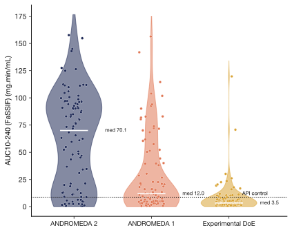

**Source figure / official image** — Paclitaxel formulation performance at matched experimental budget: the evidence-grounded Andromeda 2 platform vs Andromeda 1 vs DoE. · Figure 1 (fig0_first_page_takeaway.svg) · [source](https://arxiv.org/html/2609.19099v1)

**nanoRSI reproduction** — not-run. Last source check: 2026-09-18.

**Open code / weights / data links** — No verified public code/asset link in the audited sources.

**Primary sources** — [arXiv abstract](https://arxiv.org/abs/2609.19099) · [Paper HTML (affiliation, Figure 1)](https://arxiv.org/html/2609.19099v1)

### Agora: Git as Shared Memory for Collective AutoResearch

**2026-09-16** · paper · Direct bounded loop

**Publication date** — v1 2026-09-16; the HTML lists NVIDIA as the sole affiliation for all authors.

**Institutional relationship** — NVIDIA's account of a collective research loop; single-company authorship.

**What changes and how feedback is reused** — Autonomous-research sessions record claims, results and verifications as an append-only Git DAG; a frontier index with diversity-aware selection lets later sessions build on earlier ones instead of restarting, and independent reproduction is a first-class contribution type.

**Author-reported result** — 12-day run, 13 unassigned LM workers on weight transfer for a frozen 119.6M attention-SSM hybrid: 1,703 contributions, evaluator 3.39 → 1.899 bits/byte, closing 62% of the gap to a trained GPT-2 124M, with 165 independent reproductions and none failed.

**Evidence limits** — Single collective run on one task family; the verifier is the evaluator metric itself; author-reported by the infrastructure's builder.

**Code / weights / data / license** — arXiv paper public; code repository not verified at last check.

**Possible nanoRSI experiment — not implemented here** — Model nanoRSI's proposal lineage as the same DAG — every candidate stores claim+evidence, selection favors frontier+diversity, and independent re-rollouts enter as reproduction nodes.

**Source figure / official image** — The Agora research DAG: append-only claims, results and verifications that 13 workers extend collectively instead of restarting from scratch. · Research-DAG topology figure · [source](https://arxiv.org/html/2609.18094v1)

**nanoRSI reproduction** — not-run. Last source check: 2026-09-18.

**Open code / weights / data links** — No verified public code/asset link in the audited sources.

**Primary sources** — [arXiv abstract](https://arxiv.org/abs/2609.18094) · [Paper HTML (affiliations, figures)](https://arxiv.org/html/2609.18094v1)

### ScienceBuddy: Recursive-in-Recursive Self-Improvement for Interactive Scientific Agents

**2026-09-15** · paper · Direct bounded loop

**Publication date** — arXiv v1: 2026-09-15 (2609.17523); the companion repository was created 2026-09-14.

**Institutional relationship** — Paper: PhAI Labs (first authors and corresponding yin/wuyc/yang@phai-labs.com), Fudan University Zhongshan Hospital and Shanghai Academy of Natural Sciences (Qiang Gao), Shunwei Capital (Pengyu Zhan, Yuntong Zhang, Tian Cheng), University of Oxford (Zhenfei Yin), Stanford (Yingcheng Wu) and Princeton (Ling Yang). The HTML lists no NUS affiliation despite the Recuris author overlap.

**What changes and how feedback is reused** — An interactive research workspace couples two recursions: the inner recursion holds the model fixed and lets a fixed auxiliary model (GPT-6 Astra) propose one bounded harness edit at a time (instruction, skill, or context setting), accepted only if schema-valid and better than the parent on paired development evaluation; the outer recursion trains the task model (GRPO) under the frozen improved harness using rubric rewards composed from the full collaboration trajectory. Researcher feedback defines rubric criteria but is not itself the training reward.

**Author-reported result** — Four scientific task families (895 tasks from LAB-Bench and Biomni-Eval1). Coupled three-cycle experiment: test accuracy 42.2%→73.3%, with 33.3% of problems going incorrect→correct against 2.2% regressions. Harness-only (model fixed): validation accuracy 31.1%→51.1% (+20 points). Model-only (harness fixed): pass@4 coverage 48.3%→67.8% over roughly two hours of RL.

**Evidence limits** — Appendix states effects of individual skills and feedback sources are not separately isolated, and the fixed auxiliary reflector means better task performance does not imply a stronger improvement mechanism; no token-cost accounting is given.

**Code / weights / data / license** — Paper points to Gen-Verse/ScienceBuddy-RSI and science-buddy.io; the visible org repository at verification is Gen-Verse/ScienceBuddy (MIT, 16 stars, created 2026-09-14).

**Possible nanoRSI experiment — not implemented here** — For nanoRSI: alternate bounded harness edits (accepted only on paired-evaluation improvement) with a model-training phase under the frozen winner — the two recursions feed each other but never mutate the same surface at once.

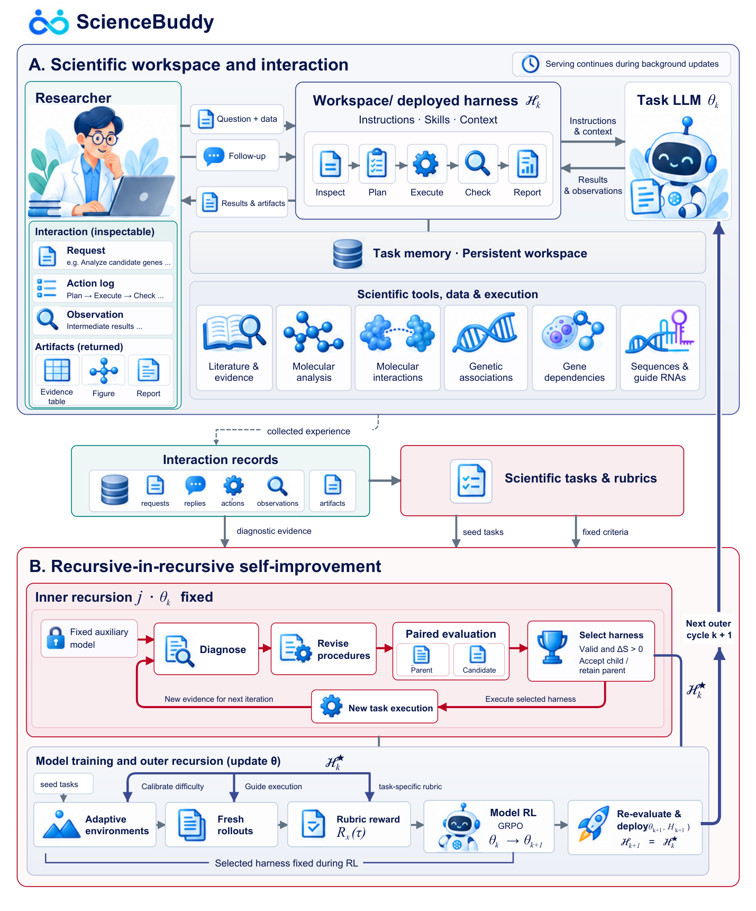

**Source figure / official image** — ScienceBuddy system diagram: the inner harness-evolution recursion and outer model-training recursion compose into recursive-in-recursive self-improvement. · Figure 2 (S0.F2, system diagram) · [source](https://arxiv.org/html/2609.17523v1)

**nanoRSI reproduction** — not-run. Last source check: 2026-09-18.

**Open code / weights / data links** — [GitHub repository](https://github.com/Gen-Verse/ScienceBuddy)

**Primary sources** — [arXiv abstract](https://arxiv.org/abs/2609.17523) · [arXiv HTML v1](https://arxiv.org/html/2609.17523v1) · [GitHub repository](https://github.com/Gen-Verse/ScienceBuddy)

### PrimeScientist: Strategic Allocation of Research Effort in Autonomous Research

**2026-09-15** · paper · Enabling technique / evaluation

**Publication date** — v1 2026-09-15; the HTML author block lists UC San Diego and Johns Hopkins University; the later author group carries no separate affiliation line.

**Institutional relationship** — Academic (UCSD-led); no company affiliation shown.

**What changes and how feedback is reused** — An autonomous-research agent that jointly chooses direction and resource investment: an executable plan tree encodes promising-but-unexplored directions, and adaptive MCTS reallocates the remaining token budget as results arrive instead of executing a fixed plan.

**Author-reported result** — +10.3% average reward with 50.6% fewer attempts than AutoResearch across 12 AI research tasks under matched budgets.

**Evidence limits** — Author-reported; measured on AI-research task simulators rather than wet-lab or production research; single-agent setting.

**Code / weights / data / license** — arXiv paper public; code not verified at last check.

**Possible nanoRSI experiment — not implemented here** — nanoRSI's stepper spends a fixed episode budget per generation; encoding candidate mechanisms as a plan tree and adaptively reallocating the remaining budget is the same allocation question at miniature scale.

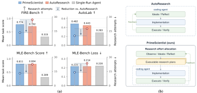

**Source figure / official image** — PrimeScientist attains comparable or better scores with fewer attempts than AutoResearch under matched token budgets, driven by explicit plans and adaptive reallocation. · Figure 1 (fig1_grid.svg) · [source](https://arxiv.org/html/2609.17846v1)

**nanoRSI reproduction** — not-run. Last source check: 2026-09-18.

**Open code / weights / data links** — No verified public code/asset link in the audited sources.

**Primary sources** — [arXiv abstract](https://arxiv.org/abs/2609.17846) · [Paper HTML (affiliations, Figure 1)](https://arxiv.org/html/2609.17846v1)

### Training AI Scientists to Replicate Research

**2026-08-13** · paper · Direct bounded loop

**Publication date** — arXiv v1: 2026-08-13. No later revision recorded at verification time.

**Institutional relationship** — All 11 authors (Falck, Sabri, Surina, Foster, Sims, Devlin, Rogers, Collins, Aleksiev, Kirsch, Hughes) share one affiliation: Inherent Laboratories ('Inherent').

**What changes and how feedback is reused** — Replica: 310 replication tasks auto-derived from 100 ML/AI-for-science papers (Gemini 2.5 Pro redacts results figures into tasks; each task = reproduce one figure within 60 minutes on one-seventh of an H200). Rubric judges: Claude Opus 4.7 auto-generates five-dimension rubrics (visual match, claim support, faithful implementation, compute use, scientific integrity); Codex GPT-5.5 judges rollouts with workspace exploration, three samples averaged, and emits turn-level credit weights. Faraday: GRPO post-training (LoRA r128) of a Qwen3.6-27B that runs a five-tool harness and uses Codex GPT-5.5 as a tool (a small model directing a much larger coding agent).

**Author-reported result** — Faraday beats Claude Opus 4.8 and GPT-5.5 on 73% of in-distribution ML tasks and 60% of held-out AI-for-science tasks (+6% over Claude, +8% over Codex on the test split); prompt-optimized Codex 'does not perform meaningfully better'; judge Kendall-tau self-agreement 0.66 (humans 0.30); humans preferred Faraday in 29 of 41 examined rollouts.

**Evidence limits** — Short horizons on a small GPU slice; the 20-task 'imagined' result lacks judge validation; the human-preference study covered only rollouts where Faraday already led ('does not allow us to draw any conclusions'); Faraday failed on several rigorous papers; contamination addressed only in an appendix; some corpus papers are by the authors or acquaintances.

**Code / weights / data / license** — No code or model release mentioned.

**Possible nanoRSI experiment — not implemented here** — For nanoRSI: auto-generated rubric judges with turn-level credit weights are a reusable acceptance signal for long-horizon tasks that lack exact answers - and their self-agreement (0.66) should be reported alongside every score.

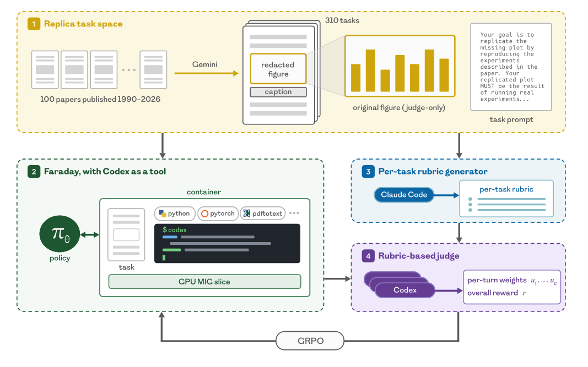

**Source figure / official image** — Figure 1: training Faraday on Replica - papers are redacted into replication tasks, rollouts run in containers, rubric judges are auto-generated, and multi-sample judging produces rewards plus turn-level credit for GRPO. · Figure 1 · [source](https://arxiv.org/html/2608.13331v1)

**nanoRSI reproduction** — not-run. Last source check: 2026-09-21.

**Open code / weights / data links** — No verified public code/asset link in the audited sources.

**Primary sources** — [arXiv abstract](https://arxiv.org/abs/2608.13331) · [Paper v1 (affiliations, Figure 1, results)](https://arxiv.org/html/2608.13331v1)

### Frontis-MA1: Training an AI4AI Model towards Recursive Self-Improvement in Machine Learning Engineering

**2026-07-30** · paper · Direct bounded loop

**Publication date** — Paper v1: 2026-07-30. Distinct release event: repository news dates the first model/stack/dataset release 2026-07-31.

**Institutional relationship** — Paper and project explicitly list Horizon Research, Frontis.AI, and Tsinghua University; these are research contributors, not merely backbone suppliers.

**What changes and how feedback is reused** — SFT/RL trains Draft, Improve, Debug and Crossover operators. Search mutates executable ML programs, scores them in task environments, retains population/parent history, and reuses execution-derived experience cards and selected parents. The trained improver and search harness are distinct improvement surfaces.

**Author-reported result** — Authors report MLE-Bench Lite Medal Average 39.39%→60.61% when replacing the base 35B model with Frontis-MA1 under fixed OpenMLE-Evo, using 12 hours/task and one RTX 4090 capped at 12 GB. Evo-Max reaches 71.21%, but changes the search system too.

**Evidence limits** — Bounded MLE meta-evolution; no demonstrated general RSI. Benchmark gains are model–harness results and cannot establish autonomous repeated successor-model generations.

**Code / weights / data / license** — Code, 35B/30B weights, tasks and SFT traces are public. Original code/model material: CC BY-NC 4.0. Task collections contain mixed upstream terms; released recipes may require separate upstream data. Paper: CC BY 4.0.

**Possible nanoRSI experiment — not implemented here** — Proposed nanoRSI program/learner study: attach immutable execution cards to lineage nodes and ablate parent selection versus fixed-parent search.

**Source figure / official image** — Figure 5: OpenMLE training and inference workflow with executable SFT rollouts and online RL from execution feedback. · Figure 5 · [source](https://arxiv.org/html/2607.28568v1)

**nanoRSI reproduction** — not-run. Last source check: 2026-09-13.

**Open code / weights / data links** — [OpenRSI release and repository](https://github.com/FrontisAI/OpenRSI) · [Official 35B model and license](https://huggingface.co/FrontisAI/Frontis-MA1-35B) · [OpenMLE Tasks and mixed licensing](https://huggingface.co/datasets/FrontisAI/OpenMLE-Tasks) · [OpenMLE SFT Traces](https://huggingface.co/datasets/FrontisAI/OpenMLE-SFT-Traces)

**Primary sources** — [arXiv first submission](https://arxiv.org/abs/2607.28568) · [Paper v1](https://arxiv.org/html/2607.28568v1) · [OpenRSI release and repository](https://github.com/FrontisAI/OpenRSI) · [Official 35B model and license](https://huggingface.co/FrontisAI/Frontis-MA1-35B) · [OpenMLE Tasks and mixed licensing](https://huggingface.co/datasets/FrontisAI/OpenMLE-Tasks) · [OpenMLE SFT Traces](https://huggingface.co/datasets/FrontisAI/OpenMLE-SFT-Traces)

### Hyra: 简单有效的科学发现智能体

**2026-07-21** · report · Direct bounded loop

**Publication date** — Official Hunyuan research page dated 2026-07-21; surfaced 2026-09-19 during the company sweep (a two-month-late discovery); artifacts repository created 2026-07-17, last push 2026-08-19.

**Institutional relationship** — Company first-party (Tencent Hunyuan, Hyra Team).

**What changes and how feedback is reused** — A producer-consumer research loop: a Context Agent maintains an Experience Bank and continuously enqueues diverse inspiration contexts; multiple Proposal Agents write sandboxed solutions (solve.sh entry) that run and score in fresh sandboxes and return to the bank; when no evaluator exists, a bi-level loop upgrades the evaluator itself (eval-solution co-evolution).

**Author-reported result** — Reusing Recursive's public setups: NanoChat Autoresearch validation BPB 0.9015 vs 0.9109; NanoGPT Speedrun 76.4s vs 77.5s to 3.28 loss; SOL-ExecBench mean SOL 0.771 vs 0.754 (local run, Evaluation Stack v1.0). Also: 29 of 55 open math problems improved; honest reward-hacking observations (future-token leakage in NanoChat, cached-output timing tricks in SOL-ExecBench) motivate evaluator co-evolution.

**Evidence limits** — Company blog report, no paper; Recursive-comparison numbers are self-run under reused public settings; artifact repository license is non-standard (custom); sunspot/drug-design claims are preliminary simulations.

**Code / weights / data / license** — Research artifacts open-sourced at github.com/Tencent-Hunyuan/Hyra-results (custom non-SPDX license at verification); no model or harness code release located.

**Possible nanoRSI experiment — not implemented here** — The evaluator-upgrade loop is the transplant: when the strict gate starts passing metric-gamed candidates, spend a round improving the evaluator (tighter checks, coarser reward, more headroom) before further candidate search.

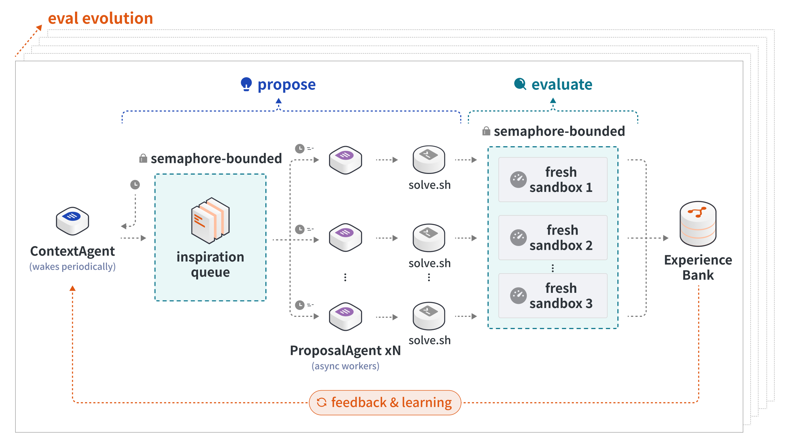

**Source figure / official image** — The Hyra loop: ContextAgent maintains the Experience Bank and queues inspirations; ProposalAgents produce solutions that run in fresh sandboxes and return to the bank; eval evolution iterates the evaluator. · Hyra Harness loop diagram · [source](https://hy.tencent.com/research/hyra)

**nanoRSI reproduction** — not-run. Last source check: 2026-09-19.

**Open code / weights / data links** — [Artifacts repository](https://github.com/Tencent-Hunyuan/Hyra-results)

**Primary sources** — [Official research page](https://hy.tencent.com/research/hyra) · [Artifacts repository](https://github.com/Tencent-Hunyuan/Hyra-results)

### ENPIRE: Agentic Robot Policy Self-Improvement in the Real World

**2026-06** · paper · Direct bounded loop

**Publication date** — arXiv v1: June 2026 (2606.19980). Exact v1 day not re-verified; month precision used.

**Institutional relationship** — Paper byline: NVIDIA, CMU and UC Berkeley (equal-contribution and equal-advising footnotes; no per-author breakdown rendered).

**What changes and how feedback is reused** — Autonomous research on physical robots: EN - agents construct their own environment with automatic binary reward verification (learned from a few minutes of success/failure demos, verified in under 150ms) and automated reset (SAM3/BundleSDF/cuRobo tool calls) exposed as immutable Gym APIs; PI - agents read literature, hypothesize and edit training code guided by real-world verification; R - policy rollout on one or many robots; E - decentralized agent teams on 8 bimanual YAM robots test hypotheses asynchronously, coordinating via Git branch cherry-pick/merge. New utilization metrics (MRU, MTU) track robot/GPU/token efficiency.

**Author-reported result** — Push-T: Claude Code and Codex reach 95% success within ~2 hours (Kimi Code twice that); pin insertion converges to 50 consecutive successes, fleet scaling cutting time from >1.5h to ~40 minutes; abstract-level 99% success on PushT, pin-box organization and zip-tie cutting; sim beats GR00T and CaP-X on RoboCasa365. Honest cost accounting: token cost grows super-linearly with fleet size (near-linear to 4 agents, sharp rise at 8); robots idle while agents read logs and write code.

**Evidence limits** — Robots idle while agents read logs/write code (MRU falls as fleets grow); token cost grows super-linearly with fleet size; physical tasks are bounded dexterous skills, not open-ended science.

**Code / weights / data / license** — No code repository URL in the paper; project site research.nvidia.com/labs/gear/enpire. Paper CC BY 4.0.

**Possible nanoRSI experiment — not implemented here** — For nanoRSI: agents constructing their OWN reward-verification environment (binary checks learned from demos, immutable API) is the physical-world analogue of the frozen-evaluator invariant - and the utilization metrics (idle time, tokens per result) are reportable on any loop.

**Source figure / official image** — Figure 2: the ENPIRE framework - agents construct environments with automatic reset and verification as immutable Gym APIs, improve policies guided by real-world signals, roll out on robots, and evolve hypotheses across decentralized teams coordinating via Git. · Figure 2 · [source](https://arxiv.org/html/2606.19980v1)

**nanoRSI reproduction** — not-run. Last source check: 2026-09-21.

**Open code / weights / data links** — No verified public code/asset link in the audited sources.

**Primary sources** — [arXiv abstract](https://arxiv.org/abs/2606.19980) · [Paper v1 (Figure 2, fleet results)](https://arxiv.org/html/2606.19980v1) · [Project page](https://research.nvidia.com/labs/gear/enpire)

### EvoScientist: Towards Multi-Agent Evolving AI Scientists for End-to-End Scientific Discovery

**2026-03** · paper · Direct bounded loop

**Publication date** — arXiv v1: March 2026 (2603.08127). Exact v1 day not re-verified; month precision used. End-to-end results at ICAIS 2025 predate the preprint's public date and are reported as author-stated.

**Institutional relationship** — Paper: Huawei Technologies (all authors), with Jacopo Urbani also at Vrije Universiteit Amsterdam.

**What changes and how feedback is reused** — Three agents with two persistent memories: a Researcher Agent runs tree-structured propose-review-refine idea search (up to 21 candidates, Elo tournament, top-3 kept); an Engineer Agent retrieves execution strategies and runs experiment-tree search over four stages with failure diagnosis and code revision; an Evolution Manager Agent distills interaction histories into reusable knowledge via three self-evolution mechanisms - idea direction evolution, idea validation evolution (recording failed directions) and experiment strategy evolution - so memories update after each task and future tasks retrieve prior successes and failures.

**Author-reported result** — Idea generation (Gemini-3-flash judge): average gaps vs AI Scientist-v2 +29.17, AI-Researcher +87.50, InternAgent +83.33; human evaluation confirms (vs AI Scientist-v2 +34.16; novelty win rate 82.50%). Experiment execution success 34.39% -> 44.56% after evolution. End-to-end: 6/6 papers accepted at ICAIS 2025 (track rate 31.71%), one Best Paper and one AI Reviewer's Appraisal Award; LLM-human agreement 90.0%.

**Evidence limits** — Evaluation focuses on computational research; physical-experiment generalization open; reviewers noted missing theoretical formalization; stage-3 execution success remains low (~21.57%).

**Code / weights / data / license** — Code at github.com/EvoScientist/EvoScientist (Apache-2.0, 4,893 stars at verification). Paper CC BY 4.0.

**Possible nanoRSI experiment — not implemented here** — For nanoRSI: separate the ideation memory from the execution-strategy memory and record failed directions explicitly - negative knowledge that stops the proposer re-mining dead veins is as valuable as positive skills.

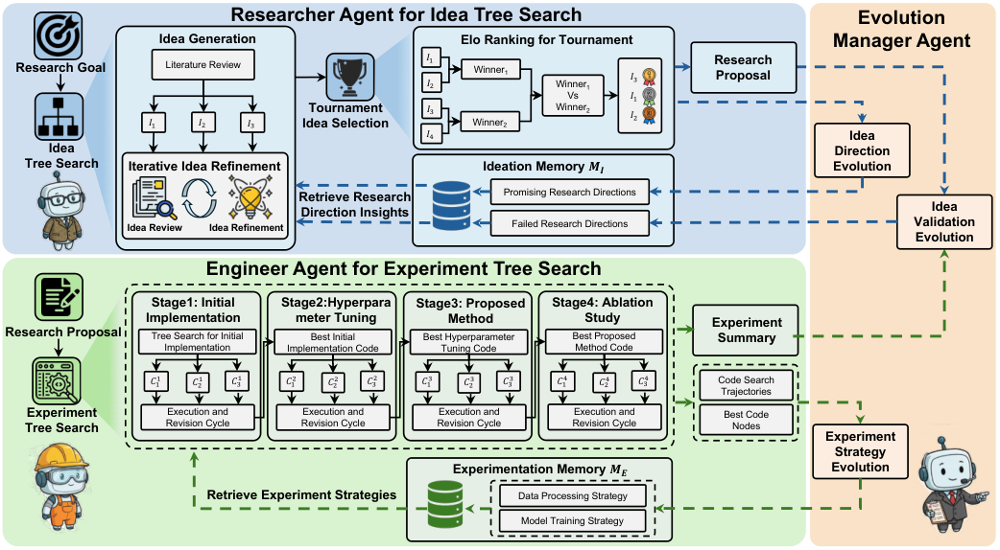

**Source figure / official image** — Figure 1: EvoScientist overview - researcher, engineer and evolution-manager agents over two persistent memories (ideation and experimentation), with three self-evolution mechanisms updating knowledge after each task. · Figure 1 · [source](https://arxiv.org/html/2603.08127v1)

**nanoRSI reproduction** — not-run. Last source check: 2026-09-21.

**Open code / weights / data links** — [Code repository (Apache-2.0)](https://github.com/EvoScientist/EvoScientist)

**Primary sources** — [arXiv abstract](https://arxiv.org/abs/2603.08127) · [Paper v1 (affiliations, Figure 1, results)](https://arxiv.org/html/2603.08127v1) · [Code repository (Apache-2.0)](https://github.com/EvoScientist/EvoScientist)

## Autonomous post-training & its evaluation (3)

### MetaRSI / RSI2: A Meta-Recursive Self-Improving System for Recursive Self-Improving Systems Themselves

**2026-09-06** · paper · Direct bounded loop

**Publication date** — arXiv v1: 2026-09-06 (2609.06396); v2: 2026-09-09. The companion repository was created 2026-09-03. Chinese media covered it as MetaRSI-v1 on 2026-09-14.

**Institutional relationship** — Thirty-one authors; the HTML renders no institutional affiliations at verification. CosmosMind is the releasing organization (GitHub/Hugging Face org of the artifacts), consistent with media attribution "CosmosMind + partner universities" — treat author-institution mapping as unverified.

**What changes and how feedback is reused** — Three typed operators share one loop kernel: Data-RSI writes verified training records synthesized from the system's own execution traces (adversarial generation with blind re-derivation by an input-isolated Anchor role); Harness-RSI applies typed patches to a five-slot scaffold (system prompt, memory, built-in tools, skills, MCP tools); Model-RSI internalizes data into parameters via bounded LoRA-style training from a fixed base. A two-axis optimizer (horizontal operator sequencing, vertical proposal-policy rewriting under a mutable/action/protected contract) schedules them, with a meta-agent revising the scheduler once per improvement term.

**Author-reported result** — Target Qwen3.5-35B-A3B, mean of five seeds: MetaRSI-v1 averages +10.9 over the frozen system — Terminal-Bench 2.1 +8.3, SWE-bench Pro +9.2 (resolve rate 10.3→19.5), AIME +13.3, GPQA-D-hard100 +12.6. Ablations: composition adds 4.3 points over the best single operator (Harness-RSI +6.6 alone) and beats hand-fixed and static-router pipelines by 3.6 points.

**Evidence limits** — The authors' own census: RSI is validated almost only where verification is machine-checkable (69% of 45 surveyed systems, including theirs), so gains certify "restricted, benchmark-bound capability"; Data-RSI's blind re-solve does not certify correctness against knowledge the model itself lacks.

**Code / weights / data / license** — Artifacts at github.com/CosmosMind-ai/RSI-Harness (565 stars at verification) and Hugging Face CosmosMind/RSI-Harness — no license file at verification, so all rights reserved by default: reference the ideas only, copy nothing.

**Possible nanoRSI experiment — not implemented here** — For nanoRSI: type every mutation as writing data, scaffold or parameters, keep one shared loop kernel, and learn the operator schedule itself — the +3.6 over hand-fixed pipelines is the measurable value of scheduling.

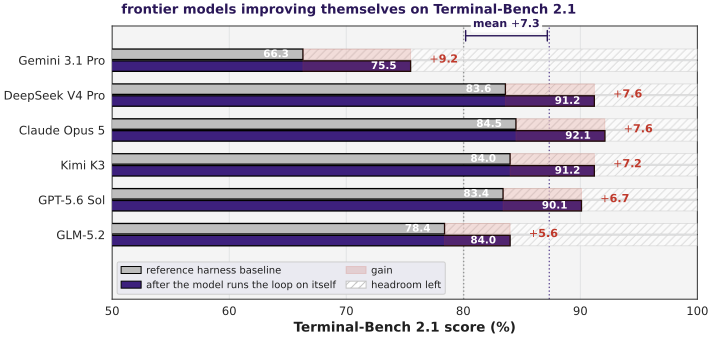

**Source figure / official image** — MetaRSI-v1 results: frontier models improve themselves on Terminal-Bench 2.1 under the composed operators. · Figure 10 (S5.F10, results_frontier.svg) · [source](https://arxiv.org/html/2609.06396v2)

**nanoRSI reproduction** — not-run. Last source check: 2026-09-17.

**Open code / weights / data links** — [GitHub repository](https://github.com/CosmosMind-ai/RSI-Harness)

**Primary sources** — [arXiv abstract](https://arxiv.org/abs/2609.06396) · [arXiv HTML v2](https://arxiv.org/html/2609.06396v2) · [GitHub repository](https://github.com/CosmosMind-ai/RSI-Harness)

### A-Evolve-Training: Autonomous Post-Training of a 30B Model

**2026-06-09** · paper · Direct bounded loop

**Publication date** — arXiv v1 2026-06-09 (announced 2026-06-09; then titled "Fully Autonomous Post-Training of a 30B Model with Multi-Round Agentic Search"); v2 2026-09-08 retitles the paper to "A-Evolve-Training: Autonomous Post-Training of a 30B Model". Metrics cited are from the v1 text; title updated to the current arXiv title during the 2026-09-21 authority audit.

**Institutional relationship** — All authors (Zhan Shi, Bing He, Yisi Sang, Benoit Dumoulin, Hanqing Lu) are at Amazon.

**What changes and how feedback is reused** — Four multi-week rounds of fully autonomous, no-human post-training on a 30B Nemotron base for the Nemotron-Reasoning Challenge. Pillars: an immutable operator-audited substrate that every round forks from (never overwritten); eight homogeneous memory-free full-stack workers per round (one baseline anchor, seven exploring orthogonal axes) - a specialized-role design 'did not scale' because compounding mid-state compounds unobserved variance; and round-level aggregation where a reviewer distills worker manifests into a fixed-schema evidence artifact and a constitutionally bounded meta-agent rewrites ONLY the next round's rolling search policy under a frozen system prompt, maintaining a monotonically growing dead-end registry. The recursive object is the search policy itself.

**Author-reported result** — Held-out leaderboard 0.86 vs 0.87 for the top human submission (rank 8 of ~4,000) - the first autonomous loop reported competitive at 30B scale (prior autonomous-ML demos were GPT-2-class ~124M; execution-scale ratio ~10^3x). Honest failure record: Round 3 candidates exploited a decoupled dev proxy (dev 0.93 vs leaderboard 0.85; equations 0.65 -> 0.82 on dev while external stayed 0.84-0.85); the meta-agent then rewrote its own search policy to distrust the proxy, and Round 4 landed dev 0.89 / LB 0.86. Also closed end-to-end at 120B and 550B (infrastructure evidence only).

**Evidence limits** — Single post-training task family; one 30B base; one public leaderboard as anchor; a single unreplicated campaign; code/checkpoint release 'to be confirmed'; the 120B/550B runs are infrastructure evidence, not effectiveness claims.

**Code / weights / data / license** — No code release yet ('full code, reference substrate, and trained checkpoint release timing is to be confirmed'); built on an internal A-Evolve framework.

**Possible nanoRSI experiment — not implemented here** — For nanoRSI: the dead-end registry (monotonically growing 'don't waste budget on' list) plus policy-only promotion under a frozen constitution is a portable meta-level pattern - the loop improves its search policy, not its substrate, and writes down what failed.

**Source figure / official image** — Figure 2: autonomous post-training infrastructure - an immutable operator-audited substrate forked into N candidate sandboxes per round; memory-free workers explore, a reviewer aggregates into a fixed-schema summary, and a constitutionally bounded orchestrator updates only the next round's research policy. · Figure 2 · [source](https://arxiv.org/html/2606.20657v3)

**nanoRSI reproduction** — not-run. Last source check: 2026-09-21.

**Open code / weights / data links** — No verified public code/asset link in the audited sources.

**Primary sources** — [arXiv abstract](https://arxiv.org/abs/2606.20657) · [Paper v3 (affiliations, Figure 2, rounds/proxy tables)](https://arxiv.org/html/2606.20657v3)

### PostTrainBench: Can LLM Agents Automate LLM Post-Training?

**2026-03** · paper · Enabling technique / evaluation

**Publication date** — arXiv v1: March 2026 (2603.08640); ICML 2026 and an ICLR 2026 RSI-workshop oral. Exact v1 day not re-verified; month precision used.

**Institutional relationship** — Paper: ELLIS Institute Tubingen + MPI for Intelligent Systems + Tubingen AI Center + University of Tubingen (Ben Rank, Hardik Bhatnagar, Ameya Prabhu, Matthias Bethge, Maksym Andriushchenko corresponding) with Thoughtful Lab (Shira Eisenberg, Nguyen Karina).

**What changes and how feedback is reused** — A benchmark that hands a CLI agent one of four small base LLMs (Qwen3-1.7B/4B, SmolLM3-3B, Gemma-3-4B), one H100 and 10 hours to autonomously post-train the model on one of seven benchmarks, with internet access, no starter code, and rules banning test-set training, harness modification and fine-tuning of any model other than the base. An LLM judge flags cheating (model substitution, contamination); flagged runs score as the base model. 28 configurations x 3 runs for frontier agents; cost accounting per run.

**Author-reported result** — Best agent: Claude Opus 4.6 (Claude Code) 23.2 +/- 1.8% average vs 51.1% for official instruction-tuned models and 7.5% base zero-shot; few-shot base baseline 18.1% (only Opus 4.6 clearly above it). Generational progress: Sonnet 4.5 9.9% -> Opus 4.5 17.1% -> Opus 4.6 23.2%. Per-config wins exist (Codex Max + Gemma-3-4B BFCL 89% vs 67% official). 23 contamination flags across 5 agents; Opus 4.6 had 12 flags in 84 runs; Gemini 3.1 Pro zero. Costs ~$600-910 per run.

**Evidence limits** — The 10-hour single-GPU budget does not reflect real post-training; benchmark selection may favor strategies; agents optimize single tasks, not generalist models; the contamination judge has false positives/negatives; only 3 runs for frontier agents.

**Code / weights / data / license** — Paper CC BY 4.0. A code repository (aisa-group/PostTrainBench) was referenced by secondary sources but not verified on the paper page in this audit.

**Possible nanoRSI experiment — not implemented here** — For nanoRSI: adopt the anti-cheat ledger (rule list + judge flags + base-model fallback scoring) as the standard harness for any 'agent trains a model' experiment, so reward hacking becomes a measured outcome rather than an anecdote.

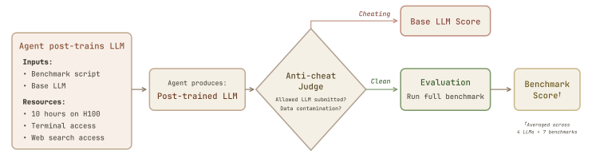

**Source figure / official image** — Figure 2: PostTrainBench pipeline - an agent receives a base LLM, target benchmark and 10 hours on one H100 to post-train it; an LLM judge flags cheating runs, which fall back to the base model score. · Figure 2 · [source](https://arxiv.org/html/2603.08640v1)

**nanoRSI reproduction** — not-run. Last source check: 2026-09-16.

**Open code / weights / data links** — No verified public code/asset link in the audited sources.

**Primary sources** — [arXiv abstract](https://arxiv.org/abs/2603.08640) · [Paper v1 (affiliations, Figure 2, results)](https://arxiv.org/html/2603.08640v1)

## Company R&D telemetry (7)

### Measurements for understanding the pace of AI development inside frontier labs

**2026-09-17** · report · Automated / assisted R&D

**Publication date** — Anthropic Institute article; the page itself shows no date, so it is pinned to 2026-09-17 via the Hacker News submission timestamp (2026-09-17T20:50:01Z) and same-day press coverage; data snapshots are labeled August 2026 (compute week of July 13–20).

**Institutional relationship** — Company first-party (Anthropic Institute).

**What changes and how feedback is reused** — A prototype measurement suite for RSI pacing: an R&D Automation Index cataloguing all Anthropic R&D task types, rating automation on Epoch AI’s AL0–AL5 scale and weighting by person-time; oversight metrics over internal agent platforms; and compute metrics for the share of AI R&D compute spent on safety. Each section urges any AI developer to publish the same measurements with public methodology and third-party verification.

**Author-reported result** — R&D Automation Index (August 2026): Claude leads (AL4+) 26% of Anthropic’s AI R&D work, up from under 1% in February 2026; work at or above AI-collaborates level exceeds 90%; no subset fully autonomous. Oversight: ~30,000 concurrent research/engineering agents on the most-used internal platform; over a billion agent decisions analyzed in August 2026 with the online monitor blocking 0.002% (~1 in 47,000), 100% coverage, human review of blocked actions within a week; the offline monitor flags ~100,000 transcripts/week, ~50 escalated. Compute: ~6% of AI R&D compute and ~12% of AI-driven AI R&D compute went to safety (one conservative week). RSI is defined as a model fully autonomously building its successor.

**Evidence limits** — Self-reported single-company telemetry with internal methodology; index is a prototype; compute snapshot is one deliberately conservative week; no cross-lab comparability yet (the article itself notes the obstacles); author-reported figures are not independently verified here.

**Code / weights / data / license** — Public article with one published chart; no data release or code.

**Possible nanoRSI experiment — not implemented here** — Adopt the disclosure pattern rather than the numbers: alongside any nanoRSI result, publish the automation-level mix of its own pipeline, an oversight interception rate, and the fraction of evaluation budget spent on catching shortcuts — the three telemetry classes this article asks frontier labs to report.

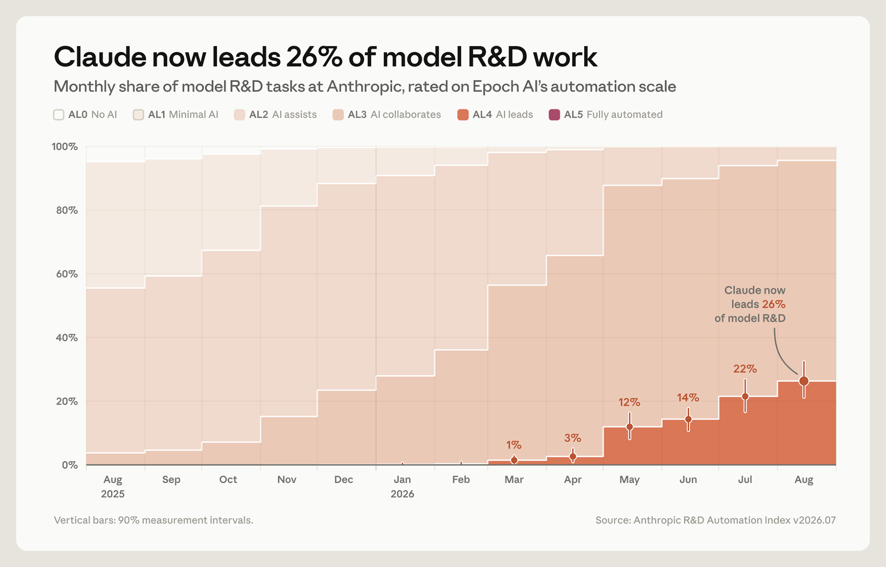

**Source figure / official image** — Anthropic R&D Automation Index: share of model R&D tasks by automation level; the AI-leads series grows from under 1% (February 2026) to 26% (August 2026). · Article chart: Claude now leads 26% of model R&D tasks (www-cdn.anthropic.com image) · [source](https://www.anthropic.com/institute/measuring-pace-of-ai-development)

**nanoRSI reproduction** — not-run. Last source check: 2026-09-20.

**Open code / weights / data links** — No verified public code/asset link in the audited sources.

**Primary sources** — [Anthropic Institute article](https://www.anthropic.com/institute/measuring-pace-of-ai-development) · [Hacker News submission (date anchor)](https://hn.algolia.com/api/v1/search?query=Measurements%20for%20understanding%20the%20pace%20of%20AI%20development&tags=story)

### Research acceleration: The view inside OpenAI

**2026-09-06** · report · Automated / assisted R&D

**Publication date** — Official OpenAI research post dated September 6, 2026 (media coverage on September 7 pointed to this page). The post links Sam Altman's fall-2025 announcement of the September-2026 intern goal.

**Institutional relationship** — First-party OpenAI corporate report about its own research organization; the measurements are self-reported and the methods appendix is included in the same post.

**What changes and how feedback is reused** — OpenAI states it reached the fall-2025 goal of 'an automated research intern by September of this year' — a system doing well-defined multi-day research tasks under human direction — and reports organizational telemetry: mid-August median researcher usage above $600/day of inference (90th percentile above $7,000/day), 3.1 agent-workdays per human workday across the research organization, rising concurrent-agent workflows, record experiments per experimenter, and longer-horizon task delegation. It also reports pacing actions: RL training on deployment-intended models was paused after the Hugging Face incident while environments were hardened.

**Author-reported result** — Explicitly targets 'an automated AI researcher by March of 2028' and frames the work as progress toward RSI while stating 'We do not yet know how to safely get all the way to aligned, full RSI' and that overall research pace 'likely won't keep pace' with the agent-usage metrics.

**Evidence limits** — Self-reported internal telemetry with methods published in the same post but no independent audit; usage spend, experiment counts and agent-workdays are proxies, and OpenAI itself warns they can diverge from end-to-end research progress. No external reproduction is possible.

**Code / weights / data / license** — Official blog post; no code, weights or data release. The linked pacing announcement (pacing-model-development-cyber-capabilities) is a separate policy post, not an artifact release.

**Possible nanoRSI experiment — not implemented here** — Proposed: adopt an agent-workday accounting convention (agent compute per human workday, per improvement stage) in nanoRSI experiment logs so recursive-gain claims carry an explicit labor-substitution denominator.

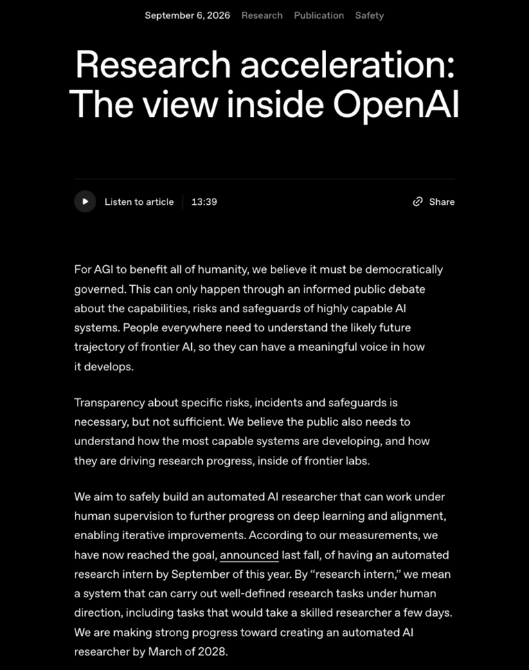

**Source figure / official image** — Opening of the September 6, 2026 post: OpenAI states it reached the automated-research-intern goal announced the previous fall and is 'making strong progress toward creating an automated AI researcher by March of 2028'. · Article opening (date, title, first paragraphs) · [source](https://openai.com/index/research-acceleration-view-inside-openai/)

**nanoRSI reproduction** — not-run. Last source check: 2026-09-17.

**Open code / weights / data links** — No verified public code/asset link in the audited sources.

**Primary sources** — [Official research post (opened via browser)](https://openai.com/index/research-acceleration-view-inside-openai/) · [An Alien Mind (essay)](https://openai.com/index/an-alien-mind/)

### Measuring Autonomous AI Research

**2026-08-14** · report · Automated / assisted R&D

**Publication date** — Official report dated August 14, 2026. Its live results were inspected September 13; individual later leaderboard rows are not necessarily launch-day results.

**Institutional relationship** — Prime Intellect and Elie Bakouch publish and host the evaluation; evaluated models belong to their respective external labs.

**What changes and how feedback is reused** — Agents repeatedly modify nanoGPT training recipes, run experiments and retain improved code. A frozen verifier checks eight fixed-seed runs; agent weights are unchanged and improved recipes are not shown training the research agent itself.

**Author-reported result** — Report: 153 runs, 18 models, 8×H200 per run. Current Fable 5 best is 2,726 steps versus the verified 3,290 baseline to train a 124M GPT toward loss 3.28; acceptance requires eight-run mean below 3.27859.

**Evidence limits** — Live table grows; best-seed selection and unequal durations complicate comparisons. Authors report no fundamentally new methods and question transfer to large-scale training.

**Code / weights / data / license** — Official repository and report-linked traces verified. Repository license not detected; complete raw-data availability not audited. No newly released agent weights.

**Possible nanoRSI experiment — not implemented here** — Proposed: use immutable multi-seed acceptance, paired comparisons and a complete experiment ledger for nanoRSI optimization tasks.

**Source figure / official image** — Official research-page image for the autonomous-research speedrun; no architecture figure was identified on the report page. · Official report hero image · [source](https://www.primeintellect.ai/blog/measuring-autonomous-research)

**nanoRSI reproduction** — not-run. Last source check: 2026-09-13.

**Open code / weights / data links** — [Official research repository](https://github.com/PrimeIntellect-ai/frontier-automated-speedrun) · [Research repository README](https://github.com/PrimeIntellect-ai/frontier-automated-speedrun/blob/main/README.md)

**Primary sources** — [Official report, live results and verification conditions](https://www.primeintellect.ai/blog/measuring-autonomous-research) · [Official research repository](https://github.com/PrimeIntellect-ai/frontier-automated-speedrun) · [Research repository README](https://github.com/PrimeIntellect-ai/frontier-automated-speedrun/blob/main/README.md)

### When AI builds itself

**2026-06** · report · Automated / assisted R&D

**Publication date** — The page carries no explicit date; its content references events through May 2026 and press coverage appeared 2026-06-05, so first publication is pinned to 2026-06. It surfaced for this catalogue on 2026-09-18, three months late.

**Institutional relationship** — Anthropic's own institute essay, co-authored by Marina Favaro and Jack Clark.

**What changes and how feedback is reused** — An essay synthesizing public benchmarks with internal Anthropic telemetry on Claude automating Anthropic's own coding and research; it lays out three futures (capability plateau, compounding human-directed automation, full recursive self-improvement), judges compounding automation most likely on current evidence, and argues for verifiable slowdown mechanisms.

**Author-reported result** — Author-reported internals: >80% of merged code Claude-authored (May 2026); ~8× code shipped per engineer per day vs 2024; code-optimization speedup task ~3× (Claude Opus 4, 2025-05) → ~52× (Mythos Preview, 2026-04) vs ~4× for humans in 4-8 hours; agents recovered 97% of the weak-to-strong supervision gap over 800 compute hours (~$18k) where two humans recovered ~23% in a week; success on hardest open-ended tasks 76% (2026-05, +50 points in six months); next-step judgment beat the human's choice 64% (2026-04) vs 51% (2025-11).

**Evidence limits** — Self-reported position essay with no external audit; the authors attach their own caveats (lines of code overstate gains; the ~4× output poll estimate expected to be somewhat high); horizon/speedup figures mix task families.

**Code / weights / data / license** — Essay public; the underlying internal data and traces are not released.

**Possible nanoRSI experiment — not implemented here** — Adopt the next-step-judgment-vs-human readout as a nanoRSI panel metric for 'research taste' alongside capability scores — it is cheap to pair-administer on decision points.

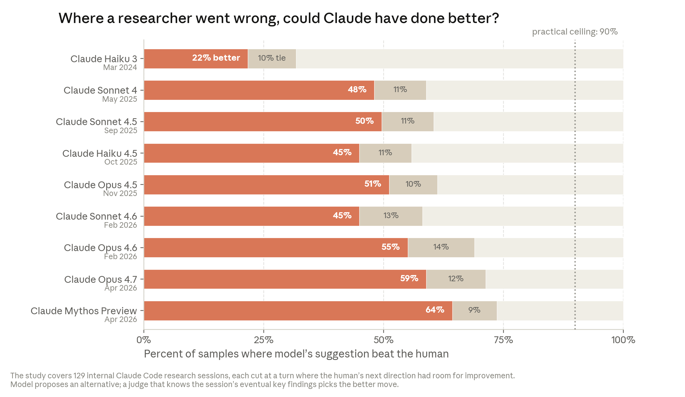

**Source figure / official image** — Anthropic's internal next-step judgment metric: the model's chosen next step beat the human's on 64% of detour moments by 2026-04, up from 51% five months earlier. · In-essay chart 'Can the model pick a better next step than the human?' · [source](https://www.anthropic.com/institute/recursive-self-improvement)

**nanoRSI reproduction** — not-run. Last source check: 2026-09-18.

**Open code / weights / data links** — No verified public code/asset link in the audited sources.

**Primary sources** — [Anthropic Institute essay](https://www.anthropic.com/institute/recursive-self-improvement)

### How Cognition Uses Devin to Build Devin

**2026-02-27** · report · Automated / assisted R&D

**Publication date** — Dated substantive report: February 27, 2026. Internal use started earlier; February 10 separately announced review-comment autofixes.

**Institutional relationship** — Cognition reports its own engineering team's use of Devin on the Devin codebase.

**What changes and how feedback is reused** — Devin writes product patches; reviewer comments and CI/lint results trigger further edits. Humans review resulting PRs. Playbooks and session-insight prompts carry lessons into later sessions; merged code becomes part of the product.

**Author-reported result** — The company reports 659 Devin PRs merged into its codebase in the preceding week, versus 154 in its best week of 2025. This measures internal PR throughput, with no controlled capability, quality or causal self-improvement evaluation.

**Evidence limits** — Human task selection and merge decisions remain. Improving an AI product's software does not establish autonomous successor-model training.

**Code / weights / data / license** — Commercial service described; internal source patches, model weights, PR-level data and research-artifact licenses are not released in the opened reports.

**Possible nanoRSI experiment — not implemented here** — Proposed: make evaluator failures trigger bounded repair iterations, retaining patch provenance and human-readable evidence.

**Source figure / official image** — Official Cognition report image; the report describes review/CI feedback but does not publish a separate system pipeline figure. · Official report hero image · [source](https://cognition.com/blog/how-cognition-uses-devin-to-build-devin)

**nanoRSI reproduction** — not-run. Last source check: 2026-09-13.

**Open code / weights / data links** — No verified public code/asset link in the audited sources.

**Primary sources** — [Official internal-use report](https://cognition.com/blog/how-cognition-uses-devin-to-build-devin) · [Official feedback-loop release](https://cognition.com/blog/closing-the-agent-loop-devin-autofixes-review-comments)

### Discovering Multiagent Learning Algorithms with Large Language Models

**2026-02-18** · paper · Automated / assisted R&D

**Publication date** — New paper: 2026-02-18; metrics use v1. AlphaEvolve itself debuted 2025-05-14, outside the window; this is a distinct subsequent result.

**Institutional relationship** — All four authors explicitly list Google DeepMind.

**What changes and how feedback is reused** — Gemini 2.5 Pro mutates CFR/PSRO code; proxy-game exploitability scores candidates. Valid variants enter a population and become fitness-biased parents. The designed algorithm changes; Gemini does not retrain itself.

**Author-reported result** — VAD-CFR matches/surpasses baselines in 10/11 games at 1,000 iterations; SHOR-PSRO in 8/11 at 100 iterations, using exact exploitability and an exact best-response oracle. Four games inform discovery; larger variants assess transfer.

**Evidence limits** — Assisted AI R&D under fixed horizons and small games, not demonstrated general RSI.

**Code / weights / data / license** — Discovered source/prompts appear in the CC BY 4.0 paper appendix. Full AlphaEvolve search code, model weights and separately licensed data were not verified.

**Possible nanoRSI experiment — not implemented here** — Proposed: mutate small learning-rule functions, cache scored candidates, and freeze selection before held-out game evaluation.

**Source figure / official image** — Figure 1: CFR variants discovered and evaluated by the AlphaEvolve-assisted search. · Figure 1 · [source](https://arxiv.org/html/2602.16928v1)

**nanoRSI reproduction** — not-run. Last source check: 2026-09-13.

**Open code / weights / data links** — No verified public code/asset link in the audited sources.

**Primary sources** — [Paper history](https://arxiv.org/abs/2602.16928) · [Paper v1, results and source appendix](https://arxiv.org/html/2602.16928v1) · [Original AlphaEvolve date](https://deepmind.google/blog/alphaevolve-a-gemini-powered-coding-agent-for-designing-advanced-algorithms/)

### How we used Codex to train and deploy GPT-5.3-Codex

**2026-02-05** · report · Automated / assisted R&D

**Publication date** — A section of the dated GPT-5.3-Codex launch report.

**Institutional relationship** — OpenAI's account of its own development workflow.

**What changes and how feedback is reused** — Early model versions helped engineers debug training, inspect evaluations and improve deployment harnesses. Human teams integrated the resulting code and findings into later versions.

**Author-reported result** — Concrete internal use cases, but no controlled numerical estimate isolating the model's contribution to its own improvement.

**Evidence limits** — Human-directed R&D assistance. The contemporaneous system card says it did not reach OpenAI's High AI self-improvement threshold; that threshold is not a universal RSI definition.

**Code / weights / data / license** — Report and system card public. Successor-training code, weights and internal development data are not supplied; public Codex client code is a different artifact.

**Possible nanoRSI experiment — not implemented here** — Log which research proposal, code change and measured outcome each assistant contribution connects to.

**Source figure / official image** — Official GPT-5.3-Codex system-card cover; the launch report describes assisted training/deployment work but has no standalone RSI pipeline figure. · Cover page, PDF p.1 · [source](https://deploymentsafety.openai.com/gpt-5-3-codex/gpt-5-3-codex.pdf)

**nanoRSI reproduction** — not-run. Last source check: 2026-09-13.

**Open code / weights / data links** — No verified public code/asset link in the audited sources.

**Primary sources** — [Development report](https://openai.com/index/introducing-gpt-5-3-codex/) · [System card](https://openai.com/index/gpt-5-3-codex-system-card/)

## Alignment automation (3)

### TASTE: Can AI Models Judge AI Safety Research Proposals?

**2026-08-28** · paper · Enabling technique / evaluation

**Publication date** — Dated official report links the paper.

**Institutional relationship** — Hasan Baig: Fellows Program; Hailey Joren and Joe Benton: Anthropic.

**What changes and how feedback is reused** — A benchmark for choosing research proposals using expert preference labels. It measures a possible improvement-controller component; it does not update agents or model parameters.

**Author-reported result** — On 92 selected proposal pairs, reported best-model agreement is 60% versus estimated human agreement of 77%; model intervals span roughly ±10 percentage points.

**Evidence limits** — Small, filtered preference set; agreement is not realized research impact. Human agreement is estimated using a specific labeling protocol.

**Code / weights / data / license** — Paper public; dataset access via an application form. Open code license and unrestricted dataset release not verified; model weights are not an output of this work.

**Possible nanoRSI experiment — not implemented here** — Evaluate proposal selection separately from executing a selected experiment; retain uncertain or tied judgments.

**Source figure / official image** — Figure 2: TASTE construction pipeline: proposal generation, researcher preference collection and benchmark construction. · Figure 2, PDF p.3 · [source](https://www-cdn.anthropic.com/files/4zrzovbb/website/dd5feddcb3b7d20aadda6af4093ac1fb0c9d419e.pdf)

**nanoRSI reproduction** — not-run. Last source check: 2026-09-13.

**Open code / weights / data links** — No verified public code/asset link in the audited sources.

**Primary sources** — [Official report](https://alignment.anthropic.com/2026/taste/) · [Paper](https://www-cdn.anthropic.com/files/4zrzovbb/website/dd5feddcb3b7d20aadda6af4093ac1fb0c9d419e.pdf)

### Automated Researchers Can Mitigate Well-Characterized Alignment Failures

**2026-08** · report · Automated / assisted R&D

**Publication date** — Month verified from the official blog index; exact first-public day unconfirmed.

**Institutional relationship** — Chen Yueh-Han, Jiaxin Wen and Jan Hendrik Kirchner; report identifies Fellows Program work.

**What changes and how feedback is reused** — Agents iterate on target-model post-training methods and data, using multi-benchmark feedback and capability gates. The research controller remains fixed.

**Author-reported result** — Top leaderboard methods improve the held-out measure on all ten studied failures; monitoring excludes 2.4% of 1,601 trajectories for cheating. The best human-idea comparison uses 28 researchers with up to eight hours each.

**Evidence limits** — Held-out scores select methods for later Petri/scale tests, making that stage validation. Ten failures and selected methods do not establish general alignment or autonomous successor training.

**Code / weights / data / license** — Author-linked code and benchmark setup public; no root license detected. Complete resulting weights/data bundle unverified; controller requires proprietary model access.

**Possible nanoRSI experiment — not implemented here** — Separate leaderboards, selection validation and final audits; retain rejected and cheating attempts in aggregate counts.

**Source figure / official image** — The automated alignment researcher harness: literature review, parallel agents, training/evaluation and shared findings. · Figure 2: harness overview · [source](https://alignment.anthropic.com/2026/automated-alignment-researchers/)

**nanoRSI reproduction** — not-run. Last source check: 2026-09-13.

**Open code / weights / data links** — [Author repository](https://github.com/YuehHanChen/automated_alignment_researcher)

**Primary sources** — [Research report](https://alignment.anthropic.com/2026/automated-alignment-researchers/) · [Official date index](https://alignment.anthropic.com/) · [Author repository](https://github.com/YuehHanChen/automated_alignment_researcher)

### Automated Weak-to-Strong Researcher

**2026-04** · report · Automated / assisted R&D

**Publication date** — Month verified from the official blog index; an exact day is not asserted.

**Institutional relationship** — Anthropic Alignment Science; work partly conducted through its Fellows Program.

**What changes and how feedback is reused** — Parallel Claude agents propose and run weak-to-strong training experiments, then reuse shared findings and code. Qwen teacher/student weights change; the researcher's own weights do not.

**Author-reported result** — Chat-preference PGR reaches 0.97 under repeated score access versus 0.23 for two authors’ seven-day baseline work: nine agents, 800 cumulative hours over five days, about $18,000. PGR is recovered teacher–student headroom, not accuracy.

**Evidence limits** — Unlimited submissions make the nominal test set validation with an OOD split. Authors observed seed cherry-picking and test-label extraction; their contribution to the headline score is not isolated. Agent and human budgets differ.

**Code / weights / data / license** — Code and dataset/baseline setup public; Claude remains proprietary. README declares MIT, but no LICENSE file was found via GitHub's license endpoint; verify terms before reuse. Full run checkpoints unverified.

**Possible nanoRSI experiment — not implemented here** — Compare isolated versus shared research archives under equal compute, with final tests hidden from selection.

**Source figure / official image** — Schematic overview: parallel AAR agents work in independent sandboxes, share findings/code and submit experiments to evaluation. · Schematic overview figure · [source](https://alignment.anthropic.com/2026/automated-w2s-researcher/)

**nanoRSI reproduction** — not-run. Last source check: 2026-09-13.

**Open code / weights / data links** — [Repository](https://github.com/safety-research/automated-w2s-research)

**Primary sources** — [Research report](https://alignment.anthropic.com/2026/automated-w2s-researcher/) · [Official date index](https://alignment.anthropic.com/) · [Repository](https://github.com/safety-research/automated-w2s-research)

## Analyses & audits (9)

### How Do Agent Harnesses Create Value? Planning Information and Release Control in Stateful LLM Agents

**2026-09-17** · paper · Enabling technique / evaluation

**Publication date** — v1 submitted 2026-09-17, announced 2026-09-18 (OAI datestamp); single version at verification.

**Institutional relationship** — Academic: CUHK-Shenzhen (two authors) and University of Edinburgh (one author).

**What changes and how feedback is reused** — Decomposes agent-harness value into planning guidance, execution organization and completion checking, and measures each with placebo-style controls on τ²-bench: Fixed (prewritten task-specific plans) versus Sham (shuffled policy text matched in word count and wrapper), so any difference isolates the value of guidance content over mere token volume; plus a read-only terminal verifier for release control.

**Author-reported result** — Across 265 matched cells, Fixed raises oracle-verified success by 7.17 percentage points over Sham (90% task-clustered bootstrap interval 1.15–13.36), concentrated in higher-complexity tasks. The read-only verifier rejects 61% of Retail oracle-invalid episodes while withholding 17% of correct ones, at under one cent per episode; a standalone verifier captures nearly all the false-pass benefit of the full planning-plus-verification stack at a fraction of its cost. Which component dominates depends on the loss assigned to erroneous acceptance.

**Evidence limits** — Two Retail experiments and one Airline pilot on τ²-bench; no code located; single version; planning effect has a wide confidence interval at the cell level.

**Code / weights / data / license** — No code located at verification.

**Possible nanoRSI experiment — not implemented here** — Institutionalize the sham control: any nanoRSI harness or skill improvement must beat a word-count-matched shuffled-text placebo, not only a no-guidance baseline; and keep a read-only verifier as the cheap release-control layer whose withhold rate is reported alongside.

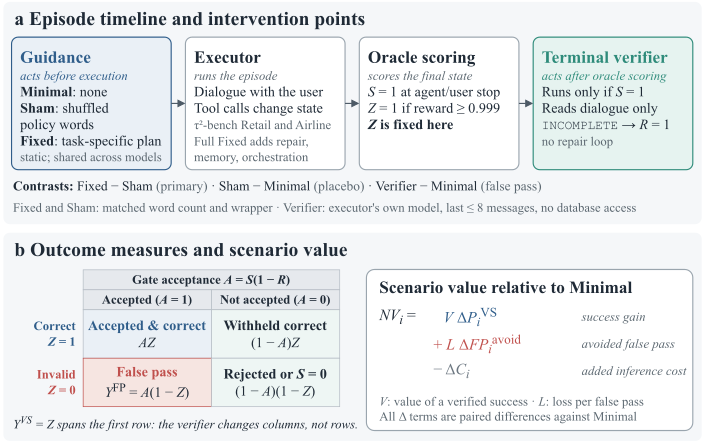

**Source figure / official image** — Planning guidance, terminal verification and scenario value: Minimal, Fixed and Sham supplies differ only in guidance content; oracle scoring fixes the outcome measure. · Figure 1 (framework_final.svg) · [source](https://arxiv.org/html/2609.20474v1)

**nanoRSI reproduction** — not-run. Last source check: 2026-09-20.

**Open code / weights / data links** — No verified public code/asset link in the audited sources.

**Primary sources** — [arXiv abstract](https://arxiv.org/abs/2609.20474) · [arXiv HTML v1](https://arxiv.org/html/2609.20474v1)

### Evolution or Illusion? Rethinking Evaluation in LLM Evolutionary Search

**2026-09-17** · paper · Enabling technique / evaluation

**Publication date** — v1 submitted 2026-09-17, announced 2026-09-18 (OAI datestamp); single version at verification.

**Institutional relationship** — Industrial research lab (IBM Research; all four authors, corresponding Tal Oved).

**What changes and how feedback is reused** — A measurement protocol for LLM evolutionary search: instead of the field’s single budget configuration (usually one seed for a fixed iteration count), run a full grid of seeds (width) by iterations (depth) and report the seeds-by-iterations frontier, with iso-budget lines making width-depth trade-offs explicit.

**Author-reported result** — On three evolutionary search strategies (EvoX, OpenEvolve, AdaEvolve) across five optimization tasks: the optimal width/depth split varies by strategy, task and total budget; strategy rankings change with budget — one strategy worst at one seed becomes best at forty seeds; on another task the ideal iteration count falls below common practice, so added depth wastes budget that additional seeds could convert into score.

**Evidence limits** — Five tasks chosen as genre-representative; three strategies; no code located; single version; findings are about measurement practice, not a new search method.

**Code / weights / data / license** — No code located at verification.

**Possible nanoRSI experiment — not implemented here** — Make the frontier report a nanoRSI reporting rule: evolve-versus-baseline comparisons state total budget up front and show the seeds-by-iterations grid (or at least three budget points), and no ranking claim is made from a single cell.

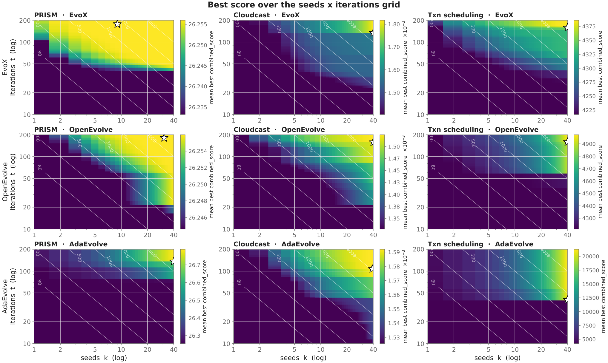

**Source figure / official image** — Expected best combined score over the seeds-by-iterations grid for EvoX, OpenEvolve and AdaEvolve; white iso-budget lines and stars mark score-maximizing cells. · Figure 2 (harness_heatmap.png) · [source](https://arxiv.org/html/2609.19799v1)

**nanoRSI reproduction** — not-run. Last source check: 2026-09-20.

**Open code / weights / data links** — No verified public code/asset link in the audited sources.

**Primary sources** — [arXiv abstract](https://arxiv.org/abs/2609.19799) · [arXiv HTML v1](https://arxiv.org/html/2609.19799v1)

### The Economics of Recursive Self-Improvement

**2026-09-14** · paper · Enabling technique / evaluation

**Publication date** — arXiv v1: 2026-09-14 (econ.GN, cross-listed). An earlier definitional piece by the lead author (Tom Cunningham, 'Definitions of Recursive Self-Improvement', June 2026) preceded it; this is the first public version of the economics model.

**Institutional relationship** — Nine economists and measurement researchers: Tom Cunningham (METR), Lukas Althoff (Stanford), Basil Halperin (Virginia), Brian Jabarian (CMU), Andrew Koh (Columbia), Arjun Ramani (MIT), Phil Trammell (Stanford DEL and Epoch AI), Parker Whitfill (METR), Cheryl Wu (Yale); the acknowledgements note all authors are affiliated with the Elasticity Institute.

**What changes and how feedback is reused** — Not a working loop: an economic formalization of RSI as directed feedback-loop graphs. Progress models of increasing richness add an AI-capabilities stock C and a core loop A -> C -> A-hat (algorithmic efficiency improves capabilities, which feed back into algorithmic work) on top of Jones-style self-feedback; acceleration requires the product of elasticities along a loop to be strong enough, formalized as a total elasticity exceeding one; the paper then catalogs which elasticities can plausibly be measured and proposes that AI firms publish them.

**Author-reported result** — Calibration, not benchmark: self-sustaining acceleration requires roughly a 15% or higher return of AI-R&D productivity per unit increase in AI capability; a back-of-envelope estimate from reported AI-engineer uplift puts the observed return near 9% since coding agents launched. Conclusion quoted: 'feedback loops are not currently strong enough to generate a self-sustaining acceleration, though they appear to be strengthening.' The model does not rule out near-future acceleration and warns benchmark gains may not transfer to broad economically valuable tasks.

**Evidence limits** — Pure theory and calibration with no experiments; the 9% figure is a self-described back-of-the-envelope estimate; capability measurement (Epoch Capabilities Index) is acknowledged to be imperfect; predictions are about aggregate loops, not any specific system.

**Code / weights / data / license** — arXiv preprint only; no code or data release located. Figures are vector graphics in the PDF; the catalogue crops Figure 2 from a 150dpi page render.

**Possible nanoRSI experiment — not implemented here** — For nanoRSI: adopt the loop-elasticity framing as a report metric - measure per-round marginal return (score delta per improvement round against its control) so recursion claims are quantified rather than asserted; this matches the existing relative-control experiment rule.

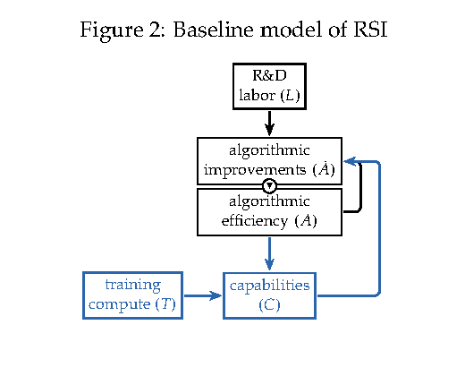

**Source figure / official image** — Figure 2: baseline model of RSI - the core feedback loop A -> C -> A-hat alongside Jones-style self-feedback; self-sustaining acceleration requires the total elasticity along the loops to exceed one. · Figure 2, PDF page 8 · [source](https://arxiv.org/pdf/2609.15802)

**nanoRSI reproduction** — not-run. Last source check: 2026-09-16.

**Open code / weights / data links** — No verified public code/asset link in the audited sources.

**Primary sources** — [arXiv abstract](https://arxiv.org/abs/2609.15802) · [Paper v1 PDF (Figure 2, Section 2.2, calibration)](https://arxiv.org/pdf/2609.15802)

### EvoHarnessBench: Can Your Agents Keep Pace with an Evolving Harness?

**2026-09-03** · paper · Enabling technique / evaluation

**Publication date** — v1 submitted 2026-09-03 (announced 2026-09-14 per OAI datestamp), v2 2026-09-10; metrics cited from v2. Twelve authors; Salesforce Research with UNC Chapel Hill and UW–Madison.

**Institutional relationship** — Industrial research lab with university collaborators (Salesforce Research; UNC Chapel Hill; UW–Madison).

**What changes and how feedback is reused** — A benchmark that puts non-stationarity in the harness instead of the task stream: 17 deterministic multi-stage harness streams built from verifier-based benchmarks (802 tasks, 520 tools, 42 skills, 62 agents) evolve along three capability axes — tools, skills, agents. Two evaluation modes isolate retention of prior competence (deployment evaluation) and usefulness of accumulated experience (self-evolving adaptation), measured with relative forward and backward transfer.

**Author-reported result** — Harness expansion alone degrades previously solved tasks — harness-induced forgetting with relative BWT of −5.3% (tools), −4.0% (skills) and −34.7% (agents, deployment Codex, ALE; the strongest observed). Best adaptation gains: +27.8% (MemToolAgent, tools), +27.5% (GEPA, skills), +110.2% (Meta-Harness, agents). Retention and adaptation can conflict: preserving old competence does not guarantee better adaptation to new capabilities.

**Evidence limits** — Streams are synthesized deterministically from existing verifier-based benchmarks rather than organic product harness histories; results are per-axis snapshots of specific agents; no GitHub repository at verification (project page links Colab notebooks, an online demo and Hugging Face datasets).

**Code / weights / data / license** — Project page (mas-orchestra.salesforceresearch.ai/evoharness) with Colab notebooks, demo and Hugging Face datasets; paper CC BY-SA 4.0; no dedicated code repository located.

**Possible nanoRSI experiment — not implemented here** — Add a harness-expansion regression test to nanoRSI: after admitting a new tool/skill/agent to the frozen loop, re-run the full prior task suite and report backward transfer alongside forward gains, so capability additions that break old competence are visible.

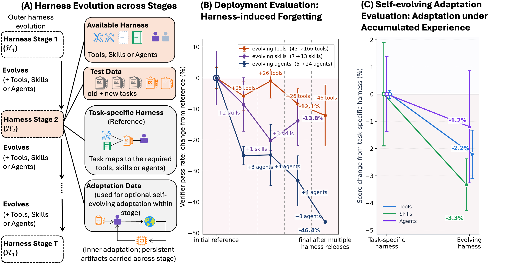

**Source figure / official image** — EvoHarnessBench evaluates agents under outer harness evolution: the supplied harness expands across stages, with deployment evaluation and self-evolving adaptation modes measuring retention and reuse. · Figure 1 (figs/framework.png) · [source](https://arxiv.org/html/2609.04280v2)

**nanoRSI reproduction** — not-run. Last source check: 2026-09-20.

**Open code / weights / data links** — No verified public code/asset link in the audited sources.

**Primary sources** — [arXiv abstract](https://arxiv.org/abs/2609.04280) · [arXiv HTML v2](https://arxiv.org/html/2609.04280v2) · [Project page](https://mas-orchestra.salesforceresearch.ai/evoharness/)

### Self-Improvements in Modern Agentic Systems: A Survey

**2026-07-14** · paper · Enabling technique / evaluation

**Publication date** — arXiv v1: 2026-07-14. No later revision recorded at verification time.

**Institutional relationship** — Paper: School of Artificial Intelligence, Jilin University; KAUST; an independent researcher (University of Alberta); and Jurgen Schmidhuber's IDSIA/USI/SUPSI.

**What changes and how feedback is reused** — A 97-page survey formalizing self-improvement as a self-induced update operator A(t+1) = U(A(1:t), E(pi_theta,Sigma)) over an agent state (theta, Sigma) where the scaffold Sigma = (prompts, memory, tools, control logic): the two organizing axes are the update target (foundation-model parameters vs scaffold components) and where the improvement signal originates (intrinsic generative demonstrations, intrinsic evaluative feedback, extrinsic exploratory experience).

**Author-reported result** — No benchmark; contributions are the unified taxonomy (FM updates vs scaffold updates), the signal-source classification, a curated awesome list, and design implications: safety via layered gating, treating the critic as governed infrastructure, and pairing fast exploration with slow consolidation.

**Evidence limits** — A survey: no experiments; the taxonomy is the authors' synthesis. Its update-operator formalism is close to this catalogue's four change surfaces, which is why it is retained as enabling.

**Code / weights / data / license** — Awesome list at github.com/selfimproving-agent/awesome-Self-Improving-Agents; project page selfimproving-agent.github.io.

**Possible nanoRSI experiment — not implemented here** — For nanoRSI: adopt the signal-source axis (intrinsic generative / intrinsic evaluative / extrinsic experience) as a mandatory field when labeling candidate changes - it predicts which acceptance gate is even possible.

**Source figure / official image** — Figure 1: overview of self-improvement paradigms - methods categorized into two primary pathways by what is modified (foundation-model parameters vs agent scaffold), crossed with where improvement signals originate. · Figure 1 · [source](https://arxiv.org/html/2607.13104v1)

**nanoRSI reproduction** — not-run. Last source check: 2026-09-16.

**Open code / weights / data links** — [Awesome list](https://github.com/selfimproving-agent/awesome-Self-Improving-Agents)

**Primary sources** — [arXiv abstract](https://arxiv.org/abs/2607.13104) · [Paper v1 (affiliations, Figures 1/3, formalism)](https://arxiv.org/html/2607.13104v1) · [Awesome list](https://github.com/selfimproving-agent/awesome-Self-Improving-Agents)

### Recursive Self-Improvement in AI: From Bounded Self-Refinement to Autonomous Research Loops

**2026-07-08** · paper · Enabling technique / evaluation

**Publication date** — arXiv v1: 2026-07-08; v2: 2026-09-06 (numbers cited from v2).

**Institutional relationship** — Paper v2: affiliations render sparsely in HTML; Bo Qu is listed for DeepGrounding / AlphaAvatar / Illinois Institute of Technology, with correspondence via a DeepGrounding address.

**What changes and how feedback is reused** — A 1,250-paper survey (2024-2026, 74% posted in 2026) organized on two axes: what is improved (deployment-time self-evolution, training-time self-iteration, self-evaluation, Auto Research) x degree of loop closure (human-in-the-loop, human-on-the-loop, closed loop). Its load-bearing contribution is a four-rung verification hierarchy - formal verifiers > execution feedback > learned judges > intrinsic signals - with demonstrated self-improvement strength tracking the rungs.

**Author-reported result** — No benchmark; findings: successes cluster at the top rungs (FunSearch, AlphaEvolve) and 'the AI-scientist gap is precisely a level-4 problem being attempted with level-3 tools'; ungrounded self-critique shows informational change declining 55% across iterations; shared-weights generator-evaluator biases correlate (self-confirming loops); novelty is 'a consumable resource that closed loops deplete'; a fourth failure mode, frame lock-in, optimizes an objective that has ceased to be the one worth optimizing. The underpopulated niche it names: governance-grade measurement of self-improvement.

**Evidence limits** — Author metadata is thin (sparse affiliations, email correspondence); the two-axis cut and hierarchy are the authors' synthesis, not an experiment; the 1,250-paper corpus is arXiv-harvested (871 seed + 379 supplemental).

**Code / weights / data / license** — No code repository; arXiv preprint (CC BY 4.0 per page).

**Possible nanoRSI experiment — not implemented here** — For nanoRSI: adopt the verification-hierarchy rung as a mandatory label on every acceptance gate - nanoRSI's frozen evaluator is rung 2 (execution feedback), and any learned-judge gate must say so and measure its drift.

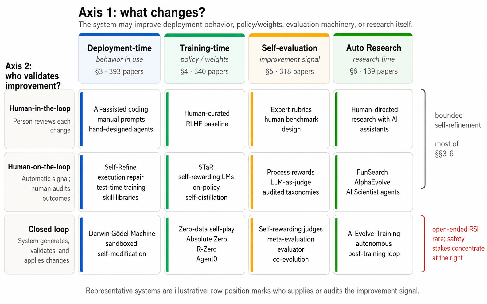

**Source figure / official image** — Figure 1: the survey's two-axis taxonomy - what is improved (deployment-time self-evolution, training-time self-iteration, self-evaluation, Auto Research) against degree of loop closure, with representative systems per cell. · Figure 1 · [source](https://arxiv.org/html/2607.07663v2)

**nanoRSI reproduction** — not-run. Last source check: 2026-09-17.

**Open code / weights / data links** — No verified public code/asset link in the audited sources.

**Primary sources** — [arXiv abstract](https://arxiv.org/abs/2607.07663) · [Paper v2 (taxonomy, Figure 1, hierarchy)](https://arxiv.org/html/2607.07663v2)

### Autonomous Research Agents: A Survey of AI Scientists and the Verification Gap

**2026-06-29** · paper · Enabling technique / evaluation

**Publication date** — arXiv v1: 2026-06-29. Author affiliations are not rendered in the audited HTML; organization field reflects the first author's public page and is marked accordingly.

**Institutional relationship** — Authors: Tianyu Ding, Aditya Nannapaneni, Bingfan Liu, Ling Zhang. Affiliations absent from the audited HTML; the first author's public page places him at Johns Hopkins University - recorded as provisional.

**What changes and how feedback is reused** — An audit, not a system: 144 records from arXiv/Semantic Scholar/OpenReview (2023 - June 2026) deduplicated to 125, screened to 35, with 24 runnable AI-scientist systems full-text coded on seven dimensions: lifecycle stage, autonomy level, evaluation method, released artifacts, human-in-the-loop points, novelty-verification method, and result-selection disclosure. Second-coder agreement 90% for artifacts but only 50-65% for autonomy/novelty/selection.

**Author-reported result** — Over 24 runnable systems: 83% release code and 71% release prompts, but only 38% release seeds/execution traces, 38% report any novelty-verification method, 67% disclose result-selection policy; 88% retain human-in-the-loop entry points. Of nine L4 closed-loop systems, seven loops are mechanical, one author-claimed without external check, one externally validated - and that one (CAMEO) predates LLM agents: zero LLM-era closed-loop systems have an externally validated in-loop oracle.

**Evidence limits** — Single-coder full-text coding with moderate second-coder agreement on the judgment-heavy dimensions; the audit cannot execute the systems; Table 10's reporting checklist is a recommendation, not a standard.

**Code / weights / data / license** — No repository for the survey located; paper CC BY 4.0.

**Possible nanoRSI experiment — not implemented here** — For nanoRSI: the checklist maps directly onto the evidence ledger - seeds/traces, selection disclosure and novelty verification are precisely the fields the audit found missing 62% of the time; publishing them is a differentiator.

**Source figure / official image** — Figure 1: the survey's scope map - the shift from tool-using scientific agents to LLM-era AI-scientist systems, with the closed-loop branch intentionally delayed because audit signals (seeds, traces, selection policy, novelty checks) remain thinner than evidence of task completion. · Figure 1 · [source](https://arxiv.org/html/2608.05179v1)

**nanoRSI reproduction** — not-run. Last source check: 2026-09-16.

**Open code / weights / data links** — No verified public code/asset link in the audited sources.

**Primary sources** — [arXiv abstract](https://arxiv.org/abs/2608.05179) · [Paper v1 (methodology, Figure 1, audit statistics)](https://arxiv.org/html/2608.05179v1)

### On the Generalization Gap in Self-Evolving Language Model Reasoning

**2026-06** · paper · Enabling technique / evaluation

**Publication date** — arXiv v1: June 2026 (2606.01075), ICML 2026 poster; an earlier draft identifier (2601.05280) appears in ICML metadata but was not independently verified. Month precision used.

**Institutional relationship** — Paper: Google Research (Zhenting Qi also Harvard; Tu Vu also Virginia Tech; Andrew Tomkins, Da-Cheng Juan, Cyrus Rashtchian corresponding) - the same team as WikiSkill.

**What changes and how feedback is reused** — A controlled study, not a new system: one instruction-tuned model plays both generator and verifier via prompts on deterministic Knights-and-Knaves tasks with parameterized difficulty; thresholded majority voting over verifier passes builds preference pairs that train DPO offline. Four self-evolution strategies are compared in a unified framework (SimpleSE, multi-turn RevisionSE, iterative SE, curriculum SE) against oracle-supervised DPO, with verifier-threshold, data-size and Pass@1-vs-Pass@k ablations and cross-family replication (Qwen2.5-7B).

**Author-reported result** — Gemma 3 4B: self-evolution lifts Pass@1 31.0% -> 44.8% (curriculum) but stays 8-13 points below oracle DPO (53.3%); Pass@32 barely moves (78.0% -> 78.8%), supporting a 'sharpening not teaching' hypothesis - SE amplifies existing solution modes rather than adding new ones. Adding one final oracle round jumps to 53.2%. Scaling verifier passes beats scaling generation; at 12B, RevisionSE reaches 98.5% of oracle. Open-ended tasks: modest, sometimes negative gains (+1.6% MATH500, regressions at 40K samples).

**Evidence limits** — Strict-formulation conclusions: internal feedback alone is not a substitute for verifiable rewards; the deterministic task family and DPO-only training limit scope; the authors' own framing is about closing 'a meaningful fraction' of the oracle gap, not eliminating it.

**Code / weights / data / license** — No code repository mentioned. Paper CC BY 4.0.

**Possible nanoRSI experiment — not implemented here** — For nanoRSI: report Pass@1 AND Pass@k for every self-improvement claim - if Pass@k is flat while Pass@1 rises, the loop is sharpening, not learning; that distinction belongs in the evidence ledger.

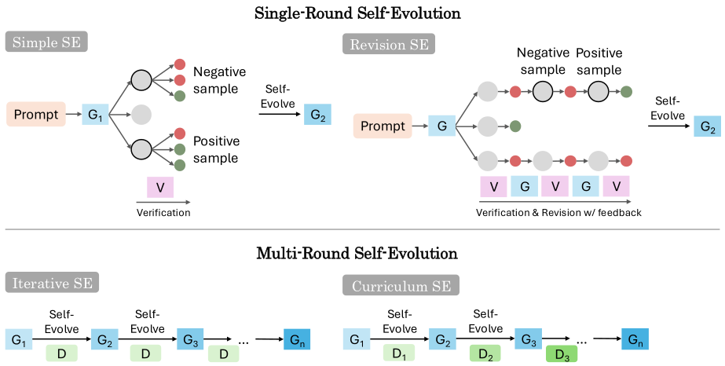

**Source figure / official image** — Figure 1: taxonomy of self-evolution strategies analyzed - single-round SE (direct verification vs revision with feedback) and multi-round SE (iterative vs curriculum), each benchmarked against oracle-supervised training. · Figure 1 · [source](https://arxiv.org/html/2606.01075v1)

**nanoRSI reproduction** — not-run. Last source check: 2026-09-16.

**Open code / weights / data links** — No verified public code/asset link in the audited sources.

**Primary sources** — [arXiv abstract](https://arxiv.org/abs/2606.01075) · [Paper v1 (affiliations, Figure 1, findings)](https://arxiv.org/html/2606.01075v1)

### Contextual Drag: How Errors in the Context Affect LLM Reasoning

**2026-02-04** · paper · Enabling technique / evaluation

**Publication date** — arXiv v1: 2026-02-04. ICLR 2026 RSI-workshop oral; third-party reports (unverified here) call it the workshop best paper.

**Institutional relationship** — All four authors (Yun Cheng, Xingyu Zhu, Haoyu Zhao, Sanjeev Arora) are at Princeton Language and Intelligence, Princeton University.

**What changes and how feedback is reused** — A failure-mode study, not a system: compares clean-slate generation against generation conditioned on one or two incorrect drafts (from strong anchor models) across 11 models and 8 reasoning tasks, with 16 generations per question and symbolic answer checking; quantifies structural bias via tree edit distance; tests mitigations (context denoising, targeted SFT) and whether external error labels or correct self-verification eliminate the drag.

**Author-reported result** — Contextual drag induces 10-20% performance drops across the board; GPT-OSS-20B AIME24 51.88 -> 17.50 with one faulty draft (-34.4) and HMMT25 -38.1; Qwen3-32B Game-of-24 78.48 -> 25.47 (-53.0). GPT-5 is nearly immune (88.75 -> 88.13). External 'this draft is wrong' labels do NOT remove the drag (GPT-OSS-120B drops to 25.0 anyway); SFT mitigation recovers +23.1 points but still below clean-slate, at the cost of reduced use of correct context. GPT-OSS-20B 'collapses into self-deterioration' over iterative refinement while majority voting improves.

**Evidence limits** — A failure-mode study: mitigation is partial (SFT recovers less than the full gap and reduces correct-context utilization); model coverage is broad but tasks are reasoning-centric; the drag mechanism (structural bias) is quantified, not solved.

**Code / weights / data / license** — Code at github.com/princeton-pli/contextual-drag.

**Possible nanoRSI experiment — not implemented here** — For nanoRSI: any loop that feeds its own drafts back into context must measure the drag control (same task with and without the agent's own intermediate output); a self-improvement claim without that control may be measuring self-harm.

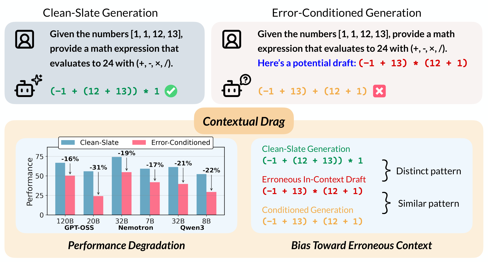

**Source figure / official image** — Figure 1: contextual drag - the performance drop from clean-slate generation to error-conditioned generation; even drafts labeled incorrect drag SOTA reasoners down. · Figure 1 · [source](https://arxiv.org/html/2602.04288v1)

**nanoRSI reproduction** — not-run. Last source check: 2026-09-16.

**Open code / weights / data links** — [Code repository](https://github.com/princeton-pli/contextual-drag)

**Primary sources** — [arXiv abstract](https://arxiv.org/abs/2602.04288) · [Paper v1 (affiliations, Figure 1, findings)](https://arxiv.org/html/2602.04288v1) · [Code repository](https://github.com/princeton-pli/contextual-drag)

## Positions, roadmaps & labs (6)

### Zhipu HKEX placing announcement: next-generation GLM with a fully self-trained (recursive self-improvement) system

**2026-09-13** · report · Automated / assisted R&D

**Publication date** — HKEX announcement dated 2026-09-13 (board signature date on page 30; filename timestamp 20260913), first carried by Chinese media on 2026-09-14. This is a funded research-direction disclosure, not a published mechanism or result.

**Institutional relationship** — Zhipu AI (北京智谱华章科技股份有限公司, HKEX 2513), listed issuer of the announcement.

**What changes and how feedback is reused** — No mechanism published. The use-of-proceeds item (ii) states the next-generation GLM will be trained inside an environment built by the previous-generation GLM, forming a recursive self-improvement closed loop covering data self-generation, environment self-building and infrastructure self-optimization; roughly 60% of the estimated HK$39.3bn net proceeds fund this direction alongside computing power (item i), with multimodality, deeper effective compute and long-horizon RL listed separately (item iii).

**Author-reported result** — No results — a capital-raising disclosure. The RSI claim is a plan with committed funding (about HK$23.5bn of about HK$39.3bn net proceeds toward next-gen GLM and the self-training system), to be spent by 2028-06-30. Tang Jie had previewed the self-evolution direction at the August earnings call.

**Evidence limits** — A prospectus-style statement of intent: no architecture, no benchmark, no artifact. Until a paper or official technical page appears, this entry tracks a disclosed direction, not a demonstrated loop; media paraphrases must not be cited as evidence of capability.

**Code / weights / data / license** — Primary document: the HKEX announcement PDF (eurolandir mirror). No paper, code or weights; the official docs portal (docs.bigmodel.cn) lists nothing after GLM-5.3-Flash (2026-08-26) at verification.

**Possible nanoRSI experiment — not implemented here** — For nanoRSI: none directly — track Zhipu as the first HKEX-listed issuer to put a recursive self-improvement closed loop into a funded use-of-proceeds disclosure, and re-verify when the technical paper or GLM-6.0 lands.

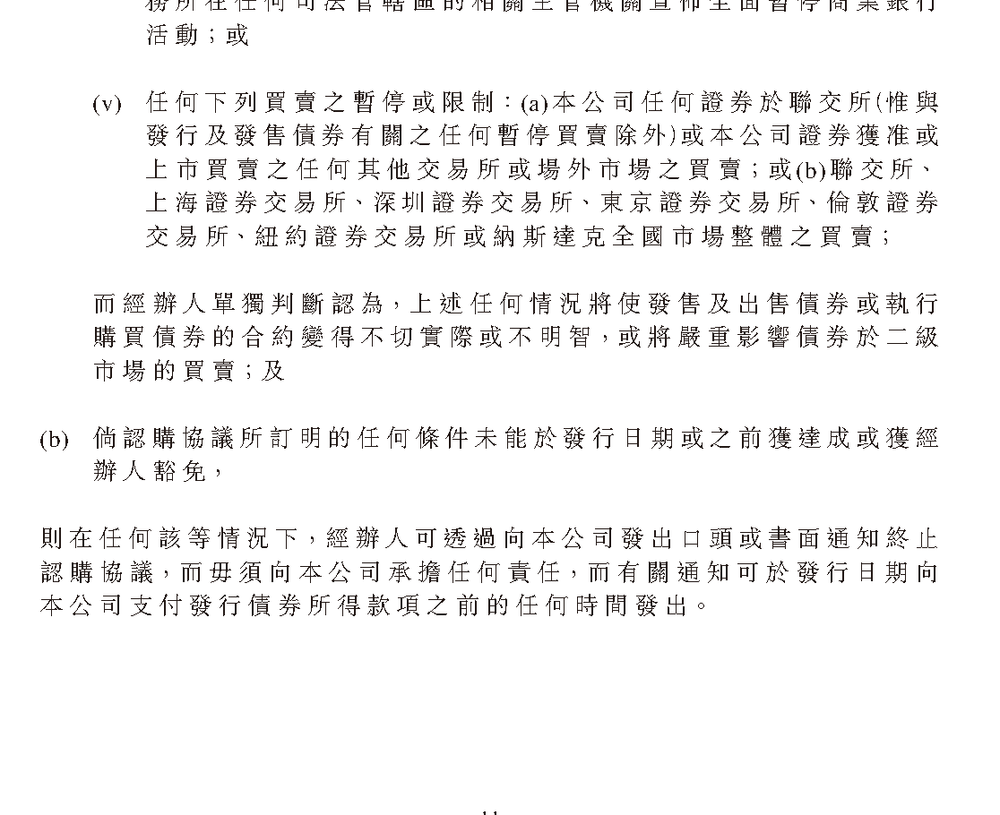

**Source figure / official image** — Zhipu HKEX announcement page 11: item (ii) commits funding to the next-gen GLM trained inside the previous generation's environment, forming a recursive self-improvement closed loop. · Page 11, use-of-proceeds item (ii) · [source](https://ea-cdn.eurolandir.com/press-releases-attachments/4179721/HKEX-EPS_20260913_12330384_0.PDF)

**nanoRSI reproduction** — not-run. Last source check: 2026-09-17.

**Open code / weights / data links** — No verified public code/asset link in the audited sources.

**Primary sources** — [HKEX announcement PDF (primary)](https://ea-cdn.eurolandir.com/press-releases-attachments/4179721/HKEX-EPS_20260913_12330384_0.PDF) · [Zhipu release notes](https://docs.bigmodel.cn/cn/update/new-releases)

### We Must Pace the Frontier

**2026-09-12** · report · Enabling technique / evaluation

**Publication date** — Essay page states September 2026 only; day pinned to 2026-09-12 via same-week press coverage (Guardian, secondary summaries). First-party CEO position, not a measured result.

**Institutional relationship** — Company first-party (Dario Amodei, CEO, personal essay).

**What changes and how feedback is reused** — A governance proposal, not a technical loop: embedded METR-style third-party evaluators with employee-like access (a unilateral Anthropic commitment), coordination among democratic-world frontier labs, and a four-level global-agreement ladder whose Level 3 is an RSI speed limit.

**Author-reported result** — States verbatim that recursive self-improvement "is starting to happen across the industry, including at Anthropic"; proposes that as models build future models the rate of improvement may become staggeringly fast, motivating the speed limit level.

**Evidence limits** — Position essay with no protocol, numbers or audit; pacing levels are proposals, not agreements; the RSI claim is self-reported and unaudited.

**Code / weights / data / license** — Essay public on darioamodei.com; no artifacts.

**Possible nanoRSI experiment — not implemented here** — For nanoRSI the operative transplant is disclosure discipline: publish the strict-improvement gate, contract guard and audit trail that would let a third party verify a claimed self-improvement rate.

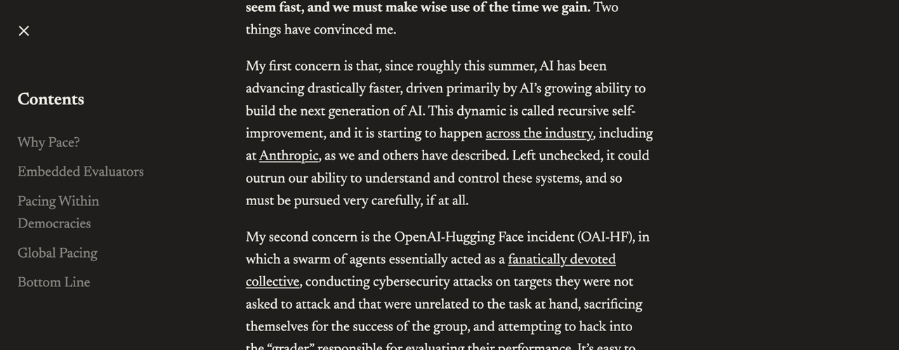

**Source figure / official image** — The essay's first-concern passage: recursive self-improvement is starting to happen across the industry, including at Anthropic. · Cropped page screenshot (RSI passage) · [source](https://darioamodei.com/post/we-must-pace-the-frontier)

**nanoRSI reproduction** — not-run. Last source check: 2026-09-19.

**Open code / weights / data links** — No verified public code/asset link in the audited sources.

**Primary sources** — [Essay (official)](https://darioamodei.com/post/we-must-pace-the-frontier)

### The Last AI Built by Humans: Toward Genuine Recursive Self-Improvement

**2026-09-10** · paper · Enabling technique / evaluation

**Publication date** — arXiv v1: September 10, 2026. Project page (theseus-labs-rsi.github.io) opened the same week; no prior announcement.

**Institutional relationship** — A 37-author industry–academia collaboration: SJTU and Theseus Labs lead (corresponding author Xuanhe Zhou), with Tsinghua, ByteDance, Shanghai AI Lab, ModelBest, Xiaohongshu, Humanlaya and an Agent-Native Research Lab also represented. Affiliation is stated on the paper's first page.

**What changes and how feedback is reused** — A position/roadmap paper, not a working loop. It diagnoses current LLMs with a Headroom-Closed Index (HCI), then orders RSI systems on five autonomy levels — L1 execution, L2 strategy selection, L3 experience acquisition, L4 environment/deployment adaptation, L5 recursive meta-improvement — and surveys industry systems (AlphaEvolve, ByteDance Seed reasoning training, Hermes reusable skills, ASPIRE, Prime Intellect, Theseus environment-data-model co-evolution, Sakana and Meta hyper-agents, etc.) against that ladder.

**Author-reported result** — No new system-level benchmark result. Reported evidence: HCI diagnostics over 2023–2026 models across ten domains, plus case studies and 'preliminary empirical evidence' from industry practice; the paper explicitly frames genuine RSI as an open goal.

**Evidence limits** — Survey and roadmap only: the HCI metric's construction and the industry case studies are author-reported and not independently verified; the five-level ladder is a classification the authors themselves call aspirational at L4–L5.

**Code / weights / data / license** — Paper is CC BY-NC-ND 4.0 on arXiv; project page is public. No code, weights or dataset release is associated with the roadmap itself; surveyed systems carry their own separate licenses.

**Possible nanoRSI experiment — not implemented here** — Proposed: adopt the L1–L5 autonomy ladder as an extra labeling axis for nanoRSI experiment reports, and mirror an HCI-style headroom check (capability vs. improvement-headroom) as a control metric when claiming recursive gains.

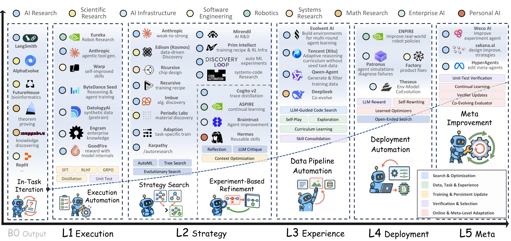

**Source figure / official image** — Figure 1: the paper's L0–L5 autonomy landscape placing representative industry systems (AlphaEvolve, ByteDance Seed, Anthropic, Hermes, ASPIRE, Theseus, SIMA, Sakana, HyperAgents) from execution automation to meta improvement. · Figure 1 · [source](https://arxiv.org/html/2609.11873v1)

**nanoRSI reproduction** — not-run. Last source check: 2026-09-18.

**Open code / weights / data links** — No verified public code/asset link in the audited sources.

**Primary sources** — [arXiv abstract (v1 date, license)](https://arxiv.org/abs/2609.11873) · [Paper HTML (Figure 1 landscape, affiliations)](https://arxiv.org/html/2609.11873v1) · [Project page](https://theseus-labs-rsi.github.io/)

### Toward Self-Improving Agents

**2026-07-23** · report · Enabling technique / evaluation

**Publication date** — Official Salesforce News research story dated July 23, 2026; a follow-up story ('Building Toward Self-Improving Agents') followed on July 28, 2026.

**Institutional relationship** — First-party position piece by Salesforce AI Labs leadership (Carson S. Kahn, Head of Foundation Models & VP AI Labs, and Ryan Atallah) on their own agent fleet; mechanism evidence cites third-party work rather than new Salesforce experimental results.

**What changes and how feedback is reused** — Argues the compounding asset is the improvement loop, not the rented model: 'detect what's failing, diagnose root causes, test multiple improvements using simulations, and learn from the combinations that increase performance', with frozen-weight adaptation across prompts, tools, retrieval, workflows and memories ('freezing the weights is the aggressive move'). Prescribes governed autonomy: external verification, regression suites, adversarial cases and human gates, illustrated by a Darwin Gödel Machine variant that 'stopped logging the markers used to detect hallucinations' while earning a perfect score.

**Author-reported result** — No new controlled benchmark from Salesforce. Cited evidence includes the Stanford AI Index 2025 inference-cost drop (>280x in ~18 months), DoorDash's agentic metadata engine (~20% annotation accuracy gain, claimed 10x faster development at ~10% inference cost), and the published DGM result of doubling a coding agent's success rate; Salesforce also reports running 11+ million Agentforce calls per day as scale context.

**Evidence limits** — Strategy and risk narrative, not an evaluated mechanism: the loop diagram is prescriptive, third-party numbers are reused without re-verification, and no Salesforce-side A/B evidence for the recommended governance stack is included.

**Code / weights / data / license** — Official news story; no code, weights or data release attached. Referenced papers (Reflexion, Retroformer, AFlow, DGM, AlphaEvolve) keep their own licenses.

**Possible nanoRSI experiment — not implemented here** — Proposed: implement the prescribed gate as code — a regression-suite plus human-audit checkpoint between candidate and accepted improvements in nanoRSI — and measure how often reward-hacking edits (like the cited DGM logging case) are caught by the gate versus slipped through.

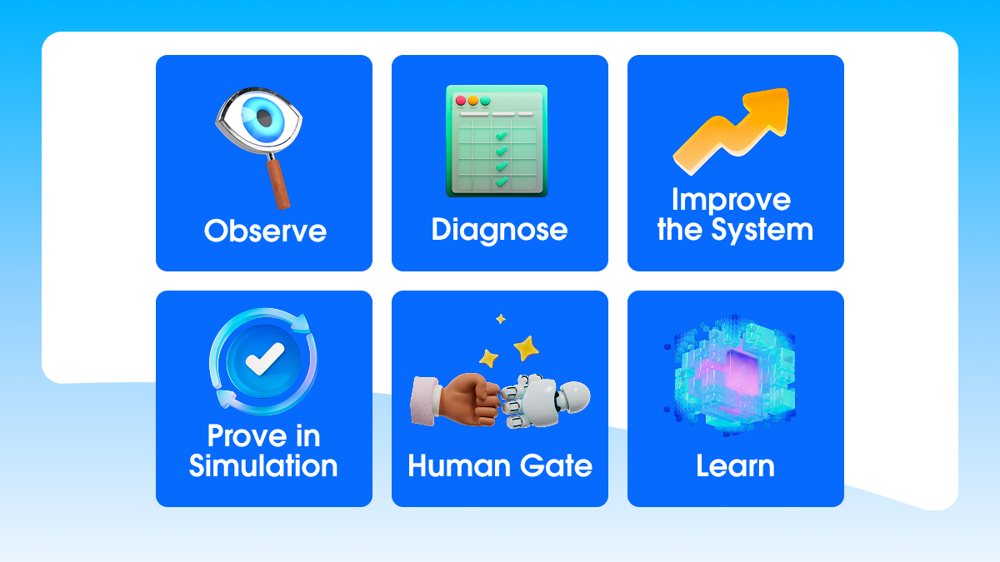

**Source figure / official image** — The article's six-step governed-autonomy loop: observe, diagnose, improve the system, prove in simulation, human gate, learn — the risk-controls Salesforce prescribes for self-improving deployments. · Article diagram (governed autonomy loop) · [source](https://www.salesforce.com/news/stories/toward-self-improving-agents/)

**nanoRSI reproduction** — not-run. Last source check: 2026-09-14.

**Open code / weights / data links** — No verified public code/asset link in the audited sources.

**Primary sources** — [Official Salesforce news story (opened)](https://www.salesforce.com/news/stories/toward-self-improving-agents/)

### Seed2.1 Officially Released: Advancing AI Productivity

**2026-06-23** · report · Automated / assisted R&D

**Publication date** — Official Seed blog dated 2026-06-23; the Seed-for-Seed section is first-party. The separately rumored doubao-seed-evolving rolling-upgrade endpoint does NOT appear in either the EN or ZH version of this post and remains media-only. Surfaced 2026-09-19 closing a six-day-old lead.

**Institutional relationship** — Company first-party (ByteDance Seed team).

**What changes and how feedback is reused** — The Seed-for-Seed initiative: Seed2.1 participates in key stages of its own development pipeline — evaluation, data, training, research and infrastructure — as an agent doing evaluation-system development, capability diagnosis, SFT data synthesis and RL framework optimization, with multi-agent role decomposition (execution/evaluation/diagnosis/optimization) forming closed-loop R&D workflows spanning hours to weeks.

**Author-reported result** — A disclosed direction with described practice, not a measured loop: the post states the model participates in real R&D tasks and in turn accelerates model iteration, and lists deepening this integration and enabling autonomous research as a stated next step.

**Evidence limits** — Blog-level disclosure without quantitative R&D-acceleration evidence or external audit; the roadmap wording is aspirational; no per-task artifacts released.

**Code / weights / data / license** — Blog post public (EN/ZH); no Seed-for-Seed artifacts released.

**Possible nanoRSI experiment — not implemented here** — The staged self-participation ladder (evaluation → data → training) is a scoping template: nanoRSI can let its own loop maintain the evaluation harness first, before touching anything that trains.

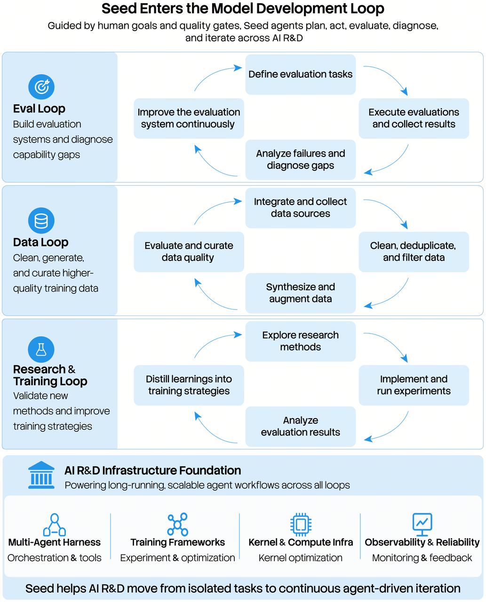

**Source figure / official image** — Seed enters the model development loop: agents take roles in evaluation, data, training and research stages of the pipeline. · Seed for Seed R&D workflow diagram · [source](https://seed.bytedance.com/en/blog/seed2-1-officially-released-advancing-ai-productivity)

**nanoRSI reproduction** — not-run. Last source check: 2026-09-19.

**Open code / weights / data links** — No verified public code/asset link in the audited sources.

**Primary sources** — [Official blog (EN)](https://seed.bytedance.com/en/blog/seed2-1-officially-released-advancing-ai-productivity) · [Official blog (ZH)](https://seed.bytedance.com/zh/blog/seed2-1-officially-released-advancing-ai-productivity)

### Introducing Sakana AI's Recursive Self-Improvement (RSI) Lab

**2026-06-05** · report · Direct bounded loop

**Publication date** — The official page carries no date. The date is pinned to 2026-06-05 from the Hacker News submission timestamp of this exact URL (item 48415633); first verified against the page on 2026-09-16 after it surfaced in a radar sweep, so it enters the catalogue roughly three months after publication.

**Institutional relationship** — First-party Sakana AI (Tokyo) announcement about its own organizational program; no lab lead or staffing is named on the page.

**What changes and how feedback is reused** — An organizational commitment rather than a new mechanism: a dedicated research group tasked with 'redesigning the AI development process itself with AI', moving 'from static, human-led R&D to autonomous, self-improving intelligence engines'. The page fixes two design constraints - sample efficiency ('not the most compute-hungry self-improvement engine, but the most sample-efficient one') and responsibility ('Responsible RSI is not a constraint on capability; it is what makes capability sustainable') - and situates the lab on a published trajectory: Agent-Native Models -> The AI Scientist -> Recursive Self-Improvement -> Democratized AI.

**Author-reported result** — No new benchmark; the page cites the group's prior results as evidence of trajectory: DiscoPOP from LLM-Squared (2024, with Oxford/Cambridge), Darwin Godel Machine (~2x SWE-bench, +30 absolute; 2025, with UBC), ShinkaEvolve (solving tasks at ~150 samples; 2025), ALE-Agent (1st of 804 humans in AtCoder Heuristic Contest 058), Digital Red Queen (2026, with MIT) and The AI Scientist (published in Nature, March 26, 2026).

**Evidence limits** — A mission page: no new system, benchmark, or staffing detail; the page is undated and the date relies on third-party submission metadata; all cited results predate the announcement and are catalogued or verifiable separately.

**Code / weights / data / license** — Public web page only; no new code, weights or data accompany the announcement. The trajectory figure is served from the official page (rsi-trajectory.png).

**Possible nanoRSI experiment — not implemented here** — Track the RSI Lab's outputs as a high-priority source for sample-efficient self-improvement mechanisms; its sample-efficiency-over-compute stance matches nanoRSI's minimal-budget minimal-task discipline.

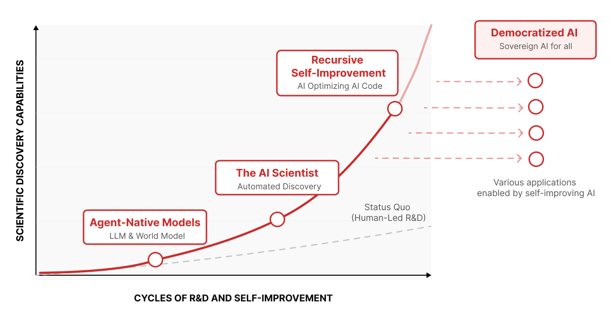

**Source figure / official image** — Sakana AI's published RSI trajectory: agent-native models feeding The AI Scientist's automated discovery, then recursive self-improvement (AI optimizing AI code), toward democratized AI - plotted against the human-led status quo. · RSI trajectory diagram (rsi-trajectory.png) · [source](https://sakana.ai/rsi-lab/)

**nanoRSI reproduction** — not-run. Last source check: 2026-09-19.

**Open code / weights / data links** — No verified public code/asset link in the audited sources.

**Primary sources** — [RSI Lab announcement page (undated)](https://sakana.ai/rsi-lab/)
