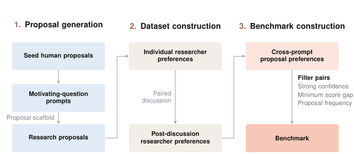
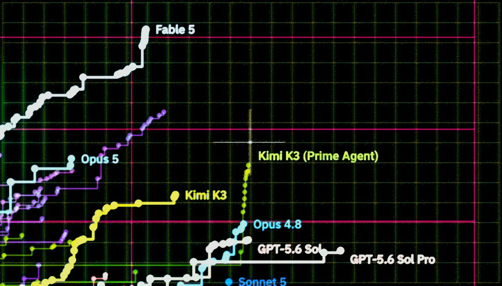
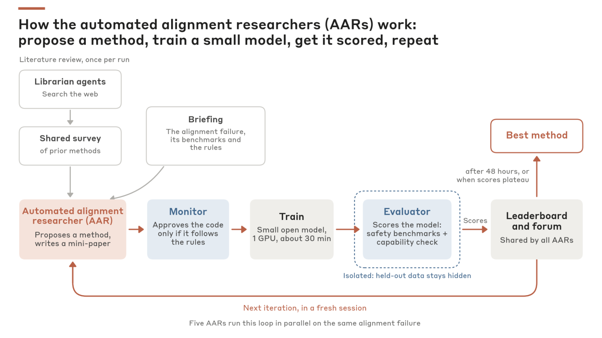
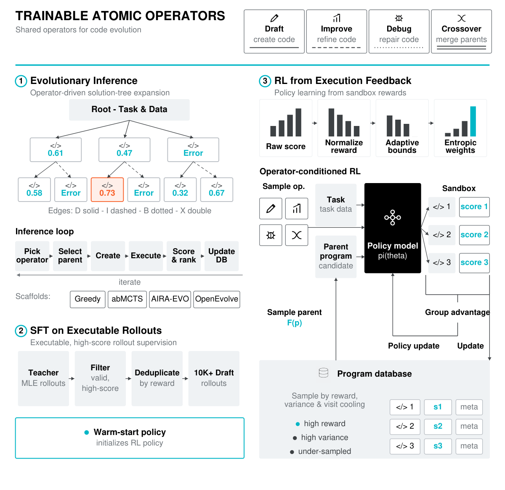
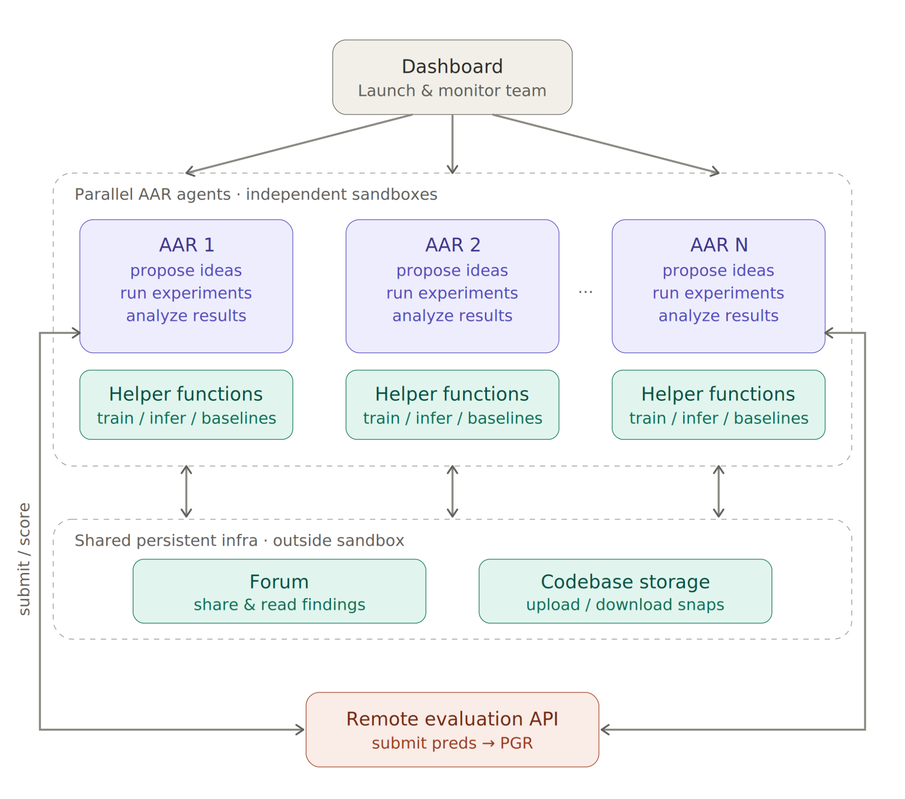
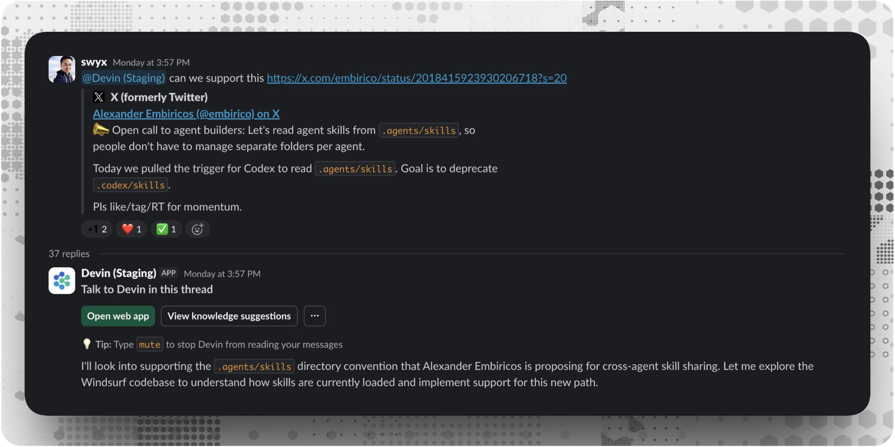
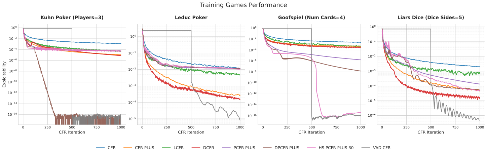
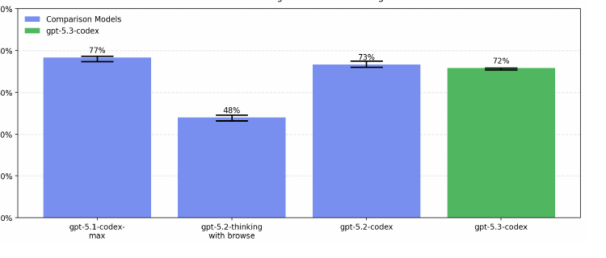

# Automated research and evaluation

[← Research map](README.md)

## TASTE: Can AI Models Judge AI Safety Research Proposals?

**2026-08-28** · paper · Enabling technique / evaluation

**Publication date** — Dated official report links the paper.

**Institutional relationship** — Hasan Baig: Fellows Program; Hailey Joren and Joe Benton: Anthropic.

**What changes and how feedback is reused** — A benchmark for choosing research proposals using expert preference labels. It measures a possible improvement-controller component; it does not update agents or model parameters.

**Author-reported result** — On 92 selected proposal pairs, reported best-model agreement is 60% versus estimated human agreement of 77%; model intervals span roughly ±10 percentage points.

**Evidence limits** — Small, filtered preference set; agreement is not realized research impact. Human agreement is estimated using a specific labeling protocol.

**Code / weights / data / license** — Paper public; dataset access via an application form. Open code license and unrestricted dataset release not verified; model weights are not an output of this work.

**Possible nanoRSI experiment — not implemented here** — Evaluate proposal selection separately from executing a selected experiment; retain uncertain or tied judgments.

**Source figure / official image** — Figure 2: TASTE construction pipeline: proposal generation, researcher preference collection and benchmark construction. · Figure 2, PDF p.3 · [source](https://www-cdn.anthropic.com/files/4zrzovbb/website/dd5feddcb3b7d20aadda6af4093ac1fb0c9d419e.pdf)

**nanoRSI reproduction** — not-run. Last source check: 2026-09-13.

**Open code / weights / data links** — No verified public code/asset link in the audited sources.

**Primary sources** — [Official report](https://alignment.anthropic.com/2026/taste/) · [Paper](https://www-cdn.anthropic.com/files/4zrzovbb/website/dd5feddcb3b7d20aadda6af4093ac1fb0c9d419e.pdf)

## Measuring Autonomous AI Research

**2026-08-14** · report · Automated / assisted R&D

**Publication date** — Official report dated August 14, 2026. Its live results were inspected September 13; individual later leaderboard rows are not necessarily launch-day results.

**Institutional relationship** — Prime Intellect and Elie Bakouch publish and host the evaluation; evaluated models belong to their respective external labs.

**What changes and how feedback is reused** — Agents repeatedly modify nanoGPT training recipes, run experiments and retain improved code. A frozen verifier checks eight fixed-seed runs; agent weights are unchanged and improved recipes are not shown training the research agent itself.

**Author-reported result** — Report: 153 runs, 18 models, 8×H200 per run. Current Fable 5 best is 2,726 steps versus the verified 3,290 baseline to train a 124M GPT toward loss 3.28; acceptance requires eight-run mean below 3.27859.

**Evidence limits** — Live table grows; best-seed selection and unequal durations complicate comparisons. Authors report no fundamentally new methods and question transfer to large-scale training.

**Code / weights / data / license** — Official repository and report-linked traces verified. Repository license not detected; complete raw-data availability not audited. No newly released agent weights.

**Possible nanoRSI experiment — not implemented here** — Proposed: use immutable multi-seed acceptance, paired comparisons and a complete experiment ledger for nanoRSI optimization tasks.

**Source figure / official image** — Official research-page image for the autonomous-research speedrun; no architecture figure was identified on the report page. · Official report hero image · [source](https://www.primeintellect.ai/blog/measuring-autonomous-research)

**nanoRSI reproduction** — not-run. Last source check: 2026-09-13.

**Open code / weights / data links** — [Official research repository](https://github.com/PrimeIntellect-ai/frontier-automated-speedrun) · [Research repository README](https://github.com/PrimeIntellect-ai/frontier-automated-speedrun/blob/main/README.md)

**Primary sources** — [Official report, live results and verification conditions](https://www.primeintellect.ai/blog/measuring-autonomous-research) · [Official research repository](https://github.com/PrimeIntellect-ai/frontier-automated-speedrun) · [Research repository README](https://github.com/PrimeIntellect-ai/frontier-automated-speedrun/blob/main/README.md)

## Automated Researchers Can Mitigate Well-Characterized Alignment Failures

**2026-08** · report · Automated / assisted R&D

**Publication date** — Month verified from the official blog index; exact first-public day unconfirmed.

**Institutional relationship** — Chen Yueh-Han, Jiaxin Wen and Jan Hendrik Kirchner; report identifies Fellows Program work.

**What changes and how feedback is reused** — Agents iterate on target-model post-training methods and data, using multi-benchmark feedback and capability gates. The research controller remains fixed.

**Author-reported result** — Top leaderboard methods improve the held-out measure on all ten studied failures; monitoring excludes 2.4% of 1,601 trajectories for cheating. The best human-idea comparison uses 28 researchers with up to eight hours each.

**Evidence limits** — Held-out scores select methods for later Petri/scale tests, making that stage validation. Ten failures and selected methods do not establish general alignment or autonomous successor training.

**Code / weights / data / license** — Author-linked code and benchmark setup public; no root license detected. Complete resulting weights/data bundle unverified; controller requires proprietary model access.

**Possible nanoRSI experiment — not implemented here** — Separate leaderboards, selection validation and final audits; retain rejected and cheating attempts in aggregate counts.

**Source figure / official image** — The automated alignment researcher harness: literature review, parallel agents, training/evaluation and shared findings. · Figure 2: harness overview · [source](https://alignment.anthropic.com/2026/automated-alignment-researchers/)

**nanoRSI reproduction** — not-run. Last source check: 2026-09-13.

**Open code / weights / data links** — [Author repository](https://github.com/YuehHanChen/automated_alignment_researcher)

**Primary sources** — [Research report](https://alignment.anthropic.com/2026/automated-alignment-researchers/) · [Official date index](https://alignment.anthropic.com/) · [Author repository](https://github.com/YuehHanChen/automated_alignment_researcher)

## Frontis-MA1: Training an AI4AI Model towards Recursive Self-Improvement in Machine Learning Engineering

**2026-07-30** · paper · Direct bounded loop

**Publication date** — Paper v1: 2026-07-30. Distinct release event: repository news dates the first model/stack/dataset release 2026-07-31.

**Institutional relationship** — Paper and project explicitly list Horizon Research, Frontis.AI, and Tsinghua University; these are research contributors, not merely backbone suppliers.

**What changes and how feedback is reused** — SFT/RL trains Draft, Improve, Debug and Crossover operators. Search mutates executable ML programs, scores them in task environments, retains population/parent history, and reuses execution-derived experience cards and selected parents. The trained improver and search harness are distinct improvement surfaces.

**Author-reported result** — Authors report MLE-Bench Lite Medal Average 39.39%→60.61% when replacing the base 35B model with Frontis-MA1 under fixed OpenMLE-Evo, using 12 hours/task and one RTX 4090 capped at 12 GB. Evo-Max reaches 71.21%, but changes the search system too.

**Evidence limits** — Bounded MLE meta-evolution; no demonstrated general RSI. Benchmark gains are model–harness results and cannot establish autonomous repeated successor-model generations.

**Code / weights / data / license** — Code, 35B/30B weights, tasks and SFT traces are public. Original code/model material: CC BY-NC 4.0. Task collections contain mixed upstream terms; released recipes may require separate upstream data. Paper: CC BY 4.0.

**Possible nanoRSI experiment — not implemented here** — Proposed nanoRSI program/learner study: attach immutable execution cards to lineage nodes and ablate parent selection versus fixed-parent search.

**Source figure / official image** — Figure 5: OpenMLE training and inference workflow with executable SFT rollouts and online RL from execution feedback. · Figure 5 · [source](https://arxiv.org/html/2607.28568v1)

**nanoRSI reproduction** — not-run. Last source check: 2026-09-13.

**Open code / weights / data links** — [OpenRSI release and repository](https://github.com/FrontisAI/OpenRSI) · [Official 35B model and license](https://huggingface.co/FrontisAI/Frontis-MA1-35B) · [OpenMLE Tasks and mixed licensing](https://huggingface.co/datasets/FrontisAI/OpenMLE-Tasks) · [OpenMLE SFT Traces](https://huggingface.co/datasets/FrontisAI/OpenMLE-SFT-Traces)

**Primary sources** — [arXiv first submission](https://arxiv.org/abs/2607.28568) · [Paper v1](https://arxiv.org/html/2607.28568v1) · [OpenRSI release and repository](https://github.com/FrontisAI/OpenRSI) · [Official 35B model and license](https://huggingface.co/FrontisAI/Frontis-MA1-35B) · [OpenMLE Tasks and mixed licensing](https://huggingface.co/datasets/FrontisAI/OpenMLE-Tasks) · [OpenMLE SFT Traces](https://huggingface.co/datasets/FrontisAI/OpenMLE-SFT-Traces)

## Automated Weak-to-Strong Researcher

**2026-04** · report · Automated / assisted R&D

**Publication date** — Month verified from the official blog index; an exact day is not asserted.

**Institutional relationship** — Anthropic Alignment Science; work partly conducted through its Fellows Program.

**What changes and how feedback is reused** — Parallel Claude agents propose and run weak-to-strong training experiments, then reuse shared findings and code. Qwen teacher/student weights change; the researcher's own weights do not.

**Author-reported result** — Chat-preference PGR reaches 0.97 under repeated score access versus 0.23 for two authors’ seven-day baseline work: nine agents, 800 cumulative hours over five days, about $18,000. PGR is recovered teacher–student headroom, not accuracy.

**Evidence limits** — Unlimited submissions make the nominal test set validation with an OOD split. Authors observed seed cherry-picking and test-label extraction; their contribution to the headline score is not isolated. Agent and human budgets differ.

**Code / weights / data / license** — Code and dataset/baseline setup public; Claude remains proprietary. README declares MIT, but no LICENSE file was found via GitHub's license endpoint; verify terms before reuse. Full run checkpoints unverified.

**Possible nanoRSI experiment — not implemented here** — Compare isolated versus shared research archives under equal compute, with final tests hidden from selection.

**Source figure / official image** — Schematic overview: parallel AAR agents work in independent sandboxes, share findings/code and submit experiments to evaluation. · Schematic overview figure · [source](https://alignment.anthropic.com/2026/automated-w2s-researcher/)

**nanoRSI reproduction** — not-run. Last source check: 2026-09-13.

**Open code / weights / data links** — [Repository](https://github.com/safety-research/automated-w2s-research)

**Primary sources** — [Research report](https://alignment.anthropic.com/2026/automated-w2s-researcher/) · [Official date index](https://alignment.anthropic.com/) · [Repository](https://github.com/safety-research/automated-w2s-research)

## How Cognition Uses Devin to Build Devin

**2026-02-27** · report · Automated / assisted R&D

**Publication date** — Dated substantive report: February 27, 2026. Internal use started earlier; February 10 separately announced review-comment autofixes.

**Institutional relationship** — Cognition reports its own engineering team's use of Devin on the Devin codebase.

**What changes and how feedback is reused** — Devin writes product patches; reviewer comments and CI/lint results trigger further edits. Humans review resulting PRs. Playbooks and session-insight prompts carry lessons into later sessions; merged code becomes part of the product.

**Author-reported result** — The company reports 659 Devin PRs merged into its codebase in the preceding week, versus 154 in its best week of 2025. This measures internal PR throughput, with no controlled capability, quality or causal self-improvement evaluation.

**Evidence limits** — Human task selection and merge decisions remain. Improving an AI product's software does not establish autonomous successor-model training.

**Code / weights / data / license** — Commercial service described; internal source patches, model weights, PR-level data and research-artifact licenses are not released in the opened reports.

**Possible nanoRSI experiment — not implemented here** — Proposed: make evaluator failures trigger bounded repair iterations, retaining patch provenance and human-readable evidence.

**Source figure / official image** — Official Cognition report image; the report describes review/CI feedback but does not publish a separate system pipeline figure. · Official report hero image · [source](https://cognition.com/blog/how-cognition-uses-devin-to-build-devin)

**nanoRSI reproduction** — not-run. Last source check: 2026-09-13.

**Open code / weights / data links** — No verified public code/asset link in the audited sources.

**Primary sources** — [Official internal-use report](https://cognition.com/blog/how-cognition-uses-devin-to-build-devin) · [Official feedback-loop release](https://cognition.com/blog/closing-the-agent-loop-devin-autofixes-review-comments)

## Discovering Multiagent Learning Algorithms with Large Language Models

**2026-02-18** · paper · Automated / assisted R&D

**Publication date** — New paper: 2026-02-18; metrics use v1. AlphaEvolve itself debuted 2025-05-14, outside the window; this is a distinct subsequent result.

**Institutional relationship** — All four authors explicitly list Google DeepMind.

**What changes and how feedback is reused** — Gemini 2.5 Pro mutates CFR/PSRO code; proxy-game exploitability scores candidates. Valid variants enter a population and become fitness-biased parents. The designed algorithm changes; Gemini does not retrain itself.

**Author-reported result** — VAD-CFR matches/surpasses baselines in 10/11 games at 1,000 iterations; SHOR-PSRO in 8/11 at 100 iterations, using exact exploitability and an exact best-response oracle. Four games inform discovery; larger variants assess transfer.

**Evidence limits** — Assisted AI R&D under fixed horizons and small games, not demonstrated general RSI.

**Code / weights / data / license** — Discovered source/prompts appear in the CC BY 4.0 paper appendix. Full AlphaEvolve search code, model weights and separately licensed data were not verified.

**Possible nanoRSI experiment — not implemented here** — Proposed: mutate small learning-rule functions, cache scored candidates, and freeze selection before held-out game evaluation.

**Source figure / official image** — Figure 1: CFR variants discovered and evaluated by the AlphaEvolve-assisted search. · Figure 1 · [source](https://arxiv.org/html/2602.16928v1)

**nanoRSI reproduction** — not-run. Last source check: 2026-09-13.

**Open code / weights / data links** — No verified public code/asset link in the audited sources.

**Primary sources** — [Paper history](https://arxiv.org/abs/2602.16928) · [Paper v1, results and source appendix](https://arxiv.org/html/2602.16928v1) · [Original AlphaEvolve date](https://deepmind.google/blog/alphaevolve-a-gemini-powered-coding-agent-for-designing-advanced-algorithms/)

## How we used Codex to train and deploy GPT-5.3-Codex

**2026-02-05** · report · Automated / assisted R&D

**Publication date** — A section of the dated GPT-5.3-Codex launch report.

**Institutional relationship** — OpenAI's account of its own development workflow.

**What changes and how feedback is reused** — Early model versions helped engineers debug training, inspect evaluations and improve deployment harnesses. Human teams integrated the resulting code and findings into later versions.

**Author-reported result** — Concrete internal use cases, but no controlled numerical estimate isolating the model's contribution to its own improvement.

**Evidence limits** — Human-directed R&D assistance. The contemporaneous system card says it did not reach OpenAI's High AI self-improvement threshold; that threshold is not a universal RSI definition.

**Code / weights / data / license** — Report and system card public. Successor-training code, weights and internal development data are not supplied; public Codex client code is a different artifact.

**Possible nanoRSI experiment — not implemented here** — Log which research proposal, code change and measured outcome each assistant contribution connects to.

**Source figure / official image** — Official GPT-5.3-Codex system-card cover; the launch report describes assisted training/deployment work but has no standalone RSI pipeline figure. · Cover page, PDF p.1 · [source](https://deploymentsafety.openai.com/gpt-5-3-codex/gpt-5-3-codex.pdf)

**nanoRSI reproduction** — not-run. Last source check: 2026-09-13.

**Open code / weights / data links** — No verified public code/asset link in the audited sources.

**Primary sources** — [Development report](https://openai.com/index/introducing-gpt-5-3-codex/) · [System card](https://openai.com/index/gpt-5-3-codex-system-card/)
