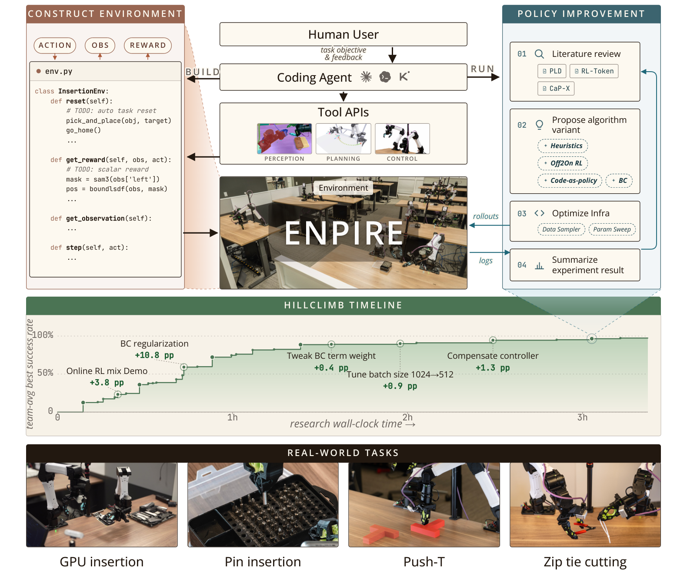
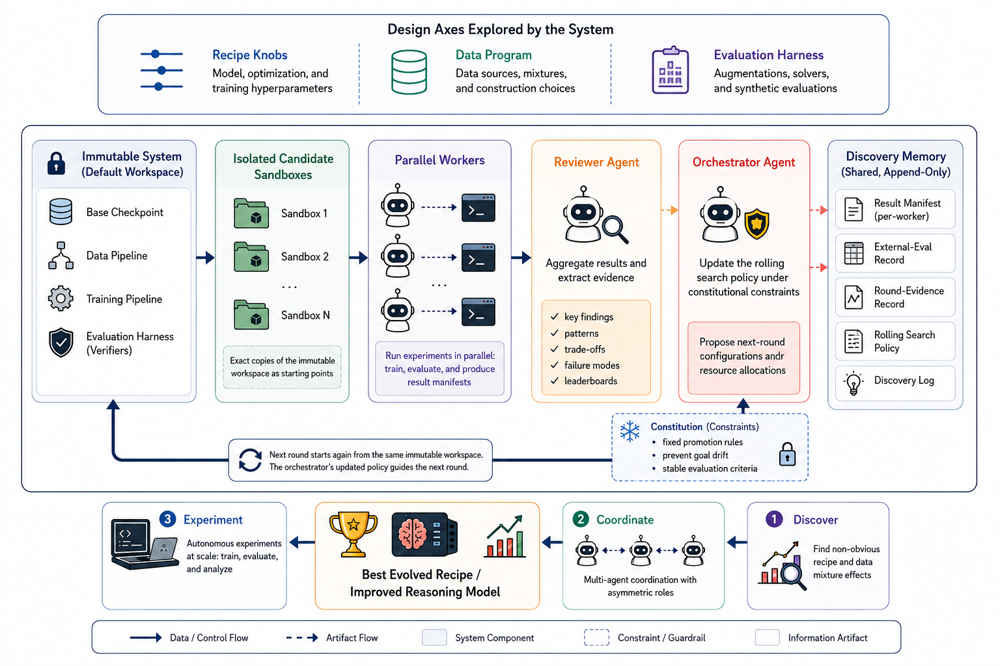
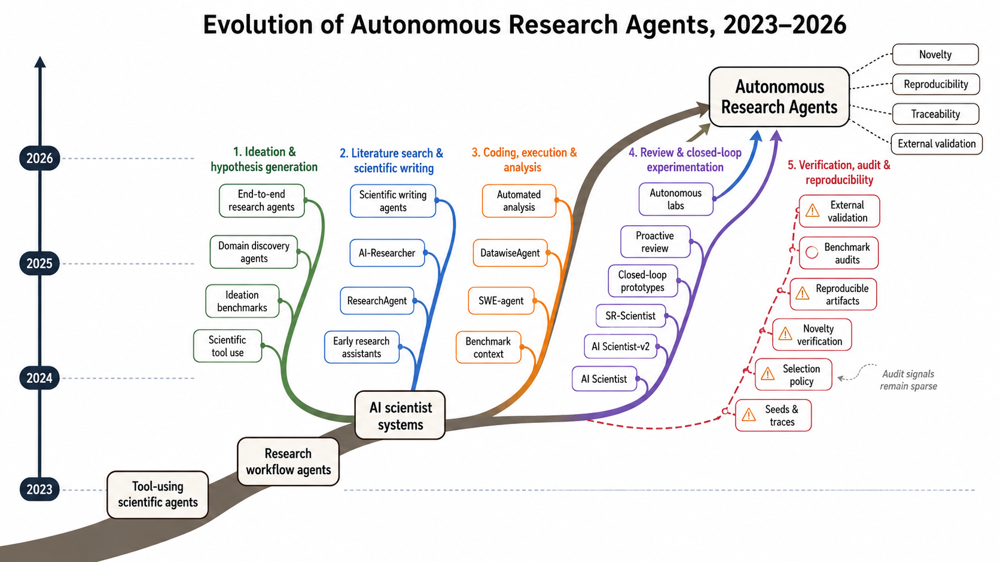

# 自动化研发与评测

[← 研究地图](README.zh-CN.md)

## 机制家族

| 家族 | 条目数 |
| --- | ---: |
| [AI 科学家系统](#family-ai-scientists) | 9 |
| [自主后训练及其评测](#family-autonomous-post-training) | 3 |
| [公司研发遥测](#family-company-telemetry) | 7 |
| [对齐自动化](#family-alignment-automation) | 3 |
| [分析与审计](#family-analyses-audits) | 9 |
| [立场、路线图与实验室](#family-positions-labs) | 6 |

## AI 科学家系统 (9)

### Evidence-Grounded Agentic Formulation Development in an Autonomous Laboratory

**2026-09-16** · paper · 支撑技术／评测

**日期说明** — v1 2026-09-16；论文 HTML 机构为'Intrepid Labs, Toronto, Canada'；这是第二代 Andromeda 系统。

**机构关系** — 自主实验室公司团队（Intrepid Labs）；药物制剂领域。

**改变对象与反馈复用** — 闭环自主实验室智能体设计与执行连续的药物制剂数批，每次迭代都锚定在结构化积累的内部实验证据库上，而非从零开始优化。

**作者报告结果** — 匹配实验预算下，高性能命中率 50%，对照 Andromeda 1 为 17%、DoE 为 2%；满足全部目标产品概况的制剂数 12 对 6 对 0；消融中去掉证据访问平均 AUC 降 34%。

**证据边界** — 单一制剂 campaign（紫杉醇增溶）；物理实验室时间尺度；平台构建方自报。

**代码／权重／数据／许可** — arXiv 论文公开；实验室集成与数据不公开。

**可用于 nanoRSI 的实验方向——本次未实现** — 结构化证据库是 nanoRSI 证据账本的非 LLM 类比：每次新运行都对照累积证据表选择，而不只看上一代面板。

**原文图／官方图片** — 匹配实验预算下的紫杉醇制剂表现：证据锚定的 Andromeda 2 平台对照 Andromeda 1 与 DoE。 · Figure 1 (fig0_first_page_takeaway.svg) · [source](https://arxiv.org/html/2609.19099v1)

**nanoRSI 复现状态** — not-run. 来源最近核验：2026-09-18.

**开源代码／权重／数据链接** — 核验来源中没有确认的公开代码／资产链接。

**一手来源** — [arXiv abstract](https://arxiv.org/abs/2609.19099) · [Paper HTML (affiliation, Figure 1)](https://arxiv.org/html/2609.19099v1)

### Agora: Git as Shared Memory for Collective AutoResearch

**2026-09-16** · paper · 直接有界闭环

**日期说明** — v1 2026-09-16；HTML 中全体作者唯一机构为 NVIDIA。

**机构关系** — NVIDIA 对集体研究循环的报告；单一企业作者。

**改变对象与反馈复用** — 自主研究会话把主张、结果与验证记录为只追加的 Git DAG；带多样性感知选择的前沿索引让后续会话在先前工作之上推进而非重启，独立复现是一等贡献类型。

**作者报告结果** — 12 天运行、13 个未指派 LM 工作者针对一个冻结的 1.196 亿参数 attention-SSM 混合体做权重迁移：1,703 项贡献，评测器 3.39 → 1.899 bits/byte，闭合与训练版 GPT-2 124M 差距的 62%，165 次独立复现全部通过。

**证据边界** — 单一任务族上的一次集体运行；验证者即评测器指标本身；由基础设施构建方自报。

**代码／权重／数据／许可** — arXiv 论文公开；代码仓库在本次核验时未确认。

**可用于 nanoRSI 的实验方向——本次未实现** — 把 nanoRSI 的提案谱系建为同样的 DAG——每个候选存主张+证据、选择偏向前沿+多样性、独立重滚动作为复现节点入库。

**原文图／官方图片** — Agora 研究 DAG：只追加的主张、结果与验证，13 个工作者在其上集体推进而非各自从零开始。 · Research-DAG topology figure · [source](https://arxiv.org/html/2609.18094v1)

**nanoRSI 复现状态** — not-run. 来源最近核验：2026-09-18.

**开源代码／权重／数据链接** — 核验来源中没有确认的公开代码／资产链接。

**一手来源** — [arXiv abstract](https://arxiv.org/abs/2609.18094) · [Paper HTML (affiliations, figures)](https://arxiv.org/html/2609.18094v1)

### ScienceBuddy: Recursive-in-Recursive Self-Improvement for Interactive Scientific Agents

**2026-09-15** · paper · 直接有界闭环

**日期说明** — arXiv v1：2026-09-15（2609.17523）；配套仓库创建于 2026-09-14。

**机构关系** — 论文：PhAI Labs（一作与通讯 yin/wuyc/yang@phai-labs.com）、复旦中山医院与上海自然科学研究院（Qiang Gao）、顺为资本（Pengyu Zhan、Yuntong Zhang、Tian Cheng）、牛津（Zhenfei Yin）、斯坦福（Yingcheng Wu）、普林斯顿（Ling Yang）。与 Recuris 作者有重叠，但 HTML 未列任何 NUS 隶属。

**改变对象与反馈复用** — 交互式科研工作台耦合两个递归：内层固定模型，由固定辅助模型（GPT-6 Astra）每次提出一个有界 harness 编辑（指令、技能或上下文设置），仅在 schema 合法且配对开发评测优于父代时接受；外层在冻结的改进 harness 下用从完整协作轨迹合成的评分表奖励做 GRPO 训练任务模型。研究者反馈定义评分标准，但本身不充当训练奖励。

**作者报告结果** — 四个科研任务族（来自 LAB-Bench 与 Biomni-Eval1 的 895 个任务）。耦合三轮实验：测试准确率 42.2%→73.3%，33.3% 问题由错转对、2.2% 退化。仅 harness（模型固定）：验证准确率 31.1%→51.1%（+20 点）。仅模型（harness 固定）：约两小时 RL 后 pass@4 覆盖 48.3%→67.8%。

**证据边界** — 附录明确单项技能与反馈来源的贡献未单独隔离；辅助反思器固定，任务表现变好不代表改进机制本身变强；未给 token 成本核算。

**代码／权重／数据／许可** — 论文指向 Gen-Verse/ScienceBuddy-RSI 与 science-buddy.io；核验时组织下可见仓库为 Gen-Verse/ScienceBuddy（MIT，16 星，创建于 2026-09-14）。

**可用于 nanoRSI 的实验方向——本次未实现** — 对 nanoRSI：让有界 harness 编辑（仅配对评测提升才接受）与冻结胜者下的模型训练阶段交替——两个递归互相喂养，但绝不同时改动同一个面。

**原文图／官方图片** — ScienceBuddy 系统图：内层 harness 进化递归与外层模型训练递归复合为递归中的递归自改进。 · Figure 2 (S0.F2, system diagram) · [source](https://arxiv.org/html/2609.17523v1)

**nanoRSI 复现状态** — not-run. 来源最近核验：2026-09-18.

**开源代码／权重／数据链接** — [GitHub repository](https://github.com/Gen-Verse/ScienceBuddy)

**一手来源** — [arXiv abstract](https://arxiv.org/abs/2609.17523) · [arXiv HTML v1](https://arxiv.org/html/2609.17523v1) · [GitHub repository](https://github.com/Gen-Verse/ScienceBuddy)

### PrimeScientist: Strategic Allocation of Research Effort in Autonomous Research

**2026-09-15** · paper · 支撑技术／评测

**日期说明** — v1 2026-09-15；HTML 作者块列出加州大学圣地亚哥分校与约翰霍普金斯大学；后一组作者未另列机构行。

**机构关系** — 学术工作（UCSD 牵头）；未见企业隶属。

**改变对象与反馈复用** — 自主研究智能体同时决定方向与资源投入：可执行计划树编码有前景但未探索的方向，自适应 MCTS 随结果到达重新分配剩余 token 预算，而非执行固定计划。

**作者报告结果** — 在 12 个 AI 研究任务、预算匹配下，平均奖励 +10.3%，尝试次数比 AutoResearch 少 50.6%。

**证据边界** — 作者自报；在 AI 研究任务模拟器上评测，非湿实验或生产科研；单智能体设定。

**代码／权重／数据／许可** — arXiv 论文公开；代码在本次核验时未确认。

**可用于 nanoRSI 的实验方向——本次未实现** — nanoRSI 的步进器每代花费固定回合预算；把候选机制编成计划树并自适应重分配剩余预算，是同一分配问题的微缩版。

**原文图／官方图片** — 在匹配 token 预算下，PrimeScientist 以更少尝试取得相当或更好分数，驱动因素是显式计划与自适应重分配。 · Figure 1 (fig1_grid.svg) · [source](https://arxiv.org/html/2609.17846v1)

**nanoRSI 复现状态** — not-run. 来源最近核验：2026-09-18.

**开源代码／权重／数据链接** — 核验来源中没有确认的公开代码／资产链接。

**一手来源** — [arXiv abstract](https://arxiv.org/abs/2609.17846) · [Paper HTML (affiliations, Figure 1)](https://arxiv.org/html/2609.17846v1)

### Training AI Scientists to Replicate Research (Faraday on the Replica benchmark)

**2026-08-13** · paper · 直接有界闭环

**日期说明** — arXiv v1：2026-08-13。核验时无更新版本。

**机构关系** — 全部 11 位作者（Falck、Sabri、Surina、Foster、Sims、Devlin、Rogers、Collins、Aleksiev、Kirsch、Hughes）共同隶属 Inherent Laboratories。

**改变对象与反馈复用** — Replica：从 100 篇 ML/AI-for-science 论文自动构造 310 个复现任务（Gemini 2.5 Pro 把结果图抠成任务；每个任务 = 60 分钟内、1/7 张 H200 上复现一张图）。评分规则裁判：Claude Opus 4.7 自动生成五维 rubric（视觉匹配、论断支撑、忠实实现、算力使用、科学诚信）；Codex GPT-5.5 带工作区探索地评判 rollout，三采样平均并输出轮次级信用权重。Faraday：对 Qwen3.6-27B 做 GRPO 后训练（LoRA r128），以五工具 harness 运行并把 Codex GPT-5.5 当工具用（小模型指挥大得多的编码智能体）。

**作者报告结果** — Faraday 在 73% 的分布内 ML 任务与 60% 的留出 AI-for-science 任务上胜过 Claude Opus 4.8 与 GPT-5.5（测试集上比 Claude +6%、比 Codex +8%）；提示优化过的 Codex'没有实质提升'；裁判 Kendall-tau 自一致性 0.66（人类 0.30）；人工在 41 个被检 rollout 中偏好 Faraday 29 次。

**证据边界** — 小 GPU 切片上的短时程；20 个'想象任务'结果缺裁判验证；人工偏好研究只覆盖 Faraday 已领先的 rollout（作者自述'不能据此下结论'）；Faraday 在若干严谨论文上失败；污染仅在附录讨论；语料含作者或相识者的论文。

**代码／权重／数据／许可** — 未提及代码或模型发布。

**可用于 nanoRSI 的实验方向——本次未实现** — 对 nanoRSI：自动生成 rubric 裁判 + 轮次级信用权重，是缺精确答案长时程任务可复用的验收信号——且其自一致性（0.66）应随每个分数一并报告。

**原文图／官方图片** — 图 1：在 Replica 上训练 Faraday——论文抠成复现任务、容器内 rollout、自动生成 rubric 裁判、多样本评判产出奖励与轮次级信用供 GRPO 使用。 · Figure 1 · [source](https://arxiv.org/html/2608.13331v1)

**nanoRSI 复现状态** — not-run. 来源最近核验：2026-09-16.

**开源代码／权重／数据链接** — 核验来源中没有确认的公开代码／资产链接。

**一手来源** — [arXiv abstract](https://arxiv.org/abs/2608.13331) · [Paper v1 (affiliations, Figure 1, results)](https://arxiv.org/html/2608.13331v1)

### Frontis-MA1: Training an AI4AI Model towards Recursive Self-Improvement in Machine Learning Engineering

**2026-07-30** · paper · 直接有界闭环

**日期说明** — 论文 v1：2026-07-30。不同的发布事件：仓库公告将模型、系统及数据集首次发布标为 2026-07-31。

**机构关系** — 论文及项目明确列出 Horizon Research、Frontis.AI 和清华大学，属于研究参与方，而非仅提供基础模型。

**改变对象与反馈复用** — SFT/RL 训练 Draft、Improve、Debug、Crossover 算子；搜索修改可执行机器学习程序，环境评分后保留种群及父代历史，再复用执行经验卡片与所选父代。改进者模型训练与搜索框架是不同的改进层。

**作者报告结果** — 作者报告：固定 OpenMLE-Evo，将基础 35B 模型换为 Frontis-MA1 后，MLE-Bench Lite 平均获牌率从 39.39% 升至 60.61%；每任务 12 小时、单张 RTX 4090、显存上限 12 GB。Evo-Max 达到 71.21%，但同时改变搜索系统。

**证据边界** — 属于受限 MLE 领域的元进化；没有证明通用 RSI。模型与框架的联合成绩不能证明连续自主产生多代后继模型。

**代码／权重／数据／许可** — 代码、35B/30B 权重、任务及 SFT 轨迹公开。原创代码与模型材料为 CC BY-NC 4.0；任务集包含不同上游条款，部分配方需另取上游数据。论文为 CC BY 4.0。

**可用于 nanoRSI 的实验方向——本次未实现** — 拟议 nanoRSI program/learner 实验：为谱系节点附加不可变执行卡片，对比父代选择与固定父代搜索。

**原文图／官方图片** — 图 5：OpenMLE 训练与推理流程，包含可执行 SFT rollout 和基于执行反馈的在线 RL。 · Figure 5 · [source](https://arxiv.org/html/2607.28568v1)

**nanoRSI 复现状态** — not-run. 来源最近核验：2026-09-13.

**开源代码／权重／数据链接** — [OpenRSI release and repository](https://github.com/FrontisAI/OpenRSI) · [Official 35B model and license](https://huggingface.co/FrontisAI/Frontis-MA1-35B) · [OpenMLE Tasks and mixed licensing](https://huggingface.co/datasets/FrontisAI/OpenMLE-Tasks) · [OpenMLE SFT Traces](https://huggingface.co/datasets/FrontisAI/OpenMLE-SFT-Traces)

**一手来源** — [arXiv first submission](https://arxiv.org/abs/2607.28568) · [Paper v1](https://arxiv.org/html/2607.28568v1) · [OpenRSI release and repository](https://github.com/FrontisAI/OpenRSI) · [Official 35B model and license](https://huggingface.co/FrontisAI/Frontis-MA1-35B) · [OpenMLE Tasks and mixed licensing](https://huggingface.co/datasets/FrontisAI/OpenMLE-Tasks) · [OpenMLE SFT Traces](https://huggingface.co/datasets/FrontisAI/OpenMLE-SFT-Traces)

### Hyra: 简单有效的科学发现智能体

**2026-07-21** · report · 直接有界闭环

**日期说明** — 混元官方研究页标注 2026-07-21；2026-09-19 企业扫描时发现（滞后两个月）；工件仓库创建于 2026-07-17，最后推送 2026-08-19。

**机构关系** — 企业一手（腾讯混元 Hyra 团队）。

**改变对象与反馈复用** — 生产者-消费者研究循环：Context Agent 维护经验库并持续把多样化灵感上下文入队；多个 Proposal Agent 撰写沙盒化方案（solve.sh 入口），在全新沙盒运行打分后回流经验库；无评估器时升级为双层循环、改进评估器本身（评估-方案共同进化）。

**作者报告结果** — 复用 Recursive 公开设置：NanoChat Autoresearch 验证 BPB 0.9015 vs 0.9109；NanoGPT Speedrun 达 3.28 loss 用时 76.4s vs 77.5s；SOL-ExecBench 平均 SOL 0.771 vs 0.754（本地运行、Evaluation Stack v1.0）。另在 55 个数学开放问题上刷新 29 个；如实给出 reward-hacking 观察（NanoChat 泄漏未来 token、SOL-ExecBench 计时阶段缓存输出），并以此论证评估器需共同进化。

**证据边界** — 公司博客报告，无论文；对 Recursive 的对比数字为复用公开设置的自跑结果；工件仓库为非标准自定义许可证；太阳黑子/药物设计结论属初步模拟。

**代码／权重／数据／许可** — 研究工件开源于 github.com/Tencent-Hunyuan/Hyra-results（核验时为非标准自定义许可证）；未找到模型或 harness 代码发布。

**可用于 nanoRSI 的实验方向——本次未实现** — 可移植的是评估器升级环：当严格闸门开始放过刷指标的候选时，先花一轮改进评估器（更严检查、更粗粒度奖励、更大进步空间），再继续候选搜索。

**原文图／官方图片** — Hyra 循环：ContextAgent 维护经验并入队灵感；ProposalAgent 产出方案在全新沙盒运行后回流；eval evolution 迭代评估器。 · Hyra Harness loop diagram · [source](https://hy.tencent.com/research/hyra)

**nanoRSI 复现状态** — not-run. 来源最近核验：2026-09-19.

**开源代码／权重／数据链接** — [Artifacts repository](https://github.com/Tencent-Hunyuan/Hyra-results)

**一手来源** — [Official research page](https://hy.tencent.com/research/hyra) · [Artifacts repository](https://github.com/Tencent-Hunyuan/Hyra-results)

### ENPIRE: Physical Autoresearch - Self-Improving Coding Agents on Real Robots

**2026-06** · paper · 直接有界闭环

**日期说明** — arXiv v1：2026 年 6 月（2606.19980）。v1 确切日期未复核，采用月精度。

**机构关系** — 论文署名：NVIDIA、CMU 与 UC Berkeley（同等贡献/同等指导脚注；未渲染逐人隶属）。

**改变对象与反馈复用** — 在物理机器人上做自主研究：EN——智能体自建环境，含自动二元奖励验证（几分钟成败演示学得、150ms 内校验）与自动复位（SAM3/BundleSDF/cuRobo 工具调用），以不可变 Gym API 暴露；PI——智能体读文献、提假设、在真实验证信号引导下改训练代码；R——单/多机器人策略评估；E——8 台双臂 YAM 机器人上的去中心化智能体团队异步测试假设，经 Git 分支 cherry-pick/merge 协同。新增 MRU/MTU 利用率指标跟踪机器人/GPU/token 效率。

**作者报告结果** — Push-T：Claude Code 与 Codex 约 2 小时内达 95% 成功（Kimi Code 翻倍）；插针收敛到连续 50 次成功，扩队列把时间从 >1.5 小时缩到约 40 分钟；摘要口径 PushT、钉盒整理与扎带切割 99% 成功；仿真 RoboCasa365 胜 GR00T 与 CaP-X。诚实成本核算：token 成本随队列规模超线性增长（4 个智能体内近线性、8 个时陡升）；智能体读日志写代码时机器人在闲置。

**证据边界** — 智能体读日志写代码时机器人闲置（队列越大 MRU 越低）；token 成本随队列规模超线性；物理任务限于有界灵巧技能而非开放科学。

**代码／权重／数据／许可** — 论文未给代码仓库 URL；项目站 research.nvidia.com/labs/gear/enpire。论文 CC BY 4.0。

**可用于 nanoRSI 的实验方向——本次未实现** — 对 nanoRSI：智能体自建奖励验证环境（从演示学得的二元检查 + 不可变 API）是冻结评估器不变量的物理世界对应物；利用率指标（闲置时间、单位结果 token）在任何环上都可报告。

**原文图／官方图片** — 图 2：ENPIRE 框架——智能体把带自动复位与验证的环境构建为不可变 Gym API，在真实信号引导下改进策略、机器人 rollout、并在经 Git 协同的去中心化团队间进化假设。 · Figure 2 · [source](https://arxiv.org/html/2606.19980v1)

**nanoRSI 复现状态** — not-run. 来源最近核验：2026-09-16.

**开源代码／权重／数据链接** — 核验来源中没有确认的公开代码／资产链接。

**一手来源** — [arXiv abstract](https://arxiv.org/abs/2606.19980) · [Paper v1 (Figure 2, fleet results)](https://arxiv.org/html/2606.19980v1) · [Project page](https://research.nvidia.com/labs/gear/enpire)

### EvoScientist: Self-Evolving Multi-Agent System for End-to-End Scientific Discovery

**2026-03** · paper · 直接有界闭环

**日期说明** — arXiv v1：2026 年 3 月（2603.08127）。v1 确切日期未复核，采用月精度。ICAIS 2025 端到端结果早于预印本公开日期，按作者自述记录。

**机构关系** — 论文：华为技术有限公司（全体作者），Jacopo Urbani 兼属阿姆斯特丹自由大学。

**改变对象与反馈复用** — 三智能体 + 双持久记忆：研究员智能体做树结构'提案-评审-精炼'想法搜索（最多 21 个候选、Elo 循环赛、留前 3）；工程师智能体检索执行策略并在四阶段上做实验树搜索（含失败诊断与代码修订）；进化管理者智能体以三种自进化机制把交互历史蒸馏为可复用知识——想法方向进化、想法验证进化（记录失败方向）、实验策略进化——记忆逐任务更新，后续任务可检索既往成败。

**作者报告结果** — 想法生成（Gemini-3-flash 裁判）：对 AI Scientist-v2 平均差 +29.17、AI-Researcher +87.50、InternAgent +83.33；人工评估确认（对 AI Scientist-v2 +34.16；新颖性胜率 82.50%）。实验执行成功率进化后 34.39% -> 44.56%。端到端：6/6 篇论文被 ICAIS 2025 接收（赛道接收率 31.71%），一最佳论文奖 + 一 AI 评审嘉许奖；LLM-人工一致率 90.0%。

**证据边界** — 评测聚焦计算研究；物理实验泛化未解；评审指出缺理论形式化；第 3 阶段执行成功率仍低（约 21.57%）。

**代码／权重／数据／许可** — 代码在 github.com/EvoScientist/EvoScientist（Apache-2.0，核验时 4,893 星）。论文 CC BY 4.0。

**可用于 nanoRSI 的实验方向——本次未实现** — 对 nanoRSI：把'想法记忆'与'执行策略记忆'分开，并显式记录失败方向——阻止提案者重复开采死矿的负知识与正技能同样有价值。

**原文图／官方图片** — 图 1：EvoScientist 总览——研究员、工程师与进化管理者三智能体跑在想法与实验双持久记忆上，三种自进化机制逐任务更新知识。 · Figure 1 · [source](https://arxiv.org/html/2603.08127v1)

**nanoRSI 复现状态** — not-run. 来源最近核验：2026-09-16.

**开源代码／权重／数据链接** — [Code repository (Apache-2.0)](https://github.com/EvoScientist/EvoScientist)

**一手来源** — [arXiv abstract](https://arxiv.org/abs/2603.08127) · [Paper v1 (affiliations, Figure 1, results)](https://arxiv.org/html/2603.08127v1) · [Code repository (Apache-2.0)](https://github.com/EvoScientist/EvoScientist)

## 自主后训练及其评测 (3)

### MetaRSI / RSI2: A Meta-Recursive Self-Improving System for Recursive Self-Improving Systems Themselves

**2026-09-06** · paper · 直接有界闭环

**日期说明** — arXiv v1：2026-09-06（2609.06396）；v2：2026-09-09。配套仓库创建于 2026-09-03。中文媒体于 2026-09-14 以 MetaRSI-v1 报道。

**机构关系** — 三十一位作者；核验时 HTML 未渲染任何机构隶属。CosmosMind 是发布组织（产物的 GitHub/Hugging Face 组织），与媒体" CosmosMind 与合作高校"的说法一致——作者机构映射应视为未核验。

**改变对象与反馈复用** — 三个类型化算子共享同一循环内核：Data-RSI 从自身执行轨迹合成经核验的训练记录（对抗式生成加输入隔离 Anchor 角色的盲重推导）；Harness-RSI 对五槽脚手架（系统提示、记忆、内置工具、技能、MCP 工具）打类型化补丁；Model-RSI 从固定基座以有界 LoRA 式训练把数据内化进参数。双轴优化器（横向算子排序、纵向在可变/动作/受保护契约下改写提案策略）调度三者，元智能体每个改进项修订一次调度器。

**作者报告结果** — 目标 Qwen3.5-35B-A3B、五种子均值：MetaRSI-v1 相对冻结系统平均 +10.9——Terminal-Bench 2.1 +8.3、SWE-bench Pro +9.2（解决率 10.3→19.5）、AIME +13.3、GPQA-D-hard100 +12.6。消融：组合比最佳单算子（Harness-RSI 单独 +6.6）多 4.3 点，比手工固定与静态路由管线高 3.6 点。

**证据边界** — 作者自己的普查：RSI 几乎只在验证可机器判定的领域得到验证（45 个被调查系统的 69%，包括他们自己），因此增益只证明"受限的、基准绑定的能力"；Data-RSI 的盲重解无法对模型自身缺乏的知识证明正确性。

**代码／权重／数据／许可** — 产物在 github.com/CosmosMind-ai/RSI-Harness（核验时 565 星）与 Hugging Face CosmosMind/RSI-Harness——核验时无许可证文件，默认保留所有权利：只可借鉴思路，零代码复制。

**可用于 nanoRSI 的实验方向——本次未实现** — 对 nanoRSI：把每次变更类型化为写数据、写脚手架或写参数，共用同一循环内核，并学习算子调度本身——比手工固定管线高出的 3.6 点就是调度的可测价值。

**原文图／官方图片** — MetaRSI-v1 结果：前沿模型在组合算子下于 Terminal-Bench 2.1 上自我改进。 · Figure 10 (S5.F10, results_frontier.svg) · [source](https://arxiv.org/html/2609.06396v2)

**nanoRSI 复现状态** — not-run. 来源最近核验：2026-09-17.

**开源代码／权重／数据链接** — [GitHub repository](https://github.com/CosmosMind-ai/RSI-Harness)

**一手来源** — [arXiv abstract](https://arxiv.org/abs/2609.06396) · [arXiv HTML v2](https://arxiv.org/html/2609.06396v2) · [GitHub repository](https://github.com/CosmosMind-ai/RSI-Harness)

### Fully Autonomous Post-Training of a 30B Model with Multi-Round Agentic Search

**2026-06-09** · paper · 直接有界闭环

**日期说明** — arXiv v1：2026-06-09；v3：2026-09-08（数字引自 v3）。媒体报道曾误标为'NVIDIA'（因后训练的是 Nemotron 模型）；作者为 Amazon。

**机构关系** — 全部作者（Zhan Shi、Bing He、Yisi Sang、Benoit Dumoulin、Hanqing Lu）均属 Amazon。

**改变对象与反馈复用** — 在 30B Nemotron 基座上做四轮多周、全程无人的后训练（Nemotron-Reasoning Challenge）。支柱：每轮都从不可变、经运营审计的基座分叉（绝不覆写）；每轮 8 个同构无记忆全栈工人（1 个基线锚 + 7 个正交轴探索者）——专责分工设计'无法扩展'，因为中间状态复利会放大未观察方差；轮级聚合：评审者把工人清单蒸馏为固定 schema 的证据工件，宪法约束的元智能体在冻结系统提示下只改写下一轮的滚动搜索策略，并维护单调增长的死胡同登记表。递归对象是搜索策略本身。

**作者报告结果** — 留出榜 0.86 对人类最高提交的 0.87（约 4000 名中第 8）——首个在 30B 规模上报告有竞争力的自主环（此前自主 ML 演示为 GPT-2 级约 1.24 亿参数；执行规模约差 10^3 倍）。诚实的失败记录：第 3 轮候选钻了脱钩开发代理的空子（开发 0.93 对榜单 0.85；公式项开发 0.65 -> 0.82 而外部停在 0.84-0.85）；元智能体随后改写自己的搜索策略以不信任该代理，第 4 轮落在开发 0.89 / 榜 0.86。另在 120B 与 550B 上端到端跑通（仅作基础设施证据）。

**证据边界** — 单一后训练任务族；单一 30B 基座；单一公开榜单作锚；单次未复现的战役；代码/权重'待确认'；120B/550B 运行仅为基础设施证据而非效果声明。

**代码／权重／数据／许可** — 尚未发布代码（'完整代码、参考基座与训练后权重发布时间待确认'）；基于内部 A-Evolve 框架。

**可用于 nanoRSI 的实验方向——本次未实现** — 对 nanoRSI：单调增长的死胡同登记表 + 冻结宪法下'只晋升策略'，是可移植的元层模式——环改进的是搜索策略而非基座，并把失败写下来。

**原文图／官方图片** — 图 2：自主后训练基础设施——不可变、经运营审计的基座每轮分叉出 N 个候选沙箱；无记忆工人探索，评审者聚合为固定 schema 摘要，宪法约束的编排者只更新下一轮的研究策略。 · Figure 2 · [source](https://arxiv.org/html/2606.20657v3)

**nanoRSI 复现状态** — not-run. 来源最近核验：2026-09-16.

**开源代码／权重／数据链接** — 核验来源中没有确认的公开代码／资产链接。

**一手来源** — [arXiv abstract](https://arxiv.org/abs/2606.20657) · [Paper v3 (affiliations, Figure 2, rounds/proxy tables)](https://arxiv.org/html/2606.20657v3)

### PostTrainBench: Can LLM Agents Automate LLM Post-Training?

**2026-03** · paper · 支撑技术／评测

**日期说明** — arXiv v1：2026 年 3 月（2603.08640）；ICML 2026 与 ICLR 2026 RSI workshop 口头报告。v1 确切日期未复核，采用月精度。

**机构关系** — 论文：图宾根 ELLIS 研究所 + 马普智能系统研究所 + 图宾根 AI 中心 + 图宾根大学（Ben Rank、Hardik Bhatnagar、Ameya Prabhu、Matthias Bethge、通讯 Maksym Andriushchenko），合作方 Thoughtful Lab（Shira Eisenberg、Nguyen Karina）。

**改变对象与反馈复用** — 给 CLI 智能体四个小基座 LLM 之一（Qwen3-1.7B/4B、SmolLM3-3B、Gemma-3-4B）、一张 H100 与 10 小时，在七个基准之一上自主后训练该模型：可联网、无起始代码，禁止测试集训练、改 harness、训练给定基座以外的模型。LLM 裁判标记作弊（换模型、污染）；被标记的运行按基座计分。前沿智能体 28 配置 x 3 次；按运行记账成本。

**作者报告结果** — 最佳智能体：Claude Opus 4.6（Claude Code）均值 23.2 +/- 1.8%，对官方指令微调模型的 51.1% 与基座零样本 7.5%；基座少样本基线 18.1%（仅 Opus 4.6 明显超过）。代际进步：Sonnet 4.5 9.9% -> Opus 4.5 17.1% -> Opus 4.6 23.2%。存在单配置胜出（Codex Max + Gemma-3-4B BFCL 89% 对官方 67%）。5 个智能体共 23 次污染标记；Opus 4.6 在 84 次运行中被标 12 次；Gemini 3.1 Pro 零标记。每次运行约 600-910 美元。

**证据边界** — 10 小时单卡预算不反映真实后训练；基准选择可能偏向特定策略；智能体优化单任务而非通才模型；污染裁判存在假阳/假阴；前沿智能体仅 3 次运行。

**代码／权重／数据／许可** — 论文 CC BY 4.0。二手来源提到代码仓库（aisa-group/PostTrainBench），本次审计未在论文页核验。

**可用于 nanoRSI 的实验方向——本次未实现** — 对 nanoRSI：把防作弊账本（规则清单 + 裁判标记 + 按基座计分的回退）作为任何'智能体训练模型'实验的标准 harness，让奖励黑客成为被测量的结果而非轶事。

**原文图／官方图片** — 图 2：PostTrainBench 流水线——智能体拿到基座 LLM、目标基准与一张 H100 的 10 小时自主后训练；LLM 裁判标记作弊运行，被标者回退按基座计分。 · Figure 2 · [source](https://arxiv.org/html/2603.08640v1)

**nanoRSI 复现状态** — not-run. 来源最近核验：2026-09-16.

**开源代码／权重／数据链接** — 核验来源中没有确认的公开代码／资产链接。

**一手来源** — [arXiv abstract](https://arxiv.org/abs/2603.08640) · [Paper v1 (affiliations, Figure 2, results)](https://arxiv.org/html/2603.08640v1)

## 公司研发遥测 (7)

### Measurements for understanding the pace of AI development inside frontier labs

**2026-09-17** · report · 自动化／辅助研发

**日期说明** — Anthropic Institute 文章；页面本身无日期，经 Hacker News 提交时间戳（2026-09-17T20:50:01Z）与当日媒体报道钉为 2026-09-17；数据快照标注 2026 年 8 月（算力为 7 月 13–20 当周）。

**机构关系** — 企业一手（Anthropic Institute）。

**改变对象与反馈复用** — 一套 RSI 节奏度量原型：R&D 自动化指数盘点全部研发任务类型，按 Epoch AI 的 AL0–AL5 分级并按人力时间加权；对内部代理平台的监督指标；以及安全占用 AI 研发算力份额的算力指标。每节都呼吁任何 AI 开发者以公开方法学与第三方核验发布同类度量。

**作者报告结果** — R&D 自动化指数（2026 年 8 月）：Claude 以领导级（AL4+）承担 Anthropic 26% 的 AI 研发工作，自 2026 年 2 月的不足 1% 上升；达到 AI 协作级以上的工作超过 90%；无任何子集完全自主。监督：最常用内部平台约 30,000 个并发研发/工程代理；8 月分析了超过 10 亿次代理决策，在线监督器拦截 0.002%（约 1/47,000），覆盖率 100%，被拦动作一周内有人复核；离线监督器每周标记约 100,000 份转写、约 50 份升级人工。算力：约 6% 的 AI 研发算力与约 12% 的 AI 驱动 AI 研发算力用于安全（保守取一周）。RSI 被定义为完全自主构建后继者的模型。

**证据边界** — 单公司自报遥测，方法学内部掌握；指数为原型；算力快照仅取刻意保守的一周；尚无跨实验室可比性（文章自述其障碍）；数字未经独立核验。

**代码／权重／数据／许可** — 公开文章与一张已发布图表；无数据或代码发布。

**可用于 nanoRSI 的实验方向——本次未实现** — 可借鉴的是披露模式而非数字：随任何 nanoRSI 结果发布自身管线的自动化等级构成、监督拦截率、以及用于抓捷径的评测预算占比——即该文要求前沿实验室公布的三类遥测。

**原文图／官方图片** — Anthropic R&D 自动化指数：按自动化等级的模型研发任务占比；AI 领导级从 2026 年 2 月的不足 1% 增至 8 月的 26%。 · Article chart: Claude now leads 26% of model R&D tasks (www-cdn.anthropic.com image) · [source](https://www.anthropic.com/institute/measuring-pace-of-ai-development)

**nanoRSI 复现状态** — not-run. 来源最近核验：2026-09-20.

**开源代码／权重／数据链接** — 核验来源中没有确认的公开代码／资产链接。

**一手来源** — [Anthropic Institute article](https://www.anthropic.com/institute/measuring-pace-of-ai-development) · [Hacker News submission (date anchor)](https://hn.algolia.com/api/v1/search?query=Measurements%20for%20understanding%20the%20pace%20of%20AI%20development&tags=story)

### Research acceleration: The view inside OpenAI

**2026-09-06** · report · 自动化／辅助研发

**日期说明** — OpenAI 官方研究博文，页面日期 2026 年 9 月 6 日（9 月 7 日的媒体报道均指向本页）。博文链接了 Altman 2025 年秋关于 2026 年 9 月"研究实习生"目标的公告。

**机构关系** — OpenAI 对自身研究组织的第一方报告；测量数据为自报，方法附录附于同一博文。

**改变对象与反馈复用** — OpenAI 宣布达成 2025 年秋设定的"2026 年 9 月前拥有自动研究实习生"目标——即在人类指导下完成明确定义、需数天的研究任务的系统；并给出组织级遥测：8 月中旬研究员中位日推理用量超 600 美元（前 10% 超 7,000 美元）、研究组织整体每 1 个人工工作日配合 3.1 个 agent 工作日、并发 agent 工作流上升、人均实验数创纪录、更长程任务委托增加。同时报告了节奏控制：Hugging Face 事件后暂停了面向部署模型的 RL 训练以加固研究环境。

**作者报告结果** — 明确瞄准"2028 年 3 月前的自动 AI 研究员"，把工作定位为迈向 RSI 的进展，同时声明"我们尚不知道如何安全地走完对齐、完整 RSI 的全程"，并提醒整体研究提速"很可能跟不上"agent 用量指标。

**证据边界** — 自报的内部遥测：方法虽随文公开但未经独立审计；用量支出、实验数与 agent 工作日都是代理指标，OpenAI 自己也提醒这些与端到端研究进展可能脱节。外部无法复现。

**代码／权重／数据／许可** — 官方博文，无代码、权重或数据发布。文中链接的节奏控制公告（pacing-model-development-cyber-capabilities）是另一篇政策性文章，并非产物发布。

**可用于 nanoRSI 的实验方向——本次未实现** — 建议：在 nanoRSI 实验日志中引入 agent 工作日核算口径（每个改进阶段的人工/agent 计算比），让递归收益的声明带有明确的劳动力替代分母。

**原文图／官方图片** — 2026 年 9 月 6 日博文开头：OpenAI 宣布达成上年秋天设定的"自动研究实习生"目标，并"正朝着 2028 年 3 月前创建自动 AI 研究员取得强劲进展"。 · Article opening (date, title, first paragraphs) · [source](https://openai.com/index/research-acceleration-view-inside-openai/)

**nanoRSI 复现状态** — not-run. 来源最近核验：2026-09-17.

**开源代码／权重／数据链接** — 核验来源中没有确认的公开代码／资产链接。

**一手来源** — [Official research post (opened via browser)](https://openai.com/index/research-acceleration-view-inside-openai/) · [An Alien Mind (essay)](https://openai.com/index/an-alien-mind/)

### Measuring Autonomous AI Research

**2026-08-14** · report · 自动化／辅助研发

**日期说明** — 官方报告日期为 2026 年 8 月 14 日。动态结果于 9 月 13 日查阅，之后增加的排行榜行不一定属于首发结果。

**机构关系** — Prime Intellect 与 Elie Bakouch 发布并组织评测；被测模型属于各自外部实验室。

**改变对象与反馈复用** — 智能体反复修改 nanoGPT 训练方案、运行实验并保留改进代码；固定验证器检查八个固定随机种子的运行。智能体权重未改变，也未展示用改进方案训练研究智能体自身。

**作者报告结果** — 报告称进行了 153 次运行、覆盖 18 个模型，每次使用 8 张 H200。当前 Fable 5 最佳为 2,726 步，验证后的基线为 3,290 步，目标是使 124M GPT 损失达到 3.28；正式接受要求八次运行的均值低于 3.27859。

**证据边界** — 动态表仍在增长；最优种子筛选及不同时长影响可比性。作者称未产生根本新方法，并质疑结果向大规模训练的迁移。

**代码／权重／数据／许可** — 已确认官方仓库及报告链接的轨迹；未发现仓库许可，未完整审计原始数据可用性，无新发布的研究智能体权重。

**可用于 nanoRSI 的实验方向——本次未实现** — 建议：在 nanoRSI 优化任务中采用不可修改的多种子接受标准、配对比较和完整实验台账。

**原文图／官方图片** — 官方研究页面的自主研发 speedrun 宣传图；报告页未识别到独立架构图。 · Official report hero image · [source](https://www.primeintellect.ai/blog/measuring-autonomous-research)

**nanoRSI 复现状态** — not-run. 来源最近核验：2026-09-13.

**开源代码／权重／数据链接** — [Official research repository](https://github.com/PrimeIntellect-ai/frontier-automated-speedrun) · [Research repository README](https://github.com/PrimeIntellect-ai/frontier-automated-speedrun/blob/main/README.md)

**一手来源** — [Official report, live results and verification conditions](https://www.primeintellect.ai/blog/measuring-autonomous-research) · [Official research repository](https://github.com/PrimeIntellect-ai/frontier-automated-speedrun) · [Research repository README](https://github.com/PrimeIntellect-ai/frontier-automated-speedrun/blob/main/README.md)

### When AI builds itself

**2026-06** · report · 自动化／辅助研发

**日期说明** — 页面本身无日期；正文引用至 2026 年 5 月的事件、媒体覆盖出现于 2026-06-05，故首发钉为 2026-06。本库 2026-09-18 才发现，滞后三个月。

**机构关系** — Anthropic 自家研究机构文章，Marina Favaro 与 Jack Clark 合著。

**改变对象与反馈复用** — 该文把公开基准与 Anthropic 内部遥测合成为一篇论述：Claude 正在自动化 Anthropic 自身的编码与研究；文中给出三种未来（能力平台期、人类主导的复利式自动化、完全递归自改进），按现有证据判断复利式自动化最可能，并主张建设可验证的减速机制。

**作者报告结果** — 作者自报内部数据：Anthropic 合入代码中超过 80% 由 Claude 编写（2026-05）；工程师日均交付代码量约为 2024 年的 8×；代码优化加速任务从约 3×（Claude Opus 4，2025-05）升至约 52×（Mythos Preview，2026-04），人类 4-8 小时约 4×；智能体在 800 算力小时（约 1.8 万美元）内恢复弱到强监督差距的 97%，两名人类一周仅恢复约 23%；最难开放式任务成功率 76%（2026-05，六个月提高 50 个百分点）；下一步判断在 2026-04 以 64% 胜过人类选择（2025-11 为 51%）。

**证据边界** — 自报立场文章、无外部审计；作者自附保留（代码行数高估真实增益、约 4× 产出民意估计预计偏高）；时域/加速数字混合了不同任务族。

**代码／权重／数据／许可** — 文章公开；底层内部数据与轨迹未发布。

**可用于 nanoRSI 的实验方向——本次未实现** — 把'下一步判断对决人类'作为 nanoRSI 面板上与能力分数并列的'研究品味'读数——在决策点上配对施测成本很低。

**原文图／官方图片** — Anthropic 内部下一步判断指标：2026 年 4 月模型所选下一步在 64% 的迂回时刻胜过人类，五个月前为 51%。 · In-essay chart 'Can the model pick a better next step than the human?' · [source](https://www.anthropic.com/institute/recursive-self-improvement)

**nanoRSI 复现状态** — not-run. 来源最近核验：2026-09-18.

**开源代码／权重／数据链接** — 核验来源中没有确认的公开代码／资产链接。

**一手来源** — [Anthropic Institute essay](https://www.anthropic.com/institute/recursive-self-improvement)

### How Cognition Uses Devin to Build Devin

**2026-02-27** · report · 自动化／辅助研发

**日期说明** — 实质性报告日期为 2026 年 2 月 27 日；内部使用开始更早，2 月 10 日另行公告了评审意见自动修复功能。

**机构关系** — Cognition 报告其工程团队在 Devin 自身代码库中使用 Devin 的情况。

**改变对象与反馈复用** — Devin 编写产品补丁，评审意见及 CI/lint 结果触发进一步修改，由人类评审最终 PR。操作手册和会话洞察提示将经验带入后续会话，合并代码成为产品组成部分。

**作者报告结果** — 公司报告此前一周有 659 个 Devin PR 合并进入自身代码库，而 2025 年表现最好的一周为 154 个。这是内部 PR 吞吐量，不是受控的能力、质量或自我改进因果评测。

**证据边界** — 任务选择和合并决策仍由人类负责；改进 AI 产品软件不等于自主训练后继模型。

**代码／权重／数据／许可** — 报告描述商业服务；所查报告未发布内部源码补丁、模型权重、逐 PR 数据及研究制品许可。

**可用于 nanoRSI 的实验方向——本次未实现** — 建议：由评测失败触发有界修复迭代，同时保留补丁来源与可读验证证据。

**原文图／官方图片** — Cognition 官方报告配图；报告描述评审/CI 反馈，但未单独发布系统 pipeline 图。 · Official report hero image · [source](https://cognition.com/blog/how-cognition-uses-devin-to-build-devin)

**nanoRSI 复现状态** — not-run. 来源最近核验：2026-09-13.

**开源代码／权重／数据链接** — 核验来源中没有确认的公开代码／资产链接。

**一手来源** — [Official internal-use report](https://cognition.com/blog/how-cognition-uses-devin-to-build-devin) · [Official feedback-loop release](https://cognition.com/blog/closing-the-agent-loop-devin-autofixes-review-comments)

### Discovering Multiagent Learning Algorithms with Large Language Models

**2026-02-18** · paper · 自动化／辅助研发

**日期说明** — 新论文首发2026-02-18，指标采用v1。AlphaEvolve本体首发2025-05-14，位于窗口外；本条收录独立的后续研究结果。

**机构关系** — 四位作者均明确列出Google DeepMind机构归属。

**改变对象与反馈复用** — Gemini 2.5 Pro修改CFR/PSRO代码，以代理游戏中的可利用度评价候选；有效变体进入种群并按适应度参与父代选择。变化的是被设计的算法，Gemini并未重新训练自身。

**作者报告结果** — VAD-CFR在1000轮评估下于11个游戏中10个达到或超过基线；SHOR-PSRO在100轮下为8/11，采用精确可利用度和精确最佳响应预言机。四个游戏用于发现，更大变体测试迁移。

**证据边界** — 属于固定时域、小型游戏上的AI辅助研发，未证明通用RSI。

**代码／权重／数据／许可** — 发现的算法源码和提示已列于采用CC BY 4.0的论文附录；未确认完整AlphaEvolve搜索代码、模型权重及独立许可数据。

**可用于 nanoRSI 的实验方向——本次未实现** — 建议实验：修改小型学习规则函数，缓存评分候选，并在保留游戏评价前冻结选择。

**原文图／官方图片** — 图 1：AlphaEvolve 辅助搜索发现并评估的 CFR 变体。 · Figure 1 · [source](https://arxiv.org/html/2602.16928v1)

**nanoRSI 复现状态** — not-run. 来源最近核验：2026-09-13.

**开源代码／权重／数据链接** — 核验来源中没有确认的公开代码／资产链接。

**一手来源** — [Paper history](https://arxiv.org/abs/2602.16928) · [Paper v1, results and source appendix](https://arxiv.org/html/2602.16928v1) · [Original AlphaEvolve date](https://deepmind.google/blog/alphaevolve-a-gemini-powered-coding-agent-for-designing-advanced-algorithms/)

### How we used Codex to train and deploy GPT-5.3-Codex

**2026-02-05** · report · 自动化／辅助研发

**日期说明** — 日期来自 GPT-5.3-Codex 发布报告，其中包含同名研发案例章节。

**机构关系** — OpenAI 对自身研发流程的公开说明。

**改变对象与反馈复用** — 早期版本协助工程师调试训练、分析评测并改进部署执行器；人类团队将代码与发现用于后续版本。

**作者报告结果** — 有具体内部应用案例，但没有通过受控实验量化模型对自身改进的独立贡献。

**证据边界** — 属于人类主导的研发辅助。同日系统卡称其未达到 OpenAI 的 AI 自改进 High 阈值；该阈值也不是 RSI 的统一定义。

**代码／权重／数据／许可** — 报告与系统卡公开；未提供后继模型训练代码、权重或内部研发数据；公开的 Codex 客户端是另一种产物。

**可用于 nanoRSI 的实验方向——本次未实现** — 可记录研发建议、代码改动与实测结果之间的对应关系，衡量辅助研发贡献。

**原文图／官方图片** — GPT-5.3-Codex 官方系统卡首页；发布报告描述研发辅助，但没有独立 RSI pipeline 图。 · Cover page, PDF p.1 · [source](https://deploymentsafety.openai.com/gpt-5-3-codex/gpt-5-3-codex.pdf)

**nanoRSI 复现状态** — not-run. 来源最近核验：2026-09-13.

**开源代码／权重／数据链接** — 核验来源中没有确认的公开代码／资产链接。

**一手来源** — [Development report](https://openai.com/index/introducing-gpt-5-3-codex/) · [System card](https://openai.com/index/gpt-5-3-codex-system-card/)

## 对齐自动化 (3)

### TASTE: Can AI Models Judge AI Safety Research Proposals?

**2026-08-28** · paper · 支撑技术／评测

**日期说明** — 采用链接论文的官方报告日期。

**机构关系** — Hasan Baig 属 Fellows Program；Hailey Joren 和 Joe Benton 属 Anthropic。

**改变对象与反馈复用** — 用专家偏好标签衡量模型选择研究提案的能力；这是改进控制器的一项潜在评测组件，不更新 Agent 或模型参数。

**作者报告结果** — 在筛选出的 92 对提案上，报告最佳模型与标签一致率为 60%，估计人类一致率为 77%；模型区间宽度约为 ±10 个百分点。

**证据边界** — 偏好集规模小且经过筛选；偏好一致不等于实际研究影响，人类一致率也来自特定标注协议的估计。

**代码／权重／数据／许可** — 论文公开，数据访问需填写申请表；未确认开放代码许可及不受限的数据发布，该工作不以模型权重为产物。

**可用于 nanoRSI 的实验方向——本次未实现** — 可把提案选择能力与实验执行能力分别评测，并保留不确定或并列判断。

**原文图／官方图片** — 图 2：TASTE 构建流程：提案生成、研究者偏好收集和基准构建。 · Figure 2, PDF p.3 · [source](https://www-cdn.anthropic.com/files/4zrzovbb/website/dd5feddcb3b7d20aadda6af4093ac1fb0c9d419e.pdf)

**nanoRSI 复现状态** — not-run. 来源最近核验：2026-09-13.

**开源代码／权重／数据链接** — 核验来源中没有确认的公开代码／资产链接。

**一手来源** — [Official report](https://alignment.anthropic.com/2026/taste/) · [Paper](https://www-cdn.anthropic.com/files/4zrzovbb/website/dd5feddcb3b7d20aadda6af4093ac1fb0c9d419e.pdf)

### Automated Researchers Can Mitigate Well-Characterized Alignment Failures

**2026-08** · report · 自动化／辅助研发

**日期说明** — 月份由官方博客目录确认，未确认首次公开的具体日。

**机构关系** — 作者为 Chen Yueh-Han、Jiaxin Wen、Jan Hendrik Kirchner；报告注明工作在 Fellows Program 完成。

**改变对象与反馈复用** — Agent 根据多基准反馈和能力保持门槛迭代目标模型的后训练方法与数据，研究控制器本身保持固定。

**作者报告结果** — 排行榜首位方法在十类目标失败的保留指标上均有改善；监测发现并排除了 1,601 条轨迹中 2.4% 的作弊轨迹。人类创意对照来自 28 位研究者，每人最多八小时。

**证据边界** — 后续 Petri/规模迁移实验会依据保留集评分选择方法，因此该阶段属于验证。十类失败和选中方法不足以证明通用对齐或自主训练后继模型。

**代码／权重／数据／许可** — 作者链接的代码和基准配置公开；未检测到根目录许可证。未核实完整结果权重/数据包，控制器需专有模型访问。

**可用于 nanoRSI 的实验方向——本次未实现** — 可区分排行榜、选择验证与最终审计，并在汇总中保留被拒绝及作弊尝试的计数。

**原文图／官方图片** — 自动化对齐研究器框架：文献综述、并行 Agent、训练/评测和共享发现。 · Figure 2: harness overview · [source](https://alignment.anthropic.com/2026/automated-alignment-researchers/)

**nanoRSI 复现状态** — not-run. 来源最近核验：2026-09-13.

**开源代码／权重／数据链接** — [Author repository](https://github.com/YuehHanChen/automated_alignment_researcher)

**一手来源** — [Research report](https://alignment.anthropic.com/2026/automated-alignment-researchers/) · [Official date index](https://alignment.anthropic.com/) · [Author repository](https://github.com/YuehHanChen/automated_alignment_researcher)

### Automated Weak-to-Strong Researcher

**2026-04** · report · 自动化／辅助研发

**日期说明** — 月份由官方博客目录确认，不推定具体日期。

**机构关系** — Anthropic Alignment Science 研究，部分工作在 Fellows Program 完成。

**改变对象与反馈复用** — 并行 Claude Agent 提出并运行弱监督强模型实验，复用共享发现与代码；更新的是 Qwen 教师/学生实验中的目标参数，不是研究 Agent 自身权重。

**作者报告结果** — 反复访问评分的聊天偏好实验中，PGR 达到 0.97，对照为两位作者七天调试得到的 0.23；九个 Agent 在五天内累计运行 800 小时，约 18,000 美元。PGR 是师生能力差距恢复比例，不是准确率。

**证据边界** — 无限次提交使名义测试集实际成为带 OOD 划分的验证集。作者观察到了挑选随机种子和推断测试标签；这些因素对主结果的贡献未被单独量化。Agent 与人类预算也不同。

**代码／权重／数据／许可** — 代码及数据/基线准备方式公开，Claude 仍为专有模型。README 声明 MIT，但 GitHub 许可接口未找到 LICENSE 文件，复用前需核对条款；未核实全部运行检查点。

**可用于 nanoRSI 的实验方向——本次未实现** — 可在等计算预算下比较独立与共享研究档案，并将最终测试与选择彻底分离。

**原文图／官方图片** — 流程示意：并行 AAR Agent 在独立沙盒中工作，共享发现/代码并提交实验评测。 · Schematic overview figure · [source](https://alignment.anthropic.com/2026/automated-w2s-researcher/)

**nanoRSI 复现状态** — not-run. 来源最近核验：2026-09-13.

**开源代码／权重／数据链接** — [Repository](https://github.com/safety-research/automated-w2s-research)

**一手来源** — [Research report](https://alignment.anthropic.com/2026/automated-w2s-researcher/) · [Official date index](https://alignment.anthropic.com/) · [Repository](https://github.com/safety-research/automated-w2s-research)

## 分析与审计 (9)

### How Do Agent Harnesses Create Value? Planning Information and Release Control in Stateful LLM Agents

**2026-09-17** · paper · 支撑技术／评测

**日期说明** — v1 提交于 2026-09-17，公告日 2026-09-18（OAI datestamp）；核验时仅一版。

**机构关系** — 学术：香港中文大学（深圳）两名作者与爱丁堡大学一名作者。

**改变对象与反馈复用** — 把 agent harness 的价值分解为规划引导、执行组织与完成检查，并在 τ²-bench 上用安慰剂式对照逐项度量：Fixed（预写的任务专属计划）对 Sham（词数与外壳匹配的打乱策略文本），差异即分离引导内容价值与单纯 token 量；另配只读终端验证器做放行控制。

**作者报告结果** — 在 265 个匹配单元上，Fixed 较 Sham 提升 oracle 验证成功率 7.17 个百分点（90% 任务聚类自助区间 1.15–13.36），集中于更高复杂度任务。只读验证器拒绝 61% 的 Retail oracle 无效 episode、误扣 17% 的正确 episode，每例成本不足一美分；单独的验证器以零头成本捕获完整规划+验证栈几乎全部的误放行收益。哪个组件占优取决于误接受的损失权重。

**证据边界** — 仅 τ²-bench 上两组 Retail 实验与一组 Airline 试点；未找到代码；仅一版；规划效应在单元级置信区间较宽。

**代码／权重／数据／许可** — 核验时未找到代码。

**可用于 nanoRSI 的实验方向——本次未实现** — 把安慰剂对照制度化：任何 nanoRSI harness 或技能改进都必须胜过词数匹配的打乱文本安慰剂，而不只是无引导基线；并保留只读验证器作为廉价放行控制层，同时报告其误扣率。

**原文图／官方图片** — 规划引导、终端验证与场景价值：Minimal、Fixed 与 Sham 的差别只在引导内容；oracle 评分固定结果度量。 · Figure 1 (framework_final.svg) · [source](https://arxiv.org/html/2609.20474v1)

**nanoRSI 复现状态** — not-run. 来源最近核验：2026-09-20.

**开源代码／权重／数据链接** — 核验来源中没有确认的公开代码／资产链接。

**一手来源** — [arXiv abstract](https://arxiv.org/abs/2609.20474) · [arXiv HTML v1](https://arxiv.org/html/2609.20474v1)

### Evolution or Illusion? Rethinking Evaluation in LLM Evolutionary Search

**2026-09-17** · paper · 支撑技术／评测

**日期说明** — v1 提交于 2026-09-17，公告日 2026-09-18（OAI datestamp）；核验时仅一版。

**机构关系** — 企业研究院（IBM Research；四位作者全部，通讯 Tal Oved）。

**改变对象与反馈复用** — 面向 LLM 进化搜索的测量协议：不以领域惯用的单一预算配置（通常单种子固定迭代数）报告，而是跑满种子（宽度）×迭代（深度）网格，报告种子-迭代前沿，用等预算线使宽深权衡显式化。

**作者报告结果** — 在三种进化搜索策略（EvoX、OpenEvolve、AdaEvolve）与五个优化任务上：最优宽深拆分随策略、任务与总预算变化；策略排名随预算改变——某策略单种子最差、四十种子时最佳；另一任务的理想迭代数低于惯用值，追加深度浪费了本可由更多种子转化为分数的预算。

**证据边界** — 五个任务取自该领域常报集合；三种策略；未找到代码；仅一版；结论关乎测量实践而非新搜索方法。

**代码／权重／数据／许可** — 核验时未找到代码。

**可用于 nanoRSI 的实验方向——本次未实现** — 把前沿报告立为 nanoRSI 报告规则：进化对基线的比较先声明总预算，给出种子×迭代网格（或至少三个预算点），任何排名结论不得出自单一单元。

**原文图／官方图片** — EvoX、OpenEvolve、AdaEvolve 在种子×迭代网格上的期望最优综合分；白色等预算线与星标为得分最大化单元。 · Figure 2 (harness_heatmap.png) · [source](https://arxiv.org/html/2609.19799v1)

**nanoRSI 复现状态** — not-run. 来源最近核验：2026-09-20.

**开源代码／权重／数据链接** — 核验来源中没有确认的公开代码／资产链接。

**一手来源** — [arXiv abstract](https://arxiv.org/abs/2609.19799) · [arXiv HTML v1](https://arxiv.org/html/2609.19799v1)

### The Economics of Recursive Self-Improvement

**2026-09-14** · paper · 支撑技术／评测

**日期说明** — arXiv v1：2026-09-14（econ.GN 交叉）。第一作者 Tom Cunningham 更早的定义性文章（2026 年 6 月）是前置工作；本文是经济学模型的首次公开版本。

**机构关系** — 九位经济学与测度研究者：Tom Cunningham（METR）、Lukas Althoff（斯坦福）、Basil Halperin（弗吉尼亚大学）、Brian Jabarian（卡内基梅隆）、Andrew Koh（哥伦比亚）、Arjun Ramani（MIT）、Phil Trammell（斯坦福 DEL 与 Epoch AI）、Parker Whitfill（METR）、Cheryl Wu（耶鲁）；致谢注明全部作者隶属 Elasticity Institute。

**改变对象与反馈复用** — 非工作闭环：把 RSI 形式化为有向反馈环图的经济学模型。逐步加细的进展模型在 Jones 式自反馈之上引入 AI 能力存量 C 与核心环 A -> C -> A-hat（算法效率提升能力，能力反哺算法工作）；加速要求环上弹性乘积足够强，形式化为总弹性大于一；论文随后梳理哪些弹性可实际测量，并倡议 AI 公司公开这些量。

**作者报告结果** — 校准而非基准：自持加速大致要求单位 AI 能力提升带来 15% 以上的 AI 研发生产率回报；按已报告的 AI 工程师增益估算，编码智能体问世以来观察值约 9%。结论原文：'feedback loops are not currently strong enough to generate a self-sustaining acceleration, though they appear to be strengthening.' 模型不排除近期加速，并警告基准收益未必转化为宽谱经济价值。

**证据边界** — 纯理论与校准、无实验；9% 为作者自述的粗估；能力测度（Epoch Capabilities Index）承认不完备；结论针对总体反馈环，不针对任何具体系统。

**代码／权重／数据／许可** — 仅有 arXiv 预印本；未找到代码或数据发布。图为 PDF 内矢量图，本条目图 2 取自 150dpi 页面渲染的裁剪。

**可用于 nanoRSI 的实验方向——本次未实现** — 对 nanoRSI：把环弹性框架落成报告指标——测量每轮相对对照的边际回报（每改进轮的分数增量），让递归声明可量化而非口头断言；与既有相对对照实验规则一致。

**原文图／官方图片** — 图 2：RSI 基线模型——核心反馈环 A -> C -> A-hat 与 Jones 式自反馈并存；自持加速要求环上总弹性大于一。 · Figure 2, PDF page 8 · [source](https://arxiv.org/pdf/2609.15802)

**nanoRSI 复现状态** — not-run. 来源最近核验：2026-09-16.

**开源代码／权重／数据链接** — 核验来源中没有确认的公开代码／资产链接。

**一手来源** — [arXiv abstract](https://arxiv.org/abs/2609.15802) · [Paper v1 PDF (Figure 2, Section 2.2, calibration)](https://arxiv.org/pdf/2609.15802)

### EvoHarnessBench: Can Your Agents Keep Pace with an Evolving Harness?

**2026-09-03** · paper · 支撑技术／评测

**日期说明** — v1 提交于 2026-09-03（OAI datestamp 公告日 2026-09-14），v2 于 2026-09-10；指标引自 v2。共 12 位作者；Salesforce Research 联合北卡罗来纳大学教堂山分校与威斯康星大学麦迪逊分校。

**机构关系** — 企业研究院联合高校（Salesforce Research；北卡教堂山；威斯康星麦迪逊）。

**改变对象与反馈复用** — 把非平稳性放进 harness 而非任务流的基准：17 条由带验证器的基准确定性构建的多阶段 harness 流（802 任务、520 工具、42 技能、62 代理）沿工具、技能、代理三个能力轴演化。两种评测模式分别隔离先前能力保持（部署评测）与积累经验效用（自进化适配），用相对前向/后向转移度量。

**作者报告结果** — 仅扩展 harness 就会损害已解任务——harness 诱发遗忘，相对 BWT 为 −5.3%（工具）、−4.0%（技能）、−34.7%（代理，部署版 Codex，ALE 环境，为观测最强）。最佳适配增益：+27.8%（MemToolAgent，工具）、+27.5%（GEPA，技能）、+110.2%（Meta-Harness，代理）。保持与适配会冲突：保住旧能力不保证更好适配新能力。

**证据边界** — harness 流由既有带验证器基准确定性合成，而非真实产品 harness 演化史；结果是特定代理的分轴快照；核验时无 GitHub 仓库（项目页链接 Colab 笔记本、在线演示与 Hugging Face 数据集）。

**代码／权重／数据／许可** — 项目页（mas-orchestra.salesforceresearch.ai/evoharness）含 Colab 笔记本、演示与 Hugging Face 数据集；论文 CC BY-SA 4.0；未找到专门代码仓库。

**可用于 nanoRSI 的实验方向——本次未实现** — 为 nanoRSI 增加 harness 扩展回归测试：新工具/技能/代理进入冻结循环后，重跑全部先前任务并随前向增益一并报告后向转移，让破坏旧能力的新增能力可见。

**原文图／官方图片** — EvoHarnessBench 在外层 harness 演化下评测代理：外部供给的 harness 逐阶段扩张，部署评测与自进化适配两种模式分别度量能力保持与复用。 · Figure 1 (figs/framework.png) · [source](https://arxiv.org/html/2609.04280v2)

**nanoRSI 复现状态** — not-run. 来源最近核验：2026-09-20.

**开源代码／权重／数据链接** — 核验来源中没有确认的公开代码／资产链接。

**一手来源** — [arXiv abstract](https://arxiv.org/abs/2609.04280) · [arXiv HTML v2](https://arxiv.org/html/2609.04280v2) · [Project page](https://mas-orchestra.salesforceresearch.ai/evoharness/)

### Self-Improvements in Modern Agentic Systems: A Survey

**2026-07-14** · paper · 支撑技术／评测

**日期说明** — arXiv v1：2026-07-14。核验时无更新版本。

**机构关系** — 论文：吉林大学人工智能学院、KAUST、独立研究者（阿尔伯塔大学）与 Schmidhuber 所在的 IDSIA/USI/SUPSI。

**改变对象与反馈复用** — 97 页综述，把自改进形式化为作用于智能体状态 (theta, Sigma) 的自诱导更新算子 A(t+1) = U(A(1:t), E(...))，其中脚手架 Sigma =（提示、记忆、工具、控制逻辑）；两条组织轴是更新目标（基础模型参数 vs 脚手架组件）与改进信号来源（内在生成演示、内在评价反馈、外在探索经验）。

**作者报告结果** — 无基准；贡献为统一分类（基础模型更新 vs 脚手架更新）、信号来源分类、策划的 awesome 清单，以及设计启示：分层闸门保安全、把评论家当作受治理的基础设施、快探索配慢巩固。

**证据边界** — 综述：无实验；分类法是作者的综合。其'更新算子'形式化与本资料库的四个改变面接近，故按 enabling 收录。

**代码／权重／数据／许可** — 清单在 github.com/selfimproving-agent/awesome-Self-Improving-Agents；项目页 selfimproving-agent.github.io。

**可用于 nanoRSI 的实验方向——本次未实现** — 对 nanoRSI：采纳'信号来源'轴（内在生成/内在评价/外在经验）作为标注候选变更的必填字段——它决定了哪种验收闸门是可行的。

**原文图／官方图片** — 图 1：自改进范式总览——按'修改什么'（基础模型参数 vs 智能体脚手架）分两条主路径，再与'改进信号来源'交叉。 · Figure 1 · [source](https://arxiv.org/html/2607.13104v1)

**nanoRSI 复现状态** — not-run. 来源最近核验：2026-09-16.

**开源代码／权重／数据链接** — [Awesome list](https://github.com/selfimproving-agent/awesome-Self-Improving-Agents)

**一手来源** — [arXiv abstract](https://arxiv.org/abs/2607.13104) · [Paper v1 (affiliations, Figures 1/3, formalism)](https://arxiv.org/html/2607.13104v1) · [Awesome list](https://github.com/selfimproving-agent/awesome-Self-Improving-Agents)

### Recursive Self-Improvement in AI: From Bounded Self-Refinement to Autonomous Research Loops

**2026-07-08** · paper · 支撑技术／评测

**日期说明** — arXiv v1：2026-07-08；v2：2026-09-06（数字引自 v2）。

**机构关系** — 论文 v2：HTML 中隶属渲染不全；Bo Qu 标注 DeepGrounding / AlphaAvatar / 伊利诺伊理工，通讯经 DeepGrounding 邮箱。

**改变对象与反馈复用** — 覆盖 1,250 篇论文（2024-2026，74% 为 2026 年）的综述，两轴组织：改进对象（部署时自进化、训练时自迭代、自评估、自动研究）x 闭环程度（人在环内、人在环上、闭环）。承重贡献是四级验证层级——形式验证器 > 执行反馈 > 学习型裁判 > 内在信号——且已证实的自改进强度随层级递减。

**作者报告结果** — 无基准；发现：成功案例集中在高层级（FunSearch、AlphaEvolve），'AI 科学家缺口正是用三级工具去解四级问题'；无锚定的自我批评信息量跨迭代递减 55%；生成器与评估器共享权重时偏置相关（自我确认环）；新颖性是'闭环会耗尽的可消耗资源'；第四种失败模式'框架锁定'——优化一个已不再值得优化的目标。其点名的空白生态位：治理级的自改进度量。

**证据边界** — 作者元数据薄弱（隶属稀疏、邮箱通讯）；两轴切割与层级是作者的综合而非实验；1250 篇语料来自 arXiv 采集（871 种子 + 379 补充）。

**代码／权重／数据／许可** — 无代码仓库；arXiv 预印本（页面标注 CC BY 4.0）。

**可用于 nanoRSI 的实验方向——本次未实现** — 对 nanoRSI：把'验证层级'作为每个验收闸门的必填标签——nanoRSI 的冻结评估器是第 2 级（执行反馈），任何学习型裁判闸门都必须言明并度量自身漂移。

**原文图／官方图片** — 图 1：综述的两轴分类法——改进对象（部署时自进化、训练时自迭代、自评估、自动研究）对闭环程度，每格列代表性系统。 · Figure 1 · [source](https://arxiv.org/html/2607.07663v2)

**nanoRSI 复现状态** — not-run. 来源最近核验：2026-09-17.

**开源代码／权重／数据链接** — 核验来源中没有确认的公开代码／资产链接。

**一手来源** — [arXiv abstract](https://arxiv.org/abs/2607.07663) · [Paper v2 (taxonomy, Figure 1, hierarchy)](https://arxiv.org/html/2607.07663v2)

### Autonomous Research Agents: A Survey of AI Scientists and the Verification Gap

**2026-06-29** · paper · 支撑技术／评测

**日期说明** — arXiv v1：2026-06-29。所审 HTML 未渲染作者隶属；机构字段依据一作公开页面并如实标注。

**机构关系** — 作者：Tianyu Ding、Aditya Nannapaneni、Bingfan Liu、Ling Zhang。所审 HTML 无隶属信息；一作公开页面显示其属约翰霍普金斯大学——暂按此记录。

**改变对象与反馈复用** — 审计而非系统：从 arXiv/Semantic Scholar/OpenReview 取 144 条记录（2023-2026.6），去重得 125、筛入 35，对 24 个可运行的 AI 科学家系统按七维全文编码：生命周期阶段、自主层级、评测方法、发布工件、人环介入点、新颖性验证方法、结果选择披露。第二编码者对工件一致性 90%，但对自主性/新颖性/选择仅 50-65%。

**作者报告结果** — 24 个可运行系统中：83% 发布代码、71% 发布提示，但仅 38% 发布种子/执行轨迹、38% 报告任何新颖性验证方法、67% 披露结果选择策略；88% 保留人环介入点。九个 L4 闭环系统中：七个闭环仅是机械的、一个作者自称但无外部核验、一个经外部验证——而那个（CAMEO）早于 LLM 智能体：零个 LLM 时代闭环系统拥有经外部验证的环内 oracle。

**证据边界** — 全文编码为单人，判断密集维度上第二编码者一致性中等；审计无法实际运行这些系统；表 10 的报告清单是建议而非标准。

**代码／权重／数据／许可** — 未找到该综述的仓库；论文 CC BY 4.0。

**可用于 nanoRSI 的实验方向——本次未实现** — 对 nanoRSI：该清单与证据账本直接对应——种子/轨迹、选择披露与新颖性验证正是审计发现 62% 缺失的字段；发布它们本身就是差异化优势。

**原文图／官方图片** — 图 1：综述范围图——从工具型科学智能体到 LLM 时代 AI 科学家系统；闭环分支刻意延后，因为其审计信号（种子、轨迹、选择策略、新颖性检查）仍比任务完成证据稀薄。 · Figure 1 · [source](https://arxiv.org/html/2608.05179v1)

**nanoRSI 复现状态** — not-run. 来源最近核验：2026-09-16.

**开源代码／权重／数据链接** — 核验来源中没有确认的公开代码／资产链接。

**一手来源** — [arXiv abstract](https://arxiv.org/abs/2608.05179) · [Paper v1 (methodology, Figure 1, audit statistics)](https://arxiv.org/html/2608.05179v1)

### On the Generalization Gap in Self-Evolving Language Model Reasoning

**2026-06** · paper · 支撑技术／评测

**日期说明** — arXiv v1：2026 年 6 月（2606.01075），ICML 2026 海报；ICML 元数据中出现更早草稿编号（2601.05280）但未独立核验。采用月精度。

**机构关系** — 论文：Google Research（Zhenting Qi 兼哈佛；Tu Vu 兼弗吉尼亚理工；Andrew Tomkins、Da-Cheng Juan、通讯 Cyrus Rashtchian）——与 WikiSkill 同一团队。

**改变对象与反馈复用** — 受控研究而非新系统：同一指令微调模型经提示在确定性'骑士与骗子'任务（难度参数化）上同时扮演生成器与验证器；对验证器通过做阈值多数投票构造偏好对，离线训练 DPO。统一框架下对比四种自进化策略（SimpleSE、多轮 RevisionSE、迭代 SE、课程 SE）与 oracle 监督 DPO，并做验证器阈值、数据规模、Pass@1-vs-Pass@k 消融与跨家族复现（Qwen2.5-7B）。

**作者报告结果** — Gemma 3 4B：自进化把 Pass@1 从 31.0% 提到 44.8%（课程式），但仍比 oracle DPO（53.3%）低 8-13 分；Pass@32 几乎不动（78.0% -> 78.8%），支持'锐化而非新授'假设——自进化放大既有解题模式而非新增能力。补一轮 oracle 即跳到 53.2%。扩大验证器通过数优于扩大生成；12B 时 RevisionSE 达 oracle 的 98.5%。开放式任务：增益温和且有时为负（MATH500 +1.6%，4 万样本时退化）。

**证据边界** — 严格表述下的结论：内部反馈不能替代可验证奖励；确定性任务族与仅用 DPO 限制了范围；作者自述结论是缩小'有意义的比例'而非消除 oracle 差距。

**代码／权重／数据／许可** — 未提及代码仓库。论文 CC BY 4.0。

**可用于 nanoRSI 的实验方向——本次未实现** — 对 nanoRSI：每个自改进声明同时报告 Pass@1 与 Pass@k——若 Pass@1 升而 Pass@k 平，说明环在'锐化'而非'学习'；这一区分应进入证据账本。

**原文图／官方图片** — 图 1：所分析的自进化策略分类——单轮 SE（直接验证 vs 带反馈修订）与多轮 SE（迭代 vs 课程），各自对照 oracle 监督训练。 · Figure 1 · [source](https://arxiv.org/html/2606.01075v1)

**nanoRSI 复现状态** — not-run. 来源最近核验：2026-09-16.

**开源代码／权重／数据链接** — 核验来源中没有确认的公开代码／资产链接。

**一手来源** — [arXiv abstract](https://arxiv.org/abs/2606.01075) · [Paper v1 (affiliations, Figure 1, findings)](https://arxiv.org/html/2606.01075v1)

### Contextual Drag: How Errors in the Context Affect LLM Reasoning

**2026-02-04** · paper · 支撑技术／评测

**日期说明** — arXiv v1：2026-02-04。ICLR 2026 RSI workshop 口头报告；第三方（此处未核验）称其为 workshop 最佳论文。

**机构关系** — 四位作者（Yun Cheng、Xingyu Zhu、Haoyu Zhao、Sanjeev Arora）均属普林斯顿语言与智能研究所、普林斯顿大学。

**改变对象与反馈复用** — 失败模式研究而非系统：在 11 个模型、8 个推理任务上比较干净生成与'条件于 1-2 个错误草稿'的生成（草稿取自强锚模型），每题 16 次生成、符号化答案校验；用树编辑距离量化结构性偏置；检验缓解手段（上下文去噪、定向 SFT）以及外部错误标签或正确的自我验证能否消除拖累。

**作者报告结果** — 上下文拖累造成 10-20% 的普遍性能下降；GPT-OSS-20B AIME24 一个错误草稿即 51.88 -> 17.50（-34.4），HMMT25 -38.1；Qwen3-32B 二十四点 78.48 -> 25.47（-53.0）。GPT-5 几乎免疫（88.75 -> 88.13）。外部'此草稿有错'标签不能消除拖累（GPT-OSS-120B 照样掉到 25.0）；SFT 缓解恢复 +23.1 分但仍低于干净生成，且以减少利用正确上下文为代价。GPT-OSS-20B 在迭代精炼中'塌缩为自我退化'，而多数投票在改善。

**证据边界** — 失败模式研究：缓解不彻底（SFT 恢复不满全额且降低正确上下文的利用率）；模型覆盖广但任务以推理为中心；拖累机制（结构性偏置）被量化而未被解决。

**代码／权重／数据／许可** — 代码在 github.com/princeton-pli/contextual-drag。

**可用于 nanoRSI 的实验方向——本次未实现** — 对 nanoRSI：任何把自身草稿回喂上下文的环，都必须测'拖累对照'（同一任务带与不带自身中间输出）；缺此对照的自改进声明可能测的是自我伤害。

**原文图／官方图片** — 图 1：上下文拖累——干净生成与错误条件生成之间的性能落差；即使标注了'错误'的草稿仍会拖累 SOTA 推理器。 · Figure 1 · [source](https://arxiv.org/html/2602.04288v1)

**nanoRSI 复现状态** — not-run. 来源最近核验：2026-09-16.

**开源代码／权重／数据链接** — [Code repository](https://github.com/princeton-pli/contextual-drag)

**一手来源** — [arXiv abstract](https://arxiv.org/abs/2602.04288) · [Paper v1 (affiliations, Figure 1, findings)](https://arxiv.org/html/2602.04288v1) · [Code repository](https://github.com/princeton-pli/contextual-drag)

## 立场、路线图与实验室 (6)

### Zhipu HKEX placing announcement: next-generation GLM with a fully self-trained (recursive self-improvement) system

**2026-09-13** · report · 自动化／辅助研发

**日期说明** — 港交所公告落款 2026-09-13（第 30 页签署日期；文件名时间戳 20260913），中文媒体 2026-09-14 首报。这是有资金支持的研究方向披露，不是已发表的机制或结果。

**机构关系** — 智谱（北京智谱华章科技股份有限公司，股份代号 2513），公告的上市发行人。

**改变对象与反馈复用** — 未发表机制。所得款项用途第 (ii) 项称下一代 GLM 将在上一代 GLM 搭建的环境中训练，形成涵盖数据自产、环境自造与基础设施自我优化的递归式自我改进闭环；预计约 393 亿港元净额中约六成投向该方向与算力（第 i 项），原生多模态、更深有效计算与长程任务强化学习另列（第 iii 项）。

**作者报告结果** — 无结果——这是一次融资披露。RSI 主张是有资金承诺的计划（约 393 亿港元净额中约 235 亿投向下一代 GLM 与自训练体系），款项须于 2028-06-30 前使用。唐杰曾在 8 月业绩会上预告自进化方向。

**证据边界** — 招股书式的意向声明：无架构、无基准、无产物。在论文或官方技术页出现前，本条目只跟踪已披露的方向，不证明已实现的闭环；媒体转述不得作为能力证据。

**代码／权重／数据／许可** — 一手文件：港交所公告 PDF（eurolandir 镜像）。无论文、代码或权重；核验时官方文档站（docs.bigmodel.cn）在 GLM-5.3-Flash（2026-08-26）之后无新条目。

**可用于 nanoRSI 的实验方向——本次未实现** — 对 nanoRSI：无直接应用——把智谱作为首家把递归自改进闭环写进有资金用途披露的港交所发行人来跟踪，待技术论文或 GLM-6.0 落地时再核验。

**原文图／官方图片** — 智谱港交所公告第 11 页：第 (ii) 项承诺投入下一代 GLM——在上一代所搭环境中训练、形成递归式自我改进闭环。 · Page 11, use-of-proceeds item (ii) · [source](https://ea-cdn.eurolandir.com/press-releases-attachments/4179721/HKEX-EPS_20260913_12330384_0.PDF)

**nanoRSI 复现状态** — not-run. 来源最近核验：2026-09-17.

**开源代码／权重／数据链接** — 核验来源中没有确认的公开代码／资产链接。

**一手来源** — [HKEX announcement PDF (primary)](https://ea-cdn.eurolandir.com/press-releases-attachments/4179721/HKEX-EPS_20260913_12330384_0.PDF) · [Zhipu release notes](https://docs.bigmodel.cn/cn/update/new-releases)

### We Must Pace the Frontier

**2026-09-12** · report · 支撑技术／评测

**日期说明** — 文章页仅标 September 2026；日期经同周媒体覆盖（卫报及二手摘要）钉为 2026-09-12。属 CEO 一手立场文，不是可测量结果。

**机构关系** — 企业一手（CEO Dario Amodei 个人文章）。

**改变对象与反馈复用** — 治理提案而非技术闭环：嵌入式 METR 式第三方评估员（员工级权限，Anthropic 单方面承诺）、民主世界前沿实验室协调、四级全球协议阶梯（第 3 级为 RSI 限速）。

**作者报告结果** — 逐字声明递归自改进“正在整个行业发生，包括在 Anthropic”；提出当模型开始构建未来模型时改进速率可能快得惊人，因此需要限速层级。

**证据边界** — 立场文，无协议、数字或审计；限速层级是提案不是协议；RSI 断言为自报且未经审计。

**代码／权重／数据／许可** — 文章公开于 darioamodei.com；无工件。

**可用于 nanoRSI 的实验方向——本次未实现** — 对 nanoRSI 可移植的是披露纪律：把严格改进闸门、契约守卫与审计轨迹公开到足以让第三方核验所声称的自改进速率。

**原文图／官方图片** — 文章第一节关切段：递归自改进正在整个行业发生，包括在 Anthropic。 · Cropped page screenshot (RSI passage) · [source](https://darioamodei.com/post/we-must-pace-the-frontier)

**nanoRSI 复现状态** — not-run. 来源最近核验：2026-09-19.

**开源代码／权重／数据链接** — 核验来源中没有确认的公开代码／资产链接。

**一手来源** — [Essay (official)](https://darioamodei.com/post/we-must-pace-the-frontier)

### The Last AI Built by Humans: Toward Genuine Recursive Self-Improvement

**2026-09-10** · paper · 支撑技术／评测

**日期说明** — arXiv v1 为 2026 年 9 月 10 日；项目页 theseus-labs-rsi.github.io 同周开放，无更早公告。

**机构关系** — 37 位作者的产学合作：上海交大与 Theseus Labs 主导（通讯作者周轩鹤），清华大学、字节跳动、上海 AI 实验室、无问芯穹、小红书、Humanlaya 及一个 Agent-Native 研究实验室参与。机构关系以论文首页署名为准。

**改变对象与反馈复用** — 这是一篇立场/路线图论文而非可运行闭环：用 Headroom-Closed Index（HCI）诊断现有 LLM，然后把 RSI 系统排到五级自主性阶梯——L1 执行、L2 策略选择、L3 经验获取、L4 环境/部署适应、L5 递归元改进——并按此阶梯梳理产业系统（AlphaEvolve、字节 Seed 推理训练、Hermes 可复用技能、ASPIRE、Prime Intellect、Theseus 环境-数据-模型协同进化、Sakana 与 Meta 超级智能体等）。

**作者报告结果** — 无新的系统级基准结果。报告证据包括：对 2023–2026 年模型在十个领域的 HCI 诊断、案例研究及来自产业实践的"初步实证"；论文明确把真正的 RSI 定位为未完成目标。

**证据边界** — 仅为综述与路线图：HCI 指标的构造与产业案例均为作者报告、未经独立核验；五级阶梯是作者自己的分类，L4–L5 被明确定位为愿景。

**代码／权重／数据／许可** — 论文在 arXiv 上为 CC BY-NC-ND 4.0 许可；项目页公开。路线图本身未发布代码、权重或数据集；被survey系统各自另有许可。

**可用于 nanoRSI 的实验方向——本次未实现** — 建议：把 L1–L5 自主性阶梯作为 nanoRSI 实验报告的附加标注维度，并在声称递归收益时引入 HCI 式"余量"检查作为对照指标。

**原文图／官方图片** — 图 1：论文的 L0–L5 自主性全景，把代表性产业系统（AlphaEvolve、字节 Seed、Anthropic、Hermes、ASPIRE、Theseus、SIMA、Sakana、HyperAgents）从执行自动化排到元改进。 · Figure 1 · [source](https://arxiv.org/html/2609.11873v1)

**nanoRSI 复现状态** — not-run. 来源最近核验：2026-09-18.

**开源代码／权重／数据链接** — 核验来源中没有确认的公开代码／资产链接。

**一手来源** — [arXiv abstract (v1 date, license)](https://arxiv.org/abs/2609.11873) · [Paper HTML (Figure 1 landscape, affiliations)](https://arxiv.org/html/2609.11873v1) · [Project page](https://theseus-labs-rsi.github.io/)

### Toward Self-Improving Agents

**2026-07-23** · report · 支撑技术／评测

**日期说明** — Salesforce News 官方研究文章，日期 2026 年 7 月 23 日；2026 年 7 月 28 日另有续篇《Building Toward Self-Improving Agents》。

**机构关系** — Salesforce AI 实验室负责人（Carson S. Kahn，基础模型负责人兼 AI 实验室 VP，与 Ryan Atallah）对自家 agent 舰队的第一方立场文章；机制证据引用第三方工作，而非新的 Salesforce 实验结果。

**改变对象与反馈复用** — 主张复利资产是改进环而非租来的模型："检测失败、诊断根因、用仿真测试多个改进、从提升性能的组合中学习"，冻结权重下照样可改进提示、工具、检索、工作流与记忆（"冻结权重才是激进之举"）。提出"受治理的自治"：外部验证、回归套件、对抗用例与人工闸门，并以达尔文哥德尔机变体"不再记录幻觉检测标记却拿满分"的奖励黑客案例为警示。

**作者报告结果** — Salesforce 未给出新的受控基准。引用证据包括斯坦福 AI Index 2025 的推理成本降幅（约 18 个月降超 280 倍）、DoorDash 的 agent 元数据引擎（标注准确率约 +20%，宣称开发快 10 倍、推理成本约 10%）、以及已发表的 DGM 编码 agent 成功率翻倍结果；另以日均 1100 万+ Agentforce 调用作为规模背景。

**证据边界** — 属战略与风险论述而非受评测机制：闭环图为规范性主张，第三方数字未经复核转引，也未提供 Salesforce 自身的治理栈 A/B 证据。

**代码／权重／数据／许可** — 官方新闻文章；未附带代码、权重或数据发布。所引论文（Reflexion、Retroformer、AFlow、DGM、AlphaEvolve）各自保留其许可。

**可用于 nanoRSI 的实验方向——本次未实现** — 建议：把文中开出的"药方"实现为代码——在 nanoRSI 的候选改进与接受改进之间加入回归套件+人工审计检查点——统计类似 DGM 日志案例的奖励黑客改动被闸门拦截与漏过的比例。

**原文图／官方图片** — 文章的六步"受治理自治"环：观察、诊断、改进系统、仿真证明、人工闸门、学习——Salesforce 为自改进部署开出的风险控制流程。 · Article diagram (governed autonomy loop) · [source](https://www.salesforce.com/news/stories/toward-self-improving-agents/)

**nanoRSI 复现状态** — not-run. 来源最近核验：2026-09-14.

**开源代码／权重／数据链接** — 核验来源中没有确认的公开代码／资产链接。

**一手来源** — [Official Salesforce news story (opened)](https://www.salesforce.com/news/stories/toward-self-improving-agents/)

### Seed2.1 Officially Released: Advancing AI Productivity

**2026-06-23** · report · 自动化／辅助研发

**日期说明** — Seed 官方博客标注 2026-06-23；Seed-for-Seed 段落为一手内容。媒体传闻的 doubao-seed-evolving 滚动升级端点在中英文版正文均未出现，仍仅存于媒体。2026-09-19 发现，关闭一条挂了六天的线索。

**机构关系** — 企业一手（字节 Seed 团队）。

**改变对象与反馈复用** — Seed-for-Seed 计划：Seed2.1 以 agent 身份参与自身开发管线的关键阶段——评测、数据、训练、研究与基建——承担评测系统开发、能力诊断、SFT 数据合成与 RL 框架优化，并以执行/评测/诊断/优化多角色分解形成跨小时到数周的闭环研发工作流。

**作者报告结果** — 已披露方向与做法描述，非可测量闭环：博文称模型参与真实研发任务并反过来加速模型迭代，并把深化该整合、启用自主研究列为下一步。

**证据边界** — 博客级披露，无量化研发加速证据或外部审计；路线图为期望性表述；未发布逐任务工件。

**代码／权重／数据／许可** — 博客公开（中英文）；未发布 Seed-for-Seed 工件。

**可用于 nanoRSI 的实验方向——本次未实现** — 分阶段自我参与阶梯（评测→数据→训练）是范围控制模板：nanoRSI 可先让自身循环维护评测 harness，再触碰任何训练环节。

**原文图／官方图片** — Seed 进入模型开发循环：agent 在管线的评测、数据、训练与研究阶段承担角色。 · Seed for Seed R&D workflow diagram · [source](https://seed.bytedance.com/en/blog/seed2-1-officially-released-advancing-ai-productivity)

**nanoRSI 复现状态** — not-run. 来源最近核验：2026-09-19.

**开源代码／权重／数据链接** — 核验来源中没有确认的公开代码／资产链接。

**一手来源** — [Official blog (EN)](https://seed.bytedance.com/en/blog/seed2-1-officially-released-advancing-ai-productivity) · [Official blog (ZH)](https://seed.bytedance.com/zh/blog/seed2-1-officially-released-advancing-ai-productivity)

### Introducing Sakana AI's Recursive Self-Improvement (RSI) Lab

**2026-06-05** · report · 直接有界闭环

**日期说明** — 官方页面未标日期。日期依据该 URL 的 Hacker News 提交时间戳（条目 48415633）定为 2026-06-05；2026-09-16 雷达扫查中浮出后才首次对照页面核验，入库时间比发布晚约三个月。

**机构关系** — Sakana AI（东京）关于自身组织计划的第一方公告；页面未披露实验室负责人或人员编制。

**改变对象与反馈复用** — 组织级承诺而非新机制：设立专门研究组，任务是'用 AI 重新设计 AI 研发流程本身'，从'静态的人类主导研发'走向'自主的自改进智能引擎'。页面固定了两条设计约束——样本效率（'不做最耗算力的自改进引擎，而做样本效率最高的'）与责任（'负责任的 RSI 不是能力的约束，而是能力可持续的前提'），并把实验室放在一条公开路线上：Agent 原生模型 -> AI Scientist -> 递归自改进 -> 民主化 AI。

**作者报告结果** — 无新基准；页面引用该团队既往成果作为路线证据：LLM-Squared 的 DiscoPOP（2024，与牛津/剑桥）、Darwin Godel Machine（SWE-bench 约 2 倍、绝对 +30；2025，与 UBC）、ShinkaEvolve（约 150 样本解题；2025）、ALE-Agent（AtCoder 启发式竞赛 058 804 名人类选手中第一）、Digital Red Queen（2026，与 MIT）与 The AI Scientist（Nature 刊发，2026 年 3 月 26 日）。

**证据边界** — 属于使命宣言页：无新系统、新基准或人事细节；页面无日期，日期依赖第三方提交元数据；所引成果均早于公告，已单独收录或可独立核验。

**代码／权重／数据／许可** — 仅有公开网页；公告未附新代码、权重或数据。路线图取自官方页面（rsi-trajectory.png）。

**可用于 nanoRSI 的实验方向——本次未实现** — 把该实验室的产出列为样本高效自改进机制的高优先级来源；其'样本效率优先于算力'的立场与 nanoRSI 的最小预算最小任务纪律同向。

**原文图／官方图片** — Sakana AI 公布的 RSI 路线：Agent 原生模型支撑 The AI Scientist 的自动发现，再到递归自改进（AI 优化 AI 代码），通往民主化 AI——与人类主导的现状对照。 · RSI trajectory diagram (rsi-trajectory.png) · [source](https://sakana.ai/rsi-lab/)

**nanoRSI 复现状态** — not-run. 来源最近核验：2026-09-19.

**开源代码／权重／数据链接** — 核验来源中没有确认的公开代码／资产链接。

**一手来源** — [RSI Lab announcement page (undated)](https://sakana.ai/rsi-lab/)
