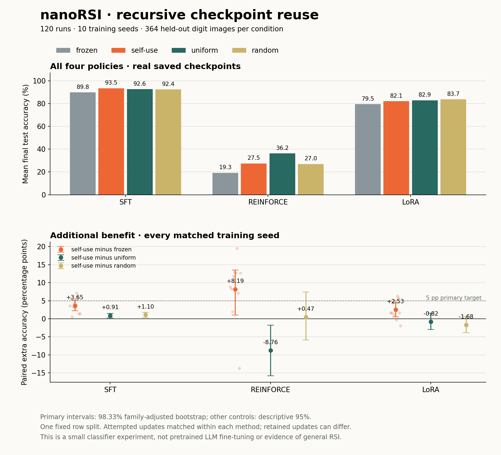

# Recursive checkpoint reuse on handwritten digits — v0.4.1

**SFT self-use improved final accuracy over frozen priorities in all 10 training seeds: 89.835% → 93.489% on average.** Its mean test error fell from 10.1648% to 6.5110%, a **35.9459% relative error reduction**, equivalent to **+3.6538 percentage points of accuracy**. This is the paired comparison between two trained controls, not initial-to-trained improvement. The error reduction is 370 → 237 errors across ten evaluations of the same 364 images; it does not represent 3,640 distinct test images.

All **120 runs and 720 training rounds** completed. REINFORCE and LoRA also improved over their frozen controls on average, but both trailed uniform sampling. Only REINFORCE met the predeclared primary target; SFT and LoRA did not. The full controls and uncertainty below are part of the result.

[English study guide](../../recursive_learning/README.md) · [中文实验与复现指南](../../recursive_learning/README.zh-CN.md) · [Machine-readable summary](summary.json)



## Design and scope

- Implementation: `7809e7924bf806272b721fb829ef689db0263718`; [plan](plan.json) fixed before confirmation testing.
- Panel: SFT, sampled-reward REINFORCE and rank-four LoRA × initialization/training seeds **10–19** × **frozen, self-use, uniform and random** policies.
- Data: the **1,797-image UCI/scikit-learn optical-digits subset**, with a fixed stratified row split of **1,074 train / 359 validation / 364 test** images (split seed `20260912`). This resplits the original UCI test subset; it is **not the official UCI benchmark split**. Writer IDs are unavailable, so unseen-writer generalization is untested. [Attribution and license](../../recursive_learning/data/README.md).
- Model: a small linear classifier with effective matrix `W + A @ B` (65×10 base and rank-four factors). SFT and REINFORCE update W; LoRA freezes W and updates A/B. These are real numerical CPU updates, not pretrained LLM fine-tuning.
- Selection: every candidate competes with its parent on **validation cross entropy**. Test accuracy is measured only after the full study freezes, on the same 364 cases for each initial and selected checkpoint, with no retraining.
- Development: [all 48 validation-only configurations and 576 policy/seed trials](../../recursive_learning/pilots/README.md), including unfavorable results, are retained with prototype source and CSV records. Settings were selected using development seeds 0–2 and locked before confirmation; no confirmation test scores were used to tune them.

Every policy continues training its latest accepted checkpoint. Frozen uses its initial checkpoint to score TRAIN losses and set priorities; self-use uses its latest accepted checkpoint. Uniform and random score the same TRAIN panel but deliberately ignore those loss scores when choosing samples. Random refreshes focus with matched size and concentration. The intervention is which checkpoint determines the subsequent curriculum, not whether training happens.

Within each method, controls share initialization, data, six training opportunities, batch size, attempt-specific RNG schedule and scoring panels. The global [freeze barrier](all-frozen.json) binds all 120 candidate snapshots to the saved plan before any test evaluation. Study execution used Python 3.13 and NumPy 2.3.3, with no model API calls or GPU. NumPy is required only by this optional adapter; the nanoRSI core has zero third-party runtime dependencies.

## Final accuracy and primary paired effects

All entries are selected-checkpoint test accuracies averaged over the ten seeds. `pp` means percentage points.

| Method | Frozen | Self-use | Uniform | Random |
| --- | ---: | ---: | ---: | ---: |
| SFT | 89.835% | 93.489% | 92.582% | 92.390% |
| REINFORCE | 19.286% | 27.473% | 36.236% | 27.005% |
| LoRA | 79.533% | 82.060% | 82.885% | 83.736% |

The primary outcome is **self-use minus frozen test accuracy**, paired by method and seed. The predeclared success target requires an observed mean effect **≥5 pp**, a **positive nominal Bonferroni-adjusted bootstrap lower bound** across the three primary comparisons (familywise alpha allocation 0.05), and complete matched-budget evidence. Meeting this rule does not establish that the true gain is ≥5 pp: REINFORCE's adjusted lower bound is only 1.071 pp.

| Method | Mean delta | Positive / tied / negative seeds | Descriptive 95% bootstrap CI | Nominal adjusted 98.333% bootstrap CI | Target met? |
| --- | ---: | ---: | --- | --- | --- |
| SFT | +3.654 pp | 10 / 0 / 0 | [2.445, 4.945] pp | [2.198, 5.192] pp | No: mean <5 pp |
| REINFORCE | +8.187 pp | 9 / 0 / 1 | [2.473, 12.747] pp | [1.071, 13.462] pp | Yes |
| LoRA | +2.527 pp | 8 / 0 / 2 | [0.934, 4.148] pp | [0.549, 4.423] pp | No: mean <5 pp |

The paired percentile bootstrap uses 10,000 resamples of the ten training seeds on **one fixed dataset split**, with bootstrap RNG seed `20260912`. Bonferroni allocates alpha across the three primary intervals, but these approximate bootstrap intervals do not give an exact finite-sample familywise error guarantee. They describe initialization/training variation; they do not cover new datasets, writers or task populations. Each primary comparison has all ten measured, complete, matched-budget pairs, so its all-measured and complete-case effects coincide. No failed or missing run was dropped.

## Uniform and random controls

These are secondary comparisons with **descriptive, unadjusted 95% bootstrap intervals**. They are not additional confirmatory successes under the primary family.

| Method | Comparison | Mean delta | 95% bootstrap CI | Positive / tied / negative seeds |
| --- | --- | ---: | --- | ---: |
| SFT | Self-use − uniform | +0.907 pp | [0.247, 1.456] pp | 8 / 0 / 2 |
| SFT | Self-use − random | +1.099 pp | [0.330, 1.758] pp | 8 / 0 / 2 |
| REINFORCE | Self-use − uniform | −8.764 pp | [−15.797, −1.758] pp | 3 / 0 / 7 |
| REINFORCE | Self-use − random | +0.467 pp | [−5.879, 7.390] pp | 4 / 0 / 6 |
| LoRA | Self-use − uniform | −0.824 pp | [−2.967, 1.566] pp | 4 / 1 / 5 |
| LoRA | Self-use − random | −1.676 pp | [−3.846, 0.659] pp | 3 / 0 / 7 |

SFT shows a consistent gain over frozen priorities and smaller gains over the two sampling controls. REINFORCE's primary gain comes alongside low absolute accuracy and a substantial loss to uniform, so it does not establish that recursive priorities are the best curriculum. LoRA's mean accuracy is below both sampling controls, with intervals spanning zero. The results support a measured SFT benefit in this setup, not a universal recursive-learning advantage.

## Training work and rejected candidates

| Method | Runs | Rounds per run | Updates per round | Batch size | Learning rate | Priority multiplier | Preserve class mass? |
| --- | ---: | ---: | ---: | ---: | ---: | ---: | --- |
| SFT | 40 | 6 | 24 | 32 | 0.3 | 9 | Yes |
| REINFORCE | 40 | 6 | 8 | 32 | 0.3 | 3 | No |
| LoRA | 40 | 6 | 24 | 32 | 0.3 | 3 | No |

The study recorded **676 accepted and 44 rejected candidates**, with **0 failed, missing or unaccounted attempts**. All 720 training rounds completed, consuming **13,440 actual update steps and 430,080 sampled examples**. Selected checkpoints retained **13,072 update steps**: rejected work is counted as consumed but does not survive in the selected checkpoint. Matched actual budgets do not imply identical retained work, priority-ranking overhead or wall time.

For example, REINFORCE attempted 48 updates per run in both frozen and self-use, but retained 24.0 versus 47.2 updates on average. Its paired effect therefore measures the whole process of curriculum choice, training and validation-based acceptance; it does not isolate curriculum quality at equal retained training depth. All 240 LoRA training rounds kept W fixed while changing A/B.

Per run, the proposer scored 6,444 TRAIN examples across six rounds; the trainer recorded 12,888 scoring examples; search evaluation scored 11,111 examples. Final testing adds 728 evaluations per run (initial and selected checkpoints × 364 cases). The [summary](summary.json) retains planned, known, actual and retained work separately. REINFORCE uses sampled actions and scalar rewards for its update, while its curriculum uses labeled TRAIN losses; this is not fully label-free RL.

## Inspectable evidence

| File | Contents |
| --- | --- |
| [summary.json](summary.json) | All 120 runs, group means, paired effects, intervals, budget and completion fields |
| [plan.json](plan.json) | Locked factors, settings, split hashes, workspace contract and primary inference rule |
| [all-frozen.json](all-frozen.json) | Exact initial/selected commits and freeze sequences for all assigned runs |
| [journal-digests.json](journal-digests.json) | Original journal digests, event counts and referenced-artifact counts |
| [attempts.jsonl](attempts.jsonl) | All 720 decisions, parent/candidate validation metrics and proposer checkpoint identities |
| [outcomes.jsonl.gz](outcomes.jsonl.gz) | Per-case frozen test outcomes for initial and selected checkpoints |
| [curricula.jsonl.gz](curricula.jsonl.gz) | Per-attempt TRAIN loss traces, focus rows, sampler hashes and scoring checkpoint identities |
| [training.jsonl.gz](training.jsonl.gz) | Sanitized per-attempt training records, actual work and checkpoint hashes |
| [checkpoints.jsonl.gz](checkpoints.jsonl.gz) | 699 deduplicated checkpoint byte snapshots, keyed by SHA-256 |
| [evidence-manifest.json](evidence-manifest.json) | Export file byte counts, SHA-256 digests and original implementation commit |

The original local HMAC journals and their referenced artifact bytes were verified before extraction; the summary was rebuilt from verified outcomes. **This public bundle is an unsigned extract.** It contains neither the private HMAC keys nor full runnable workspaces. Its hashes support internal integrity checks, not independent authentication of the original execution. Training records are sanitized, and the original source hashes are retained separately. Public checkpoint text can be checked against its byte count and SHA-256. Re-running the study below produces fresh local workspaces and journals.

## Reproduce

From a repository checkout with Git, Python 3.11+, nanoRSI and an existing NumPy installation available in the same environment:

```bash
python -c "import sys, numpy, nanorsi; print(sys.version); print(numpy.__version__)"
```

If NumPy is absent, the optional experiment environment can install the version used for this study with `python -m pip install numpy==2.3.3`. This is not a new nanoRSI core dependency. Then run:

```bash
python examples/recursive_learning/run.py ./digits-study --phase search --workers 2
python examples/recursive_learning/run.py ./digits-study --phase final --workers 2
```

The search output directory must be new. The first command prepares and runs all 120 workspaces, freezes every selected candidate and records the global barrier without a final-test call. The second reads the locked plan, checks the barrier, evaluates the frozen checkpoints and writes `digits-study/summary.json`. Use the implementation recorded above to reproduce the measured version; the plan records Python command paths and NumPy version from the original environment. No dataset download, model credential or scikit-learn installation is required.

For an individual inspectable workspace, mechanisms and accounting details, see the [English](../../recursive_learning/README.md) or [Chinese guide](../../recursive_learning/README.zh-CN.md). Historical synthetic-cluster CPU and GLM results remain in the [v0.4.0 evidence bundle](../v0.4.0/README.md).
